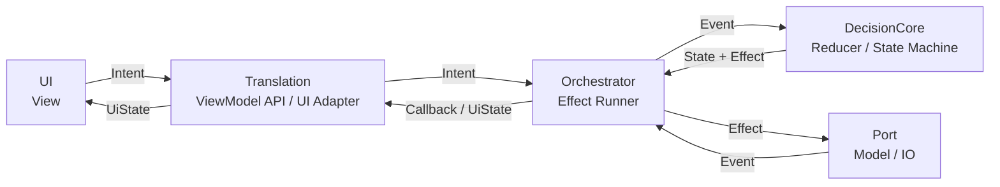

# SOP 总蓝图

这套 SOP 的目标不是发明一套复杂架构，而是把现有业务整理成一组清晰的 MVVM 状态机。

## 1. 核心模型

我们采用的是扩展版 MVVM：

| MVVM 角色 | 本项目组件 | 职责 |
|---|---|---|
| View | `UI` | 渲染状态，提交用户意图 |
| ViewModel 对外接口 | `Translation` | 把 UI 调用和 UI 状态做薄翻译 |
| ViewModel 执行器 | `Orchestrator` | 执行副作用，调用 Port，把外部结果送回状态机 |
| ViewModel 状态机 | `DecisionCore` | 根据当前状态和事件，计算新状态和副作用 |
| Model / Repository | `Port` | 蓝牙、远端、本地存储等外部能力 |

一句话：

```text
UI 观察 State，提交 Intent。
DecisionCore 决定状态怎么变。
Orchestrator 执行副作用。
Port 负责真实 IO。
```

## 2. 总体拓扑



## 3. 状态机公式

每个工作流都优先写成这个形式：

```text
reduce(currentState, event) -> nextState + effects
```

对应到组件：

| 名称 | 含义 |
|---|---|
| `State` | 当前工作流状态 |
| `Event` | 驱动状态变化的事件，可能来自 UI，也可能来自 Port |
| `Effect` | 状态机要求执行的副作用 |

补充约定：

- `Event` 属于状态机。
- `Effect` 由 Orchestrator 直接交给 Port 的 `execute`，Port 返回 `Event` 流再送回 `DecisionCore`。
- 全库只有一种词汇形态：`effect → event`。不存在 `Command / Result` 中间词汇（04 修订，见[词汇表](./说明/词汇表.md)）。

注意：

- `Event` 是状态机输入，不只是“异常”。
- 成功、失败、超时都可以是 Event，只要它会驱动状态变化。
- `Effect` 不直接执行 IO，只描述“需要做什么”。
- 真正 IO 由 `Orchestrator -> Port` 完成。

## 4. 每个组件不做什么

| 组件 | 不做什么 |
|---|---|
| `UI` | 不判断业务状态，不解析协议，不直接调用 Port |
| `Translation` | 不持有业务状态，不做业务分支 |
| `Orchestrator` | 不决定业务状态，只执行 Effect |
| `DecisionCore` | 不做 IO，不知道 SDK、HTTP、文件细节 |
| `Port` | 不知道业务状态机，只返回 Event |

## 5. 工作流文档怎么写

每篇 `Workflow/*.md` 只写一个工作流，按这个顺序：

1. `Intent / Callback`。
2. `State / Event / Effect`。
3. 词汇形态与翻译边界（Effect/Event 直通，翻译止步于 Port）。
4. 这个工作流做什么。
5. 它对应哪个 UI 状态机。
6. `Port` 需要提供哪些能力。
7. 状态转换表。
8. 成功、失败、超时怎么收口。

不要把一个简单工作流写成多层消息百科。  
先写这三段，再解释状态机和副作用怎么执行。

## 6. 文档体系

```
SOP/
├── README.md      # 本总蓝图（核心模型 / 拓扑 / 状态机公式）
├── Workflow/      # 业务工作流（注册登录、设备连接等业务）
├── 架构/          # 架构设计（编排器、端口挂载、词汇统一等）
├── 需求/          # 滚动：需求清单与演进
├── 简报/          # 滚动：周期性汇报
└── 说明/          # 沉淀：项目树 / 拓扑 / 词汇表 / 演进史
```

写作规范（分类、模板、命名、滚动更新规则）见 [doc-writer skill](../../.claude/skills/doc-writer/SKILL.md)。
