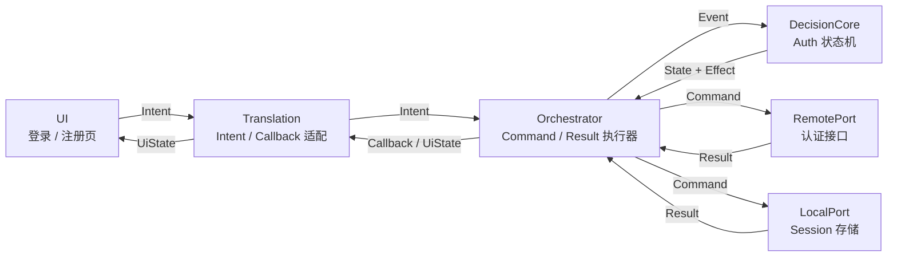
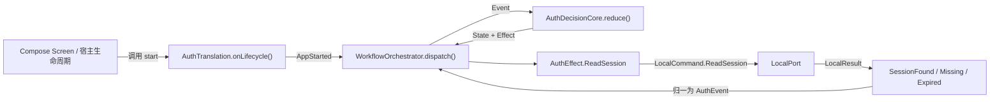

# 工作流 01：注册 / 登录

## 2. 总体位置



## 2.1 `AppStarted` 与启动时恢复 Session（工作流 01.1）

### 2.1.1 先确定第一驱动力

Auth 工作流创建时，初始状态永远是 `AuthState.Idle`。

```kotlin
val orchestrator = WorkflowOrchestrator(
    initialState = AuthState.Idle,
    decisionCore = AuthDecisionCore,
    effectExecutor = authEffectExecutor,
    scope = scope
)
```

`Idle` 只是被注入的初始值，不会主动扫描本地数据，也不会自动执行 Effect。
状态机开始恢复 Session 的第一驱动力，是外部送入的系统事件 `AuthEvent.AppStarted`：

```text
创建 Auth 工作流，初始 State = Idle
-> Screen / 宿主生命周期调用 AuthTranslation.onLifecycle(AppStarted)
-> AuthTranslation 发送 AuthEvent.AppStarted
-> Orchestrator.dispatch(AppStarted)
-> DecisionCore.reduce(Idle, AppStarted)
-> RestoringSession + ReadSession
```

这里的 `AppStarted` 不是用户点击产生的 `AuthIntent`，而是工作流生命周期事件。
它和 `SubmitLogin` 的区别只是来源不同，进入 `DecisionCore` 后都只是普通 Event。

### 2.1.2 `AppStarted` 在拓扑中的位置



这不会打破总体拓扑：

- Screen 只调用 Translation 暴露的入口，不直接调用 DecisionCore 或 Port。
- Translation 只把启动信号变成 Event，不读取 Session，不判断 token。
- DecisionCore 只计算 `State + Effect`，不做 IO。
- Orchestrator 执行 Effect，并把 Port Result 重新送回事件队列。
- LocalPort 只负责读取、保存、清理 Session，不决定 UI 状态。

### 2.1.3 Translation 如何接收生命周期信息

不建议把内部 `AuthEvent` 整体暴露给 UI。否则外部代码也能伪造 `SessionVerified`、`SessionSaved` 等只应由 Port 结果产生的事件。

Translation 对外只开放受限的生命周期事件：

```kotlin
/** 外部允许提交的 Auth 生命周期信息。 */
sealed interface AuthLifecycleEvent {
    /** Auth 主页面第一次进入组合。 */
    data object AppStarted : AuthLifecycleEvent

    // 后续确有需求时，可以增加 AppForegrounded、ScreenReentered 等类型。
    // 每增加一种类型，都必须在 Translation 中明确映射，不能直接透传 AuthEvent。
}

class AuthTranslation(
    private val orchestrator: WorkflowOrchestrator<AuthState, AuthEvent, AuthEffect>,
    scope: CoroutineScope
) : Translation<AuthIntent, AuthUiState> {

    // 把 DecisionCore 的业务状态转换成 UI 能直接渲染的状态。
    val uiState: StateFlow<AuthUiState> = orchestrator.state
        .map { it.toUiState() }
        .stateIn(
            scope = scope,
            started = SharingStarted.Eagerly,
            initialValue = orchestrator.state.value.toUiState()
        )

    /** 接收宿主生命周期信息；这里只允许映射白名单事件。 */
    fun onLifecycle(event: AuthLifecycleEvent) {
        val authEvent = when (event) {
            AuthLifecycleEvent.AppStarted -> AuthEvent.AppStarted
        }
        orchestrator.dispatch(authEvent)
    }

    /** 接收登录、注册、退出等用户主动操作。 */
    override fun submit(intent: AuthIntent) {
        orchestrator.dispatch(intent.toEvent())
    }
}
```

`AuthLifecycleEvent` 是外部输入合约，`AuthEvent` 是 DecisionCore 的内部输入合约。两者分开后，生命周期入口可以扩展，又不会让 UI 绕过 Translation 操作状态机内部事件。

### 2.1.4 最小可调试 Compose 页面

示意链路保持为：

```text
MainActivity -> AppMain -> AuthRoute -> AuthScreen
```

`MainActivity` 只安装 Compose；`AppMain` 观察全局 Auth UI 状态并发送一次启动事件；`AuthRoute` 负责把用户操作交给 Translation；`AuthScreen` 只放最小控件，目的是验证工作流而不是完成视觉设计。

```kotlin
sealed interface AuthUiState {
    data object Idle : AuthUiState
    data object RestoringSession : AuthUiState
    data object Loading : AuthUiState
    data object SavingSession : AuthUiState
    data class Registered(val message: String) : AuthUiState
    data class Authenticated(val user: User) : AuthUiState
    data class Error(val message: String) : AuthUiState
}

private fun AuthState.toUiState(): AuthUiState {
    return when (this) {
        AuthState.Idle -> AuthUiState.Idle
        AuthState.RestoringSession -> AuthUiState.RestoringSession
        AuthState.Loading -> AuthUiState.Loading
        is AuthState.SavingSession -> AuthUiState.SavingSession
        is AuthState.Registered -> AuthUiState.Registered(message)
        is AuthState.Authenticated -> AuthUiState.Authenticated(session.user)
        is AuthState.Error -> AuthUiState.Error(message)
    }
}
```

`AppGraph` 不是图库或导航图，也不是新的业务层。它只是 Application 级的手工依赖组装容器（composition root）：统一创建 Port、Orchestrator 和 Translation，保证同一进程内只使用同一份 Auth 状态机。

```kotlin
class MigrateDevApplication : Application() {
    lateinit var appGraph: AppGraph
        private set

    override fun onCreate() {
        super.onCreate()
        // Application 与进程同生命周期，适合持有全局 Auth 工作流。
        appGraph = AppGraph(this)
    }
}

class AppGraph(application: Application) {
    private val appScope = CoroutineScope(
        SupervisorJob() + Dispatchers.Main.immediate
    )
    private val clock = Clock.systemUTC()

    // 技术 Adapter：本地加密持久化。
    private val sessionStore = EncryptedSessionStore(application)
    private val persistenceLocalPort = PersistenceLocalPort(
        sessionStore = sessionStore,
        clock = clock
    )

    // 技术 Adapter：旧 App 账号接口的 Retrofit 实现。
    private val accountApi = RetrofitFactory.createAccountApi()
    private val authRemotePort = RetrofitRemotePort.Auth(
        api = accountApi,
        clock = clock
    )

    // 业务 Port：只负责把 Auth 的 Local/Remote Command 分发给对应 Adapter。
    private val authPort: AuthPort = DefaultAuthPort(
        persistence = persistenceLocalPort,
        remote = authRemotePort
    )

    private val authOrchestrator = WorkflowOrchestrator(
        initialState = AuthState.Idle,
        decisionCore = AuthDecisionCore,
        effectExecutor = AuthEffectExecutor(authPort),
        scope = appScope
    )

    val authTranslation = AuthTranslation(
        orchestrator = authOrchestrator,
        scope = appScope
    )
}

class MainActivity : ComponentActivity() {
    override fun onCreate(savedInstanceState: Bundle?) {
        super.onCreate(savedInstanceState)

        // MainActivity 不自己组装 Port，只取得 Application 已创建的 Translation。
        val appGraph = (application as MigrateDevApplication).appGraph

        setContent {
            MaterialTheme {
                AppMain(authTranslation = appGraph.authTranslation)
            }
        }
    }
}

@Composable
fun AppMain(authTranslation: AuthTranslation) {
    // collectAsStateWithLifecycle 会在页面处于可见生命周期时收集 StateFlow，
    // 页面停止后暂停收集，避免后台页面继续做无意义的 UI 刷新。
    val uiState by authTranslation.uiState.collectAsStateWithLifecycle()

    // translation 实例不变时只执行一次，不会因为 Compose 重组而重复发送。
    LaunchedEffect(authTranslation) {
        authTranslation.onLifecycle(AuthLifecycleEvent.AppStarted)
    }

    // AppMain 只负责顶层页面切换，不处理登录规则。
    when (val state = uiState) {
        is AuthUiState.Authenticated -> DebugHomeScreen(
            user = state.user,
            onLogout = { authTranslation.submit(AuthIntent.Logout) }
        )
        else -> AuthRoute(
            state = state,
            translation = authTranslation
        )
    }
}

@Composable
fun AuthRoute(
    state: AuthUiState,
    translation: AuthTranslation
) {
    AuthScreen(
        state = state,
        onLogin = { account, password ->
            translation.submit(AuthIntent.SubmitLogin(account, password))
        },
        onRegister = { account, password, phone ->
            translation.submit(
                AuthIntent.SubmitRegister(
                    account = account,
                    password = password,
                    telephone = phone
                )
            )
        },
        onRetrySession = {
            // 重试仍然重走同一条 Session 恢复链路，不直接读取 LocalPort。
            translation.onLifecycle(AuthLifecycleEvent.AppStarted)
        }
    )
}
```

下面的 Screen 故意保持简单，只提供能发现状态机问题的控件：

```kotlin
@Composable
fun AuthScreen(
    state: AuthUiState,
    onLogin: (String, String) -> Unit,
    onRegister: (String, String, String) -> Unit,
    onRetrySession: () -> Unit
) {
    var account by rememberSaveable { mutableStateOf("") }
    var password by rememberSaveable { mutableStateOf("") }
    var phone by rememberSaveable { mutableStateOf("") }

    Column(
        modifier = Modifier
            .fillMaxSize()
            .padding(24.dp),
        verticalArrangement = Arrangement.Center
    ) {
        Text("Auth workflow debug")
        Spacer(Modifier.height(16.dp))

        // 根据 UiState 渲染反馈；这里不判断 token，也不调用 Port。
        when (state) {
            AuthUiState.RestoringSession -> {
                CircularProgressIndicator()
                Text("正在读取本地会话…")
            }
            AuthUiState.Loading -> {
                CircularProgressIndicator()
                Text("正在请求服务端…")
            }
            AuthUiState.SavingSession -> Text("正在安全保存会话…")
            is AuthUiState.Registered -> Text(state.message)
            is AuthUiState.Error -> {
                Text(state.message, color = MaterialTheme.colorScheme.error)
                Button(onClick = onRetrySession) { Text("重试会话恢复") }
            }
            else -> Unit
        }

        OutlinedTextField(
            value = account,
            onValueChange = { account = it },
            label = { Text("账号或用户名") }
        )
        OutlinedTextField(
            value = password,
            onValueChange = { password = it },
            label = { Text("密码") },
            visualTransformation = PasswordVisualTransformation()
        )
        OutlinedTextField(
            value = phone,
            onValueChange = { phone = it },
            label = { Text("注册手机号") }
        )

        Row(horizontalArrangement = Arrangement.spacedBy(12.dp)) {
            Button(
                enabled = state is AuthUiState.Idle || state is AuthUiState.Error,
                onClick = { onLogin(account.trim(), password) }
            ) { Text("登录") }

            OutlinedButton(
                enabled = state is AuthUiState.Idle || state is AuthUiState.Error,
                onClick = { onRegister(account.trim(), password, phone.trim()) }
            ) { Text("注册") }
        }
    }
}

@Composable
fun DebugHomeScreen(user: User, onLogout: () -> Unit) {
    Column(Modifier.padding(24.dp)) {
        Text("已登录：${user.userName}")
        Button(onClick = onLogout) { Text("退出登录") }
    }
}
```

严格来说，Compose 首次观察到的值仍然是 `Idle`，因为它是 Orchestrator 的初始状态；随后 `LaunchedEffect` 发送 `AppStarted`，状态才进入 `RestoringSession`。Screen 不应为了消除这一瞬间的状态变化而直接读取 LocalPort。

### 2.1.5 LocalPort 如何补全 Session 读取

本地读取仍然沿用 `Effect -> Command -> Result -> Event`，不在 `Idle` 或 Screen 中直接扫描存储。

```kotlin
sealed interface AuthCommand {
    sealed interface Local : AuthCommand {
        data object ReadSession : Local
        data class SaveSession(val session: AuthSession) : Local
        data object ClearSession : Local
    }

    sealed interface Remote : AuthCommand {
        data class Login(val account: String, val password: String) : Remote
        data class Register(
            val account: String,
            val password: String,
            val telephone: String,
            val avatarUrl: String? = null
        ) : Remote
        data class ValidateSession(val session: AuthSession) : Remote
    }
}
```

LocalPort 读取后只返回事实，不决定下一个 AuthState：

```kotlin
sealed interface AuthResult {
    sealed interface Local : AuthResult {
        data class SessionFound(val session: AuthSession) : Local
        data object SessionMissing : Local
        data object SessionExpired : Local
        data class SessionReadFailed(val message: String) : Local
        data object SessionSaved : Local
        data class SessionSaveFailed(val message: String) : Local
        data class SessionClearFailed(val message: String) : Local
        data object SessionCleared : Local
    }

    sealed interface Remote : AuthResult {
        data class SessionVerified(val session: AuthSession) : Remote
        data class SessionRejected(val message: String) : Remote
        data object SessionValidationTimeout : Remote
        data class Accepted(val session: AuthSession) : Remote
        data class Rejected(val message: String) : Remote
        data object Timeout : Remote
        data object RegistrationAccepted : Remote
    }
}
```

`SessionStore` 是 LocalPort 使用的存储能力，不向 UI 暴露，也不负责状态转换：

```kotlin
sealed interface SessionRead {
    data class Found(val session: AuthSession) : SessionRead
    data object Missing : SessionRead
    data object Corrupted : SessionRead
}

interface SessionStore {
    companion object {
        // 第一版沿用旧 App 的 7 天本地 TTL；正式后端接入时优先使用 JWT exp。
        const val LOCAL_TOKEN_TTL_MS = 7L * 24 * 60 * 60 * 1000
    }

    /** 只返回本地事实；不会调用远端。 */
    fun read(): SessionRead

    /** 返回 false 表示磁盘写入没有确认成功。 */
    fun save(session: AuthSession): Boolean

    /** 清理本机 Session，返回是否完成。 */
    fun clear(): Boolean
}
```

LocalPort 将存储结果翻译为 AuthResult：

```kotlin
class PersistenceLocalPort(
    private val sessionStore: SessionStore,
    private val clock: Clock
) {
    fun execute(command: AuthCommand.Local): Flow<AuthResult> = flow {
        emit(executeLocal(command))
    }

    private fun executeLocal(command: AuthCommand.Local): AuthResult.Local {
        return when (command) {
            AuthCommand.Local.ReadSession -> {
                when (val read = sessionStore.read()) {
                    SessionRead.Missing -> AuthResult.Local.SessionMissing
                    SessionRead.Corrupted -> {
                        // 密文损坏只影响本机 Session；清理失败也不能把异常抛到 UI。
                        sessionStore.clear()
                        AuthResult.Local.SessionReadFailed("本地会话无法解密")
                    }
                    is SessionRead.Found -> {
                        val expiresAt = read.session.expiresAtMillis
                        if (expiresAt != null && clock.nowMillis() >= expiresAt) {
                            AuthResult.Local.SessionExpired
                        } else {
                            AuthResult.Local.SessionFound(read.session)
                        }
                    }
                }
            }

            is AuthCommand.Local.SaveSession -> {
                if (sessionStore.save(command.session)) {
                    AuthResult.Local.SessionSaved
                } else {
                    AuthResult.Local.SessionSaveFailed("本地会话写入失败")
                }
            }

            AuthCommand.Local.ClearSession -> {
                if (sessionStore.clear()) {
                    AuthResult.Local.SessionCleared
                } else {
                    AuthResult.Local.SessionClearFailed("本地会话清理失败")
                }
            }
        }
    }
}
```

LocalPort 发现过期时不自行清理，因为“是否清理”是业务决策。它返回 `SessionExpired`，再由 DecisionCore 产生 `ClearSession` Effect。

### 2.1.5.1 `SharedPreferences + Android Keystore` 的商用安全边界

这里的“使用 SP”指的是使用 `SharedPreferences` 作为密文容器，不是把 token 明文放入 SP。推荐的最小实现是：

```text
Session JSON
-> UTF-8 bytes
-> AES-256-GCM 加密
-> Android Keystore 中的不可导出 AES key
-> [version | random IV | ciphertext + auth tag]
-> Base64
-> SharedPreferences 的一个 blob 字段
```

Android 官方建议使用 Android Keystore 保护密钥，并推荐 AES-GCM；`EncryptedSharedPreferences` 在 `security-crypto 1.1.0` 已废弃，应直接使用平台 API 和 Keystore。[Android Keystore](https://developer.android.com/privacy-and-security/keystore)、[Android 密码学](https://developer.android.com/privacy-and-security/cryptography)

核心约束：

- 密钥别名固定，但密钥材料永远不写入 SP、日志或网络。
- 每次保存都用 `SecureRandom` 生成新的 12 字节 IV；不能复用 IV。
- GCM 使用 128-bit authentication tag；密文被篡改时解密失败。
- AAD 绑定 `prefsName + blobKey`，防止把一个字段的密文复制到另一个字段。
- Session 统一序列化成一个 blob，避免 token、用户资料和过期时间分别写入导致半更新。
- 不启用“每次读取都要求用户解锁”的 Keystore 授权，否则应用无法真正自动登录；设备锁和系统文件加密仍提供基础保护。
- 不打印 token、完整 Session、密文或解密异常中的敏感内容。

示意实现：

```kotlin
class EncryptedSessionStore(
    context: Context,
    private val json: Json = Json { ignoreUnknownKeys = true }
) : SessionStore {

    private val preferences = context.applicationContext
        .getSharedPreferences("auth_session_secure", Context.MODE_PRIVATE)

    private val key: SecretKey = loadOrCreateKeystoreKey(
        alias = "migratedev.auth.session.aes256"
    )

    override fun read(): SessionRead {
        val encoded = preferences.getString(KEY_BLOB, null)
            ?: return SessionRead.Missing

        return try {
            val plaintext = decrypt(encoded, key, aad = AAD)
            SessionRead.Found(json.decodeFromString<AuthSession>(plaintext))
        } catch (_: GeneralSecurityException) {
            // GCM 校验失败、Keystore key 失效、密文被篡改都走损坏分支。
            preferences.edit().remove(KEY_BLOB).commit()
            SessionRead.Corrupted
        } catch (_: SerializationException) {
            preferences.edit().remove(KEY_BLOB).commit()
            SessionRead.Corrupted
        }
    }

    override fun save(session: AuthSession): Boolean {
        return try {
            val plaintext = json.encodeToString(session)
            val encoded = encrypt(plaintext, key, aad = AAD)

            // commit() 同步返回写入结果；调用发生在 IO dispatcher，不能阻塞主线程。
            // 只有 commit() 返回 true，LocalPort 才能产生 SessionSaved。
            preferences.edit()
                .putString(KEY_BLOB, encoded)
                .commit()
        } catch (_: GeneralSecurityException) {
            false
        } catch (_: SerializationException) {
            false
        }
    }

    override fun clear(): Boolean {
        // clear 只删除本机密文，不会删除服务端账号。
        return preferences.edit().remove(KEY_BLOB).commit()
    }

    private companion object {
        const val KEY_BLOB = "session_blob_v1"
        const val AAD = "migratedev/auth_session_secure/session_blob_v1"
    }
}
```

这段代码中的两个容易误解的点：

1. `commit()`：`apply()` 只是把写入安排到后台，没有成功返回值；Session 保存完成后状态机必须知道“磁盘是否真的写入”，所以 LocalPort 在 IO 线程使用 `commit()` 并检查 Boolean。
2. “清理损坏数据”：如果密文无法解密，继续保留它只会让每次启动都失败。清理的是本机那一条无法使用的密文，不是删除远端用户；随后 UI 回到登录流程即可。

应用还必须排除 Session SP 的自动备份和设备迁移，否则备份恢复后可能只恢复了密文、没有恢复对应 Keystore key。Android 官方明确建议认证 token 不进入 Auto Backup。[Auto Backup](https://developer.android.com/identity/data/autobackup)

```xml
<!-- res/xml/backup_rules.xml；实际项目还要在 manifest 绑定 fullBackupContent -->
<full-backup-content>
    <exclude domain="sharedpref" path="auth_session_secure.xml" />
</full-backup-content>
```

Android 12+ 还要提供 `dataExtractionRules`，并在 `<application>` 上同时绑定对应规则；如果产品不需要迁移登录态，宁可明确排除，也不要让密文跟着设备迁移。

下面是加密容器所依赖的核心算法示意。它不是把密钥写进代码，而是每次从 Android Keystore 取得同一个不可导出的 Key：

```kotlin
private fun loadOrCreateKeystoreKey(alias: String): SecretKey {
    val keyStore = KeyStore.getInstance("AndroidKeyStore").apply { load(null) }
    val existing = keyStore.getKey(alias, null) as? SecretKey
    if (existing != null) return existing

    val generator = KeyGenerator.getInstance(
        KeyProperties.KEY_ALGORITHM_AES,
        "AndroidKeyStore"
    )
    generator.init(
        KeyGenParameterSpec.Builder(
            alias,
            KeyProperties.PURPOSE_ENCRYPT or KeyProperties.PURPOSE_DECRYPT
        )
            .setKeySize(256)
            .setBlockModes(KeyProperties.BLOCK_MODE_GCM)
            .setEncryptionPaddings(KeyProperties.ENCRYPTION_PADDING_NONE)
            .setRandomizedEncryptionRequired(true)
            .build()
    )
    return generator.generateKey()
}

private fun encrypt(plaintext: String, key: SecretKey, aad: String): String {
    val iv = ByteArray(12).also { SecureRandom().nextBytes(it) }
    val cipher = Cipher.getInstance("AES/GCM/NoPadding")
    cipher.init(
        Cipher.ENCRYPT_MODE,
        key,
        GCMParameterSpec(128, iv)
    )
    cipher.updateAAD(aad.toByteArray(Charsets.UTF_8))
    val ciphertext = cipher.doFinal(plaintext.toByteArray(Charsets.UTF_8))

    // v1 + IV + ciphertext（ciphertext 尾部包含 GCM authentication tag）。
    return Base64.encodeToString(
        byteArrayOf(1) + iv + ciphertext,
        Base64.NO_WRAP
    )
}

private fun decrypt(encoded: String, key: SecretKey, aad: String): String {
    val payload = Base64.decode(encoded, Base64.NO_WRAP)
    require(payload.size > 1 + 12 + 16 && payload[0].toInt() == 1)

    val iv = payload.copyOfRange(1, 13)
    val ciphertext = payload.copyOfRange(13, payload.size)
    val cipher = Cipher.getInstance("AES/GCM/NoPadding")
    cipher.init(
        Cipher.DECRYPT_MODE,
        key,
        GCMParameterSpec(128, iv)
    )
    cipher.updateAAD(aad.toByteArray(Charsets.UTF_8))
    return cipher.doFinal(ciphertext).toString(Charsets.UTF_8)
}
```

### 2.1.6 Port 目录：业务组合保留在 `port/auth`

这里不新增 `business/`，也不把 Adapter 提到拓扑外面。主拓扑仍然只有：

```text
UI -> Translation -> Orchestrator -> DecisionCore
                                      |
                                      v
                                    AuthPort
```

目录只把 `AuthPort` 内部的组合关系展开：

```text
port/
├─ auth/
│  ├─ AuthPort.kt              # AuthCommand / AuthResult / AuthPort
│  └─ DefaultAuthPort.kt       # 业务组合：把 Local / Remote 命令分发给 Adapter
├─ cachestream/                # 目录统一小写；后续缓存明文流业务 Port
│  └─ CacheStreamPort.kt       # Kotlin 文件名使用 PascalCase
└─ adapter/
   ├─ localport/
   │  ├─ FileLocalPort.kt      # 文件读写能力，供 cachestream 等业务组合
   │  ├─ PersistenceLocalPort.kt # SP / 数据库等持久化能力；当前 Auth 使用它
   │  ├─ SessionStore.kt
   │  └─ EncryptedSessionStore.kt
   ├─ remoteport/
   │  └─ RetrofitRemotePort.kt # Auth 实现写成 RetrofitRemotePort.Auth
   └─ bluetoothport/
      └─ AndroidBluetoothPort.kt
```

`AuthEffectExecutor` 仍然只依赖 `AuthPort`，所以不改变现有拓扑：

```kotlin
class DefaultAuthPort(
    private val persistence: PersistenceLocalPort,
    private val remote: RetrofitRemotePort.Auth
) : AuthPort {
    override fun execute(command: AuthCommand): Flow<AuthResult> {
        return when (command) {
            is AuthCommand.Local -> persistence.execute(command)
            is AuthCommand.Remote -> remotePort.execute(command)
        }
    }
}
```

这里的 `DefaultAuthPort` 不是新的业务状态机，它只是 Auth 业务对 Local/Remote 两个 Adapter 的组合点。`PersistenceLocalPort` 不带 Auth 名字，因为它描述的是技术能力；以后 `FileLocalPort` 也可以被 cachestream、上传等多个业务 Port 复用。Bluetooth 工作流继续通过自己的 BluetoothPort 组合，不和 Auth 混在一个 Port 文件里。

第一阶段不单独增加 Repository。等到同一份 Session 需要协调 SP、数据库、内存缓存或多数据源回退策略时，再考虑抽出 `SessionRepository`；目前只有一个加密 SP 数据源，Repository 只会增加转发层。

### 2.1.7 RemotePort：按旧 App 还原 Auth 小闭环

旧 App 的真实接口是：

| 操作 | HTTP | 请求 | 结果 |
|---|---|---|---|
| 登录 | `POST /api/account/v1/login` | `phone`、`password` | 返回 token 字符串 |
| 注册 | `POST /api/account/v1/register` | `username`、`password`、`phone`、`avatarUrl` | 成功时通常不带用户 data |
| 详情 | `GET /api/account/v1/detail` | Header `token` | 返回账号资料 |

旧 App 的登录顺序是“登录拿 token -> 暂存 token -> 请求 detail -> 保存完整用户”。新 RemotePort 仍保持这个业务顺序，但不把半成品 token 写入 LocalPort：

```text
RemoteCommand.Login
-> /login 得到 token
-> 使用本次 token 显式请求 /detail
-> 组装 AuthSession(user, token, expiresAtMillis)
-> RemoteResult.Accepted(session)
-> DecisionCore.SavingSession
-> LocalCommand.SaveSession
```

这样网络失败时不会留下只有 token、没有用户资料的半成品 Session。

Retrofit 合约需要允许 detail 使用本次登录刚拿到的 token，而不是依赖全局 Session：

```kotlin
interface AccountApi {
    @POST("/api/account/v1/login")
    suspend fun login(@Body request: LoginRequest): ServerResponse<String>

    @POST("/api/account/v1/register")
    suspend fun register(@Body request: RegisterRequest): ServerResponse<AccountDto>

    @GET("/api/account/v1/detail")
    suspend fun detail(@Header("token") token: String): ServerResponse<AccountDto>
}
```

DTO 只负责承接旧接口字段，不进入 DecisionCore：

```kotlin
data class LoginRequest(
    val phone: String,
    val password: String
)

data class RegisterRequest(
    val username: String,
    val password: String,
    val phone: String,
    val avatarUrl: String?
)

data class AccountDto(
    val id: Long,
    val username: String?,
    val phone: String?,
    val avatarUrl: String?,
    val role: String?
)

data class ServerResponse<T>(
    val code: Int,
    val success: Boolean,
    val msg: String?,
    val data: T?
) {
    fun isOk(): Boolean = success || code == 0 || code == 200
}

private fun AccountDto.toDomainUser(): User = User(
    id = id.toString(),
    userName = username.orEmpty(),
    telephone = phone.orEmpty(),
    avatarUrl = avatarUrl
)
```

普通业务请求仍可由统一 HTTP Client 从当前 Session 注入 `token` Header；登录和刚拿到 token 的 `/detail` 必须使用调用级 Header，避免把临时 token 提前写入 LocalPort：

```kotlin
@GET("/api/account/v1/detail")
suspend fun detail(@Header("token") token: String): ServerResponse<AccountDto>
```

RemotePort 的最小实现：

```kotlin
object RetrofitRemotePort {
    class Auth(
        private val api: AccountApi,
        private val clock: Clock
    ) {
        fun execute(command: AuthCommand.Remote): Flow<AuthResult> = flow {
            try {
                when (command) {
                is AuthCommand.Remote.Login -> {
                    val login = api.login(LoginRequest(command.account, command.password))
                    if (!login.isOk()) {
                        emit(AuthResult.Remote.Rejected(login.msg ?: "登录失败"))
                        return@flow
                    }

                    val token = login.data?.takeIf { it.isNotBlank() }
                    if (token == null) {
                        emit(AuthResult.Remote.Rejected("登录响应没有 token"))
                        return@flow
                    }

                    val detail = api.detail(token)
                    if (!detail.isOk() || detail.data == null) {
                        emit(AuthResult.Remote.Rejected(detail.msg ?: "用户详情验证失败"))
                        return@flow
                    }

                    val user = detail.data.toDomainUser()
                    emit(
                        AuthResult.Remote.Accepted(
                            AuthSession(
                                user = user,
                                token = token,
                                expiresAtMillis = clock.nowMillis() + SessionStore.LOCAL_TOKEN_TTL_MS
                            )
                        )
                    )
                }

                is AuthCommand.Remote.ValidateSession -> {
                    val detail = api.detail(command.session.token)
                    if (!detail.isOk() || detail.data == null) {
                        emit(AuthResult.Remote.SessionRejected(detail.msg ?: "token 已失效"))
                    } else {
                        emit(
                            AuthResult.Remote.SessionVerified(
                                AuthSession(
                                    user = detail.data.toDomainUser(),
                                    token = command.session.token,
                                    // 验证过程不能滑动延长本地过期时间，沿用原 Session 截止时间。
                                    expiresAtMillis = command.session.expiresAtMillis
                                )
                            )
                        )
                    }
                }

                is AuthCommand.Remote.Register -> {
                    val result = api.register(
                        RegisterRequest(
                            username = command.account,
                            password = command.password,
                            phone = command.telephone,
                            avatarUrl = command.avatarUrl
                        )
                    )
                    if (result.isOk()) {
                        // 旧 App 注册成功后回到登录页，不自动建立 Session。
                        emit(AuthResult.Remote.RegistrationAccepted)
                    } else {
                        emit(AuthResult.Remote.Rejected(result.msg ?: "注册失败"))
                    }
                }
                }
            } catch (timeout: TimeoutCancellationException) {
                emit(AuthResult.Remote.Timeout)
            } catch (network: IOException) {
                emit(AuthResult.Remote.Rejected("网络错误：${network.message ?: "unknown"}"))
            }
        }
    }
}
```

旧 App 的 `ServerResponse` 将 `success == true`、`code == 0` 或 `code == 200` 视为成功；业务码 `250004` 仍由统一会话过期拦截器转换为 `SessionRejected`，不能只依赖 HTTP 200 判断 token 是否有效。

注册与登录的语义不同：注册成功不等于已登录。RemotePort 返回 `RegistrationAccepted`，状态机把它收口到“提示注册成功、回到登录表单”，而不是保存一个不存在的 Session。

### 2.1.8 `AppMain` 到 Remote/Local 的闭环

```text
MainActivity.setContent
-> AppMain.collectAsStateWithLifecycle
-> LaunchedEffect(AppStarted)
-> AuthTranslation.onLifecycle
-> AuthEvent.AppStarted
-> AuthEffect.ReadSession
-> DefaultAuthPort
-> PersistenceLocalPort
-> EncryptedSessionStore
-> SessionFound / SessionMissing / SessionExpired

SessionFound
-> AuthEffect.ValidateSession
-> DefaultAuthPort
-> RetrofitRemotePort.Auth
-> GET /api/account/v1/detail(token)
-> SessionVerified / SessionRejected / Timeout

用户点击登录
-> AuthIntent.SubmitLogin
-> AuthEffect.LoginRemote
-> RetrofitRemotePort.Auth
-> POST /login
-> GET /detail(token)
-> RemoteAccepted(AuthSession)
-> AuthEffect.SaveSession
-> PersistenceLocalPort
-> SharedPreferences commit 成功
-> Authenticated
```

以上先形成一个可调试的 Auth 小闭环；CacheStream 和 Bluetooth 只保留目录与边界，不在本次扩大实现范围。

### 2.1.9 DecisionCore 如何处理启动事件

下面只展开启动恢复新增的分支。登录、注册、退出分支继续沿用原状态表：

```kotlin
object AuthDecisionCore : DecisionCore<AuthState, AuthEvent, AuthEffect> {
    override fun reduce(
        currentState: AuthState,
        event: AuthEvent
    ): Transition<AuthState, AuthEffect> {
        return when (event) {
            AuthEvent.AppStarted -> when (currentState) {
                AuthState.Idle, is AuthState.Error -> Transition(
                    newState = AuthState.RestoringSession,
                    effects = listOf(AuthEffect.ReadSession)
                )
                else -> Transition(newState = currentState)
            }

            is AuthEvent.SessionFound -> when (currentState) {
                AuthState.RestoringSession -> Transition(
                    newState = AuthState.Loading,
                    effects = listOf(AuthEffect.ValidateSession(event.session))
                )
                else -> Transition(newState = currentState)
            }

            AuthEvent.SessionMissing -> when (currentState) {
                AuthState.RestoringSession -> Transition(AuthState.Idle)
                else -> Transition(newState = currentState)
            }

            AuthEvent.SessionExpired -> when (currentState) {
                AuthState.RestoringSession -> Transition(
                    newState = AuthState.Idle,
                    effects = listOf(AuthEffect.ClearSession)
                )
                else -> Transition(newState = currentState)
            }

            is AuthEvent.SessionReadFailed -> when (currentState) {
                AuthState.RestoringSession -> Transition(
                    AuthState.Error(event.message)
                )
                else -> Transition(newState = currentState)
            }

            is AuthEvent.SessionVerified -> when (currentState) {
                AuthState.Loading -> Transition(
                    AuthState.Authenticated(event.session)
                )
                else -> Transition(newState = currentState)
            }

            is AuthEvent.SessionRejected -> when (currentState) {
                AuthState.Loading -> Transition(
                    newState = AuthState.Idle,
                    effects = listOf(AuthEffect.ClearSession)
                )
                else -> Transition(newState = currentState)
            }

            AuthEvent.SessionValidationTimeout -> when (currentState) {
                AuthState.Loading -> Transition(
                    AuthState.Error("会话验证超时，请重试")
                )
                else -> Transition(newState = currentState)
            }

            AuthEvent.RegistrationAccepted -> when (currentState) {
                AuthState.Loading -> Transition(
                    AuthState.Registered("注册成功，请使用新账号登录")
                )
                else -> Transition(newState = currentState)
            }

            is AuthEvent.SubmitLogin -> when (currentState) {
                AuthState.Idle, is AuthState.Registered, is AuthState.Error -> Transition(
                    newState = AuthState.Loading,
                    effects = listOf(
                        AuthEffect.LoginRemote(event.account, event.password)
                    )
                )
                else -> Transition(newState = currentState)
            }

            is AuthEvent.SubmitRegister -> when (currentState) {
                AuthState.Idle, is AuthState.Error -> Transition(
                    newState = AuthState.Loading,
                    effects = listOf(
                        AuthEffect.RegisterRemote(
                            event.account,
                            event.password,
                            event.telephone,
                            event.avatarUrl
                        )
                    )
                )
                else -> Transition(newState = currentState)
            }

            is AuthEvent.RemoteAccepted -> when (currentState) {
                AuthState.Loading -> Transition(
                    newState = AuthState.SavingSession(event.session),
                    effects = listOf(AuthEffect.SaveSession(event.session))
                )
                else -> Transition(newState = currentState)
            }

            is AuthEvent.RemoteRejected -> when (currentState) {
                AuthState.Loading -> Transition(
                    AuthState.Error(event.message)
                )
                else -> Transition(newState = currentState)
            }

            AuthEvent.RemoteTimeout -> when (currentState) {
                AuthState.Loading -> Transition(
                    AuthState.Error("远端请求超时")
                )
                else -> Transition(newState = currentState)
            }

            AuthEvent.SessionSaved -> when (currentState) {
                is AuthState.SavingSession -> Transition(
                    AuthState.Authenticated(currentState.session)
                )
                else -> Transition(newState = currentState)
            }

            is AuthEvent.SessionSaveFailed -> when (currentState) {
                is AuthState.SavingSession -> Transition(
                    AuthState.Error(event.message)
                )
                else -> Transition(newState = currentState)
            }

            is AuthEvent.SessionClearFailed -> Transition(
                AuthState.Error(event.message)
            )

            AuthEvent.Logout -> Transition(
                newState = AuthState.Idle,
                effects = listOf(AuthEffect.ClearSession)
            )

            AuthEvent.SessionCleared -> Transition(AuthState.Idle)

            AuthEvent.Reset -> when (currentState) {
                is AuthState.Error, is AuthState.Registered -> Transition(AuthState.Idle)
                else -> Transition(newState = currentState)
            }
        }
    }
}
```

`AppStarted` 只有在 `Idle` 或可重试的 `Error` 中才会启动读取。处于 `RestoringSession`、`Loading` 或 `Authenticated` 时再次收到它，状态保持不变，也不产生重复 Effect。

### 2.1.10 EffectExecutor 如何让 Port 结果回到状态机

DecisionCore 产生的 Effect 仍然经过现有 Orchestrator，不需要新增第二套事件循环：

```kotlin
private fun AuthEffect.toCommand(): AuthCommand {
    return when (this) {
        AuthEffect.ReadSession -> AuthCommand.Local.ReadSession
        is AuthEffect.ValidateSession ->
            AuthCommand.Remote.ValidateSession(session)
        is AuthEffect.LoginRemote ->
            AuthCommand.Remote.Login(account, password)
        is AuthEffect.RegisterRemote -> AuthCommand.Remote.Register(
            account,
            password,
            telephone,
            avatarUrl
        )
        is AuthEffect.SaveSession ->
            AuthCommand.Local.SaveSession(session)
        AuthEffect.ClearSession -> AuthCommand.Local.ClearSession
    }
}

private fun AuthResult.toEvent(): AuthEvent {
    return when (this) {
        is AuthResult.Local.SessionFound -> AuthEvent.SessionFound(session)
        AuthResult.Local.SessionMissing -> AuthEvent.SessionMissing
        AuthResult.Local.SessionExpired -> AuthEvent.SessionExpired
        is AuthResult.Local.SessionReadFailed ->
            AuthEvent.SessionReadFailed(message)

        is AuthResult.Remote.SessionVerified ->
            AuthEvent.SessionVerified(session)
        is AuthResult.Remote.SessionRejected ->
            AuthEvent.SessionRejected(message)
        AuthResult.Remote.SessionValidationTimeout ->
            AuthEvent.SessionValidationTimeout
        AuthResult.Remote.RegistrationAccepted ->
            AuthEvent.RegistrationAccepted
        is AuthResult.Remote.Accepted ->
            AuthEvent.RemoteAccepted(session)
        is AuthResult.Remote.Rejected ->
            AuthEvent.RemoteRejected(message)
        AuthResult.Remote.Timeout -> AuthEvent.RemoteTimeout
        AuthResult.Local.SessionSaved -> AuthEvent.SessionSaved
        is AuthResult.Local.SessionSaveFailed ->
            AuthEvent.SessionSaveFailed(message)
        is AuthResult.Local.SessionClearFailed ->
            AuthEvent.SessionClearFailed(message)
        AuthResult.Local.SessionCleared -> AuthEvent.SessionCleared
    }
}
```

`WorkflowOrchestrator` 会收集 EffectExecutor 产生的 Event，并重新发送到同一个事件队列。因此本地读取和远端验证完成后，即使用户没有继续点击，状态机仍会继续向下转移。

`ValidateSession` 成功后可以使用服务端返回值更新 `User`，但必须沿用本地 Session 原有的 token 和 `expiresAtMillis`，不能因为调用了一次 `/detail` 就重新延长 token 有效期。

### 2.1.11 完整启动回环

```text
AuthState.Idle
+ AuthEvent.AppStarted
-> AuthState.RestoringSession
+ AuthEffect.ReadSession

AuthEffect.ReadSession
-> AuthCommand.Local.ReadSession
-> AuthResult.Local.SessionFound / SessionMissing / SessionExpired / SessionReadFailed
-> AuthEvent.SessionFound / SessionMissing / SessionExpired / SessionReadFailed

SessionFound
-> AuthState.Loading
+ AuthEffect.ValidateSession
-> AuthCommand.Remote.ValidateSession(session)
-> /api/account/v1/detail
-> SessionVerified / SessionRejected / SessionValidationTimeout

SessionVerified
-> AuthState.Authenticated

SessionRejected
-> AuthState.Idle
+ AuthEffect.ClearSession

SessionValidationTimeout
-> AuthState.Error("会话验证超时，请重试")
+ 无 ClearSession
```

验证超时只表示当前无法联系服务端，不能证明 token 无效，所以保留本地 Session。用户点击重试时再次调用 `onLifecycle(AppStarted)`，重新从本地读取 Session 并验证。只有本地明确过期或服务端明确拒绝时才清理 Session。

## 3. Intent / Callback

这一层只管 UI 输入和 UI 输出。

### 3.1 Intent

```kotlin
sealed class AuthIntent {
    data class SubmitLogin(val account: String, val password: String) : AuthIntent()
    data class SubmitRegister(val account: String, val password: String, val telephone: String, val avatarUrl: String? = null) : AuthIntent()
    object Logout : AuthIntent()
    object Reset : AuthIntent()
}
```

| Intent | 含义 |
|---|---|
| `SubmitLogin` | 用户提交登录 |
| `SubmitRegister` | 用户提交注册 |
| `Logout` | 用户退出登录 |
| `Reset` | 用户关闭错误并回到初始态 |

### 3.2 Callback

```kotlin
sealed class AuthCallback {
    object ShowForm : AuthCallback()
    object ShowRestoringSession : AuthCallback()
    object ShowLoading : AuthCallback()
    data class ShowRegistered(val message: String) : AuthCallback()
    data class ShowError(val message: String) : AuthCallback()
    data class ShowAuthenticated(val user: User) : AuthCallback()
    object ShowIdle : AuthCallback()
}

data class User(
    val id: String,
    val userName: String,
    val telephone: String,
    val avatarUrl: String? = null
)

data class AuthSession(
    val user: User,
    val token: String,
    val expiresAtMillis: Long? = null
)
```

`User` 是用户资料，`AuthSession` 是登录会话。  
token 和过期时间属于会话，不属于用户资料本身。

| Callback | 含义 |
|---|---|
| `ShowForm` | 显示表单 |
| `ShowRestoringSession` | 显示启动时读取 Session 的加载界面 |
| `ShowLoading` | 显示加载中 |
| `ShowRegistered` | 显示注册成功并等待登录 |
| `ShowError` | 显示错误 |
| `ShowAuthenticated` | 进入已登录状态 |
| `ShowIdle` | 回到初始状态 |

`Translation` 的职责是：

- 把 UI Intent 变成状态机可理解的 Event。
- 把状态机输出的 UiState 变成 UI Callback。

UI 不直接关心远端命令和本地存储结果。

## 4. State / Event / Effect

这一层是 `DecisionCore`，本质是 reducer。

```text
reduce(currentState, event) -> nextState + effects
```

### 4.1 State

```kotlin
sealed class AuthState {
    object Idle : AuthState()
    object RestoringSession : AuthState()
    object Loading : AuthState()
    data class SavingSession(val session: AuthSession) : AuthState()
    data class Registered(val message: String) : AuthState()
    data class Authenticated(val session: AuthSession) : AuthState()
    data class Error(val message: String) : AuthState()
}
```

| State | 含义 |
|---|---|
| `Idle` | 等待用户输入 |
| `RestoringSession` | 正在通过 LocalPort 读取已有 Session |
| `Loading` | 正在远端认证 |
| `SavingSession` | 正在保存身份信息 |
| `Registered` | 注册成功，等待用户登录 |
| `Authenticated` | 身份已建立 |
| `Error` | 当前工作流失败 |

### 4.2 Event

```kotlin
sealed class AuthEvent {
    object AppStarted : AuthEvent()
    data class SessionFound(val session: AuthSession) : AuthEvent()
    object SessionMissing : AuthEvent()
    object SessionExpired : AuthEvent()
    data class SessionReadFailed(val message: String) : AuthEvent()
    data class SessionVerified(val session: AuthSession) : AuthEvent()
    data class SessionRejected(val message: String) : AuthEvent()
    object SessionValidationTimeout : AuthEvent()
    object RegistrationAccepted : AuthEvent()
    data class SubmitLogin(val account: String, val password: String) : AuthEvent()
    data class SubmitRegister(val account: String, val password: String, val telephone: String, val avatarUrl: String? = null) : AuthEvent()
    data class RemoteAccepted(val session: AuthSession) : AuthEvent()
    data class RemoteRejected(val message: String) : AuthEvent()
    object RemoteTimeout : AuthEvent()
    object SessionSaved : AuthEvent()
    data class SessionSaveFailed(val message: String) : AuthEvent()
    data class SessionClearFailed(val message: String) : AuthEvent()
    object SessionCleared : AuthEvent()
    object Logout : AuthEvent()
    object Reset : AuthEvent()
}
```

Event 的来源有三类：

- UI 提交。
- Screen / 宿主生命周期提交，例如 `AppStarted`。
- Orchestrator 把 Port 的 Result 归一后回灌。

### 4.3 Effect

```kotlin
sealed class AuthEffect {
    object ReadSession : AuthEffect()
    data class ValidateSession(val session: AuthSession) : AuthEffect()
    data class LoginRemote(val account: String, val password: String) : AuthEffect()
    data class RegisterRemote(val account: String, val password: String, val telephone: String, val avatarUrl: String? = null) : AuthEffect()
    data class SaveSession(val session: AuthSession) : AuthEffect()
    object ClearSession : AuthEffect()
}
```

### 4.4 状态转换

| 当前 State | Event | 下一个 State | Effect |
|---|---|---|---|
| `Idle` / `Error` | `AppStarted` | `RestoringSession` | `ReadSession` |
| `RestoringSession` | `SessionFound(session)` | `Loading` | `ValidateSession(session)` |
| `RestoringSession` | `SessionMissing` | `Idle` | 无 |
| `RestoringSession` | `SessionExpired` | `Idle` | `ClearSession` |
| `RestoringSession` | `SessionReadFailed(message)` | `Error(message)` | 无 |
| `Loading` | `SessionVerified(session)` | `Authenticated(session)` | 无 |
| `Loading` | `SessionRejected(message)` | `Idle` | `ClearSession` |
| `Loading` | `SessionValidationTimeout` | `Error("会话验证超时，请重试")` | 无，保留 Session |
| `Loading` | `RegistrationAccepted` | `Registered(message)` | 无 |
| `Idle` / `Registered` / `Error` | `SubmitLogin` | `Loading` | `LoginRemote` |
| `Idle` / `Error` | `SubmitRegister` | `Loading` | `RegisterRemote` |
| `Loading` | `RemoteAccepted` | `SavingSession` | `SaveSession` |
| `Loading` | `RemoteRejected` | `Error(message)` | 无 |
| `Loading` | `RemoteTimeout` | `Error("远端超时")` | 无 |
| `SavingSession` | `SessionSaved` | `Authenticated(session)` | 无 |
| `SavingSession` | `SessionSaveFailed` | `Error(message)` | 无 |
| 任意 | `Logout` | `Idle` | `ClearSession` |
| `Idle` | `SessionCleared` | `Idle` | 无 |
| `Error` / `Registered` | `Reset` | `Idle` | 无 |

这一层不直接处理 Command，也不直接看 Result。  
它只看 Event，只产出 State 和 Effect。

## 5. Command / Result

这一层是 `Orchestrator` 和 `Port` 的边界。

### 5.1 Command

```kotlin
sealed class AuthCommand {
    sealed class Remote : AuthCommand() {
        data class Login(val account: String, val password: String) : Remote()
        data class Register(val account: String, val password: String, val telephone: String, val avatarUrl: String? = null) : Remote()
        data class ValidateSession(val session: AuthSession) : Remote()
    }

    sealed class Local : AuthCommand() {
        object ReadSession : Local()
        data class SaveSession(val session: AuthSession) : Local()
        object ClearSession : Local()
    }
}
```

| Command | 作用 |
|---|---|
| `LocalCommand.ReadSession` | 读取本地 Session，不决定业务状态 |
| `RemoteCommand.ValidateSession` | 携带原 Session 的 token 请求 `/api/account/v1/detail`，并保留原 expiresAt |
| `RemoteCommand.Login` | 发起登录 |
| `RemoteCommand.Register` | 发起注册 |
| `LocalCommand.SaveSession` | 保存 token / session |
| `LocalCommand.ClearSession` | 清理 session |

### 5.2 Result

```kotlin
sealed class AuthResult {
    sealed class Remote : AuthResult() {
        data class SessionVerified(val session: AuthSession) : Remote()
        data class SessionRejected(val message: String) : Remote()
        object SessionValidationTimeout : Remote()
        object RegistrationAccepted : Remote()
        data class Accepted(val session: AuthSession) : Remote()
        data class Rejected(val message: String) : Remote()
        object Timeout : Remote()
    }

    sealed class Local : AuthResult() {
        data class SessionFound(val session: AuthSession) : Local()
        object SessionMissing : Local()
        object SessionExpired : Local()
        data class SessionReadFailed(val message: String) : Local()
        object SessionSaved : Local()
        data class SessionSaveFailed(val message: String) : Local()
        data class SessionClearFailed(val message: String) : Local()
        object SessionCleared : Local()
    }
}
```

| Result | 含义 |
|---|---|
| `LocalResult.SessionFound` | 找到本地未过期 Session |
| `LocalResult.SessionMissing` | 本地没有 Session |
| `LocalResult.SessionExpired` | 本地 Session 已明确过期 |
| `LocalResult.SessionReadFailed` | 本地存储读取失败 |
| `RemoteResult.SessionVerified` | 服务端确认 token 有效 |
| `RemoteResult.SessionRejected` | 服务端明确拒绝 token |
| `RemoteResult.SessionValidationTimeout` | 暂时无法验证，不能清理 Session |
| `RemoteResult.RegistrationAccepted` | 注册成功，但不创建登录 Session |
| `RemoteResult.Accepted` | 远端认证成功 |
| `RemoteResult.Rejected` | 远端拒绝 |
| `RemoteResult.Timeout` | 远端超时 |
| `LocalResult.SessionSaved` | 本地保存成功 |
| `LocalResult.SessionSaveFailed` | 本地保存失败 |
| `LocalResult.SessionClearFailed` | 本地会话清理失败 |
| `LocalResult.SessionCleared` | 本地清理成功 |

### 5.3 Orchestrator 的职责

`Orchestrator` 只做四件事：

1. 接收 `Effect`。
2. 翻译成 `Command`。
3. 调用 `Port`。
4. 把 `Result` 归一成 `Event` 再送回 `DecisionCore`。

例如：

```text
AuthEvent.AppStarted
-> AuthEffect.ReadSession
-> LocalCommand.ReadSession
-> LocalResult.SessionFound / SessionMissing / SessionExpired / SessionReadFailed
-> AuthEvent.SessionFound / SessionMissing / SessionExpired / SessionReadFailed
```

```text
AuthEvent.SessionFound
-> AuthEffect.ValidateSession
-> RemoteCommand.ValidateSession
-> RemoteResult.SessionVerified / SessionRejected / SessionValidationTimeout
-> AuthEvent.SessionVerified / SessionRejected / SessionValidationTimeout
```

```text
AuthEffect.LoginRemote
-> RemoteCommand.Login
-> RemoteResult.Accepted / Rejected / Timeout
-> AuthEvent.RemoteAccepted / RemoteRejected / RemoteTimeout
```

```text
AuthEffect.SaveSession
-> LocalCommand.SaveSession
-> LocalResult.SessionSaved / SessionSaveFailed
-> AuthEvent.SessionSaved / SessionSaveFailed
```
