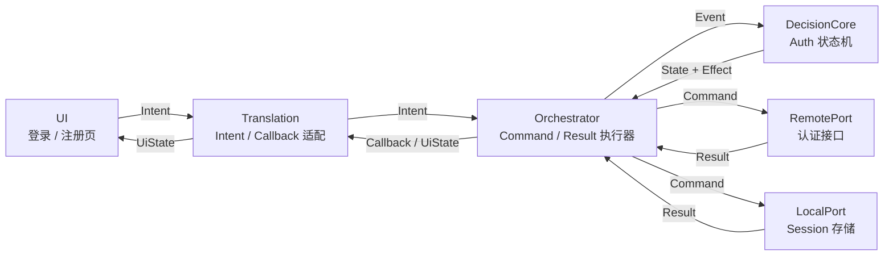

# 工作流 01：注册 / 登录

## 2. 总体位置



## 3. Intent / Callback

这一层只管 UI 输入和 UI 输出。

### 3.1 Intent

```kotlin
sealed class AuthIntent {
    data class SubmitLogin(val account: String, val password: String) : AuthIntent()
    data class SubmitRegister(val account: String, val password: String, val telephone: String, val avatarUrl: String? = null) : AuthIntent()
    object Logout : AuthIntent()
    object Reset : AuthIntent()
}
```

| Intent | 含义 |
|---|---|
| `SubmitLogin` | 用户提交登录 |
| `SubmitRegister` | 用户提交注册 |
| `Logout` | 用户退出登录 |
| `Reset` | 用户关闭错误并回到初始态 |

### 3.2 Callback

```kotlin
sealed class AuthCallback {
    object ShowForm : AuthCallback()
    object ShowLoading : AuthCallback()
    data class ShowError(val message: String) : AuthCallback()
    data class ShowAuthenticated(val user: User) : AuthCallback()
    object ShowIdle : AuthCallback()
}

data class User(
    val id: String,
    val userName: String,
    val telephone: String,
    val avatarUrl: String? = null
)

data class AuthSession(
    val user: User,
    val token: String,
    val expiresAtMillis: Long? = null
)
```

`User` 是用户资料，`AuthSession` 是登录会话。  
token 和过期时间属于会话，不属于用户资料本身。

| Callback | 含义 |
|---|---|
| `ShowForm` | 显示表单 |
| `ShowLoading` | 显示加载中 |
| `ShowError` | 显示错误 |
| `ShowAuthenticated` | 进入已登录状态 |
| `ShowIdle` | 回到初始状态 |

`Translation` 的职责是：

- 把 UI Intent 变成状态机可理解的 Event。
- 把状态机输出的 UiState 变成 UI Callback。

UI 不直接关心远端命令和本地存储结果。

## 4. State / Event / Effect

这一层是 `DecisionCore`，本质是 reducer。

```text
reduce(currentState, event) -> nextState + effects
```

### 4.1 State

```kotlin
sealed class AuthState {
    object Idle : AuthState()
    object Loading : AuthState()
    object SavingSession : AuthState()
    data class Authenticated(val session: AuthSession) : AuthState()
    data class Error(val message: String) : AuthState()
}
```

| State | 含义 |
|---|---|
| `Idle` | 等待用户输入 |
| `Loading` | 正在远端认证 |
| `SavingSession` | 正在保存身份信息 |
| `Authenticated` | 身份已建立 |
| `Error` | 当前工作流失败 |

### 4.2 Event

```kotlin
sealed class AuthEvent {
    data class SubmitLogin(val account: String, val password: String) : AuthEvent()
    data class SubmitRegister(val account: String, val password: String, val telephone: String, val avatarUrl: String? = null) : AuthEvent()
    data class RemoteAccepted(val session: AuthSession) : AuthEvent()
    data class RemoteRejected(val message: String) : AuthEvent()
    object RemoteTimeout : AuthEvent()
    object SessionSaved : AuthEvent()
    data class SessionSaveFailed(val message: String) : AuthEvent()
    object Logout : AuthEvent()
    object Reset : AuthEvent()
}
```

Event 的来源有两类：

- UI 提交。
- Orchestrator 把 Port 的 Result 归一后回灌。

### 4.3 Effect

```kotlin
sealed class AuthEffect {
    data class LoginRemote(val account: String, val password: String) : AuthEffect()
    data class RegisterRemote(val account: String, val password: String, val telephone: String, val avatarUrl: String? = null) : AuthEffect()
    data class SaveSession(val session: AuthSession) : AuthEffect()
    object ClearSession : AuthEffect()
}
```

### 4.4 状态转换

| 当前 State | Event | 下一个 State | Effect |
|---|---|---|---|
| `Idle` / `Error` | `SubmitLogin` | `Loading` | `LoginRemote` |
| `Idle` / `Error` | `SubmitRegister` | `Loading` | `RegisterRemote` |
| `Loading` | `RemoteAccepted` | `SavingSession` | `SaveSession` |
| `Loading` | `RemoteRejected` | `Error(message)` | 无 |
| `Loading` | `RemoteTimeout` | `Error("远端超时")` | 无 |
| `SavingSession` | `SessionSaved` | `Authenticated(user)` | 无 |
| `SavingSession` | `SessionSaveFailed` | `Error(message)` | 无 |
| 任意 | `Logout` | `Idle` | `ClearSession` |
| `Error` | `Reset` | `Idle` | 无 |

这一层不直接处理 Command，也不直接看 Result。  
它只看 Event，只产出 State 和 Effect。

## 5. Command / Result

这一层是 `Orchestrator` 和 `Port` 的边界。

### 5.1 Command

```kotlin
sealed class AuthCommand {
    sealed class Remote : AuthCommand() {
        data class Login(val account: String, val password: String) : Remote()
        data class Register(val account: String, val password: String, val telephone: String, val avatarUrl: String? = null) : Remote()
    }

    sealed class Local : AuthCommand() {
        data class SaveSession(val session: AuthSession) : Local()
        object ClearSession : Local()
    }
}
```

| Command | 作用 |
|---|---|
| `RemoteCommand.Login` | 发起登录 |
| `RemoteCommand.Register` | 发起注册 |
| `LocalCommand.SaveSession` | 保存 token / session |
| `LocalCommand.ClearSession` | 清理 session |

### 5.2 Result

```kotlin
sealed class AuthResult {
    sealed class Remote : AuthResult() {
        data class Accepted(val session: AuthSession) : Remote()
        data class Rejected(val message: String) : Remote()
        object Timeout : Remote()
    }

    sealed class Local : AuthResult() {
        object SessionSaved : Local()
        data class SessionSaveFailed(val message: String) : Local()
        object SessionCleared : Local()
    }
}
```

| Result | 含义 |
|---|---|
| `RemoteResult.Accepted` | 远端认证成功 |
| `RemoteResult.Rejected` | 远端拒绝 |
| `RemoteResult.Timeout` | 远端超时 |
| `LocalResult.SessionSaved` | 本地保存成功 |
| `LocalResult.SessionSaveFailed` | 本地保存失败 |
| `LocalResult.SessionCleared` | 本地清理成功 |

### 5.3 Orchestrator 的职责

`Orchestrator` 只做四件事：

1. 接收 `Effect`。
2. 翻译成 `Command`。
3. 调用 `Port`。
4. 把 `Result` 归一成 `Event` 再送回 `DecisionCore`。

例如：

```text
AuthEffect.LoginRemote
-> RemoteCommand.Login
-> RemoteResult.Accepted / Rejected / Timeout
-> AuthEvent.RemoteAccepted / RemoteRejected / RemoteTimeout
```

```text
AuthEffect.SaveSession
-> LocalCommand.SaveSession
-> LocalResult.SessionSaved / SessionSaveFailed
-> AuthEvent.SessionSaved / SessionSaveFailed
```
