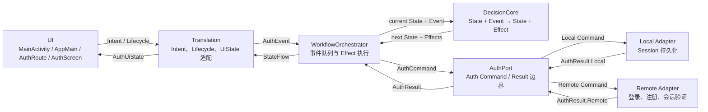

# 工作流 01：注册、登录与 Session 恢复

本文说明 `migratedev` 中 Auth 小闭环的结构和运行方式。重点不是展示某一个类的全部代码，而是回答以下问题：

- UI 的登录、注册操作如何进入状态机。
- 应用启动时，谁触发本地 Session 恢复。
- DecisionCore 如何决定下一状态和副作用。
- Orchestrator 如何把 Effect 翻译成 Port Command，再把 Result 回灌为 Event。
- LocalPort 如何安全保存单个活动 Session。
- RemotePort 如何完成登录、注册和 Session 验证。
- 当前设计已经解决什么问题，还有哪些边界需要继续处理。

当前登录输入为 `phone + password`，注册输入为 `phone + password + nickname`。远端注册 DTO 中，`nickname` 对应后端字段 `username`。

---

## 1. 总体拓扑



这张图规定了边界：

- UI 不读取 Session，不调用 Retrofit，也不直接构造内部结果事件。
- Translation 只适配外部输入和 UI 输出。
- DecisionCore 只计算状态转移，不执行 IO。
- Orchestrator 持有事件回环并执行 Effect。
- AuthPort 是 Auth 工作流访问外部能力的唯一边界。
- Local/Remote Adapter 只返回事实，不决定 UI 状态。

### 1.1 从拓扑得到的目录

| 拓扑节点 | 当前目录或文件 | 职责 |
|---|---|---|
| UI | `ui/AppMain.kt`、`ui/auth/` | 收集 `AuthUiState`，提交用户操作 |
| Translation | `translation/auth/AuthTranslation.kt` | `Intent/Lifecycle → Event`，`State → UiState` |
| Orchestrator | `orchestrator/WorkflowOrchestrator.kt` | 事件排队、状态发布、Effect 回环 |
| Auth EffectExecutor | `orchestrator/auth/AuthEffectExecutor.kt` | `Effect → Command`，`Result → Event` |
| DecisionCore | `decisioncore/auth/AuthDecision.kt` | Auth 状态、事件、Effect 和 reducer |
| AuthPort | `port/auth/` | Auth Command/Result 合约和 Local/Remote 路由 |
| Local Adapter | `port/adapter/localport/` | Session 读、写、清理和加密存储 |
| Remote Adapter | `port/adapter/remoteport/` | Retrofit 登录、注册和 Session 验证 |

---

## 2. UI：从 Application 到 AuthScreen

### 2.1 为什么从 MigrateDevApplication 和 AppGraph 开始

Auth 状态不能由某个临时 Composable 自己创建。否则页面离开组合后再次进入，可能重新得到一套 `Idle` 状态机，已经登录的内存状态也会丢失。

当前使用 Application 级组合根：

```kotlin
class MigrateDevApplication : Application() {
    lateinit var appGraph: AppGraph
        private set

    override fun onCreate() {
        super.onCreate()
        appGraph = AppGraph(this)
    }
}
```

`AppGraph` 不是新的业务层，也不是导航图。它只是手工依赖组装容器，负责在同一进程中创建并持有唯一的 Auth 工作流：

```kotlin
class AppGraph(application: Application) {
    private val appScope =
        CoroutineScope(SupervisorJob() + Dispatchers.Main.immediate)
    private val clock = Clock.systemUTC()

    private val sessionStore = EncryptedSessionStore(application)
    private val persistenceLocalPort = PersistenceLocalPort(sessionStore, clock)
    private val accountApi =
        RetrofitRemotePort.createAccountApi(BuildConfig.API_BASE_URL)
    private val authRemotePort = RetrofitRemotePort.Auth(accountApi, clock)
    private val authPort: AuthPort =
        DefaultAuthPort(persistenceLocalPort, authRemotePort)

    private val authOrchestrator = WorkflowOrchestrator(
        initialState = AuthState.Idle,
        decisionCore = AuthDecisionCore,
        effectExecutor = AuthEffectExecutor(authPort),
        scope = appScope
    )

    val authTranslation = AuthTranslation(authOrchestrator, appScope)
}
```

这里保证：

- Activity 重建时仍然取得同一个 `AuthTranslation`。
- Compose 重组不会重新创建 Port 或 Orchestrator。
- 返回 Auth 页面时重新订阅现有 `StateFlow`，而不是重新构造状态。

> TODO：`AppGraph` 当前只有 Auth 组装代码，但名称是应用级的。后续业务增加后，需要把 Auth、Bluetooth、CacheStream 等组装拆成内部子图或工厂；现阶段不为了尚未出现的复杂度增加抽象。

### 2.2 UI 链路

| 节点 | 输入 | 负责 | 不负责 |
|---|---|---|---|
| `MainActivity` | Android `Application` | 取得 `AppGraph`，安装 Compose | 创建 Port、判断登录态 |
| `AppMain` | `AuthTranslation` | 收集 `uiState`，发送一次 `AppStarted`，切换 Auth/Home | 表单字段、远端调用 |
| `AuthRoute` | `AuthUiState`、`AuthTranslation` | 把 Screen callback 转成 `AuthIntent` | 保存输入框状态、业务判断 |
| `AuthScreen` | `AuthUiState`、callbacks | 渲染表单、加载、错误和按钮 | 访问 Translation、Port、token |

`MainActivity` 只取得已经组装好的句柄：

```kotlin
class MainActivity : ComponentActivity() {
    override fun onCreate(savedInstanceState: Bundle?) {
        super.onCreate(savedInstanceState)
        val appGraph = (application as MigrateDevApplication).appGraph

        setContent {
            MaterialTheme {
                AppMain(appGraph.authTranslation)
            }
        }
    }
}
```

`AppMain` 观察状态并驱动顶层页面：

```kotlin
@Composable
fun AppMain(authTranslation: AuthTranslation) {
    val uiState by authTranslation.uiState.collectAsStateWithLifecycle()

    LaunchedEffect(authTranslation) {
        authTranslation.onLifecycle(AuthLifecycleEvent.AppStarted)
    }

    when (val state = uiState) {
        is AuthUiState.Authenticated -> DebugHomeScreen(state.user) {
            authTranslation.submit(AuthIntent.Logout)
        }
        else -> AuthRoute(state, authTranslation)
    }
}
```

这里有两个容易混淆的点：

1. `collectAsStateWithLifecycle()` 只控制 UI 在可见生命周期内收集状态，不创建或重置状态机。
2. `LaunchedEffect(authTranslation)` 在这个 Translation 实例不变时只执行一次，不会因为普通重组重复发送 `AppStarted`。

`AuthRoute` 只做参数命名和 Intent 适配：

```kotlin
@Composable
fun AuthRoute(state: AuthUiState, translation: AuthTranslation) {
    AuthScreen(
        state = state,
        onLogin = { phone, password ->
            translation.submit(AuthIntent.SubmitLogin(phone, password))
        },
        onRegister = { phone, password, nickname ->
            translation.submit(
                AuthIntent.SubmitRegister(phone, password, nickname)
            )
        },
        onRetrySession = {
            translation.onLifecycle(AuthLifecycleEvent.AppStarted)
        }
    )
}
```

### 2.3 登录与注册表单

| 模式 | 输入字段 | 提交 |
|---|---|---|
| 登录 | `phone`、`password` | `SubmitLogin(phone, password)` |
| 注册 | `phone`、`password`、`nickname` | `SubmitRegister(phone, password, nickname)` |

`phone` 和 `password` 是两种模式共有字段；只有注册模式显示 `nickname`。昵称使用普通文本键盘，不能使用 `KeyboardType.Phone`。

UI 状态反馈：

| `AuthUiState` | Screen 表现 |
|---|---|
| `Idle` | 显示可提交表单 |
| `RestoringSession` | 显示“正在自动登录…” |
| `Loading` | 显示登录或注册中的进度 |
| `SavingSession` | 显示正在保存会话 |
| `Registered` | 显示注册成功，并切回登录模式 |
| `Error` | 显示错误和 Session 恢复重试入口 |
| `Authenticated` | 由 `AppMain` 切换到 Home |

> TODO：当前 UI 允许空手机号、空密码或空昵称进入状态机。输入校验应先形成统一规则，再决定由 Screen 只控制按钮，还是由 Translation/DecisionCore 返回可测试的校验错误。

---

## 3. Translation：区分用户 Intent 与生命周期输入

### 3.1 为什么需要 onLifecycle

状态机创建时的初始状态永远是 `AuthState.Idle`。`Idle` 是一个静态初始值，不会自动扫描 SharedPreferences，也不会自己产生 Effect。

自动登录需要一个显式的第一驱动力：

| 外部来源 | Translation 输入 | 内部 Event | 用途 |
|---|---|---|---|
| 用户点击登录 | `AuthIntent.SubmitLogin` | `AuthEvent.SubmitLogin` | 手动登录 |
| 用户点击注册 | `AuthIntent.SubmitRegister` | `AuthEvent.SubmitRegister` | 注册 |
| 用户点击退出 | `AuthIntent.Logout` | `AuthEvent.Logout` | 清理当前 Session |
| App 首次启动 | `AuthLifecycleEvent.AppStarted` | `AuthEvent.AppStarted` | 读取并验证本地 Session |

`AppStarted` 不是用户操作，但进入 Orchestrator 后和其他 Event 使用同一条事件队列。它让“初始化检查”成为显式事件，而不是隐藏在构造函数、UI 或 `Idle` 状态中。

### 3.2 为什么不向 UI 暴露 AuthEvent

内部 Event 包含 `SessionVerified`、`SessionSaved`、`RemoteAccepted` 等结果事件。它们只能由受信任的 Port Result 产生。

如果 UI 可以直接 dispatch 任意 `AuthEvent`，就可以绕过远端验证或本地保存，伪造 `SessionVerified`、`SessionSaved`。因此 Translation 只开放白名单入口：

```kotlin
sealed interface AuthLifecycleEvent {
    data object AppStarted : AuthLifecycleEvent
}

fun onLifecycle(event: AuthLifecycleEvent) {
    val authEvent = when (event) {
        AuthLifecycleEvent.AppStarted -> AuthEvent.AppStarted
    }
    orchestrator.dispatch(authEvent)
}
```

### 3.3 Translation 的双向映射

用户输入映射：

| `AuthIntent` | `AuthEvent` |
|---|---|
| `SubmitLogin(phone, password)` | `SubmitLogin(phone, password)` |
| `SubmitRegister(phone, password, nickname, avatarUrl)` | 同字段 `SubmitRegister` |
| `Logout` | `Logout` |
| `Reset` | `Reset` |

状态输出映射：

| `AuthState` | `AuthUiState` | 特别处理 |
|---|---|---|
| `Idle` | `Idle` | 无 |
| `RestoringSession` | `RestoringSession` | 无 |
| `Loading` | `Loading` | 当前未区分登录、注册、Session 验证 |
| `SavingSession(session)` | `SavingSession` | 不把 Session 暴露给 UI |
| `Registered(message)` | `Registered(message)` | 无 |
| `Authenticated(session)` | `Authenticated(session.user)` | 隐藏 token 和过期时间 |
| `Error(message)` | `Error(message)` | 无 |

### 3.4 生命周期入口的风险和规划

| 风险 | 原因 | 约束或 TODO |
|---|---|---|
| 重复启动读取 | 多个页面都发送 `AppStarted` | 只由 App 根节点发送；DecisionCore 对非允许状态忽略重复事件 |
| 页面返回时重建状态机 | 在 Composable 内创建 Orchestrator | 始终复用 Application 级 `AuthTranslation` |
| `AppStarted` 语义膨胀 | 同一个事件同时承担冷启动、前台恢复、页面重进 | 真实需求出现后再增加 `AppForegrounded`、`AuthScreenEntered`，不得复用模糊事件 |
| 自动验证与手动登录共用 `Loading` | UI 无法准确区分“正在自动登录”和“正在手动登录” | TODO：在状态机中拆分远端操作类型，而不是由 UI 猜测 |
| Error 重试范围过大 | 当前 `AppStarted` 在任意 `Error` 都可以重新读 Session | TODO：区分 Session 恢复错误和手动登录错误 |

---

## 4. Orchestrator：Effect、Command、Result、Event 回环

`WorkflowOrchestrator` 的核心回环是：

```kotlin
for (event in events) {
    val transition = decisionCore.reduce(state.value, event)
    state.value = transition.newState
    transition.effects.forEach { effect ->
        effectScope.launch {
            effectExecutor.execute(effect).collect(events::send)
        }
    }
}
```

`collect(events::send)` 的返回值是 `Unit`，因为 `collect` 是终止操作。真正有意义的数据是 Flow 发出的每一个 `AuthEvent`；它们被 `events::send` 重新送入同一条 Channel，然后触发下一次 `reduce`。

### 4.1 Effect → Command

| DecisionCore 产生的 Effect | EffectExecutor 产生的 Command | 路由 |
|---|---|---|
| `ReadSession` | `Local.ReadSession` | Local |
| `ValidateSession(session)` | `Remote.ValidateSession(session)` | Remote |
| `LoginRemote(phone, password)` | `Remote.Login(phone, password)` | Remote |
| `RegisterRemote(phone, password, nickname, avatarUrl)` | 同字段 `Remote.Register` | Remote |
| `SaveSession(session)` | `Local.SaveSession(session)` | Local |
| `ClearSession` | `Local.ClearSession` | Local |

### 4.2 Result → Event

| Port Result | 回灌 Event |
|---|---|
| `Local.SessionFound(session)` | `SessionFound(session)` |
| `Local.SessionMissing` | `SessionMissing` |
| `Local.SessionExpired` | `SessionExpired` |
| `Local.SessionReadFailed(message)` | `SessionReadFailed(message)` |
| `Local.SessionSaved` | `SessionSaved` |
| `Local.SessionSaveFailed(message)` | `SessionSaveFailed(message)` |
| `Local.SessionCleared` | `SessionCleared` |
| `Local.SessionClearFailed(message)` | `SessionClearFailed(message)` |
| `Remote.SessionVerified(session)` | `SessionVerified(session)` |
| `Remote.SessionRejected(message)` | `SessionRejected(message)` |
| `Remote.SessionValidationTimeout` | `SessionValidationTimeout` |
| `Remote.Accepted(session)` | `RemoteAccepted(session)` |
| `Remote.Rejected(message)` | `RemoteRejected(message)` |
| `Remote.Timeout` | `RemoteTimeout` |
| `Remote.RegistrationAccepted` | `RegistrationAccepted` |

EffectExecutor 不判断下一状态。它只完成协议转换；Result 对状态的影响仍由 DecisionCore 决定。

---

## 5. DecisionCore：完整状态转移

DecisionCore 是纯 reducer：

```text
reduce(currentState, event) = nextState + effects
```

State 表示工作流当前所处阶段，Event 表示已经发生的事实，Effect 表示下一步需要外部执行的动作。

### 5.1 当前状态

| State | 工作流含义 |
|---|---|
| `Idle` | 没有活动认证任务，等待输入 |
| `RestoringSession` | 正在读取本地 Session |
| `Loading` | 正在执行远端登录、注册或 Session 验证 |
| `SavingSession(session)` | 远端登录已成功，正在持久化完整 Session |
| `Registered(message)` | 注册成功，等待用户登录 |
| `Authenticated(session)` | 本地保存完成，身份已建立 |
| `Error(message)` | 当前操作失败 |

### 5.2 当前实现的状态转移表

| 当前 State | Event | 下一个 State | Effect |
|---|---|---|---|
| `Idle` / `Error` | `AppStarted` | `RestoringSession` | `ReadSession` |
| `RestoringSession` | `SessionFound(session)` | `Loading` | `ValidateSession(session)` |
| `RestoringSession` | `SessionMissing` | `Idle` | 无 |
| `RestoringSession` | `SessionExpired` | `Idle` | `ClearSession` |
| `RestoringSession` | `SessionReadFailed(message)` | `Error(message)` | 无 |
| `Loading` | `SessionVerified(session)` | `Authenticated(session)` | 无 |
| `Loading` | `SessionRejected(message)` | `Idle` | `ClearSession` |
| `Loading` | `SessionValidationTimeout` | `Error("会话验证超时，请重试")` | 无，保留本地 Session |
| `Loading` | `RegistrationAccepted` | `Registered(message)` | 无 |
| `Idle` / `Registered` / `Error` | `SubmitLogin(phone, password)` | `Loading` | `LoginRemote(phone, password)` |
| `Idle` / `Error` | `SubmitRegister(phone, password, nickname)` | `Loading` | `RegisterRemote(...)` |
| `Loading` | `RemoteAccepted(session)` | `SavingSession(session)` | `SaveSession(session)` |
| `Loading` | `RemoteRejected(message)` | `Error(message)` | 无 |
| `Loading` | `RemoteTimeout` | `Error("远端请求超时")` | 无 |
| `SavingSession` | `SessionSaved` | `Authenticated(session)` | 无 |
| `SavingSession` | `SessionSaveFailed(message)` | `Error(message)` | 无 |
| 任意 | `Logout` | `Idle` | `ClearSession` |
| 任意 | `SessionClearFailed(message)` | `Error(message)` | 无 |
| 任意 | `SessionCleared` | `Idle` | 无 |
| `Error` / `Registered` | `Reset` | `Idle` | 无 |
| 其他不匹配组合 | 任意 Event | 保持当前状态 | 无 |

登录成功的安全边界是：

| 阶段 | 状态 |
|---|---|
| 服务端返回 token 并取得用户详情 | `Loading → SavingSession` |
| 加密 Session 写盘成功 | `SavingSession → Authenticated` |
| 写盘失败 | `SavingSession → Error` |

因此系统不会在 Session 尚未持久化时宣布 `Authenticated`。

### 5.3 Logout 与清理竞态

当前实现存在一个必须在 DecisionCore 收口的竞态：

| 时间 | 当前实现 |
|---|---|
| 1 | `Authenticated + Logout` 立即进入 `Idle`，同时异步执行 `ClearSession` |
| 2 | `Idle` 已允许用户提交另一个账号登录 |
| 3 | 新账号可能先完成 `SaveSession` |
| 4 | 较慢的旧 `ClearSession` 随后完成，把新 Session 删除 |

这个问题不能由 SharedPreferences、UI 或 RemotePort 修补。正确归属是状态机。

建议新增清理中的状态：

| 当前 State | Event | 下一个 State | Effect |
|---|---|---|---|
| `Authenticated` | `Logout` | `ClearingSession` | `ClearSession` |
| Session 明确过期或被拒绝 | 清理决定 | `ClearingSession` | `ClearSession` |
| `ClearingSession` | `SessionCleared` | `Idle` | 无 |
| `ClearingSession` | `SessionClearFailed(message)` | `Error(message)` | 无 |
| `ClearingSession` | `SubmitLogin` / `SubmitRegister` | `ClearingSession` | 无 |

> TODO：当前源码尚未增加 `ClearingSession`。在实现前需要同时更新 State、状态表、UiState、按钮可用条件和 DecisionCore 测试。

---

## 6. AuthPort：Auth 对外能力边界

### 6.1 Command

| Command | 参数 | Adapter 行为 |
|---|---|---|
| `Local.ReadSession` | 无 | 读取本地加密 Session |
| `Local.SaveSession` | `session` | 保存完整 Session blob |
| `Local.ClearSession` | 无 | 删除本机 Session blob |
| `Remote.Login` | `phone`、`password` | 登录并读取用户详情 |
| `Remote.Register` | `phone`、`password`、`nickname`、`avatarUrl?` | 注册账号 |
| `Remote.ValidateSession` | `session` | 使用原 token 请求用户详情 |

### 6.2 Result

| 类别 | Result | 表示的事实 |
|---|---|---|
| Local | `SessionFound(session)` | 找到并解密 Session |
| Local | `SessionMissing` | 本地没有 blob |
| Local | `SessionExpired` | 本地截止时间已过 |
| Local | `SessionReadFailed(message)` | blob 无法读取或解密 |
| Local | `SessionSaved` / `SessionSaveFailed` | 写盘成功或失败 |
| Local | `SessionCleared` / `SessionClearFailed` | 删除成功或失败 |
| Remote | `Accepted(session)` | 登录与详情请求均成功 |
| Remote | `Rejected(message)` | 登录/注册被拒绝或网络失败 |
| Remote | `Timeout` | 手动登录或注册超时 |
| Remote | `RegistrationAccepted` | 注册成功，但没有登录 Session |
| Remote | `SessionVerified(session)` | 服务端确认原 token 有效 |
| Remote | `SessionRejected(message)` | 服务端明确拒绝原 token |
| Remote | `SessionValidationTimeout` | 暂时无法验证，不能据此删除 Session |

### 6.3 DefaultAuthPort 的路由

| 输入 | 委托对象 |
|---|---|
| `AuthCommand.Local` | `PersistenceLocalPort.execute()` |
| `AuthCommand.Remote` | `RetrofitRemotePort.Auth.execute()` |

`DefaultAuthPort` 不做状态判断，不转换 Result，也不是第二个业务状态机。它只是 Auth 业务组合 Local/Remote Adapter 的位置。

目录保持为：

```text
port/
├─ auth/
│  ├─ AuthPort.kt
│  └─ DefaultAuthPort.kt
└─ adapter/
   ├─ localport/
   │  ├─ PersistenceLocalPort.kt
   │  ├─ SessionStore.kt
   │  └─ EncryptedSessionStore.kt
   ├─ remoteport/
   │  └─ RetrofitRemotePort.kt
   └─ bluetoothport/
      └─ AndroidBluetoothPort.kt
```

当前只有一个 Session 数据源，不增加 Repository。只有出现内存、SP、数据库等多个数据源协调时，Repository 才有明确职责。

---

## 7. LocalPort：SessionStore 与加密 blob

### 7.1 SessionStore 合约

| 方法 | 输入 | 输出 | 含义 |
|---|---|---|---|
| `read()` | 无 | `Found / Missing / Corrupted` | 只报告本地存储事实 |
| `save(session)` | 完整 `AuthSession` | `Boolean` | 是否确认写盘成功 |
| `clear()` | 无 | `Boolean` | 是否确认删除成功 |

`SessionStore` 不判断下一个 AuthState，也不调用远端。

### 7.2 PersistenceLocalPort 的处理

| Command | SessionStore 结果 | AuthResult |
|---|---|---|
| `ReadSession` | 没有 blob | `SessionMissing` |
| `ReadSession` | 解密/解析失败 | 清理损坏 blob，并返回 `SessionReadFailed` |
| `ReadSession` | 找到且未过期 | `SessionFound(session)` |
| `ReadSession` | 找到但本地截止时间已过 | `SessionExpired` |
| `SaveSession` | `save() == true` | `SessionSaved` |
| `SaveSession` | `save() == false` | `SessionSaveFailed` |
| `ClearSession` | `clear() == true` | `SessionCleared` |
| `ClearSession` | `clear() == false` | `SessionClearFailed` |

是否因过期或拒绝而清理 Session，由 DecisionCore 产生 `ClearSession` Effect；LocalPort 不自行决定业务策略。

### 7.3 SharedPreferences 存储结构

| 项目 | 当前值 |
|---|---|
| SharedPreferences 名称 | `auth_session_secure` |
| blob key | `session_blob_v1` |
| blob 明文 | 完整 `AuthSession` JSON |
| SP 实际存储值 | Base64 编码的加密 payload |
| Keystore alias | `migratedev.auth.session.aes256` |
| AAD | `migratedev/auth_session_secure/session_blob_v1` |

SP 中只有一个 Session blob，不分别保存 token、用户和过期时间，避免一次更新只写成功一部分。

加密 payload 的逻辑结构：

| 字段 | 作用 |
|---|---|
| `version` | 识别 payload 格式，当前为 v1 |
| `IV` | 每次加密由 Cipher/Keystore 产生的新 12-byte IV |
| `ciphertext + tag` | AES-256-GCM 密文和 128-bit authentication tag |

密钥保存在 Android Keystore 中，不写入 SP，也不能从应用中导出。AAD 把密文绑定到固定存储位置；密文被篡改、Key 失效或 JSON 损坏时，读取统一返回 `Corrupted`，不泄漏 token。

### 7.4 为什么保存使用 commit()

Session 的状态转移依赖“是否已经持久化”：

| API | 行为 | 是否适合这里 |
|---|---|---|
| `apply()` | 内存先更新，磁盘异步写入，没有成功返回值 | 不适合 |
| `commit()` | 同步写盘并返回 Boolean | 适合，在 IO dispatcher 调用 |

只有 `commit()` 返回 `true`，LocalPort 才能返回 `SessionSaved`，DecisionCore 才能进入 `Authenticated`。

### 7.5 备份边界

Session 密文不能进入 Auto Backup 或设备迁移。否则新设备可能恢复 SP 密文，却没有原设备 Keystore key，导致永久解密失败。

当前 manifest 应同时绑定：

- Android 11 及以下的 `fullBackupContent`。
- Android 12+ 的 `dataExtractionRules`。

规则明确排除 `auth_session_secure.xml`。

---

## 8. RemotePort：登录、注册与 Session 验证

### 8.1 Retrofit 接口

| 操作 | HTTP | 请求 | 成功数据 |
|---|---|---|---|
| 登录 | `POST /api/account/v1/login` | Body：`phone`、`password` | token 字符串 |
| 注册 | `POST /api/account/v1/register` | Body：`username`、`password`、`phone`、`avatarUrl` | 通常不依赖 data |
| 用户详情 | `GET /api/account/v1/detail` | Header：`token` | `AccountDto` |

领域字段与 DTO 字段：

| 领域字段 | Retrofit DTO 字段 |
|---|---|
| `phone` | `phone` |
| `password` | `password` |
| `nickname` | `username` |
| `avatarUrl` | `avatarUrl` |

### 8.2 登录调用表

| 步骤 | 异步调用 | 输入 | 成功后 | 失败结果 |
|---|---|---|---|---|
| 1 | `api.login()` | `LoginRequest(phone, password)` | 获得非空 token | `Rejected` |
| 2 | `api.detail()` | 本次登录取得的 token | 获得 `AccountDto` | `Rejected` |
| 3 | DTO 转领域对象 | `AccountDto` | `User` | 无 |
| 4 | 组装 Session | `User + token + now + TTL` | `Accepted(AuthSession)` | 无 |

登录拿到 token 后不会立刻写 LocalPort。只有 `/detail` 也成功，RemotePort 才返回完整 `AuthSession`，随后由 DecisionCore 进入 `SavingSession`。

这样可以避免保存“只有 token、没有用户资料”的半成品 Session。

### 8.3 注册调用表

| 步骤 | 输入 | Retrofit 请求 | 结果 |
|---|---|---|---|
| 1 | `Remote.Register(phone, password, nickname, avatarUrl)` | `RegisterRequest(username = nickname, phone = phone, ...)` | 发起注册 |
| 2 | 服务端成功 | 不要求创建 Session | `RegistrationAccepted` |
| 3 | 服务端拒绝 | `msg` 或默认消息 | `Rejected(message)` |

注册成功不等于登录成功。状态机进入 `Registered`，UI 切回登录模式，等待用户使用手机号和密码登录。

### 8.4 Session 验证调用表

| 步骤 | 输入 | 调用 | 成功结果 |
|---|---|---|---|
| 1 | 本地 `AuthSession` | `GET /detail`，Header 使用原 token | 新的用户资料 |
| 2 | 组装验证后 Session | 新 `User` + 原 token + 原 `expiresAtMillis` | `SessionVerified` |

验证只刷新用户资料，不滑动延长本地 Session 截止时间。

### 8.5 异常分类

| 场景 | 登录/注册结果 | Session 验证结果 | 原因 |
|---|---|---|---|
| 30 秒超时 | `Timeout` | `SessionValidationTimeout` | 超时不能证明 token 无效 |
| `IOException` | `Rejected("网络错误…")` | `SessionValidationTimeout` | 网络故障时保留本地 Session |
| HTTP 401/403 | `Rejected("服务端错误…")` | `SessionRejected` | 服务端明确拒绝 token |
| 其他 HTTP 错误 | `Rejected("服务端错误…")` | `SessionValidationTimeout` | 暂时无法确认 token 是否无效 |
| 业务响应失败 | `Rejected(msg)` | `SessionRejected(msg)` | 接口明确返回失败 |
| 登录成功但 token 为空 | `Rejected` | 不适用 | 不能继续请求详情 |

RemotePort 只把异常归类为 Result。清理 Session、显示错误还是允许重试，仍由 DecisionCore 决定。

---

## 9. 三条完整工作流

### 9.1 冷启动与自动登录

| 阶段 | State/Event/Effect | Command/调用 | Result/下一步 |
|---|---|---|---|
| 启动 | `Idle + AppStarted → RestoringSession + ReadSession` | `Local.ReadSession` | 读取本地 blob |
| 无 Session | `SessionMissing` | 无 | `Idle`，显示登录表单 |
| Session 过期 | `SessionExpired` | `Local.ClearSession` | 清理后回到 `Idle` |
| 找到 Session | `SessionFound(session)` | `Remote.ValidateSession(session)` | 请求 `/detail` |
| 验证成功 | `SessionVerified(session)` | 无 | `Authenticated` |
| 明确拒绝 | `SessionRejected` | `Local.ClearSession` | 当前实现回到 `Idle` |
| 暂时无法验证 | `SessionValidationTimeout` | 无 | `Error`，保留 Session 供重试 |

### 9.2 手动登录

| 阶段 | State/Event/Effect | Remote/Local 行为 | Result/下一步 |
|---|---|---|---|
| 提交 | `Idle + SubmitLogin → Loading + LoginRemote` | `POST /login` | 得到 token |
| 补全用户 | 保持 `Loading` | `GET /detail(token)` | 得到用户资料 |
| 远端完成 | `RemoteAccepted(session)` | 产生 `SaveSession` | `SavingSession` |
| 保存成功 | `SessionSaved` | 无 | `Authenticated` |
| 保存失败 | `SessionSaveFailed` | 无 | `Error`，不能宣布登录完成 |

### 9.3 注册

| 阶段 | State/Event/Effect | 调用 | Result/下一步 |
|---|---|---|---|
| 提交 | `Idle + SubmitRegister → Loading + RegisterRemote` | `POST /register` | 等待响应 |
| 成功 | `RegistrationAccepted` | 不保存 Session | `Registered`，切回登录表单 |
| 拒绝 | `RemoteRejected(message)` | 无 | `Error(message)` |
| 超时 | `RemoteTimeout` | 无 | `Error("远端请求超时")` |

---

## 10. 设计洞见、边界与 TODO

### 10.1 单活动账号、单 Session 槽位

当前 SP 只有一个 `session_blob_v1`，状态机在 `Authenticated` 时也不会接受新的 `SubmitLogin`。因此当前模型是：

- 同一时间只有一个活动账号。
- 新账号登录前必须退出并清理旧 Session。
- 不存在同时读取多个用户 Session 的选择问题。

普通硬件配套或工具 App 通常不需要多账号多 Session。只有邮箱、即时通讯、多租户工作台等需要同时后台同步多个身份的产品，才值得引入：

- `activeAccountId`。
- `sessions[accountId]`。
- 每账号独立缓存、数据库、通知和退出策略。

在产品没有明确要求前，不增加多 Session 存储。

### 10.2 保存完成才算登录完成

远端成功不是最终登录状态。只有完整 Session 加密并确认写盘成功后，状态机才能进入 `Authenticated`。这使进程重启后的身份状态和当前 UI 宣布的状态保持一致。

### 10.3 自动登录不是 Idle 的隐式行为

`Idle` 不扫描存储。`AppStarted` 是显式第一驱动力，Session 读取通过正常的 Effect/Command/Result/Event 回环完成。这种方式可测试，也不会让 UI 或 State 构造函数隐藏 IO。

### 10.4 Session 验证失败需要区分“拒绝”和“暂时无法确认”

- 401/403 或明确业务拒绝：token 已不可用，可以清理。
- 超时、断网、5xx：只能说明当前无法验证，必须保留本地 Session。

如果把所有异常都视为 token 失效，用户在短暂断网时会被错误退出。

### 10.5 Logout 竞态必须由状态机解决

当前 `Logout → Idle + ClearSession` 会过早开放新登录入口。需要新增 `ClearingSession`，等 `SessionCleared` 后再进入 `Idle`。同样的规则也适用于 Session 过期和服务端拒绝后的清理。

### 10.6 Loading 状态需要进一步细分

当前一个 `Loading` 同时表示：

- 手动登录。
- 注册。
- 自动 Session 验证。

这会让 UI 无法稳定显示准确文案，也让来自不同远端操作的 Result 可能在同一 State 中被错误接受。

> TODO：将远端认证阶段拆成有操作类型的状态，例如 `Loading(Login)`、`Loading(Register)`、`ValidatingSession`，并让每个结果只在对应状态生效。

### 10.7 页面重进不等于 AppStarted

页面切走再返回时，应重新订阅 Application 级 `AuthTranslation.uiState`。如果当前已经是 `Authenticated`，直接显示已登录页面，不重新读取 Session。

未来如果确实需要前台恢复检查或 Auth 页面重进检查，应增加语义明确的生命周期输入，例如 `AppForegrounded`，并为它单独定义状态转移；不能把所有入口都复用成 `AppStarted`。

### 10.8 当前实现检查清单

| 检查项 | 当前状态 |
|---|---|
| 登录字段为 `phone + password` | 已实现 |
| 注册字段为 `phone + password + nickname` | 已实现 |
| 注册 DTO 映射 `nickname → username` | 已实现 |
| 登录后先补全详情再保存 Session | 已实现 |
| Session 使用单个加密 blob | 已实现 |
| Session 保存使用可检查的 `commit()` | 已实现 |
| 冷启动读取并验证 Session | 已实现 |
| 验证超时保留本地 Session | 已实现 |
| Session SP 排除系统备份 | 已实现 |
| Logout/ClearSession 竞态 | TODO |
| 区分登录、注册、自动验证的 Loading | TODO |
| 输入字段本地校验 | TODO |
| AppGraph 多业务组装抽象 | TODO，等业务增加后处理 |
