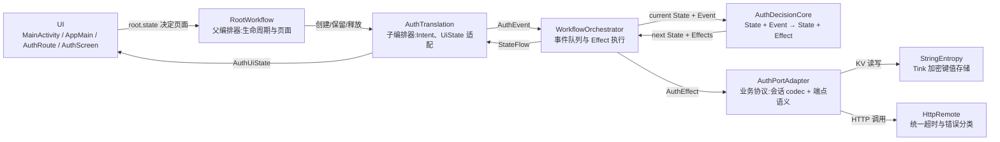

# 工作流 01：注册、登录与 Session 恢复

本文说明 `migratedev` 中 Auth 小闭环的结构和运行方式。重点不是展示某一个类的全部代码，而是回答以下问题：

- 应用启动时，谁触发本地 Session 恢复。
- UI 的登录、注册操作如何进入状态机。
- DecisionCore 如何决定下一状态和副作用。
- Orchestrator 如何把 Effect 交给 Port 执行，再把结果回灌为 Event。
- AuthPortAdapter 如何安全保存单个活动 Session。
- AuthPortAdapter 如何完成登录、注册和 Session 验证。
- 当前设计已经解决什么问题，还有哪些边界需要继续处理。

> 词汇说明：本库自 04 修订起统一为 **Effect（领域副作用，下行）/ Event（领域事实，上行）** 两种词汇，`AuthPort.execute(AuthEffect): Flow<AuthEvent>` 直通，不存在 Command/Result 中间层。

当前登录输入为 `phone + password`，注册输入为 `phone + password + nickname`。远端注册 DTO 中，`nickname` 对应后端字段 `username`。

---

## 1. 总体拓扑



这张图规定了边界：

- UI 不读取 Session，不调用 Retrofit，也不直接构造内部结果事件。
- 父编排器只创建子 Translation、把子业务输出转成自己的事件；不参与登录细节。
- Translation 只适配外部输入和 UI 输出，并向上报告跨业务的事实。
- DecisionCore 只计算状态转移，不执行 IO。
- Orchestrator 持有事件回环并执行 Effect（`effectExecutor = port::execute` 函数类型）。
- AuthPortAdapter 是 Auth 工作流访问外部能力的唯一边界：本地 KV 存会话、远端 HTTP 登录/注册/验证。
- 能力层（KV、HTTP）只返回事实，不决定 UI 状态。

### 1.1 从拓扑得到的目录

| 拓扑节点 | 当前目录或文件 | 职责 |
|---|---|---|
| UI | `ui/AppMain.kt`、`ui/auth/` | 收集 `RootState` 决定页面；Auth 页收集 `AuthUiState`，提交用户操作 |
| 父编排器 | `orchestrator/root/RootWorkflow.kt` | 持有两个 ViewModelStore，创建/释放 AuthTranslation 与 ConnectionTranslation，把 `AuthOutput` 转成 `RootEvent` |
| 子编排器 | `translation/auth/AuthTranslation.kt` | `Intent → Event`，`State → UiState`，`State → Output` 上报 |
| Orchestrator | `orchestrator/WorkflowOrchestrator.kt` | 事件排队、状态发布、Effect 回环 |
| DecisionCore | `decisioncore/auth/AuthDecision.kt` | Auth 状态、事件、Effect 和 reducer |
| AuthPort | `port/auth/` | `AuthPort` 接口 + `AuthPortAdapter`（业务协议全部内容） |
| 本地能力 | `port/adapter/localport/` | `StringEntropy`（Tink 加密键值存储） |
| 远端能力 | `port/adapter/remoteport/` | `HttpRemote`（统一超时 + 错误分类） |

---

## 2. UI：从 Application 到 AuthScreen

### 2.1 为什么从 MigrateDevApplication 和 AppGraph 开始

Auth 状态不能由某个临时 Composable 自己创建。否则页面离开组合后再次进入，可能重新得到一套 `Idle` 状态机，已经登录的内存状态也会丢失。

当前使用 Application 级组合根：

```kotlin
class MigrateDevApplication : Application() {
    lateinit var appGraph: AppGraph
        private set

    override fun onCreate() {
        super.onCreate()
        appGraph = AppGraph(this)
    }
}
```

`AppGraph` 不是新的业务层，也不是导航图。它只是手工依赖组装容器，分两段：能力挂载区（每类能力只挂一次）+ 业务组装区（薄适配器，自持业务协议）：

```kotlin
class AppGraph(application: Application) {
    // ── 能力挂载区:每类能力只挂一次 ────────────────────────────
    private val androidLocal = AndroidLocalPort.create(application, applicationScope)
    private val kv: StringEntropy = androidLocal.entropy      // 键值存储(Tink 加密)
    private val sqlite: LocalDatabase = androidLocal.sqlite   // 结构化存储(SQLDelight)
    private val http: HttpRemote = OkHttpRemote(BuildConfig.API_BASE_URL)
    private val ble: BluetoothPort = AndroidBluetoothPort(application)

    // ── 业务组装区:薄适配器,只表达业务协议 ──────────────────────
    private val authPort: AuthPort = AuthPortAdapter(kv, http, clock)
    private val connectionPort: ConnectionPort = ConnectionPortAdapter(sqlite, ble)

    val rootWorkflow = RootWorkflow(authPort, connectionPort, scope = rootScope)
}
```

这里保证：

- Activity 重建时仍然取得同一个 `RootWorkflow`（进而同一个 `AuthTranslation`）。
- Compose 重组不会重新创建 Port 或 Orchestrator。
- 返回 Auth 页面时重新订阅现有 `StateFlow`，而不是重新构造状态。

### 2.2 页面由 RootState 决定，Translation 由 RootWorkflow 管理

`AppMain` 不再直接持有 AuthTranslation，而是观察父编排器状态，靠 `RootState.screen()` 决定唯一目标页面：

```kotlin
@Composable
fun AppMain(graph: AppGraph) {
    val navController = rememberNavController()
    val root = graph.rootWorkflow
    val rootState by root.state.collectAsStateWithLifecycle()

    RootNavigationEffect(navController, rootState)

    NavHost(navController = navController, startDestination = "session") {
        navigation(route = "session", startDestination = "auth") {
            composable("auth") {
                val auth = root.authOrNull()
                if (auth == null) AppLoading()          // 父编排器尚未创建,短暂占位
                else {
                    val state by auth.uiState.collectAsStateWithLifecycle()
                    AuthRoute(state, auth)
                }
            }
            composable("connection/{userId}") {
                val connection = root.connectionOrNull()
                if (connection == null) AppLoading()
                else ConnectionRoute(connection)
            }
        }
    }
}
```

`RootWorkflow` 在冷启动时自行开始 `StartAuth` 链路（见 2.3），`RootState` 迁移到 `PreparingConnection` 后导航切到 Connection 页（`popUpTo("auth") { inclusive = true }`，按返回键不会回到登录页）。

| 节点 | 输入 | 负责 | 不负责 |
|---|---|---|---|
| `MainActivity` | Android `Application` | 取得 `AppGraph`，安装 Compose | 创建 Port、判断登录态 |
| `AppMain` | `AppGraph` | 观察 `root.state`，`RootNavigationEffect` 驱动页面 | 表单字段、远端调用 |
| `AuthRoute` | `AuthUiState`、`AuthTranslation` | 把 Screen callback 转成 `AuthIntent` | 保存输入框状态、业务判断 |
| `AuthScreen` | `AuthUiState`、callbacks | 渲染表单、加载、错误和按钮 | 访问 Translation、Port、token |

### 2.3 冷启动链路（父 → 子）

```text
RootWorkflow init → dispatch(AppStartedEvent)
→ RootDecisionCore:Starting → StartingAuth + StartAuthEffect
→ execute(StartAuthEffect) → startAuth() 创建 AuthTranslation(注入 authPort + report)
→ 发出 AuthStartedEvent → RootState.Authenticating
→ AuthTranslation init → dispatch(AuthCreated)   ← 子业务的第一驱动力,见 3.1
```

`AuthTranslation` 由 `ViewModelProvider` 从 `authStore`（RootWorkflow 持有的 `ViewModelStore`）创建，`onCleared()` 自动关闭 orchestrator。返回 Auth 页面时 `authOrNull()` 返回同一个实例。

### 2.4 登录与注册表单

| 模式 | 输入字段 | 提交 |
|---|---|---|
| 登录 | `phone`、`password` | `SubmitLogin(phone, password)` |
| 注册 | `phone`、`password`、`nickname` | `SubmitRegister(phone, password, nickname)` |

`phone` 和 `password` 是两种模式共有字段；只有注册模式显示 `nickname`。昵称使用普通文本键盘，不能使用 `KeyboardType.Phone`。

UI 状态反馈：

| `AuthUiState` | Screen 表现 |
|---|---|
| `Idle` | 显示可提交表单 |
| `RestoringSession` | 显示“正在自动登录…” |
| `Loading` | 显示登录或注册中的进度 |
| `SavingSession` | 显示正在保存会话 |
| `Registered` | 显示注册成功，并切回登录模式 |
| `Error` | 显示错误和 Session 恢复重试入口 |
| `Authenticated` | 上报父编排器，页面切到 Connection |

> TODO：当前 UI 允许空手机号、空密码或空昵称进入状态机。输入校验应先形成统一规则，再决定由 Screen 只控制按钮，还是由 Translation/DecisionCore 返回可测试的校验错误。

---

## 3. Translation：子编排器的边界

### 3.1 第一驱动力：AuthCreated

状态机创建时的初始状态永远是 `AuthState.Idle`。`Idle` 是一个静态初始值，不会自动扫描存储，也不会自己产生 Effect。

自动登录需要一个显式的第一驱动力。`AuthTranslation` 在 init 中 `dispatch(AuthEvent.AuthCreated)` 完成（由父编排器创建子 Translation 的时机保证只发一次）：

| 外部来源 | Translation 输入 | 内部 Event | 用途 |
|---|---|---|---|
| 父编排器创建（冷启动） | init 自动 | `AuthEvent.AuthCreated` | 读取并验证本地 Session |
| 用户点击“重试” | `AuthIntent.RetrySession` | `AuthEvent.AuthCreated` | 从 Error 重新走一遍恢复 |
| 用户点击登录 | `AuthIntent.SubmitLogin` | `AuthEvent.SubmitLogin` | 手动登录 |
| 用户点击注册 | `AuthIntent.SubmitRegister` | `AuthEvent.SubmitRegister` | 注册 |
| 用户点击退出 | `AuthIntent.Logout` | `AuthEvent.Logout` | 清理当前 Session |
| 重置错误态 | `AuthIntent.Reset` | `AuthEvent.Reset` | 从 Error/Registered 回到 Idle |

`AuthCreated` 进入 Orchestrator 后和其他 Event 使用同一条事件队列。它让“初始化检查”成为显式事件，而不是隐藏在构造函数、UI 或 `Idle` 状态中。

### 3.2 为什么不向 UI 暴露 AuthEvent

内部 Event 包含 `SessionVerified`、`SessionSaved`、`RemoteAccepted` 等结果事件。它们只能由受信任的 Port 结果产生。

如果 UI 可以直接 dispatch 任意 `AuthEvent`，就可以绕过远端验证或本地保存，伪造 `SessionVerified`、`SessionSaved`。因此 Translation 只开放白名单入口：`submit(AuthIntent)` 中的 when 映射。

### 3.3 Translation 的双向映射

用户输入映射：

| `AuthIntent` | `AuthEvent` |
|---|---|
| `SubmitLogin(phone, password)` | `SubmitLogin(phone, password)` |
| `SubmitRegister(phone, password, nickname, avatarUrl)` | 同字段 `SubmitRegister` |
| `RetrySession` | `AuthCreated` |
| `Logout` | `Logout` |
| `Reset` | `Reset` |

状态输出映射：

| `AuthState` | `AuthUiState` | 特别处理 |
|---|---|---|
| `Idle` | `Idle` | 无 |
| `RestoringSession` | `RestoringSession` | 无 |
| `Loading` | `Loading` | 当前未区分登录、注册、Session 验证 |
| `SavingSession(session)` | `SavingSession` | 不把 Session 暴露给 UI |
| `Registered(message)` | `Registered(message)` | 无 |
| `Authenticated(session)` | `Authenticated(session.user)` | 隐藏 token 和过期时间 |
| `Error(message)` | `Error(message)` | 无 |

跨业务上报（子 → 父，`onTransition` 钩子）：

| 转移 | 上报 Output | 父转成 RootEvent |
|---|---|---|
| 进入 `Authenticated`（且之前不是） | `AuthOutput.Authenticated(userId)` | `AuthenticatedEvent(userId)` → 启动 Connection 业务 |
| `SessionCleared` 事件 | `AuthOutput.SessionCleared` | `AuthSessionClearedEvent` → 释放 Connection 业务 |

### 3.4 生命周期入口的风险和规划

| 风险 | 原因 | 约束或 TODO |
|---|---|---|
| 重复触发恢复 | 多个页面都发恢复意图 | `AuthCreated` 只由 init 和 `RetrySession` 发送；DecisionCore 对非允许状态（非 Idle/Error）忽略 |
| 页面返回时重建状态机 | 在 Composable 内创建 Translation | 始终由 RootWorkflow 经 ViewModelStore 创建，页面只 `authOrNull()` 取用 |
| `AuthCreated` 语义膨胀 | 同一个事件同时承担冷启动、Error 重试 | 真实需求出现后再增加 `AppForegrounded` 等语义明确的事件，不得复用模糊事件 |
| 自动验证与手动登录共用 `Loading` | UI 无法准确区分“正在自动登录”和“正在手动登录” | TODO：在状态机中拆分远端操作类型，而不是由 UI 猜测 |
| Error 重试范围过大 | 当前 `AuthCreated` 在任意 `Error` 都可以重新读 Session | TODO：区分 Session 恢复错误和手动登录错误 |

---

## 4. Orchestrator：Effect → Port → Event 回环

`WorkflowOrchestrator` 的核心回环是：

```kotlin
for (event in events) {
    val transition = decisionCore.reduce(state.value, event)
    state.value = transition.newState
    transition.effects.forEach { effect ->
        effectScope.launch {
            effectExecutor.execute(effect).collect(events::send)
        }
    }
}
```

`effectExecutor` 是函数类型 `(Effect) -> Flow<Event>`：Auth 侧传 `port::execute`，Root 侧传 `::execute`。Port 执行 effect 产生的每一个 Event 都被 `events::send` 重新送入同一条 Channel，触发下一次 `reduce`。

### 4.1 Effect 直通 Port（04 修订后无 Command 中间层）

| DecisionCore 产生的 Effect | AuthPortAdapter 执行的内容 | 回灌 Event |
|---|---|---|
| `ReadSession` | KV 读 `auth.active_session` + 解密 + gson 解析 + 过期判断 | `SessionFound / SessionMissing / SessionExpired / SessionReadFailed` |
| `SaveSession(session)` | KV 写密文 | `SessionSaved / SessionSaveFailed` |
| `ClearSession` | KV 删除 | `SessionCleared / SessionClearFailed` |
| `LoginRemote(phone, password)` | `POST /login` → 拿 token → `GET /detail` → 组装 Session | `RemoteAccepted(session) / RemoteRejected / RemoteTimeout` |
| `RegisterRemote(...)` | `POST /register` | `RegistrationAccepted / RemoteRejected / RemoteTimeout` |
| `ValidateSession(session)` | `GET /detail`（原 token） | `SessionVerified / SessionRejected / SessionValidationTimeout` |

Orchestrator 与 Port 都不判断下一状态。它们只完成协议转换；Event 对状态的影响由 DecisionCore 决定。

---

## 5. DecisionCore：完整状态转移

DecisionCore 是纯 reducer：

```text
reduce(currentState, event) = nextState + effects
```

State 表示工作流当前所处阶段，Event 表示已经发生的事实，Effect 表示下一步需要外部执行的动作。

### 5.1 当前状态

| State | 工作流含义 |
|---|---|
| `Idle` | 没有活动认证任务，等待输入 |
| `RestoringSession` | 正在读取本地 Session |
| `Loading` | 正在执行远端登录、注册或 Session 验证 |
| `SavingSession(session)` | 远端登录已成功，正在持久化完整 Session |
| `Registered(message)` | 注册成功，等待用户登录 |
| `Authenticated(session)` | 本地保存完成，身份已建立 |
| `Error(message)` | 当前操作失败 |

### 5.2 当前实现的状态转移表

| 当前 State | Event | 下一个 State | Effect |
|---|---|---|---|
| `Idle` / `Error` | `AuthCreated` | `RestoringSession` | `ReadSession` |
| `RestoringSession` | `SessionFound(session)` | `Loading` | `ValidateSession(session)` |
| `RestoringSession` | `SessionMissing` | `Idle` | 无 |
| `RestoringSession` | `SessionExpired` | `Idle` | `ClearSession` |
| `RestoringSession` | `SessionReadFailed(message)` | `Error(message)` | 无 |
| `Loading` | `SessionVerified(session)` | `Authenticated(session)` | 无 |
| `Loading` | `SessionRejected(message)` | `Idle` | `ClearSession` |
| `Loading` | `SessionValidationTimeout` | `Error("会话验证超时，请重试")` | 无，保留本地 Session |
| `Loading` | `RegistrationAccepted` | `Registered(message)` | 无 |
| `Idle` / `Registered` / `Error` | `SubmitLogin(phone, password)` | `Loading` | `LoginRemote(phone, password)` |
| `Idle` / `Error` | `SubmitRegister(phone, password, nickname)` | `Loading` | `RegisterRemote(...)` |
| `Loading` | `RemoteAccepted(session)` | `SavingSession(session)` | `SaveSession(session)` |
| `Loading` | `RemoteRejected(message)` | `Error(message)` | 无 |
| `Loading` | `RemoteTimeout` | `Error("远端请求超时")` | 无 |
| `SavingSession` | `SessionSaved` | `Authenticated(session)` | 无 |
| `SavingSession` | `SessionSaveFailed(message)` | `Error(message)` | 无 |
| 任意 | `Logout` | `Idle` | `ClearSession` |
| 任意 | `SessionClearFailed(message)` | `Error(message)` | 无 |
| 任意 | `SessionCleared` | `Idle` | 无 |
| `Error` / `Registered` | `Reset` | `Idle` | 无 |
| 其他不匹配组合 | 任意 Event | 保持当前状态 | 无 |

登录成功的安全边界是：

| 阶段 | 状态 |
|---|---|
| 服务端返回 token 并取得用户详情 | `Loading → SavingSession` |
| 加密 Session 写盘成功 | `SavingSession → Authenticated` |
| 写盘失败 | `SavingSession → Error` |

因此系统不会在 Session 尚未持久化时宣布 `Authenticated`。

### 5.3 Logout 与清理竞态

当前实现存在一个必须在 DecisionCore 收口的竞态：

| 时间 | 当前实现 |
|---|---|
| 1 | `Authenticated + Logout` 立即进入 `Idle`，同时异步执行 `ClearSession` |
| 2 | `Idle` 已允许用户提交另一个账号登录 |
| 3 | 新账号可能先完成 `SaveSession` |
| 4 | 较慢的旧 `ClearSession` 随后完成，把新 Session 删除 |

这个问题不能由 KV、UI 或远端端口修补。正确归属是状态机。

建议新增清理中的状态：

| 当前 State | Event | 下一个 State | Effect |
|---|---|---|---|
| `Authenticated` | `Logout` | `ClearingSession` | `ClearSession` |
| Session 明确过期或被拒绝 | 清理决定 | `ClearingSession` | `ClearSession` |
| `ClearingSession` | `SessionCleared` | `Idle` | 无 |
| `ClearingSession` | `SessionClearFailed(message)` | `Error(message)` | 无 |
| `ClearingSession` | `SubmitLogin` / `SubmitRegister` | `ClearingSession` | 无 |

> TODO：当前源码尚未增加 `ClearingSession`。在实现前需要同时更新 State、状态表、UiState、按钮可用条件和 DecisionCore 测试。

---

## 6. AuthPort：Auth 对外能力边界

```kotlin
interface AuthPort {
    fun execute(effect: AuthEffect): Flow<AuthEvent>
}
```

| Effect | 参数 | Adapter 行为 |
|---|---|---|
| `ReadSession` | 无 | 读取并解密本地 Session（KV + codec） |
| `SaveSession` | `session` | 保存完整 Session 密文 |
| `ClearSession` | 无 | 删除本机 Session |
| `LoginRemote` | `phone`、`password` | 登录并读取用户详情 |
| `RegisterRemote` | `phone`、`password`、`nickname`、`avatarUrl?` | 注册账号 |
| `ValidateSession` | `session` | 使用原 token 请求用户详情 |

### 6.1 回灌的 Event（表示的事实）

| 类别 | Event | 表示的事实 |
|---|---|---|
| 本地 | `SessionFound(session)` | 找到并解密 Session |
| 本地 | `SessionMissing` | 本地没有 blob |
| 本地 | `SessionExpired` | 本地截止时间已过 |
| 本地 | `SessionReadFailed(message)` | blob 无法读取或解密（损坏 blob 会被清理） |
| 本地 | `SessionSaved` / `SessionSaveFailed` | 写盘成功或失败 |
| 本地 | `SessionCleared` / `SessionClearFailed` | 删除成功或失败 |
| 远端 | `RemoteAccepted(session)` | 登录与详情请求均成功 |
| 远端 | `RemoteRejected(message)` | 登录/注册被拒绝或网络失败 |
| 远端 | `RemoteTimeout` | 手动登录或注册超时 |
| 远端 | `RegistrationAccepted` | 注册成功，但没有登录 Session |
| 远端 | `SessionVerified(session)` | 服务端确认原 token 有效 |
| 远端 | `SessionRejected(message)` | 服务端明确拒绝原 token |
| 远端 | `SessionValidationTimeout` | 暂时无法验证，不能据此删除 Session |

### 6.2 AuthPortAdapter 的路由

| 输入 | 委托对象 |
|---|---|
| `ReadSession / SaveSession / ClearSession` | `StringEntropy`（KV 读写 + 会话 codec） |
| `LoginRemote / RegisterRemote / ValidateSession` | `HttpRemote`（端点语义 + 传输失败映射） |

`AuthPortAdapter` 不做状态判断，不翻译成第二个词汇层。它就是 Auth 业务协议的全部内容：端点（`AccountApi`）、会话 codec（键名 + gson + TTL + 过期判断）、传输失败到领域事件的映射、Timber 日志收口（`Auth.Port`，本地/远端各一行，全中文）。

目录保持为：

```text
port/
├─ auth/
│  ├─ AuthPort.kt            # 接口:execute(AuthEffect): Flow<AuthEvent>
│  └─ AuthPortAdapter.kt     # 业务协议全部内容(会话 codec + 端点语义)
└─ adapter/
   ├─ localport/
   │  ├─ AndroidLocalPort.kt       # 能力构造工厂(DataStore + Tink + sqlite + files)
   │  └─ entropy/TinkStringEntropy.kt
   ├─ remoteport/
   │  └─ HttpRemote.kt / OkHttpRemote.kt
   └─ bluetoothport/
      └─ AndroidBluetoothPort.kt
```

当前只有一个 Session 数据源，不增加 Repository。只有出现内存、KV、数据库等多个数据源协调时，Repository 才有明确职责。

---

## 7. 本地会话：KV + 会话 codec

### 7.1 存储结构

| 项目 | 当前值 |
|---|---|
| 密文存储 | DataStore Preferences，文件名 `string_entropy.preferences_pb` |
| 键名 | `entropy:auth.active_session`（前缀 `entropy:` 由 `TinkStringEntropy` 加，业务键 `auth.active_session` 由 `AuthPortAdapter` 自持） |
| 明文 | 完整 `AuthSession` JSON（gson） |
| 加密 | AES-256-GCM（Tink keyset） |
| keyset 位置 | SharedPreferences（`string_entropy_keyset_preferences`），master key 在 Android Keystore（`android-keystore://migratedev.string_entropy.master`，不可导出） |
| AAD | `migratedev/string-entropy/<业务键>`，把密文绑定到键名，防篡改搬运 |
| 本地 TTL | 7 天，过期判断用 `expiresAtMillis` + `Clock`；远端验证只刷新用户资料，不滑动截止时间 |

只有一份活动 Session blob，不分别保存 token、用户和过期时间，避免一次更新只写成功一部分。

### 7.2 AuthPortAdapter 的处理

| Effect | KV 结果 | AuthEvent |
|---|---|---|
| `ReadSession` | 没有 blob | `SessionMissing` |
| `ReadSession` | 解密/解析失败 | 清理损坏 blob，并返回 `SessionReadFailed` |
| `ReadSession` | 找到且未过期 | `SessionFound(session)` |
| `ReadSession` | 找到但本地截止时间已过 | `SessionExpired` |
| `SaveSession` | 写入成功 | `SessionSaved` |
| `SaveSession` | 写入失败或 token 为空 | `SessionSaveFailed` |
| `ClearSession` | 删除成功（或本就不存在） | `SessionCleared` |
| `ClearSession` | 删除失败 | `SessionClearFailed` |

是否因过期或拒绝而清理 Session，由 DecisionCore 产生 `ClearSession` Effect；Adapter 不自行决定业务策略。

### 7.3 备份边界（⚠ 已修复 2026-08-06）

Session 密文与 keyset 必须排除系统备份和设备迁移。否则新设备可能恢复密文，却没有原设备 Keystore master key，导致永久解密失败。

**核验发现的问题（已修复）**：存储已从 SharedPreferences 迁到 DataStore（`files/datastore/string_entropy.preferences_pb`），但 manifest 备份排除规则仍停留在旧形态（只排除 SP 时代的 `auth_session_secure.xml`，对 DataStore 密文文件与 keyset 均无效）。

修复：`backup_rules.xml` / `data_extraction_rules.xml` 各增加两个排除项：

```xml
<cloud-backup>
    <exclude domain="sharedpref" path="auth_session_secure.xml" />
    <!-- 密文：DataStore 文件在 files 下，备份 domain 为 file -->
    <exclude domain="file" path="datastore/string_entropy.preferences_pb" />
    <!-- keyset：SharedPreferences（由本机 Keystore master key 保护） -->
    <exclude domain="sharedpref" path="string_entropy_keyset_preferences.xml" />
</cloud-backup>
<!-- device-transfer 同理 -->
```

排除后行为：迁移/换机不会恢复会话密文 → 走"无会话"路径重新登录，而非解密崩溃。

---

## 8. 远端：端点语义与传输失败映射

### 8.1 Retrofit 接口（AccountApi，业务自持）

| 操作 | HTTP | 请求 | 成功数据 |
|---|---|---|---|
| 登录 | `POST /api/account/v1/login` | Body：`phone`、`password` | token 字符串 |
| 注册 | `POST /api/account/v1/register` | Body：`username`、`password`、`phone`、`avatarUrl` | 通常不依赖 data |
| 用户详情 | `GET /api/account/v1/detail` | Header：`token` | `AccountDto` |

领域字段与 DTO 字段：

| 领域字段 | Retrofit DTO 字段 |
|---|---|
| `phone` | `phone` |
| `password` | `password` |
| `nickname` | `username` |
| `avatarUrl` | `avatarUrl` |

### 8.2 登录调用表

| 步骤 | 异步调用 | 输入 | 成功后 | 失败结果 |
|---|---|---|---|---|
| 1 | `api.login()` | `LoginRequest(phone, password)` | 获得非空 token | `RemoteRejected` |
| 2 | `api.detail()` | 本次登录取得的 token | 获得 `AccountDto` | `RemoteRejected` |
| 3 | DTO 转领域对象 | `AccountDto` | `User` | 无 |
| 4 | 组装 Session | `User + token + now + TTL` | `RemoteAccepted(AuthSession)` | 无 |

登录拿到 token 后不会立刻保存。只有 `/detail` 也成功，Adapter 才返回完整 `AuthSession`，随后由 DecisionCore 进入 `SavingSession`。这样可以避免保存“只有 token、没有用户资料”的半成品 Session。

### 8.3 注册调用表

| 步骤 | 输入 | Retrofit 请求 | 结果 |
|---|---|---|---|
| 1 | `RegisterRemote(phone, password, nickname, avatarUrl)` | `RegisterRequest(username = nickname, phone = phone, ...)` | 发起注册 |
| 2 | 服务端成功 | 不要求创建 Session | `RegistrationAccepted` |
| 3 | 服务端拒绝 | `msg` 或默认消息 | `RemoteRejected(message)` |

注册成功不等于登录成功。状态机进入 `Registered`，UI 切回登录模式，等待用户使用手机号和密码登录。

### 8.4 Session 验证调用表

| 步骤 | 输入 | 调用 | 成功结果 |
|---|---|---|---|
| 1 | 本地 `AuthSession` | `GET /detail`，Header 使用原 token | 新的用户资料 |
| 2 | 组装验证后 Session | 新 `User` + 原 token + 原 `expiresAtMillis` | `SessionVerified` |

验证只刷新用户资料，不滑动延长本地 Session 截止时间。

### 8.5 异常分类（HttpRemote 提供传输结果，Adapter 按业务语义映射）

| 场景 | 登录/注册结果 | Session 验证结果 | 原因 |
|---|---|---|---|
| 30 秒超时 | `RemoteTimeout` | `SessionValidationTimeout` | 超时不能证明 token 无效 |
| 网络失败 | `RemoteRejected("网络错误…")` | `SessionValidationTimeout` | 网络故障时保留本地 Session |
| HTTP 401/403 | `RemoteRejected("服务端错误…")` | `SessionRejected` | 服务端明确拒绝 token |
| 其他 HTTP 错误 | `RemoteRejected("服务端错误…")` | `SessionValidationTimeout` | 暂时无法确认 token 是否无效 |
| 业务响应失败 | `RemoteRejected(msg)` | `SessionRejected(msg)` | 接口明确返回失败 |
| 登录成功但 token 为空 | `RemoteRejected` | 不适用 | 不能继续请求详情 |

远端端口只把异常归类为 Event。清理 Session、显示错误还是允许重试，仍由 DecisionCore 决定。

### 8.6 调试专用：离线会话（BypassAuth 分支）

`AuthPortAdapter` 构造参数 `debugOfflineMode`（默认 `BuildConfig.DEBUG`）启用调试注入（`@DebugOnly`，仅 DEBUG 构建生效，release 行为与现状完全一致）：

- 本地无会话时：注入离线会话（`offline-dev`），直接进入扫描页；
- 远端验证不可达时：信任本地会话。

用途：服务器不可达时调试纯蓝牙功能。移除方式：删除 `DebugOfflineSession` 对象 + 注解 + 两处“调试专用”调用点，零残留。

---

## 9. 三条完整工作流

### 9.1 冷启动与自动登录（含父编排器阶段）

| 阶段 | 父编排器 | 子编排器 State/Event/Effect | Port 执行 | Event/下一步 |
|---|---|---|---|---|
| 启动 | `AppStartedEvent` → `StartingAuth + StartAuthEffect` → 创建 AuthTranslation | `AuthCreated` → `RestoringSession + ReadSession` | KV 读 blob | 无 |
| 无 Session | `Authenticating` | `SessionMissing` | 无 | `Idle`，显示登录表单 |
| Session 过期 | `Authenticating` | `SessionExpired` | KV 删除 | 清理后回到 `Idle` |
| 找到 Session | `Authenticating` | `SessionFound(session)` | `GET /detail` | `Loading` |
| 验证成功 | `AuthenticatedEvent(userId)` → `PreparingConnection + StartConnectionEffect` → 创建 ConnectionTranslation | `SessionVerified(session)` | 无 | `Authenticated`，页面切到 Connection |
| 明确拒绝 | `Authenticating` | `SessionRejected` | KV 删除 | 当前实现回到 `Idle` |
| 暂时无法验证 | `Authenticating` | `SessionValidationTimeout` | 无 | `Error`，保留 Session 供重试 |

### 9.2 手动登录

| 阶段 | State/Event/Effect | 远端行为 | Event/下一步 |
|---|---|---|---|
| 提交 | `Idle + SubmitLogin → Loading + LoginRemote` | `POST /login` | 得到 token |
| 补全用户 | 保持 `Loading` | `GET /detail(token)` | 得到用户资料 |
| 远端完成 | `RemoteAccepted(session)` | 产生 `SaveSession` | `SavingSession` |
| 保存成功 | `SessionSaved` | 无 | `Authenticated`，上报父编排器切页 |
| 保存失败 | `SessionSaveFailed` | 无 | `Error`，不能宣布登录完成 |

### 9.3 退出（子 → 父 → 释放连接）

| 阶段 | 父编排器 | 子编排器 |
|---|---|---|
| 用户退出 | — | ConnectionTranslation 上报 `LogoutRequested` → 父 `LogoutRequestedEvent` → `EndingConnection` |
| 连接资源停止 | Connection 停止后上报 `ConnectionStopped` → `ClearingSession + ClearAuthSessionEffect` | `auth.submit(Logout)` → `Idle + ClearSession` |
| 会话清理 | `AuthOutput.SessionCleared` → `AuthSessionClearedEvent` → `ReleasingConnection + ReleaseConnectionEffect` → 释放 ConnectionTranslation（`connectionStore.clear()`） | `SessionCleared` → `Idle` |
| 释放完成 | `ConnectionReleasedEvent` → `Authenticating`（等待下次登录） | Auth 页面回到表单 |

---

## 10. 设计洞见、边界与 TODO

### 10.1 单活动账号、单 Session 槽位

当前 KV 只有一个 `auth.active_session`，状态机在 `Authenticated` 时也不会接受新的 `SubmitLogin`。因此当前模型是：

- 同一时间只有一个活动账号。
- 新账号登录前必须退出并清理旧 Session。
- 不存在同时读取多个用户 Session 的选择问题。

普通硬件配套或工具 App 通常不需要多账号多 Session。只有邮箱、即时通讯、多租户工作台等需要同时后台同步多个身份的产品，才值得引入：

- `activeAccountId`。
- `sessions[accountId]`。
- 每账号独立缓存、数据库、通知和退出策略。

在产品没有明确要求前，不增加多 Session 存储。

### 10.2 保存完成才算登录完成

远端成功不是最终登录状态。只有完整 Session 加密并确认写盘成功后，状态机才能进入 `Authenticated`。这使进程重启后的身份状态和当前 UI 宣布的状态保持一致。

### 10.3 自动登录不是 Idle 的隐式行为

`Idle` 不扫描存储。`AuthCreated`（由父编排器创建子 Translation 时触发）是显式第一驱动力，Session 读取通过正常的 Effect/Event 回环完成。这种方式可测试，也不会让 UI 或 State 构造函数隐藏 IO。

### 10.4 Session 验证失败需要区分“拒绝”和“暂时无法确认”

- 401/403 或明确业务拒绝：token 已不可用，可以清理。
- 超时、断网、5xx：只能说明当前无法验证，必须保留本地 Session。

如果把所有异常都视为 token 失效，用户在短暂断网时会被错误退出。

### 10.5 Logout 竞态必须由状态机解决

当前 `Logout → Idle + ClearSession` 会过早开放新登录入口。需要新增 `ClearingSession`，等 `SessionCleared` 后再进入 `Idle`。同样的规则也适用于 Session 过期和服务端拒绝后的清理。

### 10.6 Loading 状态需要进一步细分

当前一个 `Loading` 同时表示：

- 手动登录。
- 注册。
- 自动 Session 验证。

这会让 UI 无法稳定显示准确文案，也让来自不同远端操作的 Result 可能在同一 State 中被错误接受。

> TODO：将远端认证阶段拆成有操作类型的状态，例如 `Loading(Login)`、`Loading(Register)`、`ValidatingSession`，并让每个结果只在对应状态生效。

### 10.7 页面重进不等于 AuthCreated

页面切走再返回时，应重新订阅现有 `AuthTranslation.uiState`。如果当前已经是 `Authenticated`，父编排器会让页面显示 Connection，不重新读取 Session。

未来如果确实需要前台恢复检查或 Auth 页面重进检查，应增加语义明确的生命周期输入，例如 `AppForegrounded`，并为它单独定义状态转移；不能把所有入口都复用一个模糊事件。

### 10.8 当前实现检查清单

| 检查项 | 当前状态 |
|---|---|
| 登录字段为 `phone + password` | 已实现 |
| 注册字段为 `phone + password + nickname` | 已实现 |
| 注册 DTO 映射 `nickname → username` | 已实现 |
| 登录后先补全详情再保存 Session | 已实现 |
| Session 使用单个加密 blob（DataStore + Tink） | 已实现 |
| 冷启动读取并验证 Session（父编排器创建 → `AuthCreated`） | 已实现 |
| 验证超时保留本地 Session | 已实现 |
| 跨业务上报（`AuthOutput` → 父编排器） | 已实现 |
| 备份排除规则覆盖实际存储文件 | **待修**（见 7.3：规则停留在 SP 时代，DataStore 密文与 keyset 未被排除） |
| Logout/ClearSession 竞态 | TODO |
| 区分登录、注册、自动验证的 Loading | TODO |
| 输入字段本地校验 | TODO |
