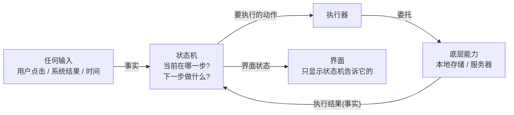

# 工作流 01：注册、登录与 Session 恢复

> 状态：**已施工**，与当前代码核验一致（2026-08-06）。后续代码变更须同步本文件。

---

## 0. 概览（先读这里，一屏看懂）

### 0.1 这部分做了什么

注册登录是 App 的**第一道门**：

- 用户用 **手机号 + 密码** 登录，或注册新账号；
- 登录成功后，App 把"登录身份"（会话）**加密保存在手机本地**；
- 下次打开 App **自动登录**，不用重新输密码；
- 服务器不可达时也不影响**纯蓝牙功能调试**（调试专用离线会话）。

整套逻辑的编排方式（不是代码结构）是本篇要讲清楚的。

### 0.2 基础思路（蓝图）

一切业务都围绕一个**决策循环**运行：



核心一句话：**任何输入都作为"事实"喂给状态机，状态机决定显示什么、执行什么；执行结果作为新事实再喂回来。界面永远不自己做业务判断。**

注册登录具体化这张蓝图：

```text
打开 App ──> 状态机: 自动登录？──> 读本地加密会话 ──> 找得到 ──> 问服务器"这个身份还有效吗"
                                                              └─> 有效 → 直接进入 App
                                                              └─> 无效/找不到 → 显示登录表单
用户在表单输入 ──> 状态机: 登录 ──> 服务器验证 ──> 成功 ──> 加密存本地 ──> 保存成功才宣布"已登录"
```

> 蓝图的完整版（每个组件做什么、不做什么）见 [第 1 章](#1-基础思路详解状态机闭环)。

### 0.3 痛点与演进（为什么不是上面这么简单）

基础思路第一次跑起来后，逐个遇到问题，逐个改进：

| # | 问题（蓝图跑不通的地方） | 改进 | 状态 | 详见 |
|---|---|---|---|---|
| 1 | 页面退出再进来，登录状态和内存身份全丢了 | 页面不持有状态；由全局父编排器统一创建/释放业务 | ✅ 已做 | [2.1](#21-生命周期父编排器统一管理) |
| 2 | "自动登录"没人触发，逻辑只能藏进构造函数 | 创建业务时显式发送一个"开始"事件 | ✅ 已做 | [2.2](#22-自动登录的显式入口-authcreated) |
| 3 | 界面可以绕过服务器伪造"验证通过" | 界面只能通过白名单意图进入状态机 | ✅ 已做 | [2.3](#23-安全边界白名单输入--保存成功才算登录) |
| 4 | 服务器说成功就宣布登录完成，但本地保存可能失败 | 新增"正在保存"状态，**保存成功才算登录完成** | ✅ 已做 | [2.3](#23-安全边界白名单输入--保存成功才算登录) |
| 5 | 断网时验证失败把用户踢下线 | 区分"明确拒绝"（清理）和"暂时无法确认"（保留） | ✅ 已做 | [2.4](#24-验证失败分类拒绝-vs-暂时无法确认) |
| 6 | 退出清理与登录并发，可能把新会话删掉 | 新增"正在清理"状态，清理完才允许新登录 | ⏳ TODO | [2.5](#25-退出竞态-clearing-session) |
| 7 | 会话明文存手机；系统备份把密文搬到没有密钥的新手机，解密必炸 | 加密存储 + 密钥绑设备 + 备份排除 | ✅ 已做 | [2.6](#26-会话安全存储加密--密钥绑设备--备份排除) |

> 每个改进点展开时，底部会有该点的详细设计。改进点本身是这篇文档的"骨架"。

### 0.4 项目切面（哪些文件属于这个业务）

```text
migratedev/src/main/kotlin/com/biosensor/migratedev/
├── ui/AppMain.kt、ui/auth/            # 界面：表单、按钮、页面切换（只显示状态机给的界面状态）
├── translation/auth/AuthTranslation.kt  # 翻译层：把用户操作翻译成状态机事件；把状态翻译成界面状态
├── orchestrator/root/RootWorkflow.kt    # 父编排器：创建/释放本业务，跨业务切换
├── orchestrator/WorkflowOrchestrator.kt # 执行器：跑决策循环
├── decisioncore/auth/AuthDecision.kt    # 状态机：状态、事件、动作、转移表（纯逻辑，不碰 IO）
├── port/auth/AuthPort.kt + AuthPortAdapter.kt  # 业务端口：本业务访问外部能力的唯一边界
└── port/adapter/
    ├── localport/（TinkStringEntropy 等）  # 本地能力：加密键值存储
    └── remoteport/（HttpRemote 等）        # 远端能力：服务器 HTTP
```

相关文档：[架构 01-父子编排器](../架构/01-父子编排器.md)、[架构 04-词汇统一与契约收尾](../架构/04-词汇统一与契约收尾.md)、[说明-拓扑](../说明/拓扑.md)、[说明-词汇表](../说明/词汇表.md)。

---

## 1. 基础思路详解：状态机闭环

### 1.1 五个词汇，一套闭环

全库业务（登录、连接、未来的缓存流）都只用五种词汇，组成一个闭环：

| 词汇 | 是什么 | 谁产生 | 例子（本业务） |
|---|---|---|---|
| `Intent` | 用户想要做什么 | 界面 | `SubmitLogin(phone, password)` |
| `Event` | 已经发生的事实 | 界面翻译层 / 底层能力 | `SubmitLogin`、`SessionFound`、`RemoteRejected` |
| `State` | 当前进行到哪一步 | 状态机 | `Idle`、`Loading`、`Authenticated` |
| `Effect` | 需要外部执行的动作（不做 IO，只描述） | 状态机 | `LoginRemote(phone, password)`、`SaveSession` |
| `UiState` | 给界面看的呈现 | 翻译层 | `Idle`、`Error("会话验证超时，请重试")` |

闭环运行方式（`WorkflowOrchestrator` 的核心循环）：

```kotlin
for (event in events) {                      // 任何事实进入队列
    val transition = decisionCore.reduce(state.value, event)  // 状态机算新状态
    state.value = transition.newState
    transition.effects.forEach { effect ->   // 状态机要求的动作
        effectScope.launch {
            effectExecutor.execute(effect).collect(events::send) // 委托能力执行，结果回灌为新事实
        }
    }
}
```

一句话：**`State + Event → 新 State + Effect`，Effect 执行完变成新 Event，再进入下一次循环。**

### 1.2 每层做什么、不做什么

| 层 | 做什么 | 不做什么 |
|---|---|---|
| 界面 | 显示状态机给的界面状态；把用户操作转成 Intent | 不判断业务，不直接调存储/服务器 |
| 翻译层 | Intent → Event；State → UiState；跨业务事实上报父编排器 | 不持有业务状态 |
| 状态机 | 决定状态转移和要执行的 Effect（纯函数，可测） | 不碰 IO，不知道 Android/网络/文件 |
| 执行器 | 跑循环；把 Effect 委托给端口，把结果送回循环 | 不决定业务状态 |
| 业务端口 | 组合底层能力，实现本业务的协议（会话编解码、端点语义） | 不判断状态 |
| 底层能力 | 存储/服务器等真实 IO | 只返回事实，不决定 UI |

### 1.3 本业务的状态机全貌

状态（进行到哪一步）：

| State | 含义 |
|---|---|
| `Idle` | 等待输入，显示表单 |
| `RestoringSession` | 正在读本地会话（自动登录中） |
| `Loading` | 正在请求服务器（登录/注册/验证） |
| `SavingSession(session)` | 服务器已同意，正在加密存本地 |
| `Registered(message)` | 注册成功，请用手机号密码登录 |
| `Authenticated(session)` | 身份已建立（本地保存完成） |
| `Error(message)` | 当前操作失败 |

完整转移表（当前实现）：

| 当前 State | Event | 下一个 State | Effect |
|---|---|---|---|
| `Idle` / `Error` | `AuthCreated`（开始自动登录） | `RestoringSession` | `ReadSession` |
| `RestoringSession` | `SessionFound(session)` | `Loading` | `ValidateSession(session)` |
| `RestoringSession` | `SessionMissing`（没有本地会话） | `Idle` | 无 |
| `RestoringSession` | `SessionExpired` | `Idle` | `ClearSession` |
| `RestoringSession` | `SessionReadFailed` | `Error` | 无 |
| `Loading` | `SessionVerified(session)` | `Authenticated(session)` | 无 |
| `Loading` | `SessionRejected`（服务器明确拒绝） | `Idle` | `ClearSession` |
| `Loading` | `SessionValidationTimeout` | `Error` | 无（保留本地会话） |
| `Loading` | `RegistrationAccepted` | `Registered` | 无 |
| `Idle` / `Registered` / `Error` | `SubmitLogin` | `Loading` | `LoginRemote` |
| `Idle` / `Error` | `SubmitRegister` | `Loading` | `RegisterRemote` |
| `Loading` | `RemoteAccepted(session)` | `SavingSession(session)` | `SaveSession(session)` |
| `Loading` | `RemoteRejected` / `RemoteTimeout` | `Error` | 无 |
| `SavingSession` | `SessionSaved` | `Authenticated(session)` | 无 |
| `SavingSession` | `SessionSaveFailed` | `Error` | 无 |
| 任意 | `Logout` | `Idle` | `ClearSession` |
| 任意 | `SessionCleared` / `SessionClearFailed` | `Idle` / `Error` | 无 |
| `Error` / `Registered` | `Reset` | `Idle` | 无 |
| 其他组合 | 任意 | 保持当前状态 | 无 |

### 1.4 三条完整链路（把蓝图走一遍）

**链路 A：冷启动自动登录**

```text
App 启动 → 父编排器创建本业务 → 翻译层发"开始"事件
→ 状态机: RestoringSession → 读本地 → 没会话 → Idle（显示表单）
→ 有会话 → 问服务器"还有效吗" → 有效 → Authenticated → 直接进 App
→ 服务器暂不可达 → Error（保留会话，稍后重试）
```

**链路 B：手动登录**

```text
填写手机号密码 → 提交 → 状态机: Loading → 服务器验证（先登录拿令牌，再取用户资料）
→ 服务器同意 → SavingSession（加密写盘）→ 写盘成功 → Authenticated → 进 App
→ 写盘失败 → Error（绝不宣布登录完成）
```

**链路 C：退出**

```text
连接页退出 → 连接业务上报 → 父编排器先停连接资源 → 再让本业务清理会话
→ 会话清理完成 → 通知父编排器 → 回到登录表单
```

---

## 2. 改进点详解

> 每一节对应 [0.3 痛点表](#03-痛点与演进为什么不是上面这么简单) 中的一个改进。

### 2.1 生命周期：父编排器统一管理（对应 #1）

**问题**：登录状态如果由某个页面自己创建，页面退出再进来，会拿到一套全新的状态机——登录状态、内存身份全部丢失。

**改进**：状态机不归页面管，归全局的"父编排器"管。

- `AppGraph`（App 级组合根）在启动时创建一次 `RootWorkflow`，Activity 重建、页面重组都拿同一个实例；
- `RootWorkflow` 持有两个 `ViewModelStore`，负责创建/释放 Auth 与 Connection 两个子业务；
- 页面只通过 `authOrNull()` 取用现有实例，**永远不创建**；
- 界面显示哪个页面由父编排器的状态决定（`RootState.screen()`），页面返回不会重建状态。

```kotlin
// AppMain 中：页面由父编排器状态决定，业务实例由父编排器管理
val rootState by root.state.collectAsStateWithLifecycle()
RootNavigationEffect(navController, rootState)   // RootState.screen() 决定唯一页面

composable("auth") {
    val auth = root.authOrNull()   // 取现成实例；父编排器尚未创建时显示占位
    if (auth == null) AppLoading() else AuthRoute(state, auth)
}
```

冷启动链路（父 → 子）：

```text
RootWorkflow init → AppStarted → 创建 AuthTranslation（注入业务端口 + 上报通道）
→ 子业务 init 自动发 AuthCreated → 开始自动登录（见 2.2）
→ 登录完成 → 子业务上报 → 父编排器切换到连接业务 → 创建 ConnectionTranslation
```

### 2.2 自动登录的显式入口：AuthCreated（对应 #2）

**问题**：状态机的初始状态永远是 `Idle`（静态值，不读存储、不产生动作）。"自动登录"总得有人触发——如果藏在构造函数或界面里，就不可见、不可测、还会重复触发。

**改进**：创建子业务时，翻译层显式发一个"开始"事件 `AuthCreated`，和所有用户操作走同一条事件队列。

| 来源 | 翻译层输入 | 状态机事件 | 用途 |
|---|---|---|---|
| 父编排器创建（冷启动） | init 自动 | `AuthCreated` | 自动登录 |
| 用户点"重试" | `RetrySession` | `AuthCreated` | 从错误态重新走一遍恢复 |

> 边界：`AuthCreated` 只在创建和重试时发送；状态机只允许 `Idle`/`Error` 响应它，其他状态一律忽略。

### 2.3 安全边界：白名单输入 + 保存成功才算登录（对应 #3、#4）

**问题一（#3）**：状态机内部事件包含"服务器验证通过"这类结果事件。如果界面能直接派发任意事件，就能绕过服务器伪造"验证通过"、伪造"已保存"。

**改进**：翻译层只开放**白名单入口**——`submit(AuthIntent)` 里写死的 when 映射，界面能触达的状态机事件只有 5 个：`SubmitLogin / SubmitRegister / RetrySession / Logout / Reset`。结果事件只能由底层能力产生。

**问题二（#4）**：如果服务器说"成功"就宣布登录完成，但本地加密保存失败了——下次启动依然没有身份，UI 却已经宣布"已登录"。

**改进**：加一个 `SavingSession` 状态。安全边界：

```text
服务器返回令牌+资料 → Loading → SavingSession（写盘）
→ 写盘成功 → Authenticated（这才算登录完成）
→ 写盘失败 → Error（绝不宣布登录完成）
```

### 2.4 验证失败分类：拒绝 vs 暂时无法确认（对应 #5）

**问题**：自动登录时要问服务器"这个身份还有效吗"。如果把所有失败（断网、超时、明确拒绝）都当成"身份无效"处理并清掉本地会话，用户在短暂断网时会莫名被踢下线。

**改进**：执行器只把异常归类为两类事实，状态机决定处置：

| 服务器响应 | 事实 | 状态机处置 |
|---|---|---|
| 明确拒绝（401/403、业务失败） | `SessionRejected` | 身份确实无效 → 清理本地会话 → 显示表单 |
| 超时 / 断网 / 5xx | `SessionValidationTimeout` | 只是暂时无法确认 → **保留本地会话** → 显示错误可重试 |

清理动作由状态机发出，底层能力（存储/网络）不自行决定业务策略。

### 2.5 退出竞态：ClearingSession（对应 #6，⏳ TODO）

**问题**：当前实现里退出是"立即回 Idle + 后台清理"。但 `Idle` 已经允许新账号登录：

```text
时间 1: Authenticated + Logout → Idle，同时后台清理旧会话
时间 2: 用户在表单登录新账号 → 新会话写盘成功
时间 3: 较慢的旧清理才完成 → 把新会话也删了！
```

这个竞态不能靠存储层或界面修补，正确归属是状态机。

**改进（设计定稿，未实现）**：新增 `ClearingSession` 状态：

| 当前 State | Event | 下一个 State | Effect |
|---|---|---|---|
| `Authenticated` | `Logout` | `ClearingSession` | `ClearSession` |
| `ClearingSession` | `SessionCleared` | `Idle` | 无 |
| `ClearingSession` | `SessionClearFailed` | `Error` | 无 |
| `ClearingSession` | `SubmitLogin` / `SubmitRegister` | `ClearingSession`（忽略） | 无 |

> TODO：实现前需同步更新 State、转移表、UiState、按钮可用条件和测试。

### 2.6 会话安全存储：加密 + 密钥绑设备 + 备份排除（对应 #7）

**问题**：登录身份（令牌、用户资料）是敏感数据，明文存手机不行；系统还会自动备份/换机迁移，把密文搬到没有密钥的新手机，解密必然失败。

**改进**（三层防线）：

**① 加密**：密文存 DataStore（文件 `string_entropy.preferences_pb`），AES-256-GCM 加密；密钥（Tink keyset）放在 SharedPreferences，主密钥放在 **Android Keystore**（不可导出）；密文绑定键名（AAD），防篡改搬运。TTL 7 天。

**② 单槽位**：只存一份"活动会话"blob（令牌+用户+过期时间整体保存），避免分字段保存产生"只写了一半"的脏数据。

**③ 备份排除**（2026-08-06 核验时发现的隐患，已修复）：备份规则曾只排除旧文件名，对实际存储的 DataStore 密文和 keyset 无效 → 换机恢复必然解密崩溃。现在 `backup_rules.xml` / `data_extraction_rules.xml` 同时排除：

```xml
<exclude domain="sharedpref" path="auth_session_secure.xml" />                       <!-- 旧版遗留 -->
<exclude domain="file" path="datastore/string_entropy.preferences_pb" />            <!-- 密文 -->
<exclude domain="sharedpref" path="string_entropy_keyset_preferences.xml" />        <!-- keyset -->
```

排除后的行为：换机不恢复会话 → 走"无会话"路径重新登录，而不是解密崩溃。

### 2.7 调试：离线会话注入（BypassAuth）

**用途**：服务器不可达时，仍能进入连接页调试纯蓝牙功能。

**实现**：`AuthPortAdapter` 构造参数 `debugOfflineMode`（仅 DEBUG 构建生效）：
- 本地无会话时注入离线会话（`offline-dev`）直接进扫描页；
- 远端验证不可达时信任本地会话。

移除方式：删除 `DebugOfflineSession` 对象 + 注解 + 两处调用点，零残留。release 构建行为与现状完全一致。

---

## 3. 边界与 TODO 清单

| 事项 | 状态 |
|---|---|
| 登录 `phone+password` / 注册 `phone+password+nickname`（昵称→后端 `username`） | ✅ 已实现 |
| 登录后先补全用户资料再保存会话 | ✅ 已实现 |
| 单活动账号、单会话槽位（不做多账号并发） | ✅ 已实现 |
| 冷启动自动登录（父编排器创建 → `AuthCreated`） | ✅ 已实现 |
| 验证失败区分"拒绝/暂不可确认" | ✅ 已实现 |
| 备份排除规则覆盖实际存储文件 | ✅ 已修复（2026-08-06） |
| 退出竞态 `ClearingSession` | ⏳ TODO（设计见 2.5） |
| 区分登录/注册/自动验证的加载态（`Loading` 细分） | ⏳ TODO |
| 输入字段本地校验（空手机号/密码目前能进状态机） | ⏳ TODO |
| 界面可测性：统一校验规则由 Screen 或状态机负责 | ⏳ TODO |

---

## 变更记录

| 日期 | 变更 |
|---|---|
| 2026-08-06 | 重构为"概览 + 基础思路详解 + 改进点详解"结构；内容与当前代码核验一致 |
| 2026-08-06 | 重写为与代码一致（对照 AuthDecision / AuthTranslation / RootWorkflow / AuthPortAdapter 核验） |
