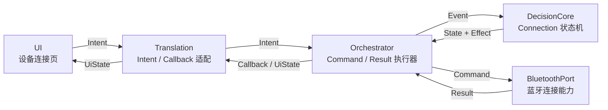

# 工作流 02：设备连接

1. tag filter
2. 自动连接我们的蓝牙设备 认证好的
3. 比特率传输定义

<安全性 非明文传输>
发指令A
<生产段>
读缓存B 流式数据
解码GBK C 不区分
<消费段>
解析 “Start Playback ... Playback all Done” 校验 eeprom相对静止 蓝牙不可靠 请求重传 D 整体的信息

硬件：扫描数据点 缓存到rom 并发/队列

禁止乱序发送 state busy


## 2. 总体位置



## 3. Intent / Callback

这一层只管 UI 输入和 UI 输出。

### 3.1 Intent

```kotlin
sealed class ConnectionIntent {
    object StartScan : ConnectionIntent()
    object StopScan : ConnectionIntent()
    data class SelectDevice(val deviceId: String) : ConnectionIntent()
    object Disconnect : ConnectionIntent()
    object ResetError : ConnectionIntent()
}
```

| Intent | 含义 |
|---|---|
| `StartScan` | 开始扫描设备 |
| `StopScan` | 停止扫描 |
| `SelectDevice` | 用户选择一个设备并发起连接 |
| `Disconnect` | 断开当前连接 |
| `ResetError` | 清除错误并回到可操作状态 |

`SelectDevice` 只需要 `deviceId`。  
设备名、地址、rssi、BLE 类型来自 `DeviceFound` 状态中的 `BluetoothDeviceInfo`，不需要在点击事件里重复携带。

### 3.2 Callback

```kotlin
sealed class ConnectionCallback {
    object ShowIdle : ConnectionCallback()
    object ShowScanning : ConnectionCallback()
    data class ShowDevices(val devices: List<BluetoothDeviceInfo>) : ConnectionCallback()
    data class ShowConnecting(val deviceId: String) : ConnectionCallback()
    data class ShowConnected(val device: BluetoothDeviceInfo) : ConnectionCallback()
    data class ShowError(val message: String) : ConnectionCallback()
}

data class BluetoothDeviceInfo(
    val id: String,
    val name: String?,
    val isBle: Boolean,
    val rssi: Int? = null // 信号强度
)
```

| Callback | 含义 |
|---|---|
| `ShowIdle` | 显示未连接状态 |
| `ShowScanning` | 显示扫描中 |
| `ShowDevices` | 显示扫描到的设备 |
| `ShowConnecting` | 显示连接中 |
| `ShowConnected` | 显示已连接 |
| `ShowError` | 显示连接错误 |

## 4. State / Event / Effect

这一层是 `DecisionCore`，本质是 reducer。

```text
reduce(currentState, event) -> nextState + effects
```

### 4.1 State

```kotlin
sealed class ConnectionState {
    object Idle : ConnectionState()
    object Scanning : ConnectionState()
    data class DeviceFound(val devices: List<BluetoothDeviceInfo>) : ConnectionState()
    data class Connecting(val deviceId: String) : ConnectionState()
    data class Connected(val device: BluetoothDeviceInfo) : ConnectionState()
    data class Error(val message: String) : ConnectionState()
}
```

| State | 含义 |
|---|---|
| `Idle` | 未扫描、未连接 |
| `Scanning` | 正在扫描 |
| `DeviceFound` | 已发现设备，等待用户选择 |
| `Connecting` | 正在连接指定设备 |
| `Connected` | 设备已连接 |
| `Error` | 扫描或连接失败 |

### 4.2 Event

```kotlin
sealed class ConnectionEvent {
    object StartScan : ConnectionEvent()
    object StopScan : ConnectionEvent()
    data class DevicesFound(val devices: List<BluetoothDeviceInfo>) : ConnectionEvent()
    data class SelectDevice(val deviceId: String) : ConnectionEvent()
    data class ConnectAccepted(val device: BluetoothDeviceInfo) : ConnectionEvent()
    data class ConnectFailed(val message: String) : ConnectionEvent()
    object ConnectTimeout : ConnectionEvent()
    data class ScanFailed(val message: String) : ConnectionEvent()
    object Disconnect : ConnectionEvent()
    object Disconnected : ConnectionEvent()
    object ResetError : ConnectionEvent()
}
```

Event 的来源有两类：

- UI 提交。
- Orchestrator 把 BluetoothPort 的 Result 归一后回灌。

### 4.3 Effect

```kotlin
sealed class ConnectionEffect {
    object StartBluetoothScan : ConnectionEffect()
    object StopBluetoothScan : ConnectionEffect()
    data class ConnectDevice(val deviceId: String) : ConnectionEffect()
    object DisconnectDevice : ConnectionEffect()
}
```

### 4.4 状态转换

| 当前 State | Event | 下一个 State | Effect |
|---|---|---|---|
| `Idle` / `Error` | `StartScan` | `Scanning` | `StartBluetoothScan` |
| `Scanning` | `DevicesFound` | `DeviceFound(devices)` | 无 |
| `Scanning` | `ScanFailed` | `Error(message)` | 无 |
| `Scanning` | `StopScan` | `Idle` | `StopBluetoothScan` |
| `DeviceFound` | `SelectDevice` | `Connecting(deviceId)` | `ConnectDevice` |
| `Connecting` | `ConnectAccepted` | `Connected(device)` | 无 |
| `Connecting` | `ConnectFailed` | `Error(message)` | 无 |
| `Connecting` | `ConnectTimeout` | `Error("连接超时")` | 无 |
| `Connected` | `Disconnect` | `Idle` | `DisconnectDevice` |
| 任意 | `Disconnected` | `Idle` | 无 |
| `Error` | `ResetError` | `Idle` | 无 |

这一层不直接处理 Command，也不直接看 Result。  
它只看 Event，只产出 State 和 Effect。

## 5. Command / Result

这一层是 `Orchestrator` 和 `BluetoothPort` 的边界。

### 5.1 Command

```kotlin
sealed class ConnectionCommand {
    object StartScan : ConnectionCommand()
    object StopScan : ConnectionCommand()
    data class Connect(val deviceId: String) : ConnectionCommand()
    object Disconnect : ConnectionCommand()
}
```

| Command | 作用 |
|---|---|
| `StartScan` | 启动蓝牙扫描 |
| `StopScan` | 停止蓝牙扫描 |
| `Connect` | 连接指定设备 |
| `Disconnect` | 断开当前设备 |

### 5.2 Result

```kotlin
sealed class ConnectionResult {
    data class DevicesFound(val devices: List<BluetoothDeviceInfo>) : ConnectionResult()
    object ScanStopped : ConnectionResult()
    data class Connected(val device: BluetoothDeviceInfo) : ConnectionResult()
    data class ConnectFailed(val message: String) : ConnectionResult()
    object ConnectTimeout : ConnectionResult()
    object Disconnected : ConnectionResult()
    data class ScanFailed(val message: String) : ConnectionResult()
}
```

| Result | 含义 |
|---|---|
| `DevicesFound` | 扫描到设备 |
| `ScanStopped` | 扫描已停止 |
| `Connected` | 设备连接成功 |
| `ConnectFailed` | 连接失败 |
| `ConnectTimeout` | 连接超时 |
| `Disconnected` | 设备断开 |
| `ScanFailed` | 扫描失败 |

### 5.3 Orchestrator 的职责

```text
ConnectionEffect.StartBluetoothScan
-> ConnectionCommand.StartScan
-> ConnectionResult.DevicesFound / ScanFailed
-> ConnectionEvent.DevicesFound / ScanFailed
```

```text
ConnectionEffect.ConnectDevice
-> ConnectionCommand.Connect
-> ConnectionResult.Connected / ConnectFailed / ConnectTimeout
-> ConnectionEvent.ConnectAccepted / ConnectFailed / ConnectTimeout
```

```text
ConnectionEffect.DisconnectDevice
-> ConnectionCommand.Disconnect
-> ConnectionResult.Disconnected
-> ConnectionEvent.Disconnected
```

### 5.4 BluetoothPort 对 SDK 的隔离与实现

旧 SDK 里的 `DeviceModule` 很具体，包含 `BluetoothDevice`、mac、name、rssi、BLE 类型、UUID、iBeacon、收藏名、乱码修正等信息。

这些不应该进入 `DecisionCore`。

新设计里：

- `BluetoothPort` 内部保存 `deviceId -> DeviceModule` 的映射。
- `deviceId` 优先使用 `DeviceModule.getMac()`。
- 状态机只使用 `deviceId` 和薄的 `BluetoothDeviceInfo`。
- `BluetoothDeviceInfo` 只保留 UI 需要的字段：`id / name / isBle / rssi`，不重复 `address`。
- `remember(module)` 返回薄信息，是因为扫描页要展示列表，但连接动作只需要 `deviceId`。
- 如果后续 UI 不展示 `rssi`，这里还可以继续瘦。
- 只有 Port 知道 `DeviceModule`、`AllBluetoothManage`、`IBluetooth`、`IDataCallback`。
- `Orchestrator` 只看到 `ConnectionCommand / ConnectionResult`，不写 SDK 分支。

SDK 查证结果：

| 能力 | SDK / app 现状 | 新 dev 处理 |
|---|---|---|
| 连接成功 | `IBluetooth.connectSucceed(DeviceModule)` | 映射成 `ConnectionResult.Connected` |
| 连接失败 | `IDataCallback.connectionFail(mac, cause)`，随后进入 `errorDisconnect(mac)` | 映射成 `ConnectionResult.ConnectFailed` |
| 异常断开 | `IBluetooth.errorDisconnect(DeviceModule)` | 映射成 `ConnectionResult.Disconnected` 或后续连接状态事件 |
| 扫描结束 | `IBluetooth.updateEnd()` / `IScanCallback.stopScan()` | 映射成扫描完成或停止 |
| 连接超时 | 没看到统一的 SDK timeout 回调 | 由 Port 内部的等待边界包装补齐 |
| bytes 接收 | `IBluetooth.readData(mac, data)` | 不放在连接工作流，后续缓存读取工作流处理 |
| 日志 / 速率 / MTU | `readLog`、`readVelocity`、`callbackMTU` | 不进入连接状态机，放到调试或高级能力 |

```kotlin
interface BluetoothPort {
    suspend fun execute(command: ConnectionCommand): ConnectionResult
}

class DeviceRegistry {
    private val modulesById: MutableMap<String, DeviceModule> = mutableMapOf()

    fun remember(module: DeviceModule): BluetoothDeviceInfo {
        val info = module.toDeviceInfo()
        modulesById[info.id] = module
        return info
    }

    fun requireModule(deviceId: String): DeviceModule? {
        return modulesById[deviceId]
    }
}

fun DeviceModule.toDeviceInfo(): BluetoothDeviceInfo {
    return BluetoothDeviceInfo(
        id = getMac(),
        name = getName(),
        isBle = isBLE(),
        rssi = getRssi()
    )
}
```

`AndroidBluetoothPort` 直接依赖 bluetoothlibrary，不再公开单独的 `BluetoothSdkAdapter` 层。

```kotlin
class AndroidBluetoothPort(
    private val bluetooth: AllBluetoothManage,
    private val registry: DeviceRegistry,
    private val timeoutMillis: Long
) : BluetoothPort {

    override suspend fun execute(command: ConnectionCommand): ConnectionResult {
        return when (command) {
            ConnectionCommand.StartScan -> startScan()
            ConnectionCommand.StopScan -> stopScan()
            is ConnectionCommand.Connect -> connect(command.deviceId)
            ConnectionCommand.Disconnect -> disconnect()
        }
    }

    private suspend fun startScan(): ConnectionResult {
        return withTimeoutOrNull(timeoutMillis) {
            suspendCancellableCoroutine { continuation ->
                // bluetooth.scanBluetooth(...)
                // IScanCallback.updateRecycler(DeviceModule) -> registry.remember(module)
                // IScanCallback.stopScan() -> continuation.resume(ConnectionResult.DevicesFound(...))
                // scan fail -> continuation.resume(ConnectionResult.ScanFailed(message))
            }
        } ?: ConnectionResult.ScanFailed("扫描超时")
    }

    private suspend fun connect(deviceId: String): ConnectionResult {
        val module = registry.requireModule(deviceId)
            ?: return ConnectionResult.ConnectFailed("设备不存在")

        return withTimeoutOrNull(timeoutMillis) {
            suspendCancellableCoroutine { continuation ->
                bluetooth.connect(module)
                // IBluetooth.connectSucceed(DeviceModule) -> ConnectionResult.Connected(...)
                // IDataCallback.connectionFail(mac, cause) -> ConnectionResult.ConnectFailed(...)
                // IBluetooth.errorDisconnect(DeviceModule) -> ConnectionResult.ConnectFailed("异常断开")
            }
        } ?: ConnectionResult.ConnectTimeout
    }

    private suspend fun stopScan(): ConnectionResult {
        bluetooth.stopScan()
        return ConnectionResult.ScanStopped
    }

    private suspend fun disconnect(): ConnectionResult {
        bluetooth.disconnect(null)
        return ConnectionResult.Disconnected
    }
}
```

Port 的实现里可以使用 `when(command)`，但只放在 `AndroidBluetoothPort` 这种实现内部，不能扩散到 `DecisionCore` 或 UI。

完整链路是：

```text
bluetoothlibrary / IBluetooth / IDataCallback
-> AndroidBluetoothPort: when(command)，把 callback 归一成 ConnectionResult
-> Orchestrator: 把 ConnectionResult 转成 ConnectionEvent
-> DecisionCore: reduce(state, event)
```

旧 app 的经验可以保留，但只能保留成 Port 内部的实现参考，不再扩散到 UI 或状态机层。这样既能复用 SDK，又能把 `DeviceModule`、MTU、速率、日志这些杂糅能力挡在边界内。

<TIPS>
截至目前，我对这一章最不放心、最容易漏风的地方是这两个：
- ConnectTimeout 的边界。SDK 里没有统一 timeout 回调，这个必须靠 Port 自己包，最容易和真实异常断开混淆。
- 扫描/连接事件归一。蓝牙库里成功、失败、异常断开、扫描结束的语义分散在不同回调里，Port 里如果收得不干净，状态机就会收到假事件。
