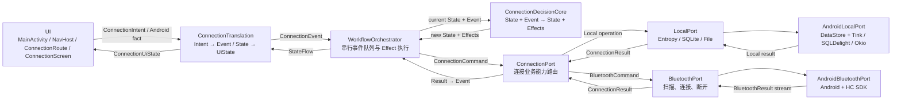

# 工作流 02：设备发现、绑定与自动连接

本文规划 `migratedev` 中登录完成后的设备连接闭环。目标不是先把目录拆得很细，而是把后续实现所需的边界、代码位置和事件流固定下来：

- Auth 成功后如何进入连接页面。
- Connection 状态机的第一个 Event 在哪里产生。
- Android 权限、蓝牙开启和页面可见性如何进入业务流程。
- Connection 工作流如何调用本地能力和蓝牙能力。
- 蓝牙能力接口与 Android/HC SDK 实现如何分开。
- BT24 筛选、用户绑定、持续扫描、手动连接和自动连接如何协同。
- 日志如何帮助快速定位状态机、扫描轮次和连接问题。
- UI、状态机、Port 和真机如何逐层联测。

本章只确定方案和代码骨架，不直接修改 Kotlin 或 Gradle。第三章的数据收发能力只保留 TODO。

---

## 1. 先固定本章的设计结论

1. 应用继续只有一个 `MainActivity`，用 Navigation Compose 在 Auth 和 Connection 两个 destination 之间导航，不新增 `ConnectionActivity`。
2. 暂不引入 Hilt。`AppGraph` 继续负责应用级对象组装；Auth Translation 使用父 navigation graph 作用域，Connection Translation 使用 destination 作用域。
3. 不建立全局 `AppLifecycleEvent` 或 `AppLifecycleCoordinator`。业务创建事件分别叫 `AuthCreated` 和 `ConnectionCreated(userId)`；页面可见性只在 Connection 扫描确实需要时处理。
4. `BluetoothPort.kt` 放进 `port/adapter/bluetoothport/`。它在一个文件中定义蓝牙能力的 `Command`、`Result`、数据模型和接口；`AndroidBluetoothPort.kt` 单独承载 Android 与 HC SDK 细节。
5. `ConnectionPort` 是业务调用边界，只组合 `LocalPort + BluetoothPort`；它不重新包装基础能力的全部接口。
6. `LocalPort` 是本地基础能力入口，组合字符串加密、SQLite 和文件三种 client。设备绑定属于结构化关系，写入 SQLite，不写入加密字符串存储。
7. 数据库选择 SQLDelight：SQL 由项目自己编写，SQLDelight 在编译期校验并生成类型安全查询接口。
8. 文件能力选择 Okio，并用受根目录约束的 `LocalFileClient` 暴露，不把不受限制的 `FileSystem.SYSTEM` 直接交给业务。
9. 业务、Orchestrator、Adapter 和 UI 的 Android 边界直接调用 Timber。`Application` 根据构建模式种植不同 Tree；不再额外包装 `AppLogger`。
10. 自动连接与手动连接不是两套扫描链路。两者共享一个扫描流，只是选择连接目标的触发条件不同，最终都进入同一个 `ConnectDevice` Effect。

---

## 2. 总体拓扑



边界含义如下：

- UI 负责 Android 权限请求、蓝牙开启请求、页面导航和用户操作，不直接调用 HC SDK。
- Translation 是页面 ViewModel，负责把外部输入翻译成 Event，并把 State 映射成 UiState。
- DecisionCore 只做纯计算，不读数据库、不扫描蓝牙，也不写日志。
- Orchestrator 串行处理 Event，保证同一时刻只有一个状态转移决定生效。
- ConnectionPort 只回答“连接业务需要调用哪些基础能力”。
- Adapter Port 回答“应用具备哪些基础能力”；具体 Android 实现不泄漏进业务代码。

---

## 3. 规划后的文件树与职责

```text
migratedev/src/main/kotlin/com/biosensor/migratedev/
├── MigrateDevApplication.kt
│   └── 创建 AppGraph，并按 BuildConfig 种植 Timber Tree
├── AppGraph.kt
│   └── 创建应用级 Adapter/Business Port，提供页面 ViewModel Factory
├── MainActivity.kt
│   └── 安装 Compose；不创建 Port，不持有扫描状态
├── logging/
│   ├── LoggingInitializer.kt
│   │   └── Debug/Release Tree 的选择、种植和进程级初始化
│   └── ReleaseTree.kt
│       └── Release 日志筛选、脱敏、异步写入与文件轮转
├── decisioncore/
│   └── connection/
│       └── ConnectionDecision.kt
│           └── Connection State/Event/Effect、reducer 和纯 maybeAutoConnect
├── orchestrator/
│   ├── WorkflowOrchestrator.kt
│   │   └── 串行事件队列、StateFlow 发布和 Effect 调度
│   └── connection/
│       └── ConnectionEffectExecutor.kt
│           └── ConnectionEffect → ConnectionCommand → ConnectionEvent
├── translation/
│   ├── auth/
│   │   └── AuthTranslation.kt
│   │       └── Auth 父导航图作用域的 ViewModel；init 时发送 AuthCreated
│   └── connection/
│       └── ConnectionTranslation.kt
│           └── Connection destination 作用域的 ViewModel；Intent/Android fact/UiState 适配
├── ui/
│   ├── AppMain.kt
│   │   └── NavHost、Auth/Connection destination 和导航条件
│   └── connection/
│       ├── BluetoothAccessGate.kt
│       │   └── 运行时权限、系统蓝牙开启请求及结果回传
│       ├── ConnectionRoute.kt
│       │   └── 收集 UiState、提交 Intent、监听 START/STOP 可见性
│       └── ConnectionScreen.kt
│           └── 设备列表、连接状态、错误、下拉刷新和用户点击
└── port/
    ├── PortContracts.kt
    │   └── 通用 CommandPort<Command, Result>
    ├── adapter/
    │   ├── localport/
    │   │   ├── LocalPort.kt
    │   │   │   └── StringEntropy、LocalDatabase、LocalFileClient 的完整能力接口
    │   │   ├── AndroidLocalPort.kt
    │   │   │   └── 组合三种本地 client，不承载 Auth/Connection 业务语义
    │   │   ├── entropy/
    │   │   │   └── TinkStringEntropy.kt
    │   │   │       └── DataStore 中密文字符串的增删改查
    │   │   ├── database/
    │   │   │   └── LocalDatabaseFactory.kt
    │   │   │       └── 创建 SQLDelight Driver 和生成的 LocalDatabase
    │   │   └── file/
    │   │       └── OkioLocalFileClient.kt
    │   │           └── 受目录空间约束的文件读写、枚举、删除和清理
    │   ├── remoteport/
    │   │   ├── RemotePort.kt
    │   │   │   └── 远端基础能力协议
    │   │   └── RetrofitRemotePort.kt
    │   │       └── Retrofit/OkHttp 实现
    │   └── bluetoothport/
    │       ├── BluetoothPort.kt
    │       │   └── 蓝牙 Command、Result、数据模型和完整能力接口
    │       ├── AndroidBluetoothPort.kt
    │       │   └── Android、HC Client、Listener、扫描轮次和连接超时实现
    │       └── Bt24AdvertisementFilter.kt
    │           └── 可独立单测的 BT24 产品族匹配规则
    ├── auth/
    │   ├── AuthPort.kt
    │   │   └── Auth 业务 Command/Result 边界
    │   └── DefaultAuthPort.kt
    │       └── 将 Auth 业务命令路由到 LocalPort/RemotePort
    └── connection/
        ├── ConnectionPort.kt
        │   └── Connection 业务 Command/Result 边界
        └── DefaultConnectionPort.kt
            └── 将绑定操作路由到 LocalPort，将设备操作路由到 BluetoothPort

migratedev/src/main/sqldelight/com/biosensor/migratedev/database/
└── DeviceBinding.sq
    └── deviceBinding 表及 findByUserId/upsert/delete 查询
```

这里的拆分依据只有两条：

1. 接口与实现分开，让我们只看接口就能得到能力全貌，再进入实现文件看 Android/库细节。
2. 只有存在独立规则、独立资源生命周期或独立测试价值时才继续拆文件。

因此：

- `BluetoothCommand` 和 `BluetoothResult` 不单独拆文件，它们与 `BluetoothPort` 共同描述一份蓝牙能力协议。
- HC Client 和四类 Listener 先留在 `AndroidBluetoothPort.kt`；后续只有当其中某块出现独立逻辑时再拆。
- `Bt24AdvertisementFilter.kt` 单独存在，因为它是与扫描资源管理不同的纯产品规则，可以独立测试。

---

## 4. 依赖与工具链基线

### 4.1 先升级 Kotlin，再逐个引入依赖

当前工程基线是 Kotlin `1.9.24`、AGP `8.5.2`、Compose Compiler `1.5.14` 和 Compose BOM `2024.06.00`。

Kotlin 2.x 之后，Compose Compiler 与 Kotlin 同版本发布，应使用 `org.jetbrains.kotlin.plugin.compose`，不再手工维护 `composeOptions.kotlinCompilerExtensionVersion`。但版本不能只升级 Kotlin：Android 官方兼容表显示，AGP `8.5.x` 对应 Kotlin `2.0`，Kotlin `2.1+` 需要更高 AGP。

所以实际编码前先做一个独立、可回退的工具链迁移：

1. 先决定使用 Kotlin `2.0.x` 继续保留 AGP `8.5.2`，还是一起升级 AGP/Gradle/JDK 后使用更高 Kotlin 2.x。
2. 在所有 Compose module 应用与 Kotlin 同版本的 `org.jetbrains.kotlin.plugin.compose`。
3. 删除旧的 `kotlinCompilerExtensionVersion`。
4. 第一轮保留现有 Compose BOM，避免同时改变过多变量。
5. 编译全部 module，并运行现有单元测试。
6. 基线通过后，再按 Navigation Compose → SQLDelight → DataStore/Tink → Okio → Timber 的顺序逐个加入依赖，每加入一个就编译和测试。

版本选择以实施当天的官方兼容表为准，不在本章预先写死“最新版本”。

参考：

- [Kotlin Compose Compiler 迁移指南](https://kotlinlang.org/docs/compose-compiler-migration-guide.html)
- [Android Kotlin 与 AGP 兼容表](https://developer.android.com/build/kotlin-support)

### 4.2 本章采用的库

| 目标 | 选择 | 原因 |
|---|---|---|
| 页面导航 | Navigation Compose | destination 自带 ViewModelStore 与生命周期，适合 Auth → Connection |
| 加密字符串 | 稳定版 Preferences DataStore + Tink AEAD | DataStore 提供异步、事务化 KV；Tink 提供认证加密 |
| 结构化数据 | SQLDelight | 自己写 SQL，编译期校验并生成类型安全 Kotlin API |
| 文件 | Okio FileSystem | API 小、读写清晰，并有 FakeFileSystem 支持测试 |
| 日志 | Timber | 调用简单，Tree 能按构建模式路由到 Logcat 或文件 |

目前没有一个成熟库能同时把“加密 KV、关系型 SQL、普通文件”统一成一套合适的存储模型。这里不强行统一底层，而是在 `LocalPort` 上统一发现入口，同时保留三种数据各自正确的语义。

---

## 5. AppGraph、Navigation 与页面生命周期

### 5.1 为什么不引入 Hilt

Hilt 解决的是对象构造和作用域注入，不负责监测页面进入、退出或应用前后台。Navigation Compose 能为 destination 或父 navigation graph 提供 `ViewModelStoreOwner`；当前对象数量也能由 `AppGraph` 清楚表达。

因此本章采用：

- Navigation Compose 管理页面以及 destination/父图级 ViewModel 生命周期。
- `AppGraph` 管理应用级 Adapter、Business Port 和 ViewModel Factory。
- Translation 本身继承 `ViewModel`，不再额外套一层只负责转发的 ViewModel。

等到 module 或 constructor 数量明显增加、手工 Factory 已经影响可读性时，再单独评估 Hilt。

### 5.2 AppGraph 只持有长生命周期能力

```kotlin
class AppGraph(application: Application) {
    internal val applicationScope =
        CoroutineScope(SupervisorJob() + Dispatchers.IO)

    internal val localPort: LocalPort =
        AndroidLocalPort.create(application)

    private val remotePort: RemotePort =
        RetrofitRemotePort.create(BuildConfig.API_BASE_URL)

    private val bluetoothPort: BluetoothPort =
        AndroidBluetoothPort(
            application = application,
            filter = Bt24AdvertisementFilter
        )

    private val authPort: AuthPort =
        DefaultAuthPort(localPort, remotePort)

    private val connectionPort: ConnectionPort =
        DefaultConnectionPort(localPort, bluetoothPort)

    val authTranslationFactory: ViewModelProvider.Factory =
        AuthTranslation.factory(authPort)

    fun connectionTranslationFactory(
        userId: String
    ): ViewModelProvider.Factory =
        ConnectionTranslation.factory(userId, connectionPort)
}
```

`AppGraph` 不再持有某个全局 `AuthTranslation` 或 `ConnectionTranslation`。Auth Translation 与登录后的父导航图同寿命，使 Connection 页仍能按顺序执行 Logout；Connection Translation 与 Connection destination 同寿命；基础 Port 与进程同寿命。这样既避免 Compose 重组重复创建 HC Client，也避免退出 Connection 后仍保留无用的连接页面状态机。

HC 库当前有以 `Activity` 为构造参数或内部强转 `Activity` 的位置。联测前必须将仅用于主线程切换的部分改为 `Handler(Looper.getMainLooper())` 或等价 dispatcher，使 `AndroidBluetoothPort` 只保存 `Application`，不泄漏 Activity。请求权限和开启蓝牙仍由 UI 完成。

### 5.3 NavHost 的实际形态

```kotlin
private const val SESSION_GRAPH = "session"
private const val AUTH_ROUTE = "auth"
private const val CONNECTION_ROUTE = "connection/{userId}"

@Composable
fun AppMain(graph: AppGraph) {
    val navController = rememberNavController()

    NavHost(
        navController = navController,
        startDestination = SESSION_GRAPH
    ) {
        navigation(
            route = SESSION_GRAPH,
            startDestination = AUTH_ROUTE
        ) {
            composable(AUTH_ROUTE) { entry ->
                val sessionEntry = remember(entry) {
                    navController.getBackStackEntry(SESSION_GRAPH)
                }
                val auth: AuthTranslation = viewModel(
                    viewModelStoreOwner = sessionEntry,
                    factory = graph.authTranslationFactory
                )

                AuthRoute(
                    translation = auth,
                    onAuthenticated = { user ->
                        navController.navigate(
                            "connection/${Uri.encode(user.id)}"
                        ) {
                            popUpTo(AUTH_ROUTE) { inclusive = true }
                        }
                    }
                )
            }

            composable(
                route = CONNECTION_ROUTE,
                arguments = listOf(
                    navArgument("userId") {
                        type = NavType.StringType
                    }
                )
            ) { entry ->
                val userId = requireNotNull(
                    entry.arguments?.getString("userId")
                )
                val sessionEntry = remember(entry) {
                    navController.getBackStackEntry(SESSION_GRAPH)
                }
                val auth: AuthTranslation = viewModel(
                    viewModelStoreOwner = sessionEntry,
                    factory = graph.authTranslationFactory
                )
                val connection: ConnectionTranslation = viewModel(
                    key = "connection:$userId",
                    factory = graph.connectionTranslationFactory(userId)
                )

                ConnectionRoute(
                    translation = connection,
                    onLogoutReady = {
                        auth.submit(AuthIntent.Logout)
                        auth.uiState.first {
                            it is AuthUiState.Idle
                        }
                        navController.navigate(AUTH_ROUTE) {
                            popUpTo(entry.destination.id) {
                                inclusive = true
                            }
                            launchSingleTop = true
                        }
                    }
                )
            }
        }
    }
}
```

这里用普通 route 参数展示最少依赖的形态。以后如果决定启用 Kotlin Serialization，可以换成 typed destination，但不改变本章的生命周期和工作流边界。

### 5.4 创建 Event 在 Translation 的 init 中发送

Auth 与 Connection 各自拥有语义明确的创建事件：

```kotlin
class AuthTranslation(
    authPort: AuthPort
) : ViewModel() {
    private val orchestrator = WorkflowOrchestrator(
        initialState = AuthState.Idle,
        decisionCore = AuthDecisionCore,
        effectExecutor = AuthEffectExecutor(authPort),
        scope = viewModelScope
    )

    init {
        orchestrator.dispatch(AuthEvent.AuthCreated)
    }
}
```

```kotlin
class ConnectionTranslation(
    private val userId: String,
    connectionPort: ConnectionPort
) : ViewModel() {
    private val orchestrator = WorkflowOrchestrator(
        initialState = ConnectionState.Idle,
        decisionCore = ConnectionDecisionCore,
        effectExecutor = ConnectionEffectExecutor(connectionPort),
        scope = viewModelScope
    )

    init {
        orchestrator.dispatch(
            ConnectionEvent.ConnectionCreated(userId)
        )
    }
}
```

这样不再需要：

- `AppStarted`
- `AppLifecycleEvent`
- `AppScreen`
- `AppLifecycleObserver`
- `AppLifecycleCoordinator`
- 为每个 Translation 注册和筛选全局页面事件

`ConnectionCreated` 只表示“连接工作流已经建立”，不能假设 Android 权限和系统蓝牙已经可用，因此它进入 `AwaitingBluetoothAccess`，不会立即开始扫描。

这会替换第一章当前的 `AppStarted/AuthLifecycleEvent` 启动方式。实施第二章时必须同步更新第一章文档和 Auth 代码，不能让新旧两套启动事件并存。

### 5.5 页面可见性只管理扫描资源

ViewModel 在应用进入后台时不会立刻销毁。如果扫描已经开始，仅依赖 `onCleared()` 会让后台继续扫描。因此 `ConnectionRoute` 只补充两个资源事件：

```kotlin
@Composable
fun ConnectionRoute(
    translation: ConnectionTranslation,
    onLogoutReady: suspend () -> Unit
) {
    val uiState by translation.uiState.collectAsStateWithLifecycle()

    LifecycleStartEffect(translation) {
        translation.submit(ConnectionIntent.BecameVisible)

        onStopOrDispose {
            translation.submit(ConnectionIntent.BecameHidden)
        }
    }

    if (uiState.phase == ConnectionPhase.LogoutReady) {
        LaunchedEffect(Unit) {
            onLogoutReady()
        }
    }

    ConnectionContent(
        uiState = uiState,
        submit = translation::submit
    )
}
```

完整流程是：

```text
创建 Connection destination
    → 创建 ConnectionTranslation
    → init 发送 ConnectionCreated(userId)
    → reducer 进入 AwaitingBluetoothAccess
    → UI 请求权限/开启蓝牙
    → BluetoothAccessGranted
    → Scanning + ReadBinding + StartScan

应用进入后台
    → BecameHidden
    → 如果正在扫描则 StopScan
    → 如果已经连接则保持连接，不主动断开

应用回到前台
    → BecameVisible
    → 未连接时恢复扫描

destination 被 pop
    → ViewModel.clear / viewModelScope 取消
    → callbackFlow.awaitClose 释放 Listener、停止扫描
```

`BecameVisible/BecameHidden` 不是通用页面生命周期框架，只是 Connection 管理扫描资源所需的业务输入。

退出登录时：

1. UI 向 Connection 提交 `LogoutRequested`。
2. Connection 执行 `Disconnect`；收到 `Disconnected` 后进入 `LogoutReady`。
3. `ConnectionRoute` 调用 `onLogoutReady`，父图作用域的 Auth Translation 提交 `Logout` 并清除 Session。
4. 等 Auth 到达明确的未登录状态后，UI 才导航回 Auth 并清除 Connection destination。
5. 不删除设备绑定。

不能在 `auth.submit(Logout)` 后不等结果就立即导航，否则 Auth 页面可能先观察到旧的 `Authenticated` 状态并再次跳回 Connection。若清除 Session 失败，则保持当前结束页面并提供重试，不伪装成已退出。

“断开连接”和“忘记设备”是不同操作。未来的 `ForgetDevice` 才删除本地绑定，并在后端/网页同步能力出现后同步删除；它不属于本章。

---

## 6. Android 权限与蓝牙开启

运行时权限是 Android UI 事实，不应塞进 `AndroidBluetoothPort`，因为 Port 不能弹系统权限框，也不应持有 Activity。

### 6.1 权限集合

```kotlin
private fun bluetoothPermissions(): Array<String> =
    if (Build.VERSION.SDK_INT >= Build.VERSION_CODES.S) {
        arrayOf(
            Manifest.permission.BLUETOOTH_SCAN,
            Manifest.permission.BLUETOOTH_CONNECT
        )
    } else {
        arrayOf(Manifest.permission.ACCESS_FINE_LOCATION)
    }
```

- Android 12/API 31 及以上请求 `BLUETOOTH_SCAN` 和 `BLUETOOTH_CONNECT`。
- Android 11/API 30 及以下扫描 BLE 请求 `ACCESS_FINE_LOCATION`。
- Manifest 中旧版 Bluetooth/Location 权限继续用 `maxSdkVersion` 限定。
- 在 BT24 真机验证前不贸然给 `BLUETOOTH_SCAN` 添加 `neverForLocation`，因为 Android 文档明确提示该声明可能过滤部分 BLE beacon。

### 6.2 BluetoothAccessGate 的责任

```kotlin
@Composable
fun BluetoothAccessGate(
    onGranted: () -> Unit,
    onDenied: (canAskAgain: Boolean) -> Unit
) {
    val context = LocalContext.current
    val activity = context.findActivity()
    val bluetoothManager = remember {
        context.getSystemService(BluetoothManager::class.java)
    }

    val enableBluetooth = rememberLauncherForActivityResult(
        ActivityResultContracts.StartActivityForResult()
    ) {
        if (bluetoothManager.adapter?.isEnabled == true) {
            onGranted()
        } else {
            onDenied(true)
        }
    }

    val requestPermissions = rememberLauncherForActivityResult(
        ActivityResultContracts.RequestMultiplePermissions()
    ) { result ->
        val granted = bluetoothPermissions().all {
            result[it] == true ||
                ContextCompat.checkSelfPermission(
                    context,
                    it
                ) == PackageManager.PERMISSION_GRANTED
        }

        if (!granted) { // 没有二次询问 就是不给权限直接退出app 
            val canAskAgain = bluetoothPermissions().any {
                ActivityCompat.shouldShowRequestPermissionRationale(
                    activity,
                    it
                )
            }
            onDenied(canAskAgain)
        } else if (bluetoothManager.adapter?.isEnabled == true) {
            onGranted()
        } else {
            enableBluetooth.launch(
                Intent(BluetoothAdapter.ACTION_REQUEST_ENABLE)
            )
        }
    }

    LaunchedEffect(Unit) {
        val permissions = bluetoothPermissions()
        val alreadyGranted = permissions.all {
            ContextCompat.checkSelfPermission(
                context,
                it
            ) == PackageManager.PERMISSION_GRANTED
        }

        when {
            !alreadyGranted ->
                requestPermissions.launch(permissions)
            bluetoothManager.adapter?.isEnabled == true ->
                onGranted()
            else ->
                enableBluetooth.launch(
                    Intent(BluetoothAdapter.ACTION_REQUEST_ENABLE)
                )
        }
    }
}
```

实际实现还要让 `findActivity()` 对 ContextWrapper 逐层解包，并把“永久拒绝”与“可再次请求”映射成不同 UI 文案。

Gate 只在 `AwaitingBluetoothAccess` 状态显示，因此 `onGranted()` 导致状态进入 `Scanning` 后，Composable 会退出组合，不会在普通重组中反复触发扫描。Translation 接收：

```kotlin
sealed interface ConnectionIntent {
    data object BluetoothAccessGranted : ConnectionIntent
    data class BluetoothAccessDenied(
        val canAskAgain: Boolean
    ) : ConnectionIntent
    data object RetryBluetoothAccess : ConnectionIntent
    data object BecameVisible : ConnectionIntent
    data object BecameHidden : ConnectionIntent
    data object Refresh : ConnectionIntent
    data class SelectDevice(val deviceId: String) : ConnectionIntent
    data object Disconnect : ConnectionIntent
    data object Logout : ConnectionIntent
}
```

---

## 7. Connection DecisionCore

### 7.1 State 要直接暴露问题所在

扫描状态内的“绑定读取”和“扫描进度”是两条独立事实，不能把所有情况压成一个 `Loading` 或一个 `Error`。

```kotlin
sealed interface BindingLookup {
    data object Loading : BindingLookup
    data object Missing : BindingLookup
    data class Found(val deviceId: String) : BindingLookup
    data class Failed(val message: String) : BindingLookup
}

sealed interface ScanProgress {
    data object Starting : ScanProgress
    data class Active(val roundId: Long) : ScanProgress
    data class Refreshing(val previousRoundId: Long?) : ScanProgress
    data class Paused(val previousRoundId: Long?) : ScanProgress
    data class Failed(val message: String) : ScanProgress
}

sealed interface ConnectionState {
    data object Idle : ConnectionState

    data class AwaitingBluetoothAccess(
        val userId: String
    ) : ConnectionState

    data class BluetoothAccessRequired(
        val userId: String,
        val canAskAgain: Boolean
    ) : ConnectionState

    data class Scanning(
        val userId: String,
        val scanSessionId: String,
        val binding: BindingLookup,
        val scan: ScanProgress,
        val devices: List<BluetoothDeviceInfo>,
        val autoAttemptedFor: String?
    ) : ConnectionState

    data class Connecting(
        val userId: String,
        val target: BluetoothDeviceInfo,
        val source: ConnectSource
    ) : ConnectionState

    data class Connected(
        val userId: String,
        val device: BluetoothDeviceInfo
    ) : ConnectionState

    data class ConnectionFailed(
        val userId: String,
        val deviceId: String?,
        val message: String
    ) : ConnectionState

    data class EndingSession(
        val userId: String
    ) : ConnectionState

    data class LogoutReady(
        val userId: String
    ) : ConnectionState
}

enum class ConnectSource {
    AUTO,
    MANUAL
}
```

从日志或测试失败中看到 `Scanning(binding=Failed, scan=Active)`，可以立即判断是本地读取失败而不是扫描失败；看到 `Scanning(binding=Found, scan=Failed)` 则相反。

### 7.2 Event 与 Effect

```kotlin
sealed interface ConnectionEvent {
    data class ConnectionCreated(val userId: String) : ConnectionEvent
    data class BluetoothAccessGranted(
        val scanSessionId: String
    ) : ConnectionEvent
    data class BluetoothAccessDenied(
        val canAskAgain: Boolean
    ) : ConnectionEvent
    data object RetryBluetoothAccess : ConnectionEvent
    data class BecameVisible(
        val scanSessionId: String
    ) : ConnectionEvent
    data object BecameHidden : ConnectionEvent
    data object RefreshRequested : ConnectionEvent
    data object LogoutRequested : ConnectionEvent

    data class BindingLoaded(val deviceId: String) : ConnectionEvent
    data object BindingMissing : ConnectionEvent
    data class BindingReadFailed(val message: String) : ConnectionEvent

    data class ScanStarted(val roundId: Long) : ConnectionEvent
    data class ScanDevicesUpdated(
        val roundId: Long,
        val devices: List<BluetoothDeviceInfo>
    ) : ConnectionEvent
    data class ScanRefreshed(val roundId: Long) : ConnectionEvent
    data class ScanFailed(val message: String) : ConnectionEvent

    data class DeviceSelected(val deviceId: String) : ConnectionEvent
    data class DeviceConnected(
        val device: BluetoothDeviceInfo
    ) : ConnectionEvent
    data class DeviceConnectFailed(val message: String) : ConnectionEvent
    data object DeviceConnectTimeout : ConnectionEvent
    data object DeviceDisconnected : ConnectionEvent
}

sealed interface ConnectionEffect {
    data class ReadBinding(val userId: String) : ConnectionEffect
    data class StartScan(val scanSessionId: String) : ConnectionEffect
    data class RefreshScan(val scanSessionId: String) : ConnectionEffect
    data class StopScan(val scanSessionId: String) : ConnectionEffect
    data class ConnectDevice(
        val userId: String,
        val device: BluetoothDeviceInfo,
        val source: ConnectSource
    ) : ConnectionEffect
    data class SaveBinding(
        val userId: String,
        val deviceId: String
    ) : ConnectionEffect
    data object Disconnect : ConnectionEffect
}
```

### 7.3 初始 transition

```kotlin
reduce(
    state = ConnectionState.Idle,
    event = ConnectionEvent.ConnectionCreated(userId)
)
```

返回：

```kotlin
Decision(
    state = ConnectionState.AwaitingBluetoothAccess(userId),
    effects = emptyList()
)
```

收到 Android 确认后才开始外部工作：

```kotlin
reduce(
    state = AwaitingBluetoothAccess(userId),
    event = BluetoothAccessGranted(scanSessionId)
)
```

返回：

```kotlin
Decision(
    state = Scanning(
        userId = userId,
        scanSessionId = scanSessionId,
        binding = BindingLookup.Loading,
        scan = ScanProgress.Starting,
        devices = emptyList(),
        autoAttemptedFor = null
    ),
    effects = listOf(
        ReadBinding(userId),
        StartScan(scanSessionId)
    )
)
```

Translation 把 UI 的 `BluetoothAccessGranted` Intent 映射成 Event 时生成 `scanSessionId`；从后台恢复扫描时也用同一方式为 `BecameVisible` Event 生成新的 session ID。ID 生成发生在纯 reducer 之外，测试可以传入固定值。

### 7.4 绑定读取不会阻塞扫描

```text
进入 Scanning
    ├── ReadBinding ──→ Loaded / Missing / Failed
    └── StartScan ────→ Started / DevicesUpdated / Failed

任一结果到达
    → 更新自己负责的字段
    → 调用纯函数 maybeAutoConnect(newState)
    → 条件满足才切换 Connecting
    → 否则立即返回 Scanning，继续接收事件
```

本地读取是一次性操作，必须最终产生 `BindingLoaded`、`BindingMissing` 或 `BindingReadFailed` 之一。Adapter 要用 `catch` 把异常变成 Result；必要时在 EffectExecutor 给一次性读取加超时，不能让状态永远停留在 `Loading`。

`Missing` 和 `Failed` 都不会阻止手动选择：

- `Missing`：没有记忆设备，正常展示设备列表。
- `Failed`：自动连接不可用，UI 显示轻量提示，但扫描和手动连接继续可用。

### 7.5 maybeAutoConnect 只是一次纯判断

```kotlin
private fun maybeAutoConnect(
    state: ConnectionState.Scanning
): Decision<ConnectionState, ConnectionEffect> {
    val remembered = state.binding as? BindingLookup.Found
        ?: return Decision(state)

    if (state.autoAttemptedFor == remembered.deviceId) {
        return Decision(state)
    }

    val target = state.devices.firstOrNull {
        it.deviceId == remembered.deviceId
    } ?: return Decision(state)

    return Decision(
        state = ConnectionState.Connecting(
            userId = state.userId,
            target = target,
            source = ConnectSource.AUTO
        ),
        effects = listOf(
            ConnectionEffect.ConnectDevice(
                userId = state.userId,
                device = target,
                source = ConnectSource.AUTO
            )
        )
    )
}
```

它没有等待、循环、锁或协程，因此不会死锁。每个 Event 只执行一次判断：

- 先读到绑定、后扫到设备：设备更新时命中。
- 先扫到设备、后读到绑定：绑定结果时命中。
- 一直 Missing/Failed：一直允许手动连接。
- 自动连接失败：记录本次已尝试目标，避免同一列表更新不断重试；用户仍可手动重试或刷新。

### 7.6 手动连接与自动连接汇合

`DeviceSelected(deviceId)` 只有在当前状态是 `Scanning` 且列表中存在该设备时才生效。DecisionCore 立即切换到 `Connecting` 并产生同一个 `ConnectDevice` Effect。

Orchestrator 串行处理 Event，所以若“自动命中”和“用户点击”非常接近：

1. 第一个 Event 使状态进入 `Connecting`。
2. 第二个 Event 在 `Connecting` 下被忽略。
3. 不会创建两条连接任务。

连接成功后的绑定规则：

| 连接来源 | 成功后动作 |
|---|---|
| 手动选择 | `SaveBinding(userId, deviceId)`，upsert 当前用户绑定 |
| 自动连接 | 不重复写入，直接进入 Connected |

连接失败或超时后回到可诊断状态，并提供“重新扫描/手动重试”，不能自动无限重连。

### 7.7 下拉刷新不重建 Activity

```text
用户下拉
    → ConnectionIntent.Refresh
    → ConnectionEvent.RefreshRequested
    → Scanning(scan = Refreshing, devices 保留)
    → ConnectionEffect.RefreshScan(scanSessionId)
    → ScanRefreshed(newRoundId) / ScanFailed
```

不能由 reducer 同时发出 `StopScan + StartScan`，因为 Effect 默认可能并发执行，容易出现旧 stop 把新 scan 停掉的竞态。

`RefreshScan` 是 BluetoothPort 的一个原子命令：Android 实现结束当前 SDK 轮次，再在同一个逻辑 scan session 中启动新轮次。旧列表保留到新一轮快照到达，Compose 只更新状态，不刷新 Activity。

### 7.8 前后台恢复使用新的 scan session

`Scanning + BecameHidden` 返回：

```text
Scanning(
    scan = Paused(previousRoundId),
    devices = 原列表,
    binding = 原结果
)
+ StopScan(currentScanSessionId)
```

`Scanning/Paused + BecameVisible(newScanSessionId)` 返回：

```text
Scanning(
    scanSessionId = newScanSessionId,
    scan = Starting,
    devices = 原列表,
    binding = 原结果
)
+ StartScan(newScanSessionId)
```

新的 session ID 让旧扫描的迟到回调可以被可靠丢弃。回前台不重复读取绑定；只有创建工作流或用户主动改变绑定时才需要重新查询。

### 7.9 Logout 先结束连接资源

所有可退出状态收到 `LogoutRequested` 后进入 `EndingSession(userId)` 并产生一个 `Disconnect` Effect。Bluetooth Adapter 的 Disconnect 同时处理“仍在扫描”和“已经连接”两种情况，最终都返回 `DeviceDisconnected`：

```text
任意活动状态 + LogoutRequested
    → EndingSession + Disconnect
    → DeviceDisconnected
    → LogoutReady
    → Route 通知父图 AuthTranslation 执行 Auth Logout
    → 导航 Auth
```

这样不会在 Connection destination 刚被 pop、`viewModelScope` 被取消时把断开动作一并取消。该流程只清除物理连接和 Auth Session，不删除 `deviceBinding`。

---

## 8. LocalPort：三种本地基础能力

### 8.1 接口表达能力，而不是业务表名

文件：`port/adapter/localport/LocalPort.kt`

```kotlin
interface LocalPort {
    val entropy: StringEntropy
    val sqlite: LocalDatabase
    val files: LocalFileClient
}

interface StringEntropy {
    suspend fun read(key: String): EntropyReadResult
    suspend fun write(
        key: String,
        value: String
    ): EntropyWriteResult
    suspend fun remove(key: String): EntropyRemoveResult
    suspend fun contains(key: String): Boolean
}

interface LocalFileClient {
    fun source(space: FileSpace, relativePath: String): Source
    fun sink(
        space: FileSpace,
        relativePath: String,
        append: Boolean = false
    ): Sink
    fun list(space: FileSpace, relativePath: String = ""): List<FileEntry>
    fun delete(space: FileSpace, relativePath: String): FileDeleteResult
    fun prune(space: FileSpace, policy: RetentionPolicy): FilePruneResult
}

enum class FileSpace {
    LOGS,
    RECEIVED,
    OUTGOING,
    CACHE
}
```

这份接口能直接看出本地层“能做什么、不能做什么”：

- `StringEntropy` 能对加密字符串做增、查、改、删。
- `sqlite` 能执行项目定义并由 SQLDelight 生成的查询。
- `files` 能在受限制的业务目录中读写和清理文件。
- 它不暴露 `readSession()`、`saveDeviceBinding()` 等 Auth/Connection 专属方法。
- 它也不允许调用方随意访问整个应用文件系统。

### 8.2 StringEntropy：DataStore + Tink

目标实现使用稳定版 Preferences DataStore 存放密文，用 Tink AEAD 加密字符串。key 作为 associated data，使密文不能被从一个 key 搬到另一个 key 下继续解密。

```text
write(key, plaintext)
    → aead.encrypt(plaintext, associatedData = key)
    → Base64 ciphertext
    → DataStore edit

read(key)
    → DataStore 读取 ciphertext
    → aead.decrypt(ciphertext, associatedData = key)
    → Found / Missing / Failed
```

Tink keyset 由 Android Keystore 保护。实现时要同时定义旧 Session 加密数据的迁移/清理策略，不能直接升级后让现有用户无提示退出。

截至本章编写时，AndroidX 原生 `datastore-tink` 仍在 `1.3.0-alpha` 线，不作为当前生产基线。先采用稳定 DataStore 加独立 Tink AEAD；等官方集成稳定后再评估替换。

参考：

- [Android DataStore](https://developer.android.com/topic/libraries/architecture/datastore)
- [Tink AEAD](https://developers.google.com/tink/aead)

### 8.3 SQLite：SQLDelight 与设备绑定

设备绑定是 `userId → deviceId` 的结构化关系，需要查询、更新和未来迁移，因此存数据库而不是 StringEntropy。

文件：`src/main/sqldelight/com/biosensor/migratedev/database/DeviceBinding.sq`

```sql
CREATE TABLE deviceBinding (
    userId TEXT NOT NULL PRIMARY KEY,
    deviceId TEXT NOT NULL,
    updatedAtMillis INTEGER NOT NULL
);

findByUserId:
SELECT userId, deviceId, updatedAtMillis
FROM deviceBinding
WHERE userId = ?;

upsert:
INSERT OR REPLACE INTO deviceBinding(
    userId,
    deviceId,
    updatedAtMillis
) VALUES (?, ?, ?);

deleteByUserId:
DELETE FROM deviceBinding
WHERE userId = ?;
```

`userId` 主键明确了本阶段“一名用户只记忆一个设备”。手动连接另一台设备成功后，`upsert` 覆盖原绑定。

业务 Port 调用生成的 `deviceBindingQueries.findByUserId()` 等命名接口，不拼接 SQL 字符串、不操作 Cursor。未来后端同步如果需要版本、同步状态或服务器 ID，再通过 SQLDelight migration 增加字段。

这里不选 Room，不是因为 Room 不能使用 SQLite，而是因为当前希望“SQL 由项目直接编写，client 暴露编译期校验后的查询”。SQLDelight 与这个边界更一致；Room 更适合以 Entity/DAO 注解作为主要入口的项目。

参考：[SQLDelight 官方说明](https://cashapp.github.io/sqldelight/)

### 8.4 文件：Okio + 受限目录

`OkioLocalFileClient` 内部使用 `FileSystem.SYSTEM`，但对外只接收 `FileSpace + relativePath`，并在解析后校验结果仍位于对应 root 下。

```text
LOGS     → application.filesDir/logs
RECEIVED → application.filesDir/received
OUTGOING → application.filesDir/outgoing
CACHE    → application.cacheDir/cache
```

这为后续日志文件、蓝牙接收文件和待发送远端文件提供同一套文件能力，同时不把三者混成同一目录。测试使用 Okio `FakeFileSystem`，并在 teardown 调用 `checkNoOpenFiles()` 检查资源泄漏。

参考：[Okio FakeFileSystem](https://square.github.io/okio/3.x/okio-fakefilesystem/okio-fakefilesystem/okio.fakefilesystem/-fake-file-system/)

---

## 9. ConnectionPort：只做业务路由

```kotlin
sealed interface ConnectionCommand {
    data class ReadBinding(val userId: String) : ConnectionCommand
    data class SaveBinding(
        val userId: String,
        val deviceId: String
    ) : ConnectionCommand

    data class Bluetooth(
        val command: BluetoothCommand
    ) : ConnectionCommand
}

sealed interface ConnectionResult {
    data class BindingLoaded(val deviceId: String) : ConnectionResult
    data object BindingMissing : ConnectionResult
    data class BindingFailed(val message: String) : ConnectionResult
    data class BindingSaved(val deviceId: String) : ConnectionResult
    data class BindingSaveFailed(val message: String) : ConnectionResult

    data class Bluetooth(
        val result: BluetoothResult
    ) : ConnectionResult
}

interface ConnectionPort :
    CommandPort<ConnectionCommand, ConnectionResult>
```

`DefaultConnectionPort.execute(command)` 只做路由和结果翻译：

- `ReadBinding/SaveBinding` 调用 SQLDelight 生成的 device binding queries。
- `Bluetooth(command)` 调用 `BluetoothPort.execute(command)`。
- 不决定自动连接、不决定页面状态、不记录“当前选中设备”。

这就是 `business/port` 与 `adapter/port` 的分离：

- Adapter Port 暴露基础设施的完整能力。
- Business Port 只暴露当前业务需要调用的能力。

---

## 10. BluetoothPort：完整蓝牙能力协议

文件：`port/adapter/bluetoothport/BluetoothPort.kt`

```kotlin
sealed interface BluetoothCommand {
    data class StartScan(
        val scanSessionId: String
    ) : BluetoothCommand
    data class RefreshScan(
        val scanSessionId: String
    ) : BluetoothCommand
    data class StopScan(
        val scanSessionId: String
    ) : BluetoothCommand
    data class Connect(
        val deviceId: String,
        val timeoutMillis: Long = 15_000
    ) : BluetoothCommand
    data object Disconnect : BluetoothCommand

    // TODO(Workflow 03): SendData / ObserveReceivedData /
    // RequestMtu / transfer progress / protocol errors
}

sealed interface BluetoothResult {
    data class ScanStarted(
        val scanSessionId: String,
        val roundId: Long
    ) : BluetoothResult
    data class DevicesUpdated(
        val scanSessionId: String,
        val roundId: Long,
        val devices: List<BluetoothDeviceInfo>
    ) : BluetoothResult
    data class ScanRoundEnded(
        val scanSessionId: String,
        val roundId: Long
    ) : BluetoothResult
    data class ScanRefreshed(
        val scanSessionId: String,
        val roundId: Long
    ) : BluetoothResult
    data class ScanFailed(
        val scanSessionId: String,
        val message: String
    ) : BluetoothResult
    data class ScanStopped(
        val scanSessionId: String
    ) : BluetoothResult

    data class Connected(
        val device: BluetoothDeviceInfo
    ) : BluetoothResult
    data class ConnectFailed(val message: String) : BluetoothResult
    data object ConnectTimeout : BluetoothResult
    data object Disconnected : BluetoothResult

    // TODO(Workflow 03): DataSent / DataReceived /
    // MtuChanged / TransferProgress / TransferFailed
}

interface BluetoothPort :
    CommandPort<BluetoothCommand, BluetoothResult>
```

接口名称不限定为“扫描 Port”或“连接 Port”，因为后续还会承担收发数据等蓝牙能力。第三章扩充同一份协议，不需要重新发明一套 Port。

### 10.1 AndroidBluetoothPort 的内部责任

`AndroidBluetoothPort.kt` 负责：

- 进程内只创建一个 HC Client，维持目前的互斥限制。
- 把四类 Listener 回调收敛为 `Flow<BluetoothResult>`。
- 在 `callbackFlow.awaitClose` 中注销 Listener、结束扫描和释放命令占用。
- 维护一个逻辑 scan session 及其中递增的 SDK roundId。
- 对刷新执行原子的“结束旧轮次 → 启动新轮次”。
- 连接前先停止扫描，并等待/确认旧轮次结束后才发起 connect。
- 对连接动作施加默认 15 秒超时。
- 把同步异常和异步失败回调都转换成 `ScanFailed/ConnectFailed`。
- 先执行 BT24 筛选，再向上游发布设备列表。

Port 不负责：

- 请求 Android 运行时权限。
- 弹出开启蓝牙的系统页面。
- 决定哪个用户绑定哪个设备。
- 决定自动连接或手动连接。
- 决定 UI 错误文案。

---

## 11. BT24 产品族与设备身份

### 11.1 产品族筛选

BT24 候选设备必须同时满足：

```text
transport      = BLE
service UUID   = FFE0
manufacturerId = 0x4458
```

`Bt24AdvertisementFilter` 接收扫描结果中的结构化广播信息，返回纯 Boolean/匹配结果。筛选发生在设备进入 `BluetoothResult.DevicesUpdated` 之前，因此 DecisionCore、绑定和 UI 看不到其他厂商设备。

需要准备以下单元测试：

| BLE | FFE0 | 0x4458 | 结果 |
|---|---|---|---|
| 是 | 是 | 是 | 接受 |
| 否 | 是 | 是 | 拒绝 |
| 是 | 否 | 是 | 拒绝 |
| 是 | 是 | 否 | 拒绝 |
| 是 | 广播字段缺失 | 是 | 拒绝 |

如果 HC SDK 当前 DTO 没有 manufacturer data，`AndroidBluetoothPort` 需要从原生 `ScanResult.scanRecord` 补齐；不能为了接口好看而假装 SDK 已经提供。

### 11.2 deviceId 与绑定前提

本阶段使用 MAC 作为 `deviceId`，前提是 BT24 广播地址稳定。

若硬件采用随机 BLE 地址，MAC 不能承担长期身份，必须改用：

- 广播中的稳定序列号，或
- 首次连接后读取的硬件 ID。

这个前提需要在真机联测中确认并记录。未确认稳定地址之前，不能宣称“记忆设备”已经完成产品闭环。

---

## 12. 持续扫描、刷新与失败边界

### 12.1 SDK 轮次不是业务超时

HC SDK 从 `startMixedScan` 到自身计时器触发 `updateEnd` 算一个扫描轮次。连接页需要持续发现，因此一次自然结束只表示 `ScanRoundEnded`，不是错误。

```text
StartScan(scanSessionId)
    → start SDK round 1
    → ScanStarted(roundId=1)
    → DevicesUpdated(...)
    → SDK timer ends
    → ScanRoundEnded(roundId=1)
    → Handler.post start SDK round 2
    → ScanStarted(roundId=2)
    → ...
```

用 `Handler.post` 或受控协程启动下一轮，不在 SDK Listener 的结束回调栈里直接递归调用扫描。

以下情况才是 `ScanFailed`：

- 权限在扫描期间被撤销。
- 系统蓝牙被关闭。
- HC SDK 拒绝启动。
- SDK 同步抛异常。
- SDK 通过异步 Listener 报告启动/扫描失败。

### 12.2 主动停止与自然结束必须区分

Android 实现内部维护：

```kotlin
private var stopRequested: Boolean
private var activeScanSessionId: String?
private var activeRoundId: Long?
```

- SDK 自然结束且 `stopRequested == false`：发布 `ScanRoundEnded` 并开启下一轮。
- `StopScan`、`Connect`、页面隐藏或 Flow 取消：设置 `stopRequested = true`，结束当前轮次，发布一次 `ScanStopped`，不重启。
- 旧 session 的迟到回调携带旧 ID，直接丢弃，不能污染新 session。

### 12.3 列表持续更新

收到第一批设备后状态仍然是 `Scanning`，只更新 `devices`。不能进入一次性的 `DeviceFound` 状态，否则后续设备、RSSI 和广告变化会被忽略。

同一设备按 `deviceId` 去重。展示顺序可以优先：

1. 记忆设备。
2. 信号强度。
3. 稳定名称或 deviceId。

但排序属于纯映射规则，不能影响绑定匹配。

### 12.4 连接前必须停止扫描

`Connect(deviceId)` 在 Android adapter 内部执行：

```text
标记 stopRequested
    → 停止 SDK scan
    → 确认/等待当前扫描轮次退出
    → 清理 scan listener ownership
    → 发起 SDK connect
    → Connected / ConnectFailed / ConnectTimeout
```

不能仅依赖 SDK 计时器“迟早会结束”，否则扫描和连接可能同时竞争同一个 HC Client。

### 12.5 刷新是一条明确命令

刷新不是第二个扫描 Flow，也不是重建 Activity。`RefreshScan` 只在当前 scan session 内替换 SDK round：

```text
round 7 active
    → RefreshScan(session A)
    → stop round 7 without ending session A
    → start round 8
    → ScanRefreshed(session A, round 8)
    → DevicesUpdated(session A, round 8, ...)
```

如果刷新启动失败，发布 `ScanFailed`，UI 保留旧设备列表并展示可重试错误。

---

## 13. Timber 日志系统

### 13.1 为什么所有调用点可以直接用 Timber

可以，而且本章就这样做。Timber 不会根据 Debug/Release 自动选择 Tree；它只把 `Timber.d/e/...` 分发给已经种下的 Tree。构建模式判断只需要在 Application 初始化时做一次：

```kotlin
class MigrateDevApplication : Application() {
    lateinit var appGraph: AppGraph
        private set

    override fun onCreate() {
        super.onCreate()
        appGraph = AppGraph(this)

        if (BuildConfig.DEBUG) {
            Timber.plant(Timber.DebugTree())
        } else {
            Timber.plant(
                ReleaseTree(
                    files = appGraph.localPort.files,
                    scope = appGraph.applicationScope
                )
            )
        }
    }
}
```

所以：

- Orchestrator、Adapter、Business Port 和 UI Android 边界直接使用 `Timber.tag(...).d(...)`。
- DecisionCore 保持纯函数，不写日志；Orchestrator 在调用 reducer 前后统一记录 transition。
- 不定义 `AppLogger` 或 `TimberAppLogger`，避免只为包装静态调用增加一层接口。
- 测试需要断言日志时种植 `TestTree`，结束后 `Timber.uprootAll()`。

Timber 自带 `DebugTree`，但不会自带满足本项目文件保留策略的 `ReleaseTree`，后者需要项目自己实现。

### 13.2 ReleaseTree 不能在 log() 中同步写磁盘

```text
Timber call
    → ReleaseTree.log()
    → 脱敏并 trySend 到 application-scope Channel
    → 单一后台 consumer
    → LocalFileClient(LOGS) append
    → 到阈值后轮转/清理
```

初始策略：

- Release 仅记录 INFO、WARN、ERROR。
- 单文件上限 5 MB。
- 最多保留 5 个文件。
- 最长保留 7 天。
- 文件写入失败不能递归调用 Timber；回退到 Android `Log.e` 或静默计数。

日志禁止写入 token、密码、完整 userId 和完整 deviceId。标识符只保留短哈希或末尾片段。

### 13.3 连接工作流的结构化字段

每次 transition 至少记录：

```text
workflowId
scanSessionId
scanRoundId
connectSessionId
previousState
event
newState
effects
durationMillis
result/failure
```

推荐 tag：

```text
Connection.Workflow
Connection.Bluetooth
Connection.Binding
Connection.UI
```

示例：

```kotlin
Timber.tag("Connection.Workflow").i(
    "workflow=%s scanSession=%s %s + %s -> %s effects=%s",
    workflowId,
    scanSessionId,
    previousState::class.simpleName,
    event::class.simpleName,
    newState::class.simpleName,
    effects.map { it::class.simpleName }
)
```

这样定位“自动连接没有触发”时，可以依次判断：

1. Binding 是 Missing、Failed 还是 Found。
2. 扫描是否发布了目标 deviceId。
3. `maybeAutoConnect` 是否已记录为 attempted。
4. 是否产生 ConnectDevice Effect。
5. AndroidBluetoothPort 是否先停止扫描。
6. HC SDK 返回失败还是 15 秒超时。

---

## 14. Effect 回路与 UiState

```text
ConnectionEffect
    → ConnectionEffectExecutor
    → ConnectionCommand
    → DefaultConnectionPort
    → LocalPort / BluetoothPort
    → ConnectionResult
    → ConnectionEffectExecutor 映射为 ConnectionEvent
    → WorkflowOrchestrator 串行回灌
```

长生命周期扫描 Result 通过 Flow 持续回灌；一次性绑定读写只发一个终态 Result。

UI 只需要以下信息：

```kotlin
data class ConnectionUiState(
    val phase: ConnectionPhase,
    val devices: List<DeviceItemUi>,
    val rememberedDeviceId: String?,
    val isRefreshing: Boolean,
    val message: String?,
    val canRetryBluetoothAccess: Boolean
)
```

| State | UI 表现 |
|---|---|
| `AwaitingBluetoothAccess` | 显示 Gate，依次处理权限与蓝牙开启 |
| `BluetoothAccessRequired` | 显示拒绝原因、重试或前往设置 |
| `Scanning/Starting` | 显示扫描进度和已有列表 |
| `Scanning/Active` | 持续更新列表，允许选择和下拉刷新 |
| `Scanning/Refreshing` | 保留列表并显示刷新指示 |
| `Scanning + BindingFailed` | 提示自动连接不可用，手动连接仍可用 |
| `Connecting` | 标记目标设备，禁用重复点击 |
| `Connected` | 显示已连接并允许进入第三章数据页 |
| `ConnectionFailed` | 显示失败/超时，提供重新扫描和手动重试 |
| `EndingSession` | 禁用交互，等待扫描/连接资源结束 |
| `LogoutReady` | Route 一次性提交 Auth Logout 并导航回 Auth |

---

## 15. 联测计划

### 15.1 第一层：DecisionCore 单元测试

必须覆盖：

1. `Idle + ConnectionCreated → AwaitingBluetoothAccess`，无 Effect。
2. `Awaiting + Granted → Scanning + ReadBinding + StartScan`。
3. 先绑定后设备、先设备后绑定都只自动连接一次。
4. Binding Missing/Failed 时扫描和手动连接都能继续。
5. 自动触发和手动点击相邻到达时只产生一次 ConnectDevice。
6. 列表更新后仍保持 Scanning。
7. RefreshRequested 只产生一个 RefreshScan，不产生并行 Stop/Start。
8. 连接成功后只有手动来源产生 SaveBinding。
9. 自动失败不会因下一批相同设备列表无限重试。
10. BecameHidden 停扫描；Connected 下 BecameHidden 不主动断开。
11. LogoutRequested 必须先到 LogoutReady，且不产生删除绑定 Effect。

### 15.2 第二层：Port 与 Adapter 测试

Local：

- `StringEntropy` CRUD、错误映射、key 与 associated data 绑定。
- SQLDelight `findByUserId/upsert/deleteByUserId`。
- 同一 userId 绑定新设备会覆盖旧设备。
- Okio 路径不能逃出 FileSpace root。
- FakeFileSystem 验证轮转、清理和无未关闭文件。

Bluetooth：

- BT24 三条件筛选及缺字段。
- 多批设备持续输出、按 deviceId 去重。
- SDK 自然结束会开启下一轮且不报超时。
- Stop 后不重启；旧 session 迟到回调被忽略。
- Refresh 原子替换 round，不开启第二条扫描流。
- Connect 前确认停止扫描。
- 同步异常与异步失败都映射为 ScanFailed。
- Connect 成功、失败和 15 秒超时。
- callbackFlow 取消后 Listener 和 HC Client ownership 正确释放。

### 15.3 第三层：Compose/Navigation 测试

- Auth 成功后导航到 `connection/{userId}`，Auth destination 被移除。
- ConnectionTranslation 只创建一次，普通重组不重复发送 ConnectionCreated。
- 权限已授予、临时拒绝、永久拒绝三种 UI。
- 系统蓝牙关闭时发起开启请求，取消后不扫描。
- 下拉刷新不重建 Activity、不清空旧列表。
- 进入后台停止扫描，回前台恢复。
- Logout 断开并返回 Auth，但数据库绑定仍存在。

### 15.4 第四层：BT24 真机联测

按顺序联测，不一次跨完所有层：

1. 权限和开启蓝牙。
2. 持续扫描及只显示 BT24。
3. 多轮扫描中列表持续更新。
4. 手动选择、连接前停止扫描、连接成功。
5. 重启 App/重新登录后读取同一用户绑定并自动连接。
6. 切换用户后只使用当前 userId 的绑定。
7. 更换绑定设备后覆盖旧关系。
8. 扫描期间下拉刷新。
9. 蓝牙关闭、设备离线、连接超时和权限撤销。
10. Debug Logcat 与 Release 文件日志能串起同一 workflow/session/round。
11. 确认 BT24 MAC 是否稳定；若不稳定，阻止以 MAC 完成正式绑定上线。

每完成一层先保存日志和结论，再进入下一层。这样失败时能明确落在 UI、DecisionCore、Business Port、Android Adapter 或 HC SDK，而不是只得到“连接不上”。

---

## 16. 第三章 TODO

本章只预留蓝牙能力扩展位置，不提前设计数据协议：

- `SendData`
- `ObserveReceivedData`
- MTU 请求与变化
- 分包、重组、校验和重试
- 传输进度与取消
- 收到的数据文件写入 `FileSpace.RECEIVED`
- 待发送文件读取 `FileSpace.OUTGOING`
- 连接断开后的数据页状态

第三章应继续扩充 `BluetoothPort.kt` 的能力协议，而不是新增一个与现有 HC Client 争用监听器的 Port。
