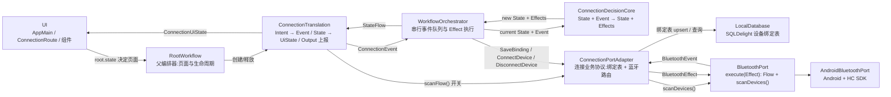

# 工作流 02：设备发现、绑定与自动连接

本文说明 `migratedev` 中登录完成后的设备连接闭环：页面如何进入、扫描如何开关、自动/手动连接如何汇合、绑定如何持久化、退出如何释放资源。重点不是展示某个类的全部代码，而是回答以下问题：

- Auth 成功后如何进入连接页面（父编排器如何切换业务）。
- Connection 状态机的第一个 Event 在哪里产生。
- Android 权限、蓝牙开启和页面可见性如何进入业务流程。
- 扫描链路由谁控制、刷新如何低能耗（08 扫描链路改进后的形态）。
- 自动连接与手动连接如何共享一条链路。
- 蓝牙能力接口与 Android/HC SDK 实现如何分开。
- BT24 筛选、用户绑定、连接和断开如何协同。
- 日志如何帮助快速定位扫描和连接问题。

> 词汇说明：下行统一为 **Effect**（领域副作用），上行统一为 **Event**（领域事实）。`ConnectionPort.execute(ConnectionEffect): Flow<ConnectionEvent>` 直通，不存在 Command/Result 中间层。扫描是一次冷 Flow（`scanDevices()`），由 Translation 侧开关控制，不经过 DecisionCore。

---

## 1. 总体拓扑



边界含义如下：

- UI 负责 Android 权限请求、蓝牙开启请求、页面导航和用户操作，不直接调用 HC SDK。
- Translation 是页面 ViewModel，负责：把外部输入翻译成 Event、把 State 映射成 UiState、持有三个协程任务（绑定读取 / 扫描开关 / 自动连接），并向父编排器上报跨业务事实。
- DecisionCore 只做纯计算，不读数据库、不扫描蓝牙，也不写日志。
- Orchestrator 串行处理 Event，保证同一时刻只有一个状态转移决定生效。
- ConnectionPortAdapter 只回答"连接业务需要调用哪些能力"：绑定走 sqlite，蓝牙走 BluetoothPort。
- BluetoothPort 是蓝牙能力契约，Android/HC 实现细节不泄漏进业务代码。

### 1.1 关键入口一览

| 关注点 | 代码入口 |
|---|---|
| 依赖组装 | `AppGraph.kt` |
| 父编排器与页面切换 | `orchestrator/root/RootWorkflow.kt`、`ui/AppMain.kt` |
| 权限、开启蓝牙与拒绝退出 | `ui/connection/BluetoothAccessGate.kt` |
| destination 可见/不可见事件 | `ui/connection/ConnectionRoute.kt` |
| 页面与组件 | `ui/connection/`（ConnectionStatus / ConnectionTitleBar / DeviceCard / DeviceList） |
| 连接状态与纯决策 | `decisioncore/connection/ConnectionDecision.kt` |
| Intent/Event、UiState 与扫描开关 | `translation/connection/ConnectionTranslation.kt` |
| 连接业务协议 | `port/connection/ConnectionPort.kt`、`ConnectionPortAdapter.kt` |
| 蓝牙能力协议 | `port/adapter/bluetoothport/BluetoothPort.kt` |
| Android/HC 蓝牙适配 | `port/adapter/bluetoothport/AndroidBluetoothPort.kt` |
| BT24 产品筛选 | `port/adapter/bluetoothport/Bt24AdvertisementFilter.kt` |
| 用户设备绑定 SQL | `src/main/sqldelight/com/biosensor/migratedev/database/DeviceBinding.sq` |
| 日志初始化与 Release 文件 Tree | `logging/LoggingInitializer.kt`、`ReleaseTree.kt` |

---

## 2. 进入连接页：父编排器的切换

Auth 登录成功 → `AuthOutput.Authenticated(userId)` → RootWorkflow 转成 `AuthenticatedEvent` → 父决策进入 `PreparingConnection` + `StartConnectionEffect` → `startConnection(userId)` 在独立的 `ViewModelStore` 中创建 `ConnectionTranslation`（注入 `connectionPort` + `report`）。`RootState.screen()` 随即返回 `Connection(userId)`，`RootNavigationEffect` 导航到 `connection/{userId}`（`popUpTo("auth") { inclusive = true }`，返回键不再回登录页）。

退出登录的完整链路见 [10. 退出流程](#10-退出流程)。

---

## 3. ConnectionTranslation：子编排器 + 三个协程任务

`ConnectionTranslation` 除了翻译层的本职工作（建 Orchestrator、Intent→Event、State→UiState），还负责三个协程任务的管理：

| 任务 | 内容 | 用途 |
|---|---|---|
| `bindingCollection` | 收集 `port.readBinding(userId)` → `binding` 状态流 | 读取当前用户绑定 |
| `scanCollection` | combine 四输入 → `ScanRequest` → `flatMapLatest` 启停 `scanFlow()` | 扫描开关（见 5） |
| `autoConnectCollection` | combine(binding, devices) → 命中则 `requestConnection(automatic = true)` | 自动连接（见 6） |

局部状态：

- `bluetoothAccessGranted` / `visible` / `scanRestart`：扫描开关的三路输入。
- `binding` / `devices`：设备列表与绑定（UI 数据源）。
- `scanActive`：扫描是否在运行（决定刷新是否 bump `scanRestart`）。
- `autoConnectConsumed`：本次会话是否已尝试过自动连接（避免重复）。
- `logoutStarted`：退出流程只执行一次。

创建事件在 init 中发送（由父编排器创建的时机保证只发一次）：

```kotlin
init {
    orchestrator.dispatch(ConnectionEvent.ConnectionCreated(userId))
}
```

`ConnectionCreated` 只表示"连接工作流已经建立"，不能假设 Android 权限和系统蓝牙已经可用，因此它进入 `AwaitingBluetoothAccess`，不会立即开始扫描。

### 3.1 页面可见性只管理扫描资源

`BecameVisible / BecameHidden` 是 Connection 管理扫描资源所需的业务输入，不是通用页面生命周期框架：

- 进入页面：`visible = true` → 扫描开关允许开启。
- 离开/后台：`visible = false` → `flatMapLatest` 切换到 `emptyFlow()`，取消收集 → `callbackFlow.awaitClose` 停止原生扫描。
- 已连接时退后台：不主动断开（状态机仍是 `Connected`，扫描本来就没开）。

### 3.2 UiState 映射

```kotlin
data class ConnectionUiState(
    val phase: ConnectionPhase,          // AwaitingBluetoothAccess / Scanning / Connecting / Connected / Failed / EndingSession / LogoutReady
    val devices: List<DeviceItemUi>,
    val rememberedDeviceId: String?,
    val isRefreshing: Boolean,           // 当前恒 false(刷新不清空列表,见 5.3)
    val message: String?
)
```

| State | UI 表现 |
|---|---|
| `Idle` / `AwaitingBluetoothAccess` | 显示 Gate，依次处理权限与蓝牙开启 |
| `Scanning` | 持续更新列表，允许选择和下拉刷新 |
| `Connecting` | 标记目标设备，禁用重复点击 |
| `Connected` | 显示已连接设备 |
| `ConnectionFailed` | 显示失败/超时，提供重新扫描和手动重试 |
| `EndingSession` | 禁用交互，等待连接资源结束 |
| `LogoutReady` | 上报 `Stopped`，由父编排器继续退出 |

设备排序规则（纯映射，不影响绑定匹配）：记忆设备优先 → 信号强度 → 名称/ID。

### 3.3 上报父编排器

| 转移 | 上报 Output | 父转成 RootEvent |
|---|---|---|
| 进入 `LogoutReady`（且之前不是） | `ConnectionOutput.Stopped` | `ConnectionStoppedEvent` |
| 用户退出（`beginLogout` 第一步） | `ConnectionOutput.LogoutRequested` | `LogoutRequestedEvent` |

---

## 4. Android 权限与蓝牙开启

运行时权限是 Android UI 事实，不应塞进 `AndroidBluetoothPort`，因为 Port 不能弹系统权限框，也不应持有 Activity。

### 4.1 权限集合

| 系统 | 权限 |
|---|---|
| Android 12/API 31 及以上 | `BLUETOOTH_SCAN`、`BLUETOOTH_CONNECT`、`ACCESS_COARSE_LOCATION`、`ACCESS_FINE_LOCATION` |
| Android 11/API 30 及以下 | `ACCESS_FINE_LOCATION` |

Manifest 中旧版 Bluetooth/Location 权限用 `maxSdkVersion` 限定。在 BT24 真机验证前不贸然给 `BLUETOOTH_SCAN` 添加 `neverForLocation`，因为 Android 文档明确提示该声明可能过滤部分 BLE beacon。

### 4.2 BluetoothAccessGate：三步线性门

Gate 是显式的三步状态机（05 UI 重构后形态），不存在交叉布尔：

```text
AwaitingPermission → AwaitingSystemEnable → Ready(终态,只进入一次)
```

- 进入时按已授予权限决定起点；未授予 → 弹系统权限请求。
- 权限齐了 → 检查系统蓝牙：无硬件直接 `finishAffinity()`；已开启 → `Ready`；未开启 → 弹系统开启请求。
- 开启请求结果：成功 → `Ready`；取消 → `onBluetoothEnableCancelled()`（停在等待状态，不开始扫描）。
- 任一必需权限被拒绝 → `onPermissionDenied()`（UI 调用 `finishAffinity()` 结束任务，应用内不提供第二次请求入口）。
- `adapter.isEnabled` 也作为 `LaunchedEffect` 的 key：用户在系统设置/下拉栏直接开启蓝牙时，同样能推进流程。

Gate 只在 `AwaitingBluetoothAccess` 阶段显示。`onAccessReady()` 使状态进入 `Scanning` 后，Composable 退出组合，不会在普通重组中反复触发。

---

## 5. 扫描链路（08 扫描链路改进后的形态）

扫描不再由 DecisionCore 管理轮次/会话 ID，而是 Translation 侧的一条开关流：

```kotlin
private val scanCollection: Job = viewModelScope.launch {
    combine(
        bluetoothAccessGranted, visible, orchestrator.state, scanRestart
    ) { access, isVisible, state, restart ->
        ScanRequest(
            enabled = access && isVisible && state is ConnectionState.Scanning,
            restart = restart
        )
    }.distinctUntilChanged().flatMapLatest { request ->
        if (request.enabled) scanFlow() else emptyFlow()
    }.collect { device ->
        discovered[device.id] = device
        devices.value = discovered.values.toList()
    }
}
```

四个输入各自保留最新值，任一变化就用全部最新值重算一次 `ScanRequest`：

| 输入 | 含义 |
|---|---|
| `bluetoothAccessGranted` | 门：用户是否已授予蓝牙权限 |
| `visible` | 门：页面当前是否可见 |
| `orchestrator.state` | 状态机是否处于 `Scanning` 阶段 |
| `scanRestart` | "请重启扫描"的请求版本号，每 bump 一次代表一次重扫诉求 |

`flatMapLatest` 是关键：新请求到来时自动取消旧收集再开新收集，等价于"停掉旧扫描 → 启动新扫描"，且不会出现新旧并发。

### 5.1 scanFlow 是扫描会话的装饰

```kotlin
private fun scanFlow(): Flow<BluetoothDeviceInfo> = port.scanDevices().onStart {
    clearDevices()                      // 扫描开始:清空列表
    scanActive = true
}.onCompletion {
    scanActive = false
}.catch { error ->
    orchestrator.dispatch(ConnectionEvent.ScanFailed(...))
}
```

- 订阅 `port.scanDevices()` 开始一次原生扫描；取消订阅时 `callbackFlow.awaitClose` 停止扫描（冷流，即用即关）。
- 扫描失败以异常关闭流 → catch 上报 `ScanFailed` → 状态机 `Scanning(message)`，扫描自然终止，不会自动重启。
- 同一时刻只有一个扫描会话：`AndroidBluetoothPort` 的 `activeScan` 单飞位拒绝第二个订阅者（见 8.1）。

### 5.2 刷新：三条路

刷新动作（`ConnectionIntent.Refresh`）执行：

```kotlin
clearDevices()                                    // 1. 清空当前列表
orchestrator.dispatch(ConnectionEvent.RefreshRequested)   // 2. 状态机:Scanning→message 清空 / Failed→回 Scanning
if (!scanActive) scanRestart.value += 1           // 3. 没在扫才 bump 重启信号
```

| 场景 | 行为 |
|---|---|
| 扫描运行中刷新 | `scanActive == true` → 不 bump；`ScanRequest` 因 `distinctUntilChanged` 值未变被吞掉 → 不重启扫描（native 零感知） |
| 扫描失败后刷新 | `ScanFailed → Scanning`（reducer 在 `ConnectionFailed` 时 `RefreshRequested` 也回 `Scanning`）+ 没在扫 → bump `scanRestart` → `flatMapLatest` 重启扫描 |
| 页面隐藏 → 可见 | `visible` 翻转 → `ScanRequest` 重算 → 重启扫描（这是真实 cost：stop/start 往返） |

低能耗结论：高频操作挡在状态流层，`distinctUntilChanged` 挡住"扫描中刷新"的无效重启；只有状态确实变化时才触碰资源流。

### 5.3 为什么 isRefreshing 恒 false

下拉刷新期间列表被清空（`clearDevices`），"刷新中"的感知由列表重新填充完成；前端不再需要独立的 `isRefreshing` 开关，也没有连发问题（刷新是幂等的：清空 + 清 message + 条件 bump）。

---

## 6. 自动连接与手动连接汇合

两者共享同一条扫描链路，只是触发条件不同，最终都进入同一个 `ConnectRequested` 事件：

```kotlin
private val autoConnectCollection: Job = viewModelScope.launch {
    combine(binding, devices) { currentBinding, currentDevices ->
        (currentBinding as? BindingSnapshot.Found)?.deviceId?.takeIf { id ->
            currentDevices.any { it.id == id }      // 记忆的设备出现在列表里
        }
    }.distinctUntilChanged().collect { deviceId ->
        if (deviceId != null) requestConnection(deviceId, automatic = true)
    }
}
```

`requestConnection` 是两条路的汇合点：

```kotlin
private fun requestConnection(deviceId: String, automatic: Boolean) {
    if (logoutStarted) return
    if (automatic) {
        if (autoConnectConsumed) return          // 本次会话已尝试过自动连接
        autoConnectConsumed = true
    } else {
        if (deviceId !in discovered) return      // 手动:设备必须在已发现列表里
        autoConnectConsumed = true
    }
    orchestrator.dispatch(ConnectionEvent.ConnectRequested(deviceId))
}
```

- 自动连接只尝试一次：`autoConnectConsumed` 置位后，即使设备列表继续更新也不会重复触发（避免无限重试）。
- 手动选择后也置位（同一次会话内自动/手动只汇合一次）。
- Orchestrator 串行处理 Event：若"自动命中"和"用户点击"非常接近，第一个事件使状态进入 `Connecting`，第二个在 `Connecting` 下被忽略，不会创建两条连接任务。

连接成功后的绑定规则：

| 连接来源 | 成功后动作 |
|---|---|
| 手动选择 | `SaveBinding(userId, deviceId)`，upsert 当前用户绑定（`onTransition` 同步更新本地 `binding` 状态流） |
| 自动连接 | 不重复写入，直接进入 Connected |

---

## 7. Connection DecisionCore

DecisionCore 是纯 reducer：`reduce(currentState, event) = nextState + effects`。它只保留业务数据：设备列表、绑定、扫描开关都不在状态机里。

### 7.1 状态

```kotlin
sealed interface ConnectionState {
    data object Idle : ConnectionState
    data class AwaitingBluetoothAccess(val userId: String) : ConnectionState
    data class Scanning(val userId: String, val message: String?) : ConnectionState
    data class Connecting(val userId: String, val deviceId: String) : ConnectionState
    data class Connected(
        val userId: String, val device: BluetoothDeviceInfo, val bindingMessage: String?
    ) : ConnectionState
    data class ConnectionFailed(val userId: String, val deviceId: String, val message: String) : ConnectionState
    data object EndingSession : ConnectionState
    data object LogoutReady : ConnectionState
}
```

`Scanning` 只有 `userId + message`：扫描资源状态（进行中/停止）由 Translation 的 `scanActive` 表达，失败只更新 `message`。

### 7.2 事件与效果

```kotlin
sealed interface ConnectionEvent {
    data class ConnectionCreated(val userId: String) : ConnectionEvent
    data object BluetoothAccessGranted : ConnectionEvent
    data class ScanFailed(val message: String) : ConnectionEvent
    data object RefreshRequested : ConnectionEvent
    data class ConnectRequested(val deviceId: String) : ConnectionEvent
    data class DeviceConnected(val device: BluetoothDeviceInfo) : ConnectionEvent
    data class DeviceConnectFailed(val message: String) : ConnectionEvent
    data object DeviceConnectTimeout : ConnectionEvent
    data object DeviceDisconnected : ConnectionEvent
    data class BindingSaved(val deviceId: String) : ConnectionEvent
    data class BindingSaveFailed(val message: String) : ConnectionEvent
    data object LogoutRequested : ConnectionEvent
}

sealed interface ConnectionEffect {
    data class SaveBinding(val userId: String, val deviceId: String) : ConnectionEffect
    data class ConnectDevice(val deviceId: String) : ConnectionEffect
    data object DisconnectDevice : ConnectionEffect
}
```

### 7.3 状态转移表（当前实现）

| 当前 State | Event | 下一个 State | Effect |
|---|---|---|---|
| `Idle` | `ConnectionCreated(userId)` | `AwaitingBluetoothAccess(userId)` | 无 |
| `AwaitingBluetoothAccess` | `BluetoothAccessGranted` | `Scanning(userId, null)` | 无（扫描由 Translation 开关启动） |
| `Scanning` | `ConnectRequested(deviceId)` | `Connecting(userId, deviceId)` | `ConnectDevice(deviceId)` |
| `Scanning` | `RefreshRequested` | `Scanning(userId, null)` | 无（清 message） |
| `Scanning` | `ScanFailed(message)` | `Scanning(userId, message)` | 无 |
| `Scanning` | `LogoutRequested` | `EndingSession` | `DisconnectDevice` |
| `Connecting` | `DeviceConnected(device)` | `Connected(userId, device, null)` | 无 |
| `Connecting` | `DeviceConnectFailed(message)` | `ConnectionFailed(userId, deviceId, message)` | 无 |
| `Connecting` | `DeviceConnectTimeout` | `ConnectionFailed(userId, deviceId, "连接超时")` | 无 |
| `Connected` | `BindingSaved(deviceId)` | `Connected(..., bindingMessage = "已保存绑定设备")` | 无 |
| `Connected` | `BindingSaveFailed(message)` | `Connected(..., bindingMessage = message)` | 无 |
| `Connected` | `DeviceDisconnected` | `ConnectionFailed(userId, deviceId, "蓝牙连接已断开")` | 无 |
| `Connected` | `LogoutRequested` | `EndingSession` | `DisconnectDevice` |
| `ConnectionFailed` | `RefreshRequested` | `Scanning(userId, null)` | 无（返回扫描，设备列表保留） |
| `EndingSession` | `DeviceDisconnected` | `LogoutReady` | 无 |
| 其他不匹配组合 | 任意 Event | 保持当前状态 | 无 |

> 绑定读取不属于状态机：`binding` 是 Translation 侧的状态流（`BindingSnapshot.Loading / Missing / Found / Failed`），只决定自动连接和 UI 记忆标识，不阻塞扫描与手动连接。`Missing` 和 `Failed` 都不会阻止手动选择。

### 7.4 退出（Logout）先结束连接资源

退出只释放当前真正持有的资源：

```text
用户点击退出 → submit(Logout) → beginLogout()
    → logoutStarted = true(只执行一次)
    → report(LogoutRequested)          → 父:EndingConnection
    → cancelAndJoin(scanCollection)     → 扫描已停,不会再开
    → dispatch(LogoutRequested)         → Scanning/Connected → EndingSession + DisconnectDevice
    → DeviceDisconnected                → LogoutReady
    → report(Stopped)                   → 父:ConnectionStoppedEvent → ClearingSession → auth.submit(Logout)
```

该流程只清除物理连接和 Auth Session，不删除 `deviceBinding`。"断开连接"和"忘记设备"是不同操作，未来的 `ForgetDevice` 才删除本地绑定，不属于本章。

---

## 8. BluetoothPort：蓝牙能力契约

文件：`port/adapter/bluetoothport/BluetoothPort.kt`

```kotlin
sealed interface BluetoothEffect {
    data class Connect(val deviceId: String, val timeoutMillis: Long = 15_000) : BluetoothEffect
    data object Disconnect : BluetoothEffect

    // TODO(Workflow 03): SendData / ObserveReceivedData / RequestMtu /
    //  transfer progress / protocol errors.
}

sealed interface BluetoothEvent {
    data class Connected(val device: BluetoothDeviceInfo) : BluetoothEvent
    data class ConnectFailed(val message: String) : BluetoothEvent
    data object ConnectTimeout : BluetoothEvent
    data object Disconnected : BluetoothEvent

    // TODO(Workflow 03): DataSent / DataReceived / MtuChanged / TransferProgress / TransferFailed.
}

interface BluetoothPort {
    fun execute(effect: BluetoothEffect): Flow<BluetoothEvent>   // 一次连接/断开会话
    fun scanDevices(): Flow<BluetoothDeviceInfo>                 // 一次扫描会话(冷流)
}
```

接口名称不限定为"扫描 Port"或"连接 Port"，后续收发数据继续扩充同一份协议（第三章），不需要重新发明一套 Port。

### 8.1 AndroidBluetoothPort 的内部责任

`AndroidBluetoothPort` 持有两个会话位 + 一个已发现缓存：

| 成员 | 职责 |
|---|---|
| `activeScan: ScanCollection?` | 扫描单飞位：第二个订阅者直接以"蓝牙扫描已经在进行中"关闭新流 |
| `connectionSession: ConnectionSession?` | 连接单飞位：已有连接会话时拒绝新连接（"已有蓝牙连接会话正在进行"） |
| `discovered: LinkedHashMap<String, ScannedBleDevice>` | 扫描发现缓存，连接时取回设备交给 HC 库 |

关键行为：

- **扫描（callbackFlow）**：订阅时注册 `NativeBleScanListener`、调用 `scanner.start(listener)`；`onDeviceFound` 先过 `Bt24AdvertisementFilter`，是当前会话才存入缓存并 `trySend`；`onScanFailed` 结束会话并带异常关闭流；`awaitClose` 统一 `finishActiveScan(expected)` 停止扫描。迟到回调靠"listener 身份是否还是当前 activeScan"丢弃。
- **连接先停扫描**：`connect` 的第一步是 `finishActiveScan()`，然后从 `discovered` 取目标设备，交给 HC 库。
- **HC 库补缓存**：`HcBluetoothLibraryClient.connect(device)` 把 `device.legacyDevice` 补入旧库 `nativeDevices` 再 `manager.connect(module)`——否则旧库连接成功后找不到设备，无法回传成功事件。
- **15 秒超时**：连接会话启动时起一个 `delay(timeoutMillis)` 协程，未连上则发 `ConnectTimeout`、`client.disconnect`、关闭流；`awaitClose` 里若仍持有会话则断开。
- **连接监听**：`BluetoothLibraryListener.onConnected/onConnectionLost` 路由到当前会话，发 `Connected` / `Disconnected`（已连接时）或 `ConnectFailed`（尚未连上）。
- **disconnect**：先停扫描，再取出会话、`client.disconnect`、发 `Disconnected`。

Port 不负责：

- 请求 Android 运行时权限。
- 弹出开启蓝牙的系统页面。
- 决定哪个用户绑定哪个设备。
- 决定自动连接或手动连接。
- 决定 UI 错误文案。

---

## 9. ConnectionPortAdapter：连接业务协议

```kotlin
interface ConnectionPort {
    fun execute(effect: ConnectionEffect): Flow<ConnectionEvent>   // 下行
    fun readBinding(userId: String): Flow<BindingSnapshot>          // 直读流(非 effect→event 形态)
    fun scanDevices(): Flow<BluetoothDeviceInfo>                    // 直读流(转发蓝牙能力)
}
```

`ConnectionPortAdapter(sqlite, ble)` 的执行内容：

| Effect / 方法 | 执行内容 |
|---|---|
| `SaveBinding(userId, deviceId)` | sqlite `deviceBindingQueries.upsert` → `BindingSaved / BindingSaveFailed` |
| `ConnectDevice(deviceId)` | `ble.execute(BluetoothEffect.Connect(deviceId))` → 翻译为 `DeviceConnected / DeviceConnectFailed / DeviceConnectTimeout` |
| `DisconnectDevice` | `ble.execute(BluetoothEffect.Disconnect)` → `DeviceDisconnected` |
| `readBinding(userId)` | sqlite `findByUserId` → `BindingSnapshot.Found / Missing / Failed` |
| `scanDevices()` | 原样转发 `ble.scanDevices()` |

`BindingSnapshot` 是直读流的结果词汇（`Loading / Missing / Found(deviceId) / Failed`），不属于 effect→event 形态。

### 9.1 设备绑定表（SQLDelight）

设备绑定是 `userId → deviceId` 的结构化关系，需要查询、更新和未来迁移，因此存数据库而不是加密键值存储。

```sql
CREATE TABLE deviceBinding (
    userId TEXT NOT NULL PRIMARY KEY,
    deviceId TEXT NOT NULL,
    updatedAtMillis INTEGER NOT NULL
);
-- findByUserId / upsert(INSERT OR REPLACE) / deleteByUserId
```

`userId` 主键明确了本阶段"一名用户只记忆一个设备"。手动连接另一台设备成功后，`upsert` 覆盖原绑定。业务侧只调用生成的 `deviceBindingQueries` 命名接口，不拼接 SQL 字符串、不操作 Cursor。

这里不选 Room：当前希望"SQL 由项目直接编写，client 暴露编译期校验后的查询"。SQLDelight 与这个边界更一致。

---

## 10. 退出流程（子 → 父 → 释放）

```text
Connection 页用户退出
  → beginLogout():report(LogoutRequested) → 父 LogoutRequestedEvent → EndingConnection
  → cancelAndJoin 扫描 → dispatch(LogoutRequested) → EndingSession + DisconnectDevice → DeviceDisconnected → LogoutReady
  → report(Stopped) → 父 ConnectionStoppedEvent → ClearingSession + ClearAuthSessionEffect
  → auth.submit(Logout) → Auth 决策 Idle + ClearSession → AuthPortAdapter 删会话 → SessionCleared
  → AuthOutput.SessionCleared → 父 AuthSessionClearedEvent → ReleasingConnection + ReleaseConnectionEffect
  → releaseConnection():connectionStore.clear()(onCleared 取消三任务并关闭 orchestrator)
  → ConnectionReleasedEvent → Authenticating(等下次登录)
```

不会在 `auth.submit(Logout)` 后不等结果就立即导航：Auth 到达明确的未登录状态才切页，避免 Auth 页面先观察到旧的 `Authenticated` 状态再次跳回 Connection。若清除 Session 失败，则保持当前结束页面并提供重试。

---

## 11. 本地能力与文件

`AppGraph` 能力挂载区：`StringEntropy`（Tink 加密键值存储，DataStore 承载，key 作为 associated data）、`LocalDatabase`（SQLDelight）、`LocalFileClient`（Okio，受目录空间约束）、`HttpRemote`（见工作流 01）、`BluetoothPort`。Connection 业务只用 `sqlite + ble` 两个能力。

文件空间（`FileSpace`）：

```text
LOGS     → application.filesDir/logs      (ReleaseTree 使用)
RECEIVED → application.filesDir/received  (第三章蓝牙接收文件)
OUTGOING → application.filesDir/outgoing  (第三章待发送文件)
CACHE    → application.cacheDir/cache
```

`LocalFileClient` 内部使用 `FileSystem.SYSTEM`，但对外只接收 `FileSpace + relativePath`，并在解析后校验结果仍位于对应 root 下。测试使用 Okio `FakeFileSystem`，teardown 时 `checkNoOpenFiles()` 检查资源泄漏。

---

## 12. BT24 产品族与设备身份

### 12.1 产品族筛选

BT24 候选设备必须同时满足：

```text
transport      = BLE
service UUID   = FFE0(兼容 16 位和标准 128 位写法)
manufacturerId = 0x4458
```

`Bt24AdvertisementFilter` 接收扫描结果中的结构化广播信息，返回纯 Boolean。筛选发生在设备进入业务设备列表之前（`AndroidBluetoothPort.onDeviceFound` 第一道过滤），因此 DecisionCore、绑定和 UI 看不到其他厂商设备。

| BLE | FFE0 | 0x4458 | 结果 |
|---|---|---|---|
| 是 | 是 | 是 | 接受 |
| 否 | 是 | 是 | 拒绝 |
| 是 | 否 | 是 | 拒绝 |
| 是 | 是 | 否 | 拒绝 |
| 是 | 广播字段缺失 | 是 | 拒绝 |

如果 HC SDK 当前 DTO 没有 manufacturer data，需要从原生 `ScanResult.scanRecord` 补齐；不能为了接口好看而假装 SDK 已经提供。

### 12.2 deviceId 与绑定前提

本阶段使用 MAC 作为 `deviceId`，前提是 BT24 广播地址稳定。

若硬件采用随机 BLE 地址，MAC 不能承担长期身份，必须改用：广播中的稳定序列号，或首次连接后读取的硬件 ID。这个前提需要在真机联测中确认并记录。未确认稳定地址之前，不能宣称"记忆设备"已经完成产品闭环。

---

## 13. Timber 日志系统

### 13.1 为什么所有调用点可以直接用 Timber

Timber 不会根据 Debug/Release 自动选择 Tree；它只把 `Timber.d/e/...` 分发给已经种下的 Tree。构建模式判断只需要在 Application 初始化时做一次（`logging/LoggingInitializer.kt`）：

- Debug：`Timber.DebugTree()`。
- Release：`ReleaseTree(files = appGraph.files, scope = appGraph.applicationScope)`。

所以：

- Orchestrator、Adapter、Port 和 UI Android 边界直接使用 `Timber.tag(...).i(...)`。
- DecisionCore 保持纯函数，不写日志；Orchestrator 在调用 reducer 前后统一记录 transition。
- 不定义 `AppLogger`，避免只为包装静态调用增加一层接口。
- 测试需要断言日志时种植 `TestTree`，结束后 `Timber.uprootAll()`。

### 13.2 ReleaseTree 的参数

| 策略 | 当前值 |
|---|---|
| 记录级别 | INFO 及以上（`isLoggable` 过滤） |
| 单文件上限 | 5 MB（到阈值轮转并 prune 旧文件） |
| 最大文件数 | 5 个 |
| 最长保留 | 7 天 |
| 写盘方式 | `Channel(256)` 缓冲 + 单一后台 consumer（`log()` 不阻塞调用方） |
| 脱敏 | 正则抹掉 `token= / password= / userId= / deviceId=` 后的值 |
| 写盘失败 | 回退到 Android `Log.e`（不能递归调用 Timber） |

推荐 tag：`Connection.Workflow`、`Connection.Bluetooth`、`Connection.Binding`、`Connection.UI`。

日志禁止写入 token、密码、完整 userId 和完整 deviceId；标识符只保留短哈希或末尾片段。

---

## 14. 依赖与工具链基线

### 14.1 已落地的工具链

`dev-2.1` 使用以下已验证组合：

| 项目 | 版本 |
|---|---|
| Kotlin / Compose Compiler plugin | `2.3.20` |
| Android Gradle Plugin | `8.13.2` |
| Gradle Wrapper | `8.13` |
| JDK / JVM target | `17` |
| compileSdk / targetSdk | `35 / 34` |
| Compose BOM | `2024.06.00` |
| Navigation Compose | `2.9.8` |
| Preferences DataStore | `1.2.1` |
| SQLDelight | `2.3.2` |
| Tink Android | `1.23.0` |
| Okio | `3.17.0` |
| Timber | `5.0.1` |

Kotlin 2.x 后 Compose Compiler 与 Kotlin 同版本发布，因此 `migratedev` 应用 `org.jetbrains.kotlin.plugin.compose`，不再维护 `composeOptions.kotlinCompilerExtensionVersion`。最初尝试的 Kotlin `2.2.20` + AGP `8.10.1` 虽能完成构建，但 D8/R8 会反复报告 Kotlin metadata 重写告警；升级到上表组合后告警消失。因此后续不要单独回退其中某一个版本。

### 14.2 为什么不引入 Hilt

Hilt 解决的是对象构造和作用域注入，不负责监测页面进入、退出或应用前后台。当前对象数量由 `AppGraph` 两段式（能力挂载区 + 业务组装区）清楚表达；Translation 由 RootWorkflow 经 `ViewModelStore` 管理。等到 module 或 constructor 数量明显增加、手工 Factory 已经影响可读性时，再单独评估 Hilt。

---

## 15. 联测计划

### 15.1 第一层：DecisionCore 单元测试

必须覆盖：

1. `Idle + ConnectionCreated → AwaitingBluetoothAccess`，无 Effect。
2. `Awaiting + BluetoothAccessGranted → Scanning`，无 Effect（扫描由 Translation 开关启动）。
3. 自动/手动 `ConnectRequested` 都只产生一次 `ConnectDevice`。
4. `RefreshRequested` 在 Scanning 清 message、在 ConnectionFailed 回 Scanning。
5. `ScanFailed` 只更新 message，不离开 Scanning。
6. 连接成功、失败、超时三种结局的转移。
7. 已连接时断开 → `ConnectionFailed("蓝牙连接已断开")`。
8. `LogoutRequested` 从 Scanning/Connected → EndingSession + DisconnectDevice；`EndingSession + DeviceDisconnected → LogoutReady`。
9. 绑定保存成功/失败只更新 `bindingMessage`，不离开 Connected。
10. 不匹配组合保持当前状态、无副作用。

### 15.2 第二层：Translation 测试

- 三路扫描开关：权限门 / 可见门 / 状态机阶段任一关闭都不开扫描。
- 刷新三态：扫描中不重启、失败后 bump `scanRestart` 重启、隐藏恢复重启。
- 自动连接只触发一次（`autoConnectConsumed`）；手动选择必须是已发现设备。
- `beginLogout` 幂等（`logoutStarted`）；退出后 `requestConnection` 不再生效。
- `onCleared` 取消三个任务并关闭 orchestrator。
- `toUiState` 映射与设备排序。

### 15.3 第三层：Port / Adapter 测试

Local：

- 绑定表 `findByUserId / upsert`（同一 userId 覆盖旧设备）。
- Okio 路径不能逃出 FileSpace root；FakeFileSystem 验证轮转、清理和无未关闭文件。

Bluetooth（`AndroidBluetoothPort` 用 fake scanner/client）：

- BT24 三条件筛选及缺字段。
- 扫描单飞：第二个订阅者以"蓝牙扫描已经在进行中"关闭。
- 取消订阅停止扫描；迟到回调被丢弃。
- 连接前停止扫描；从 discovered 取目标；15 秒超时。
- 连接单飞：已有会话拒绝新连接。
- 同步异常与异步失败都映射为 `ConnectFailed`。
- 断开后发 `Disconnected`。

### 15.4 第四层：Compose / Navigation 测试

- Auth 成功后导航到 `connection/{userId}`，Auth destination 被移除。
- ConnectionTranslation 只创建一次，普通重组不重复发送 ConnectionCreated。
- 权限已授予时进入扫描；任一权限拒绝时结束任务。
- 系统蓝牙关闭时发起开启请求，取消后不扫描。
- 下拉刷新不清空已扫列表（扫描中刷新零重启）。
- 进入后台停止扫描，回前台恢复。
- 退出后返回 Auth，但数据库绑定仍存在。

### 15.5 第五层：BT24 真机联测

按顺序联测，不一次跨完所有层：

1. 权限和开启蓝牙。
2. 持续扫描及只显示 BT24。
3. 手动选择、连接前停止扫描、连接成功。
4. 重启 App/重新登录后读取同一用户绑定并自动连接。
5. 切换用户后只使用当前 userId 的绑定。
6. 更换绑定设备后覆盖旧关系。
7. 扫描期间下拉刷新。
8. 蓝牙关闭、设备离线、连接超时和权限撤销。
9. Debug Logcat 与 Release 文件日志能串起同一 workflow/扫描/连接链路。
10. 确认 BT24 MAC 是否稳定；若不稳定，阻止以 MAC 完成正式绑定上线。

每完成一层先保存日志和结论，再进入下一层。这样失败时能明确落在 UI、Translation、DecisionCore、Port、Android Adapter 或 HC SDK，而不是只得到"连接不上"。

---

## 16. 第三章 TODO

本章只预留蓝牙能力扩展位置，不提前设计数据协议：

- `SendData`
- `ObserveReceivedData`
- MTU 请求与变化
- 分包、重组、校验和重试
- 传输进度与取消
- 收到的数据文件写入 `FileSpace.RECEIVED`
- 待发送文件读取 `FileSpace.OUTGOING`
- 连接断开后的数据页状态

第三章应继续扩充 `BluetoothPort.kt` 的能力协议（`BluetoothEffect` / `BluetoothEvent` 各加 TODO 中的条目），而不是新增一个与现有 HC Client 争用监听器的 Port。

---

## 17. 实施状态

第二章方案已按本文拓扑落地（含 08 扫描链路改进与 07 词汇统一），后续查代码时以 [1.1 关键入口一览](#11-关键入口一览) 为准。当前自动化验证覆盖 DecisionCore、Translation（三路扫描开关与刷新三态）、Port/Adapter、BT24 Filter、扫描单飞、连接前停扫与连接超时。真机仍必须按 15.5 的顺序确认系统权限行为、BT24 广播字段、MAC 稳定性和实际连接回调。
