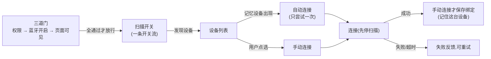

# 工作流 02：设备发现、绑定与自动连接

> 状态：**已施工**，与当前代码核验一致（2026-08-06）。后续代码变更须同步本文件。

---

## 0. 概览（先读这里，一屏看懂）

### 0.1 这部分做了什么

登录完成后，App 要连上用户的血糖仪设备（BT24 蓝牙硬件）：

- 进入连接页，**扫描周围设备**（只显示自家的 BT24 产品，杂牌过滤掉）；
- **记忆设备自动连接**：上次连过哪台，下次开机自动连上，不用手选；
- **手动点选**任意 BT24 设备连接，连接成功就记住它；
- 连接失败/超时/断开有明确反馈，可重试；
- **退出登录**时先断开连接、再清理会话，资源不泄漏。

### 0.2 基础思路（蓝图）

整个业务的运行骨架：



核心一句话：**权限、蓝牙、可见性是"门"，门全开了扫描这条开关流才工作；自动与手动连接汇合成同一个连接动作；连接是"单飞"的（扫描先停，连接和扫描不并发）。**

扫描这条"开关流"的关键设计（本业务最精巧的地方）：

```text
四路输入(权限✅/可见✅/状态是扫描中✅/有重启诉求) → 合并计算 → 值没变就忽略(防无效重启)
→ 需要扫就订阅一次原生扫描,不需要就停 → 发现设备就进列表
```

> 完整细节见 [2.2 扫描开关流](#22-扫描开关流)。

### 0.3 痛点与演进（为什么不是上面这么简单）

| # | 问题（蓝图跑不通的地方） | 改进 | 状态 | 详见 |
|---|---|---|---|---|
| 1 | 权限、蓝牙开关、页面可见性三个条件交叉组合，难维护、易漏判 | 做成**三步线性门**（权限 → 蓝牙 → 就绪） | ✅ 已做 | [2.1](#21-权限与蓝牙开启三步线性门) |
| 2 | 扫描轮次由状态机管理，轮次号满天飞、逻辑复杂 | 扫描改为 Translation 侧**开关流**，状态机只管"是否在扫描阶段" | ✅ 已做 | [2.2](#22-扫描开关流) |
| 3 | 下拉刷新反复重启扫描，白耗电 | 幂等刷新 + 值没变不重启；"刷新中"标志被证伪后移除 | ✅ 已做 | [2.2](#22-扫描开关流) |
| 4 | 自动连接在设备一直出现时**无限重试** | 每次会话**只尝试一次**自动连接 | ✅ 已做 | [2.3](#23-自动与手动连接汇合) |
| 5 | 连接与扫描同时进行会互相干扰 | 连接前先停扫描；扫描/连接各设**单飞位** | ✅ 已做 | [2.4](#24-扫描与连接互斥) |
| 6 | 旧蓝牙库连接成功后找不到设备，回不了成功事件 | 连接时把设备补进旧库缓存再连 | ✅ 已做 | [2.4](#24-扫描与连接互斥) |
| 7 | 退出时扫描、连接、会话清理交错，资源泄漏、重复触发 | 退出流程**只执行一次**，先停扫描 → 断开 → 再清会话（由父编排器协调） | ✅ 已做 | [2.5](#25-退出先结束连接资源) |
| 8 | 扫描列表混入其他厂商设备 | 广播三条件筛选（BLE + FFE0 + 厂商号），过滤发生在入口 | ✅ 已做 | [2.6](#26-bt24-筛选与设备身份) |
| 9 | 用 MAC 当设备 ID，但 MAC 可能不稳定（随机地址） | 真机联测确认 MAC 稳定性；不稳定则改用硬件序列号 | ⏳ 待联测 | [2.6](#26-bt24-筛选与设备身份) |

### 0.4 项目切面（哪些文件属于这个业务）

```text
migratedev/src/main/kotlin/com/biosensor/migratedev/
├── ui/connection/                        # 界面：权限门、设备列表、连接状态（只显示状态机给的界面状态）
│   ├── BluetoothAccessGate.kt            #   三步门：权限 → 蓝牙 → 就绪
│   └── ConnectionRoute.kt 等             #   页面可见性上报、设备卡片组件
├── translation/connection/ConnectionTranslation.kt  # 翻译层 + 三个协程任务（扫描开关/自动连接/绑定读取）
├── orchestrator/root/RootWorkflow.kt     # 父编排器：登录后创建本业务，退出时释放
├── decisioncore/connection/ConnectionDecision.kt   # 状态机：状态、事件、动作、转移表（纯逻辑）
├── port/connection/                      # 连接业务端口：绑定表 + 蓝牙路由
└── port/adapter/bluetoothport/           # 蓝牙能力：契约 + Android/HC 实现 + BT24 筛选
    ├── BluetoothPort.kt                  #   能力契约（连接/断开/扫描）
    ├── AndroidBluetoothPort.kt           #   Android + HC SDK 实现
    ├── HcBluetoothLibraryClient.kt       #   旧库封装
    └── Bt24AdvertisementFilter.kt        #   产品筛选
```

相关文档：[架构 01-父子编排器](../架构/01-父子编排器.md)、[架构 02-原生扫描替换](../架构/02-原生扫描替换.md)、[架构 05-UI分层与组件拆分](../架构/05-UI分层与组件拆分.md)、[说明-拓扑](../说明/拓扑.md)、[说明-词汇表](../说明/词汇表.md)。

---

## 1. 基础思路详解

### 1.1 谁管什么（三层分工）

| 层 | 管什么 | 不管什么 |
|---|---|---|
| **UI 门**（`BluetoothAccessGate`） | Android 权限请求、系统蓝牙开启请求、拒绝时退出 | 业务逻辑、扫描、连接 |
| **翻译层**（`ConnectionTranslation`） | 扫描开关流、自动连接、绑定读取三个协程任务；Intent/State 翻译 | 业务决策（只在状态机里做） |
| **状态机**（`ConnectionDecision`） | 阶段推进：扫描中 → 连接中 → 已连接/失败；发连接/断开/存绑定动作 | 不做 IO，不读数据库、不扫蓝牙、不写日志 |
| **业务端口**（`ConnectionPortAdapter`） | 组合底层能力：绑定走数据库，蓝牙走蓝牙能力 | 不判断状态 |
| **蓝牙能力**（`BluetoothPort` + `AndroidBluetoothPort`） | 真实扫描、连接、断开；BT24 过滤；超时控制 | 权限、业务策略、错误文案 |

### 1.2 状态机全貌

状态（进行到哪一步）：

| State | 含义 |
|---|---|
| `Idle` | 尚未建立 |
| `AwaitingBluetoothAccess(userId)` | 等三道门全开（本业务创建后的第一站） |
| `Scanning(userId, message)` | 扫描中（message 显示扫描失败原因） |
| `Connecting(userId, deviceId)` | 正在连接某台设备 |
| `Connected(userId, device, bindingMessage)` | 已连接（bindingMessage 显示绑定保存结果） |
| `ConnectionFailed(userId, deviceId, message)` | 失败/超时/断开 |
| `EndingSession` | 退出中：等待连接资源结束 |
| `LogoutReady` | 资源已释放，上报父编排器继续退出 |

事件（已发生的事实）与动作（要求执行的副作用）：

| 事件 | 动作 |
|---|---|
| `ConnectionCreated`（创建时发一次） | `SaveBinding(userId, deviceId)`（记忆设备） |
| `BluetoothAccessGranted`（门全开） | `ConnectDevice(deviceId)`（带 15s 超时） |
| `ScanFailed` / `RefreshRequested` | `DisconnectDevice`（退出时） |
| `ConnectRequested(deviceId)`（自动/手动汇合点） | |
| `DeviceConnected` / `DeviceConnectFailed` / `DeviceConnectTimeout` / `DeviceDisconnected` | |
| `BindingSaved` / `BindingSaveFailed` | |
| `LogoutRequested`（退出） | |

完整转移表（当前实现）：

| 当前 State | Event | 下一个 State | Effect |
|---|---|---|---|
| `Idle` | `ConnectionCreated` | `AwaitingBluetoothAccess` | 无 |
| `AwaitingBluetoothAccess` | `BluetoothAccessGranted` | `Scanning` | 无（扫描由翻译层开关启动） |
| `Scanning` | `ConnectRequested(deviceId)` | `Connecting` | `ConnectDevice(deviceId)` |
| `Scanning` | `RefreshRequested` | `Scanning(null)` | 无（清掉失败提示） |
| `Scanning` | `ScanFailed(message)` | `Scanning(message)` | 无 |
| `Scanning` | `LogoutRequested` | `EndingSession` | `DisconnectDevice` |
| `Connecting` | `DeviceConnected(device)` | `Connected` | 无 |
| `Connecting` | `DeviceConnectFailed(message)` | `ConnectionFailed` | 无 |
| `Connecting` | `DeviceConnectTimeout` | `ConnectionFailed("连接超时")` | 无 |
| `Connected` | `BindingSaved` / `BindingSaveFailed` | `Connected`（只更新提示） | 无 |
| `Connected` | `DeviceDisconnected` | `ConnectionFailed("蓝牙连接已断开")` | 无 |
| `Connected` | `LogoutRequested` | `EndingSession` | `DisconnectDevice` |
| `ConnectionFailed` | `RefreshRequested` | `Scanning` | 无（设备列表保留） |
| `EndingSession` | `DeviceDisconnected` | `LogoutReady` | 无 |
| 其他组合 | 任意 | 保持当前状态 | 无 |

**注意**：设备列表、绑定、扫描是否在运行**都不在状态机里**——设备列表和绑定是翻译层的数据流，扫描运行与否由翻译层的开关表达。状态机只描述"阶段"。

### 1.3 蓝牙能力端口契约

```kotlin
interface BluetoothPort {
    fun execute(effect: BluetoothEffect): Flow<BluetoothEvent>  // 一次连接/断开会话
    fun scanDevices(): Flow<BluetoothDeviceInfo>                // 一次扫描会话(冷流)
}
```

- **扫描是冷流**：订阅才开始，取消订阅即停（`callbackFlow.awaitClose`），即用即关；
- 连接/断开走统一的 `execute(BluetoothEffect)` → 事件流回灌；
- 收发数据（第三章）继续扩充这份契约，不另造 Port。

### 1.4 界面状态与表现

| 界面状态 | 屏幕表现 |
|---|---|
| `AwaitingBluetoothAccess` | 显示三道门（请求权限 / 请求开蓝牙） |
| `Scanning` | 设备列表持续更新，可点选、可下拉刷新 |
| `Connecting` | 标记目标设备，禁重复点击 |
| `Connected` | 显示已连接设备 |
| `ConnectionFailed` | 失败/超时提示，提供重试 |
| `EndingSession` / `LogoutReady` | 禁用交互，等待退出完成 |

设备排序：记忆过的设备优先 → 信号强度 → 名称/ID。

---

## 2. 改进点详解

> 每一节对应 [0.3 痛点表](#03-痛点与演进为什么不是上面这么简单) 中的一个改进。

### 2.1 权限与蓝牙开启：三步线性门（对应 #1）

**问题**：运行时权限（4 个）和系统蓝牙开启是两个独立事实，用布尔组合判断会变成交叉矩阵，任何状态都难推演。

**改进**：显式的三步线性门（UI 层实现）：

```text
AwaitingPermission → AwaitingSystemEnable → Ready（终态，只进一次）
```

- 权限不齐 → 弹系统权限框；**任一必需权限被拒绝 → 直接退出应用**（不在应用内二次纠缠）；
- 权限齐了 → 检查系统蓝牙：没硬件也退出；未开启 → 弹系统开启请求；开启失败则**停在等待**，不开扫描；
- 用户在系统设置里手动开了蓝牙，`adapter.isEnabled` 变化也能推进流程。

门只在 `AwaitingBluetoothAccess` 阶段显示；门开了（状态进 `Scanning`）组件退出组合，普通重组不会反复触发。

权限集合：Android 12+ 需要 `BLUETOOTH_SCAN / BLUETOOTH_CONNECT / ACCESS_COARSE_LOCATION / ACCESS_FINE_LOCATION` 四个；Android 11 及以下只需定位权限。

### 2.2 扫描开关流（对应 #2、#3）

**问题**：第一版把扫描轮次交给状态机管理，需要轮次号、会话号、各种同步标记，复杂且难以推理。下拉刷新还会反复重启扫描白耗电。

**改进**：扫描的开关权从状态机**上移**到翻译层，变成一条"开关流"：

```kotlin
combine(权限门, 可见性, 状态机阶段, 重启信号) { ... }   // 四路输入合并
    .distinctUntilChanged()                            // 值没变 → 忽略（防无效重启）
    .flatMapLatest { if (要扫) scanFlow() else emptyFlow() }  // 新请求自动替换旧请求
```

| 输入 | 含义 |
|---|---|
| 权限门 | 用户是否已授予蓝牙权限 |
| 可见性 | 页面是否可见（进后台即停扫） |
| 状态机阶段 | 是否处于 `Scanning` 阶段 |
| 重启信号 | "请重启扫描"的诉求（刷新时 bump） |

`flatMapLatest` 的关键性质：新请求到来时自动取消旧收集、开新收集 = "停旧扫描 → 开新扫描"，**永不并发**。

**刷新三条路**（幂等设计）：

| 场景 | 行为 |
|---|---|
| 扫描运行中刷新 | 清空列表 + 清提示；值没变 → **不重启扫描**（原生零感知） |
| 扫描失败后刷新 | 状态机回 `Scanning` + bump 重启信号 → 真正重启 |
| 页面隐藏后回前台 | 可见性翻转 → 重启（这是唯一的真实开销） |

**"刷新中"标志被移除**：曾经有一个 `isRefreshing` 开关专门表示刷新状态，实测发现列表清空 → 重新填充本身就是足够好的反馈，开关是多余的；刷新本身设计为幂等（清空 + 清提示 + 条件重启），也没有连发问题。所以现在恒为 `false`。

### 2.3 自动与手动连接汇合（对应 #4）

**问题**：记忆设备在扫描中反复出现，自动连接若不限制会无限重试。

**改进**：两条路汇合成同一个动作，且**每次会话只尝试一次**：

```text
自动路: 绑定里记忆的设备 出现在 设备列表 → 请求连接(automatic=true)
手动路: 用户在列表点选(必须是已发现设备) → 请求连接(automatic=false)
        ↓ 汇合
requestConnection: 自动已消费则不再触发; 手动要求设备在列表里
        ↓
状态机: ConnectRequested(deviceId) → Connecting + ConnectDevice
```

- `autoConnectConsumed` 置位后，即使列表继续更新也不重复触发；
- 手动选择后也置位（同一次会话自动/手动只汇合一次）；
- 事件串行处理：自动命中与用户点击几乎同时发生时，第二个事件在 `Connecting` 下被忽略，**不会产生两条连接任务**。

连接成功后的绑定规则：**手动**选择 → 保存绑定（记住这台设备，下次自动连）；**自动**连接 → 不重复写入。

### 2.4 扫描与连接互斥（对应 #5、#6）

**问题**：连接和扫描同时在跑会互相干扰；旧蓝牙库连接成功后还找不到设备（无法回传成功事件）。

**改进**（`AndroidBluetoothPort` 内部）：

| 机制 | 说明 |
|---|---|
| **扫描单飞位** | 同一时刻只有一个扫描订阅者；第二个订阅者直接以"蓝牙扫描已经在进行中"关闭 |
| **连接单飞位** | 已有连接会话时拒绝新连接（"已有蓝牙连接会话正在进行"） |
| **连接先停扫描** | 连接第一步是 `finishActiveScan()`，保证连接期间不扫描 |
| **补缓存** | 连接时把设备补进旧库 `nativeDevices` 再 `manager.connect`，旧库连接成功才能回传事件 |
| **15 秒超时** | 连接会话启动即起超时协程；超时 → `ConnectTimeout` + 断开 + 关流 |
| **迟到回调丢弃** | 扫描停止后的迟到广播按"listener 身份是否当前会话"丢弃 |

### 2.5 退出：先结束连接资源（对应 #7）

**问题**：退出涉及扫描停止、连接断开、会话清理三件事，如果各自触发，会交错、重复、泄漏。

**改进**：退出流程**幂等**（`logoutStarted` 只执行一次），严格顺序：

```text
用户点退出
  → 上报父编排器"我要退出"（父先进入"结束连接"阶段）
  → 停掉扫描任务（cancelAndJoin，扫完的绝不会再开）
  → 状态机: 断开连接 → 等待断开完成
  → 资源结束 → 上报父编排器"已停止"
  → 父编排器: 清理登录会话 → 让认证业务退出
  → 全部完成后释放本业务
```

注意：退出**不删除**绑定（"断开连接"≠"忘记设备"），下次登录还能自动连接。

### 2.6 BT24 筛选与设备身份（对应 #8、#9）

**问题**：扫描会扫到周围所有 BLE 设备。

**改进一（筛选）**：广播三条件过滤，发生在设备进入业务列表**之前**（能力层第一道过滤，上层永远看不到杂牌）：

```text
transport = BLE  ∧  service UUID = FFE0  ∧  manufacturerId = 0x4458
```

任一条件不满足或字段缺失 → 拒绝。

**改进二（身份）**：当前用 **MAC 地址**当 `deviceId`，前提是 BT24 广播地址稳定。若硬件用随机 BLE 地址，MAC 不能承担长期身份，必须改用广播中的稳定序列号或连接后读取的硬件 ID。**真机联测必须确认这个前提**，否则"记忆设备"不能宣称完成。

### 2.7 绑定持久化：数据库表（基础能力）

"记住设备"用一张表实现：`userId → deviceId`（一名用户只记忆一台设备，手动连接新设备即覆盖）。

| 项目 | 选择 |
|---|---|
| 存储 | SQLDelight（SQL 由项目直接编写，编译期校验查询） |
| 主键 | `userId`（明确"一用户一设备"） |
| 操作 | `findByUserId` / `upsert(INSERT OR REPLACE)` / `deleteByUserId` |

为什么不选 Room：当前希望"SQL 自己写、查询编译期校验"，SQLDelight 更贴合这个边界。为什么不放进加密键值存储：绑定是需要查询/更新/迁移的结构化关系，不是单值 blob。

### 2.8 日志体系（支撑）

- Debug：`Timber.DebugTree`；Release：`ReleaseTree`（文件日志）——构建模式判断只在启动时做一次，业务代码直接用 `Timber`；
- 推荐 tag：`Connection.Workflow / Connection.Bluetooth / Connection.Binding / Connection.UI`；
- **日志禁止写 token、密码、完整 userId、完整 deviceId**（只留短哈希）；
- Release 文件日志：单文件 5MB、最多 5 个、保留 7 天、`Channel(256)` 缓冲 + 单一后台消费者（调用方不阻塞）、写盘失败回退 `Log.e`。

---

## 3. 附录

### 3.1 工具链基线（已验证组合，不要单独回退）

| 项目 | 版本 |
|---|---|
| Kotlin / Compose Compiler plugin | `2.3.20` |
| Android Gradle Plugin | `8.13.2` |
| Gradle Wrapper | `8.13` |
| JDK / JVM target | `17` |
| compileSdk / targetSdk | `35 / 34` |
| Compose BOM | `2024.06.00` |
| Navigation Compose | `2.9.8` |
| Preferences DataStore | `1.2.1` |
| SQLDelight | `2.3.2` |
| Tink Android | `1.23.0` |
| Okio | `3.17.0` |
| Timber | `5.0.1` |

依赖组装用 `AppGraph` 两段式（能力挂载区 + 业务组装区），暂不引入 Hilt：对象数量还不需要；等手工 Factory 影响可读性时再评估。

### 3.2 联测计划（五层，逐层验收再进下一层）

| 层 | 内容 |
|---|---|
| 1 状态机 | 转移表全路径：进入 → 门 → 扫描 → 连接（成功/失败/超时）→ 断开 → 退出；不匹配组合保持不动 |
| 2 翻译层 | 三路开关任一关闭不开扫描；刷新三态；自动连接只一次；退出幂等；`onCleared` 取消三任务 |
| 3 端口/能力 | 绑定表覆盖；BT24 三条件；扫描单飞；取消订阅即停扫；连接先停扫；15s 超时；连接单飞 |
| 4 UI/导航 | 登录后切到连接页；权限拒绝退出；后台停扫前台恢复；刷新不清空已扫列表 |
| 5 真机 | 权限 → 扫描只见 BT24 → 连接 → 重启后自动连接 → 换设备覆盖 → 断连/超时/权限撤销 → 日志链路 → **确认 MAC 稳定性** |

> 每完成一层先保存日志和结论再进下一层。失败时能定位到具体层（UI / 翻译 / 状态机 / 端口 / 适配器 / HC SDK），而不是只知道"连不上"。

### 3.3 第三章 TODO（蓝牙收发数据）

本章只预留能力扩展位置，不提前设计协议：

- `SendData` / `ObserveReceivedData` / MTU 请求与变化 / 分包重组 / 校验重试 / 传输进度与取消
- 收到的文件写入 `FileSpace.RECEIVED`，待发送文件读取 `FileSpace.OUTGOING`
- 第三章继续扩充 `BluetoothPort.kt` 的契约（`BluetoothEffect` / `BluetoothEvent` 各加 TODO 条目），不新增与现有 HC Client 争用监听器的 Port

---

## 变更记录

| 日期 | 变更 |
|---|---|
| 2026-08-06 | 重构为"概览 + 基础思路详解 + 改进点详解"结构；内容与当前代码核验一致 |
| 2026-08-06 | 重写为与代码一致（对照 ConnectionTranslation / ConnectionDecision / AndroidBluetoothPort / BluetoothAccessGate 核验） |
