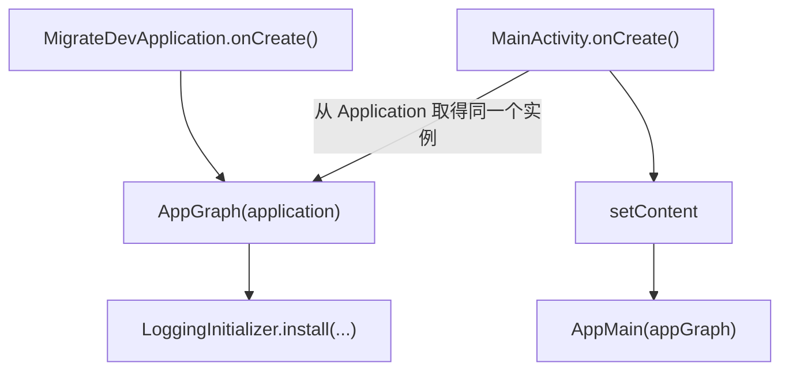

# 工作流 02 补充：UI 到 Translation 的当前实现梳理

> 文档状态：现状说明，不是改造方案。  
> 对应分支：`dev-2.1`。  
> 范围：`MigrateDevApplication → MainActivity → AppMain → Route → Translation`，以及为了说明依赖来源而涉及的 `AppGraph`。  
> 本文不决定最终文件树，不引入 Hilt，也不修改当前 Kotlin 代码。

## 1. 为什么先写这份文档

当前代码能够表达“登录后进入连接页、退出连接页后回到登录页”的流程，但阅读代码时需要同时理解：

1. `Application` 和 `AppGraph` 如何创建长生命周期对象；
2. Compose Navigation 的 graph、destination 和 BackStackEntry；
3. Translation 为什么有的跟随父 graph、有的跟随当前页面；
4. `ViewModelProvider.Factory` 在哪里创建、在哪里使用；
5. Route、Screen 和 AppMain 各自处理了哪些 UI 逻辑；
6. Auth 的本地 Session 为什么经过三层对象才到达 `LocalPort.entropy`。

这些逻辑目前没有被集中说明，而且部分责任写在了读者意想不到的位置。因此问题首先是“看不出代码的组织规则”，不等同于某一行代码一定写错。

本文只回答三个问题：

- 现在的代码是什么样；
- 运行时实际按什么顺序执行；
- 哪些地方造成了阅读困难，后续需要讨论什么。

## 2. 当前相关文件

以下是当前真实存在、与本次讨论直接相关的文件，不是规划后的文件树：

```text
migratedev/src/main/kotlin/com/biosensor/migratedev/
├── MigrateDevApplication.kt
├── MainActivity.kt
├── AppGraph.kt
├── ui/
│   ├── AppMain.kt
│   ├── auth/
│   │   ├── AuthRoute.kt
│   │   └── AuthScreen.kt
│   └── connection/
│       ├── BluetoothAccessGate.kt
│       ├── ConnectionRoute.kt
│       └── ConnectionScreen.kt
├── translation/
│   ├── Translation.kt
│   ├── auth/
│   │   └── AuthTranslation.kt
│   └── connection/
│       └── ConnectionTranslation.kt
└── port/
    ├── adapter/
    │   ├── localport/
    │   │   ├── LocalPort.kt
    │   │   ├── AndroidLocalPort.kt
    │   │   ├── SessionStore.kt
    │   │   ├── EntropySessionStore.kt
    │   │   └── PersistenceLocalPort.kt
    │   ├── remoteport/
    │   │   └── RetrofitRemotePort.kt
    │   └── bluetoothport/
    │       └── AndroidBluetoothPort.kt
    ├── auth/
    │   ├── AuthPort.kt
    │   └── DefaultAuthPort.kt
    └── connection/
        ├── ConnectionPort.kt
        └── DefaultConnectionPort.kt
```

## 3. 从 Application 到 AppMain

### 3.1 当前对象创建顺序



当前代码的实际含义如下：

```kotlin
class MigrateDevApplication : Application() {
    lateinit var appGraph: AppGraph
        private set

    override fun onCreate() {
        super.onCreate()
        appGraph = AppGraph(this)
        LoggingInitializer.install(
            debug = BuildConfig.DEBUG,
            files = appGraph.localPort.files,
            applicationScope = appGraph.applicationScope
        )
    }
}
```

- `AppGraph` 在 `Application.onCreate()` 中创建一次；
- `AppGraph` 的生命周期等同于当前应用进程；
- 日志初始化直接取得 `AppGraph` 中的 `LocalPort.files` 和协程作用域。

`MainActivity` 没有创建 Port 或 Translation，只取出已有的 `AppGraph`：

```kotlin
val appGraph = (application as MigrateDevApplication).appGraph
setContent {
    MaterialTheme {
        AppMain(appGraph)
    }
}
```

因此当前最外层依赖传递是：

```text
MigrateDevApplication 持有 AppGraph
        ↓
MainActivity 取得 AppGraph
        ↓
AppMain 使用 AppGraph 中暴露的 Translation Factory
```

### 3.2 当前 AppGraph 实际装配了什么

`AppGraph` 当前同时装配四类对象：

| 类别 | 当前对象 | 生命周期 |
|---|---|---|
| 基础运行资源 | `applicationScope`、`bluetoothScope`、`Clock` | 应用进程 |
| Adapter 能力 | `LocalPort`、`BluetoothPort`、Retrofit API | 应用进程 |
| 业务 Port | `AuthPort`、`ConnectionPort` | 应用进程 |
| UI 创建工具 | `authTranslationFactory`、`connectionTranslationFactory(userId)` | 由 AppGraph 提供，供 Compose 创建 ViewModel |

当前装配顺序是：

```text
AndroidLocalPort
    ├── entropy
    ├── sqlite
    └── files

localPort.entropy
    ↓
EntropySessionStore
    ↓
PersistenceLocalPort
    ↓
DefaultAuthPort ← RetrofitRemotePort.Auth
    ↓
AuthTranslation.factory(...)

localPort + AndroidBluetoothPort
    ↓
DefaultConnectionPort
    ↓
ConnectionTranslation.factory(...)
```

这说明当前 `AppGraph` 不只是一张“能力依赖图”，它还知道 Translation 是 Android `ViewModel`，并负责取得两个 `ViewModelProvider.Factory`。

这不是对错结论，只是当前边界事实。它也是阅读 `AppGraph` 时感觉内容突然变多的直接原因。

## 4. `PersistenceLocalPort(localPort.entropy)` 当前到底是什么

当前存在三个连续层次，它们并不是同一个接口的三份实现：

### 4.1 `LocalPort.entropy`：通用字符串加密能力

`LocalPort` 暴露：

```kotlin
interface LocalPort {
    val entropy: StringEntropy
    val sqlite: LocalDatabase
    val files: LocalFileClient
}
```

其中 `StringEntropy` 只认识：

```text
key + String value
```

它提供 `read/write/remove/contains`，不知道 `AuthSession`、token、用户或过期时间。

### 4.2 `EntropySessionStore`：把 AuthSession 组织成字符串

`EntropySessionStore` 当前做四件事：

1. 固定使用键 `auth.active_session`；
2. 使用 Gson 把 `AuthSession` 转成 JSON；
3. 调用 `StringEntropy` 加密存取这个 JSON；
4. 把底层读取结果翻译成 `Found/Missing/Corrupted`。

所以它是在通用字符串能力之上组织 Auth Session 数据。

### 4.3 `PersistenceLocalPort`：把 Auth 本地命令翻译成 Auth 结果

`PersistenceLocalPort` 接收的是：

```kotlin
AuthCommand.Local
```

返回的是：

```kotlin
Flow<AuthResult>
```

它负责：

- `ReadSession` 时调用 `SessionStore.read()`；
- 检查 `expiresAtMillis`；
- Session 损坏时执行清理；
- 把保存、读取、清理结果转换成 `AuthResult.Local`。

### 4.4 为什么现在看起来像“旧 LocalPort 没删”

从功能上说，`PersistenceLocalPort` 不是旧的 `LocalPort`：

```text
LocalPort.entropy       = 通用加密字符串能力
EntropySessionStore     = AuthSession 的序列化和键组织
PersistenceLocalPort    = Auth 本地 Command/Result 的执行与翻译
```

但是从命名和目录看：

- 三者都放在 `port/adapter/localport/`；
- `PersistenceLocalPort` 名字像另一个完整的 LocalPort；
- 它却直接 import `AuthCommand` 和 `AuthResult`；
- `AppGraph` 必须显式写出三层套接关系。

所以这里的主要问题不是“重复实现”，而是代码位置和命名没有把三个层次的差别直接表达出来。它最终应该移动、合并还是改名，需要在后续单独讨论；本文不先作决定。

## 5. 当前 Navigation 拓扑

### 5.1 Graph 与 destination

当前 `AppMain` 定义：

```text
NavHost
└── SESSION_GRAPH = "session"
    ├── AUTH_ROUTE = "auth"                  起始 destination
    └── CONNECTION_ROUTE = "connection/{userId}"
```

`SESSION_GRAPH` 不是一个可见页面。它是一层父 BackStackEntry，目前主要用于持有共享的 `AuthTranslation`。

### 5.2 当前对象归属

| 对象 | `ViewModelStoreOwner` | 何时创建 | 当前何时销毁 |
|---|---|---|---|
| `AuthTranslation` | `SESSION_GRAPH` 的 BackStackEntry | 第一次进入 Auth destination 时 | `SESSION_GRAPH` 被移出栈时 |
| `ConnectionTranslation` | Connection destination 的 BackStackEntry | 进入 `connection/{userId}` 时 | Connection destination 被移出栈时 |
| `AuthScreen` | Auth destination 的 Compose 内容 | Auth destination 显示时 | Auth destination 被弹出后 |
| `ConnectionScreen` | Connection destination 的 Compose 内容 | Connection destination 显示时 | Connection destination 被弹出后 |

这里必须区分“Auth 页面被回收”和“AuthTranslation 被回收”：

- 登录成功后，Auth destination 会从栈中移除，Auth 页面随之退出；
- 但 `AuthTranslation` 属于父 `SESSION_GRAPH`，因此仍然存活；
- Connection destination 会再次通过 `SESSION_GRAPH` 的 BackStackEntry 取得同一个 `AuthTranslation`。

这是当前代码有 `sessionEntry` 的原因。

## 6. Auth destination 当前做了什么

Auth destination 的代码现在写在 `AppMain` 内部，执行顺序是：

```text
进入 auth
  ↓
取得 SESSION_GRAPH 的 BackStackEntry
  ↓
使用 graph.authTranslationFactory 取得共享 AuthTranslation
  ↓
订阅 auth.uiState
  ├── 未认证：显示 AuthRoute
  └── Authenticated：导航到 connection/{userId}
                         并从栈中移除 auth
```

对应的关键代码是：

```kotlin
val sessionEntry = remember(entry) {
    navController.getBackStackEntry(SESSION_GRAPH)
}
val auth: AuthTranslation = viewModel(
    viewModelStoreOwner = sessionEntry,
    factory = graph.authTranslationFactory
)
val state by auth.uiState.collectAsStateWithLifecycle()
```

登录成功后的导航：

```kotlin
navController.navigate("connection/${Uri.encode(user.id)}") {
    popUpTo(AUTH_ROUTE) {
        inclusive = true
    }
    launchSingleTop = true
}
```

当前栈变化可以简化为：

```text
登录前：
session → auth

登录成功后：
session → connection/{userId}
```

`inclusive = true` 表示 `AUTH_ROUTE` 自身也被移除，因此不会按返回键回到已经完成的登录页面。

最后，`AppMain` 把已经收集好的 `state` 和 `AuthTranslation` 一起交给 `AuthRoute`：

```kotlin
AuthRoute(state, auth)
```

而 `AuthRoute` 只做 UI 回调到 Intent 的映射：

```text
onLogin        → SubmitLogin
onRegister     → SubmitRegister
onRetrySession → RetrySession
```

## 7. Connection destination 当前做了什么

Connection destination 的执行顺序是：

```text
进入 connection/{userId}
  ↓
从参数读取 userId
  ↓
取得 SESSION_GRAPH 中共享的 AuthTranslation
  ↓
以 userId 创建当前页面的 ConnectionTranslation
  ↓
进入 ConnectionRoute
```

它同时取得两个 Translation，但作用不同：

```kotlin
val auth: AuthTranslation = viewModel(
    viewModelStoreOwner = sessionEntry,
    factory = graph.authTranslationFactory
)

val connection: ConnectionTranslation = viewModel(
    key = "connection:$userId",
    factory = graph.connectionTranslationFactory(userId)
)
```

- `connection` 负责连接页自身的状态和操作；
- `auth` 只在退出登录的收尾回调中使用。

### 7.1 ConnectionRoute 内部责任

`ConnectionRoute` 当前自己完成：

1. 收集 `ConnectionTranslation.uiState`；
2. 根据状态显示 `BluetoothAccessGate`；
3. 把 Activity 的 `ON_START/ON_STOP` 转成 `BecameVisible/BecameHidden`；
4. 监听 `LogoutReady` 并调用上层 suspend 回调；
5. 把刷新、选择设备、退出登录映射成 `ConnectionIntent`；
6. 把整理后的状态和回调传给 `ConnectionScreen`。

因此它比 `AuthRoute` 承担的责任明显更多。

### 7.2 当前登出顺序

用户在 `ConnectionScreen` 点击退出后：

```text
ConnectionScreen.onLogout
  ↓
ConnectionIntent.Logout
  ↓
Connection 工作流停止扫描/断开连接
  ↓
ConnectionPhase.LogoutReady
  ↓
ConnectionRoute 调用 onLogoutReady()
  ↓
AppMain 向共享 AuthTranslation 提交 AuthIntent.Logout
  ↓
等待 AuthUiState.Idle
  ↓
导航回 AUTH_ROUTE
```

当前导航代码：

```kotlin
navController.navigate(AUTH_ROUTE) {
    popUpTo(SESSION_GRAPH) {
        inclusive = false
    }
    launchSingleTop = true
}
```

其含义是保留 `SESSION_GRAPH`，移除它上面的 Connection destination，再加入 Auth destination：

```text
登出前：
session → connection/{userId}

登出后：
session → auth
```

因为父 graph 被保留，原来的 `AuthTranslation` 也被保留，并从 `Authenticated` 经登出流程回到 `Idle`。

### 7.3 当前登出等待需要特别标记

`AuthDecisionCore` 收到 `AuthEvent.Logout` 时，当前 transition 会立即产生：

```text
newState = Idle
effect   = ClearSession
```

所以：

```kotlin
auth.uiState.first { it is AuthUiState.Idle }
```

确认的是状态已经进入 `Idle`，不一定等价于 `ClearSession` effect 已经执行完成。

这是对当前代码行为的说明，不在本文中决定如何修改。后续讨论登出与导航顺序时，必须把“状态已经 Idle”和“本地 Session 已清理完成”区分开。

## 8. Translation 当前如何创建和启动

### 8.1 AuthTranslation

`AuthTranslation` 是 `ViewModel`，构造函数私有：

```kotlin
class AuthTranslation private constructor(
    port: AuthPort
) : ViewModel()
```

它在自己的 companion object 中提供匿名 `ViewModelProvider.Factory`：

```kotlin
companion object {
    fun factory(port: AuthPort): ViewModelProvider.Factory = ...
}
```

`AppGraph` 立即创建并保存该 Factory：

```kotlin
val authTranslationFactory =
    AuthTranslation.factory(authPort)
```

第一次由 Compose `viewModel(...)` 取得 AuthTranslation 时，构造函数建立 Orchestrator，并在 `init` 中发送：

```text
AuthEvent.AuthCreated
```

因此 Session 恢复不是 `AppMain` 或 Activity 发送的生命周期事件，而是 AuthTranslation 第一次创建时自动开始。

### 8.2 ConnectionTranslation

`ConnectionTranslation` 同样在 companion object 中实现 Factory，但它还需要运行时参数 `userId`：

```kotlin
fun factory(
    userId: String,
    port: ConnectionPort,
    scanSessionIdFactory: () -> String = ...
): ViewModelProvider.Factory
```

所以 `AppGraph` 不能像 Auth 一样只保存一个固定 Factory，而是暴露：

```kotlin
fun connectionTranslationFactory(
    userId: String
): ViewModelProvider.Factory
```

Translation 创建后在 `init` 中发送：

```text
ConnectionEvent.ConnectionCreated(userId)
```

随后是否真正扫描，还要等待 UI 权限入口提交：

```text
ConnectionIntent.BluetoothAccessGranted
```

以及页面可见性入口提交：

```text
BecameVisible / BecameHidden
```

### 8.3 Factory 当前跨越的路径

Factory 相关代码目前分布在三处：

```text
AuthTranslation / ConnectionTranslation
    └── 定义匿名 ViewModelProvider.Factory 的具体写法

AppGraph
    └── 注入 Port，并把 Factory 暴露给 UI

AppMain
    └── 选择 ViewModelStoreOwner、key，并实际调用 viewModel(...)
```

单看任何一个文件都只能看到 Factory 生命周期的一部分。这正是当前“Factory 没有明确位置”的具体表现。

本文暂不决定 Factory 最终留在 Translation、AppGraph、Route 还是独立文件中。

## 9. 当前 UI 到 Translation 的输入输出关系

### 9.1 Auth

```text
AuthScreen
  └── 用户回调
       ↓
AuthRoute
  └── AuthIntent
       ↓
AuthTranslation
  ├── Intent → AuthEvent
  └── AuthState → AuthUiState
       ↓
AppMain 收集 AuthUiState
  ├── 控制 AuthScreen
  └── Authenticated 时执行导航
```

Auth 的状态收集和导航副作用位于 `AppMain`，Intent 映射位于 `AuthRoute`。

### 9.2 Connection

```text
ConnectionScreen / BluetoothAccessGate / Lifecycle
  └── UI 回调或生命周期变化
       ↓
ConnectionRoute
  └── ConnectionIntent
       ↓
ConnectionTranslation
  ├── Intent → ConnectionEvent
  └── ConnectionState → ConnectionUiState
       ↓
ConnectionRoute 收集 ConnectionUiState
  ├── 控制 ConnectionScreen
  └── LogoutReady 时通知 AppMain
```

Connection 的状态收集、权限入口、生命周期入口和页面级副作用都位于 `ConnectionRoute`。

### 9.3 两个 Route 当前写法不对称

| 责任 | Auth | Connection |
|---|---|---|
| 创建 Translation | `AppMain` | `AppMain` |
| 收集 UiState | `AppMain` | `ConnectionRoute` |
| 用户回调转 Intent | `AuthRoute` | `ConnectionRoute` |
| 页面生命周期转 Intent | 无单独处理 | `ConnectionRoute` |
| 根据业务状态触发导航 | `AppMain` | `ConnectionRoute` 通知 `AppMain` |
| 权限入口 | 无 | `ConnectionRoute` |

这种不对称不一定表示功能错误，但读者无法从 `AuthRoute` 推断 `ConnectionRoute` 的写法，也无法从后者反推前者的写法。随着页面增加，如果没有先定义 Route 的书写规则，每个页面很可能形成不同结构。

## 10. 为什么 AppMain 当前“不好看”

`AppMain` 目前在一个函数中同时承担：

1. 创建 `NavController`；
2. 声明根 NavHost 和 `SESSION_GRAPH`；
3. 声明路由字符串和参数；
4. 选择 AuthTranslation 的父 graph 作用域；
5. 创建 ConnectionTranslation；
6. 收集 AuthUiState；
7. 监听登录完成并导航；
8. 协调 Connection 登出与 Auth Session 清理；
9. 操作 Back Stack。

其中每一项单独看都有理由，但它们混在 destination DSL 的嵌套代码里后，主流程被实现细节打断：

```text
想看有哪些页面
  → 会遇到 sessionEntry 和 Factory

想看 Auth 页面
  → 会遇到 Authenticated 导航和 popUpTo

想看 Connection 页面
  → 会遇到共享 AuthTranslation 和登出等待

想看 Navigation 栈
  → 会遇到业务 Intent 和 UiState
```

所以“不清晰”的核心不是 Navigation 本身复杂，而是 Navigation 拓扑、对象作用域和业务收尾写在了同一个层级。

## 11. 当前实现中的隐含规则

阅读全部代码后才能总结出以下规则，但这些规则目前没有直接写在代码结构中：

1. `SESSION_GRAPH` 不代表页面，而代表一次可共享 AuthTranslation 的范围；
2. Auth 页面完成后弹出，但 AuthTranslation 继续存在；
3. ConnectionTranslation 跟随 Connection destination；
4. 页面创建事件由 Translation 的 `init` 自动发送；
5. Connection 的前后台事件由 Route 监听 Android Lifecycle 后发送；
6. `AppMain` 是当前唯一知道完整登录与登出导航顺序的地方；
7. AppGraph 既是依赖装配点，也是 Translation Factory 的提供者；
8. 通用 `LocalPort.entropy` 之上仍有两层 Auth Session 适配。

这些隐含规则正是下一步需要逐条显式化的内容。

## 12. 我的当前注释：先定位问题，不给改造结论

### 12.1 `SESSION_GRAPH` 的存在有实际作用，但代码没有先说明作用

它当前负责提供一个比 Auth destination 更长、比 Application 更短的 `ViewModelStoreOwner`。问题不在于嵌套 graph 一定多余，而在于读者只能从两段重复的 `getBackStackEntry(SESSION_GRAPH)` 反推它的目的。

### 12.2 页面生命周期和 Translation 生命周期没有写成明确规则

Auth 页面被移除时 AuthTranslation 不销毁；Connection 页面被移除时 ConnectionTranslation 销毁。这个差异是刻意行为还是当前登出实现带来的临时选择，需要后续确认。

### 12.3 Route 没有统一书写模板

当前 `AuthRoute` 接收外部已经收集好的状态，`ConnectionRoute` 自己收集状态。继续增加页面前，需要先讨论 Route 是否应该统一负责 Translation、UiState、Intent 和页面副作用中的哪些部分。

### 12.4 Factory 不是单点责任

Factory 的实现、依赖注入和作用域选择分散在 Translation、AppGraph、AppMain。后续要讨论的是“哪一部分属于 Factory 自身”，而不是先机械地把 Factory 移到某个新目录。

### 12.5 AppGraph 暴露了超出能力装配的信息

当前 `AppGraph` 对 UI 暴露 `ViewModelProvider.Factory`，同时又对日志初始化暴露 `localPort` 和 `applicationScope`。这使它既像 composition root，又像 UI service locator。需要先明确 AppGraph 的阅读目标，再决定哪些成员应当存在。

### 12.6 Auth 本地链路的逻辑层次存在，但目录没有表达出来

`StringEntropy → EntropySessionStore → PersistenceLocalPort` 三层各有实际逻辑，不能因为看起来复杂就直接删除其中一层；但它们全部位于 adapter/localport，使“通用能力”和“Auth 数据组织”混在同一目录。下一步应先确认每层是否独立，再谈移动、合并或改名。

### 12.7 登出导航现在等待的是 Idle，不是明确的清理完成

这一点同时影响 Navigation 和 Auth 状态机，不能只靠移动 UI 代码解决。后续梳理登出流程时，需要明确 Navigation 可以开始的业务条件到底是什么。

## 13. 建议的逐步讨论顺序

以下只是讨论顺序，不代表已经决定如何修改：

1. **先确认对象生命周期**  
   明确 AuthTranslation、ConnectionTranslation 分别应该跟随 Application、Activity、父 graph 还是 destination。

2. **再确认 Route 的固定职责**  
   以 AuthRoute 和 ConnectionRoute 为样本，决定今后每个 Route 的标准输入、状态收集、Intent 映射和页面副作用写法。

3. **再整理 Navigation 的书写位置**  
   在生命周期和 Route 职责明确后，才判断 route 常量、graph 声明和导航动作应该放在哪里。

4. **再确定 Factory 的归属**  
   根据 Translation 的 owner 和 Route 的职责决定 Factory 应该由谁创建、由谁使用，避免先移动文件后发现调用方向仍不清楚。

5. **最后单独处理 AppGraph 与本地 Session 链路**  
   它们与 UI 可读性有关，但不应夹在 Navigation 改写中一次完成。先画清依赖，再逐层判断保留、移动、合并或改名。

每一步只解决一个边界，并在修改前先把预期代码形态写进本文或新的实施小节。

## 14. 本文没有作出的决定

为了避免把“现状说明”误写成“既定方案”，本文没有决定：

- 是否保留 `SESSION_GRAPH`；
- 是否重命名或拆分 AuthTranslation；
- Route 是否负责创建 Translation；
- Factory 最终放在哪个文件；
- AppGraph 最终暴露 Port、Translation 还是 Factory；
- `PersistenceLocalPort`、`EntropySessionStore` 是否移动、合并或改名；
- 是否以及何时引入 Hilt；
- 登出完成事件最终如何表达。

这些问题将在确认当前理解一致后逐项讨论。
