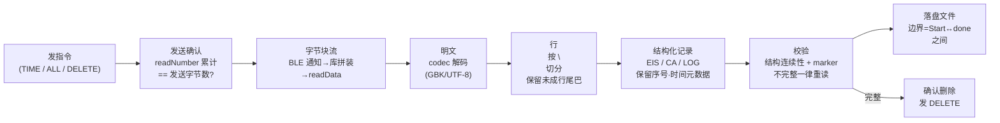

# 工作流 03：缓存明文流（发指令 → 收数据 → 校验 → 落盘）

> 状态:**对话确认稿,未施工**。已与需求方完成 SDK 实地探索与数据样例实测,本文沉淀探索结论与确认后的设计(含原工作流 04 的解析/校验内容,两章已融合)。词汇为全库统一的 Effect/Event 形态。
>
> | 日期 | 变更 |
> |---|---|
> | 2026-08-06 | 对话确认稿:SDK 探索结论(readNumber=发送确认、库内按换行拼装)+ 数据样例实测(轮结构/重复/续传/RI)+ 文件边界规则 + 内容去重 + 不完整一律重读(含代价分析),并入原 04 解析校验设计 |
> | 2026-08-06 | 修订:"续传中拼接"方案被否决(落盘后立即进算法),改为不完整一律重读 + 代价分析;EIS 字段含义/轮长 95/测量间隔列入待确认 |
> | 2026-08-06 | 修订:WaitingAck 泛化为对时/删除双确认(`AckReceived(purpose)`),明确对时可选、与读取无先后关系;CgmPort 契约补入架构 07 |

## 0. 概览

### 0.1 这部分做了什么

**把"设备缓存"完整搬到 app 本地文件**:向设备发三条指令(同步时间 / 读取缓存 / 删除缓存),接收设备回放的缓存数据,解析成结构化记录,校验完整性(优先用结构连续性,marker 兜底),**通过后确认删除设备缓存**(EEPROM 容量有限),数据落盘形成文件。

起点是三条指令,终点是数据落盘形成文件。文件生成后的推送/展示属于后续工作流 05~08。

### 0.2 基础思路

一次读取会话在一条链上走完,每个阶段只做一件事:



两个要点:

1. **会话必须串行**:设备返回的字节流没有任何"属于哪条命令"的标记,归属只能靠"发命令 → 其后到达的字节属于该命令"的时序分配。同一时刻只允许一个设备命令会话。
2. **校验靠结构,不靠字节长度**:设备回放的数据是"轮"结构(95 点/轮,序号严格 +1,时间索引严格 +10)——轮内任何跳号就是丢包。字节长度不一致(浮点位数的原因),不能用于校验;结构连续是比 marker 更强的信号。

### 0.3 痛点与演进

| # | 痛点(旧 app 现状) | 改进 | 状态 |
|---|---|---|---|
| 1 | 接收块直接 append 进文件,`RI:xxx` 等分包尾料混入,文件里还残留"上一次读取"的内容 | **文件边界 = 两个符号精确匹配**;`Start Playback` 到 `Playback all done` 之间才是文件内容,之外一律不落盘 [详见 3.1](#31-文件边界两个符号之间) | 对话确认 |
| 2 | 从 EEPROM 读出的内容直接添加会重复(旧 app 遗留),文件里有整轮重复数据 | **内容级去重**(行文本全等即重复,跳过不判错);根治 = 校验通过后发 DELETE 清空设备缓存 [详见 3.3](#33-去重与删除确认) | 对话确认 |
| 3 | 校验只认 start/end marker,marker 被切片切破或丢失时误判"完整" | **结构连续性校验**:轮内序号 +1、时间索引 +10、95 点/轮、CA 序号连续;marker 与结构互为冗余 [详见 3.2](#32-结构校验优先-marker-兜底) | 对话确认 |
| 4 | 一次读不准就整轮重读,等待时间显著拉长 | ~~三态免重传~~ → **被否决**:落盘后立即进算法,任何不完整都必须重读;重传代价经分析为分钟级,可接受(数据量 KB~百 KB 级) [详见 3.4](#34-不完整一律重读) | 对话确认 |
| 5 | 命令发出去没有送达确认,发完就当成功 | **发送确认**:readNumber 累计 == 发送字节数 ⟺ 命令完整送达(分包每包 ACK) [详见 3.5](#35-发送确认) | 探索确认 |
| 6 | 不知道设备回放数据的真实形态,校验规则凭猜 | **实测数据样例**(docs/数据样例 三份文件 15921 行),schema、轮结构、重复/续传/RI 现象全部落实 [详见 2.](#2-数据特征实测) | 探索确认 |

### 0.4 项目切面

```text
docs/数据样例/                           ← 实测样本(3 个 txt,旧 app 采集)
tools/analyze_*.mjs                     ← 样本分析脚本
migratedev/port/adapter/bluetoothport/   ← 蓝牙 Port:SendData/DataReceived/RequestMtu
migratedev/port/.../ConnectionPort*      ← 连接能力(会话的前提:已连接)
migratedev/decisioncore/                 ← 会话状态机(本章新增)
migratedev/orchestrator/                 ← 会话运行时:启动/绑定/清理
app/.../cgm/CgmCommands.java             ← 旧 app 指令表(施工参考)
app/.../cgm/CgmCacheSyncBuffer.java      ← 旧 app 接收拼装(施工参考)
bluetoothlibrary/.../BleBluetoothManage.java   ← 旧库接收拼装(块交付语义)
bluetoothlibrary/.../BluetoothLeService.java   ← 旧库分包发送/发送确认
```

相关文档:[Workflow/CONTENT.md](./CONTENT.md) 主链路 03→04(已并入)→05。

---

## 1. 基础思路详解

### 1.1 阶段语义链(每个阶段的输入/输出/语义)

| 阶段 | 输入 | 输出 | 语义 | 归属 |
|---|---|---|---|---|
| 指令编码 | 意图(读/删/对时) | 命令文本 | 三条指令的文本形态 | 本章(协议编码) |
| 发送确认 | 命令文本 | 确认信号 | 每包 ACK 累计 == 发送字节数 | 蓝牙 Port(readNumber) |
| 字节块流 | BLE 通知 | 字节块 | **一段字节,不是一条消息**——库按"缓冲满或 300ms 静默"交付,块边界任意 | 蓝牙 Port |
| 明文 | 字节块 | 文本 | codec 解码;块可能切在多字节字符中间,解码器必须保留尾巴 | 本章(生产) |
| 行 | 文本 | 行 | 按 `\n` 切分;未成行的尾巴保留到下一块 | 本章(生产) |
| 结构化记录 | 行 | 记录对象 | 解析 EIS/CA/LOG; **必须保留序号/时间索引元数据**——校验数据由生产侧定义,消费侧才能用 | 本章(生产) |
| 校验 | 记录流 | 结论:完整 / 不完整 | 结构连续性 + marker;**任何不完整 → 重读**(落盘后立即进算法,不能收不完整数据) | 本章(消费,原 04) |
| 落盘 | 完整记录 | 文件 | 边界 = Start↔done 之间 | 本章 |
| 确认删除 | 完整结论 | DELETE 发送 | 校验通过 → 通知设备清空 EEPROM | 本章 |

**融合说明**:原工作流 04(解析/校验/重试决策)的内容并入本章。原因是校验数据(序号/时间连续性)必须由生产侧定义,纯文本层的 marker 校验丢掉了设备端最强的完整性信号——两章必须一起设计。

### 1.2 三条指令(实测确认)

旧 app 指令表 [CgmCommands.java](../../../app/src/main/java/com/hc/mixthebluetooth/ui/cgm/CgmCommands.java),本次实测确认:

| 指令 | 文本 | 用途 |
|---|---|---|
| 同步时间 | `TIME,yyyy,MM,dd,HH,mm,ss\n\r` | 对时(短会话) |
| 读取缓存 | `ALL\n\r` | 触发设备回放缓存(长会话) |
| 删除缓存 | `DELETE\n\r` | 校验通过后清空设备缓存(短会话) |

### 1.3 会话模型(串行)

设备返回没有 session 标记 → 归属靠时序分配 → **同一设备同一时刻只允许一个命令会话**。

```text
启动:查"该设备是否已有活跃会话" → 有则拒绝(ReportBusy)
     无则创建运行时(session + 收集任务 + 解码器)
接收:收集到的字节块先查运行时,查得到才处理
停止:取消任务 → 关闭解码器 → 移除运行时 → 迟到结果被丢弃
```

| 会话类型 | 停止条件 |
|---|---|
| 同步时间 | 收到确认 / 超时 / 发送失败 / 断开 |
| 读取缓存 | 校验结论"完整"→ 落盘 → 发 DELETE;或"丢包"→ 重读;或超时/断开 |
| 删除缓存 | 收到删除确认 / 超时 / 发送失败 / 断开 |

### 1.4 蓝牙 Port 能力(接 SDK 的落点)

```kotlin
sealed interface BluetoothEffect {          // 上层命令蓝牙做什么
    data class Connect(...)
    data object Disconnect
    data class SendData(val data: ByteArray) : BluetoothEffect      // 发指令/发数据
    data class RequestMtu(val mtu: Int) : BluetoothEffect
}

sealed interface BluetoothEvent {           // 蓝牙主动告诉上层
    data class Connected(...)
    data class DataReceived(val data: ByteArray) : BluetoothEvent   // 收的能力在这里
    data class DataSent(val bytes: Int) : BluetoothEvent            // readNumber 累计
    data class MtuChanged(val mtu: Int) : BluetoothEvent
}
```

- **"收"为什么不是 effect**:连接建立时写 CCCD 使能通知,设备此后**主动推送**——接收是推不是拉,没有"开始接收"这个动作可命令,所以只有事件没有命令。当前 [HcBluetoothLibraryClient.kt](../../../migratedev/src/main/kotlin/com/biosensor/migratedev/port/adapter/bluetoothport/HcBluetoothLibraryClient.kt) 把 `readData` 实现成了 `= Unit`(数据被丢弃),接入时把它的转发接回通道就是"收"能力的落点。
- **库内已做拼装**:旧库按"缓冲满(1000 字节/实际最大包长)或 300ms 静默"把通知包合并成块交付;默认开启换行保护(交付前尽量把块切在 `\n` 上,半行尾巴放到下一块头部)。**但静默交付路径不切换行**——半行是常态,上层必须自己做行组装。
- **分包与节流在库内**:sendMultiple 按 MTU 切包、信号量逐包发送,上层只需给整块数据。
- **发送失败不上抛**:库对写失败的重试策略是"等 500ms → 发空包提醒 → 强制跳过",不通知上层。完整性只能靠校验兜底。

### 1.5 MVVM 骨架(状态机全貌)

#### 谁管什么

| 层 | 管什么 | 不管什么 |
|---|---|---|
| **UI 门**（`CgmCommandScreen`） | 读缓存 / 对时 / 删缓存按钮、进度显示、错误提示 | 会话、解析、校验 |
| **翻译层**（`CgmTranslation`） | Intent/State 翻译、两个编排器互斥与**隐式切换**（点新命令先停旧/复位再开始）、向编排器提交命令意图、展示 UiState | 业务决策、IO |
| **编排器**（`WorkflowOrchestrator` × 2） | 驱动 effect flow(命令流内嵌解析管道)、执行 effect | 阶段判断（在状态机里） |
| **状态机**（`CgmReadDecision` / `CgmShortDecision`） | 读流程与短命令各一个:阶段推进、记录累积、结构校验、结论 | 不做 IO（解码/落盘/蓝牙都在 effect） |
| **业务端口**（`CgmPort`） | 组合蓝牙 + 本地文件:协议编码、解析管道、文件落盘 | 会话、阶段判断 |

#### State（进行到哪一步）

**读状态机 `CgmReadDecision`**（发 ALL → 收数据 → 校验 → 落盘 → 删缓存）:

| State | 含义 |
|---|---|
| `Idle` | 无会话 |
| `Sending(session)` | 读命令已发出，等发送确认 |
| `Receiving(session, accumulated, retryCount)` | 读取缓存中：记录累积（原样追加）+ END 触发校验 |
| `Completed(session, filePath, deleteAcked)` | 校验通过:落盘 + 删除确认**双闸门**都到 → `Stopped` |
| `Failed(session, accumulated, reason, retryCount)` | 校验不完整 / 超时 / 断开 → 已触发重读（累积保留） |
| `Error(message)` | 不可恢复错误（落盘失败） |
| `Stopped(session)` | 会话结束（双闸门完成 / 用户停止 / 重试耗尽） |

**短命令状态机 `CgmShortDecision`**（对时 / 删除）:

| State | 含义 |
|---|---|
| `Idle` | 无会话 |
| `Sending(session, purpose)` | 短命令已发出，等发送确认 |
| `WaitingAck(session, purpose)` | 已发，等设备确认（`AckReceived(purpose)` 匹配） |
| `Done(session, purpose)` | **终态**：对时成功 / 删除成功，无"停止"语义 |
| `Failed(session, reason)` | 超时 / 断开 |

#### Event / Effect

**读状态机**:

| 事件（已发生的事实） | 动作（要求执行的副作用） |
|---|---|
| `ReadRequested(sessionId, deviceId)`（UI 触发） | `StartRead(session)` |
| `CommandAccepted`（发送确认） | 无（进入接收阶段） |
| `RecordsProduced(records)`（解析管线输出） | 累积；END 到达 → 校验 → `WriteFile`（完整）/ `RetryRead`（不完整）/ `StopRuntime`（耗尽） |
| `FileWritten / FileWriteFailed`（落盘结果） | 双闸门：都到 → `StopRuntime(COMPLETED)` / `Error` |
| `AckReceived(DELETE)`（读流程自动删确认） | 双闸门：都到 → `StopRuntime(COMPLETED)` |
| `CommandTimeout` / `DeviceDisconnected` | `RetryRead` 或 `StopRuntime(reason)` |
| `StopCurrent` / `ResetError` | `StopRuntime(USER_CANCEL)` / 无 |

**短命令状态机**:

| 事件（已发生的事实） | 动作（要求执行的副作用） |
|---|---|
| `ShortRequested(sessionId, deviceId, purpose)`（UI 触发） | `SendCommand(session, purpose)` |
| `CommandAccepted`（发送确认） | 无（进入等待确认） |
| `AckReceived(purpose)`（设备确认，purpose 匹配） | 无（→ `Done` 终态） |
| `CommandTimeout` / `DeviceDisconnected` | 无（→ `Failed`，不重试） |

#### 完整转移表

**读状态机**:

| 当前 State | Event | 下一个 State | Effect |
|---|---|---|---|
| `Idle` / `Completed` / `Failed` / `Stopped` / `Error` | `ReadRequested` | `Sending`(新 session) | `StartRead` |
| 活跃（Sending/Receiving/…） | `ReadRequested` | 原状态不变 | 无（串行忽略，UI 主防） |
| `Sending` | `CommandAccepted` | `Receiving([], 0)` | 无 |
| `Failed` | `CommandAccepted`（重读确认） | `Receiving(accumulated, retry)` | 无（累积保留） |
| `Receiving` | `RecordsProduced`（无 END） | `Receiving(累积)` | 无 |
| `Receiving` | `RecordsProduced`（有 END）+ 校验完整 | `Completed(null, false)` | `WriteFile` + `SendDelete` |
| `Receiving` | `RecordsProduced`（有 END）+ 校验不完整 | `Failed(accumulated, retry+1)` | `RetryRead` / 耗尽 → `StopRuntime` |
| `Receiving` | `CommandTimeout` | `Failed(accumulated, retry+1)` | `RetryRead` / 耗尽 → `StopRuntime` |
| `Sending` | `CommandTimeout` | `Failed` | `StopRuntime(TIMEOUT)` |
| `任意` | `DeviceDisconnected` | `Failed` | `StopRuntime(DISCONNECTED)` |
| `Completed` | `FileWritten` | 双闸门：都到 → `Stopped` | `StopRuntime(COMPLETED)` |
| `Completed` | `AckReceived(DELETE)` | 双闸门：都到 → `Stopped` | `StopRuntime(COMPLETED)` |
| `任意` | `FileWriteFailed` | `Error` | 无 |
| `任意` | `StopCurrent` | `Stopped` | `StopRuntime(USER_CANCEL)` |
| `Error` | `ResetError` | `Idle` | 无 |

**短命令状态机**:

| 当前 State | Event | 下一个 State | Effect |
|---|---|---|---|
| `Idle` / `Done` / `Failed` | `ShortRequested(purpose)` | `Sending(purpose)` | `SendCommand` |
| 活跃（Sending/WaitingAck） | `ShortRequested` | 原状态不变 | 无（串行忽略，UI 主防） |
| `Sending` | `CommandAccepted` | `WaitingAck` | 无 |
| `WaitingAck` | `AckReceived(purpose)`（匹配） | `Done(purpose)` | 无 |
| `Sending` / `WaitingAck` | `CommandTimeout` | `Failed` | 无（不重试，用户再点） |
| `Sending` / `WaitingAck` | `DeviceDisconnected` | `Failed` | 无 |

**两个状态机为什么分开**（评审结论）：对时/删除是"发一条 → 等确认 → 出结果"的短生命周期，`Done` 就是终态，没有"停止/重读/双闸门"这些读流程词汇；读流程的删除确认只是落盘完成前的闸门，语义不同。写在一起必然产生"对时 ack 直接停止"之类的怪转移，拆开后各自只有自己的词汇，互不干扰。

**时分复用不失序靠三层防护**（时分复用是好事，用不好就是麻烦）：① **UI 层**按钮常亮可点（不做视觉禁用——禁用无法给反馈）；② **翻译层** `submit` 是唯一入口——**互转冲突（任一侧活跃）拒绝执行 + toast 提示"正在读取缓存中 / 正在执行命令中，请等待执行完毕"**（读是分钟级昂贵操作，静默打断丢失上下文；`Blocked` 走 report → Root 提示）；Error 态下点命令自动 `ResetError` 复位后开始（复位无感，用户透明）；③ **状态机层**活跃状态对不合法事件幂等忽略（兜底）。蓝牙层保留**通道消费权转移**为防御机制：新命令 flow 启动时夺走事件通道收集权，旧 flow 收不到事件自然失效——即使未来放行切换也不会双命令并发。设计详见架构 07 §1.7、§3.3。

**停止/复位不暴露给用户**：UI 没有"停止"按钮、没有"重置错误"入口——状态切换这件事对用户透明，但昂贵读取期间的互转给出 toast 等待提示。失败信息不占屏，至多 toast（走 CgmOutput.Failed → Root 提示）。

**解析管线不在状态机里**——解码/切行/记录解析是 CgmPortAdapter 持有、随命令 flow 生灭的有状态过程，状态机只收它的产出（`RecordsProduced`）。设计详见架构 07。

**对时不是读取的前置**——同步时间只为校准，用户直接点读取也可以；三条指令各自独立成会话，读流程与短命令都从 `Idle` 出发，没有"必须先对时才允许读"的门。

---

## 2. 数据特征实测(写设计的依据)

> 样本:docs/数据样例 三份文件(2026-07-15/07-20/07-21,共 15921 行),旧 app 采集。分析脚本在 tools/。

### 2.1 行 schema

| 行类型 | 形态 | 说明 |
|---|---|---|
| 会话起点 | `Start Playback` | marker,每会话开头一次 |
| 日志头 | `LOG:1,1,95,<yyyy-MM-dd HH:mm:ss>` | 数据缓存起始时间 |
| 惯性数据 | `EIS:<点号>,<时间索引>,<ax>,<ay>,<az>,<温度>` | 高精度加速度数据,结构化定长 |
| 校准数据 | `CA:<点号>,<数值>` | 校准值,点号从 1 连续递增 |
| 汇总 | `summarize:<时间> <值1> <值2>` | 会话内可多条 |
| 会话终点 | `Playback all done` | marker,每会话结尾一次 |
| 耗时 | `RI:<时长>` | **done 之后才到达的分包尾料,不落盘** |

### 2.2 轮结构(校验的核心信号)

- 一次回放中,数据按"轮"组织:**完整轮恒为 95 个点**(实测 8/8、27/27、8/8 轮全部 95 点,零例外)
- 轮内序号严格 `1..95`(每点 +1),时间索引严格 `60..1000`(每点 +10,即 10ms 采样间隔)
- 完整轮字节数 4838~4987(近定长,**非严格**——浮点数字位数不定,所以不能用字节长度做校验)
- 轮与轮之间内容独立:0720/0721 实测相邻轮 95 个点中 94~95 个点的值不同——**轮长固定,内容滚动**(缓存窗口在前进,不是重放同一份)

> ⚠️ 待确认(需求方正在核实):① EIS 字段含义可能是阻抗而非加速度;② 轮长 95 是否恒定;③ 测量间隔(印象半小时 1 点,实测数据似 4~5 分钟 1 点)。

**校验规则**:轮内序号 +1(95→1 是轮边界除外)、时间索引 +10(1000→60 是轮边界除外)、每轮 95 点、CA 序号连续 → **任何跳号 = 丢包,精确到点**。

### 2.3 实测现象(决定边界与去重规则)

| 现象 | 证据 | 对设计的含义 |
|---|---|---|
| 不完整轮 | 轮只含 1~3、1~46 点 | 读取中断(可能因超时/断连) → **任何不完整 → 重读**(数据要立即进算法,不能拼接) |
| done 之后还有数据 | done 后夹着 EIS 行、`RI:0min42s` 等 | done 不是"数据流结束",只是"本会话结束" → 文件边界必须精确匹配 marker,尾料不落盘 |
| 整轮重复 | 0715 轮0 与轮1 95/95 点完全相同(同一窗口发两遍) | 必须内容去重;根治 = 读后删除设备缓存 |
| 头部残留 | 少数文件 Start 前有 1 行 EIS(上一会话尾巴) | Start 之前的内容不属于本会话,不落盘 |
| marker 成对 | 每会话 Start/done 各一次,位置固定 | 边界可精确切分 |

### 2.4 文件边界规则(确认)

```text
落盘文件内容 = "Start Playback" 出现后 到 "Playback all done" 出现前 之间的全部行

排除:
  之前残留(Start 之前)
  之后尾料(done 之后:游离 EIS、RI、其他)
判定必须"符号精确匹配",不做"包含字样就切"的模糊判定(旧 app 的漏风点)
```

done 之后的游离数据是**异常信号**:说明上一会话没收完 → 标记"续传中"或重读,而不是把它当本会话内容收下。

---

## 3. 改进点详解

### 3.1 文件边界:两个符号之间

旧 app 把接收块直接 append 进文件,`RI:xxx` 等分包尾料混入,文件里还有上一次读取的残留。新实现:

- 落盘内容严格 = `Start Playback` ↔ `Playback all done` 之间
- 边界判定:整行精确匹配 marker 文本
- 边界之外的内容:不写入文件;若发现游离数据,标记会话异常

### 3.2 结构校验优先,marker 兜底

**结构信号**(轮内序号 +1 / 时间索引 +10 / 95 点 / CA 连续)比 marker 强:即使 done 丢了,看到"序号 95 + 时间 1000 的完整轮"也能判轮完成。

| 信号 | 检出什么 | 备注 |
|---|---|---|
| 轮内跳号 | 丢包(精确到点) | 唯一触发重读的条件 |
| marker 缺失 | 会话边界异常 | 可用结构补判轮完成,两者互为冗余 |
| 不完整轮 | 断点续传 | 正常状态,标"续传中" |
| 重复点 | 设备重发 | 去重跳过,不判错 |

### 3.3 去重与删除确认

- **判据:行内容全等**。不能用"序号+时间索引"判重——它们每轮循环复用(1..95 / 60..1000),静止时相邻窗口内容可能相同;内容全等(含温度字段)才判重,误删概率极低
- **时机:消费侧**(解析出结构化记录之后)。字节层去重不精确(块边界任意),结构化后每行是一个完整记录,哈希即判重
- **范围**:会话内 + 跨会话统一去重(设备未删前重读会整轮重复)
- **根治:校验通过 → 发 DELETE** → 设备清空 EEPROM → 跨会话重复的源头消失。去重是兜底,DELETE 是根治

### 3.4 不完整一律重读(含代价分析)

**决策**:落盘后数据立即送后端算法计算,不能传不完整数据 → **任何不完整(不完整轮、跳号、marker 缺失)都重读**。原"续传中 → 下一会话拼接"方案在对话中被否决。

**传输量趋势分析**(确认删除对传输压力的影响,依据:数据样例实测 + 需求方前提):

基准:实测速率 620~745 B/s(取 ~650 B/s);实测每"轮"(1 次测量 ≈ EIS 95 行 + CA ~268 行 + 杂项)≈ 8.5 KB(0715 段2 8.8K/轮、段5 8.4K/轮、0720 段3 8.5K/轮,三份样本一致);按 8.5KB / 650Bps ≈ 13 秒/点。参数:半小时 1 点 × 8h 佩戴 = 16 点/天,上下午观测 2 次。

**有确认删除**(每次只传两次观测之间的新增):

| 观测 | 新增数据 | 传输量 | 耗时 |
|---|---|---|---|
| 上午第 1 次(佩戴约 1h 后) | ~2 点 | ~17 KB | ~27 s |
| 下午第 2 次(距上次约 6h) | ~12 点 | ~102 KB | ~2.6 min |
| 之后的每一天 | 恒定 2~14 点 | 17~102 KB | 27s~2.6min,不再增长 |

**无确认删除**(设备端累积,每次全量传):

| 观测 | 累积数据 | 传输量 | 耗时 |
|---|---|---|---|
| 第 1 次 | 2 点 | 17 KB | 27 s |
| 第 2 次 | 14 点 | 119 KB | 3 min |
| 第 4 次(第 2 天) | 30 点 | 255 KB | 6.6 min |
| 第 6 次(第 3 天) | 46 点 | 391 KB | 10 min |
| 第 10 次(第 5 天) | 78 点 | 663 KB | 17 min |

**结论**:
1. 确认删除使每次传输**恒定在分钟级**(27s~2.6min);不删除则线性增长(第 5 天 17 分钟),且按 136 KB/天(16 点 × 8.5KB)的写入速度,EEPROM 物理上装不下几天——**删除是唯一选项,不是优化选项**
2. "观测越多每次传输越小" ✓(只传增量);"测量间隙越短数据量越多" ✓(间隙缩到 4~5 分钟则点数为 4~5 倍,每点仍 ~13s)
3. **重传代价上限由删除机制锁定**:校验失败重读 = 重读当次增量(最多 ~2.6min),不重读历史
4. 逻辑闭合:确认删除发生在校验通过之后 → 重读时设备缓存还在,拿到的是同一份数据;不完整数据进算法的代价(结果错误 + 后端白算)远大于分钟级等待

### 3.5 发送确认

SDK 源码追踪:`onCharacteristicWrite(成功)` → 上报刚写出的包长度 → `IBluetooth.readNumber(number)`。

- **readNumber = 发送确认信号**(每次分包被设备 ACK 时上报包字节数),SDK 注释"蓝牙收到的字节数"是误导
- **校验用法**:`ΣreadNumber == 发送总字节数` ⟺ 命令完整送达(长指令被分包时逐包确认)
- 局限:只覆盖发送方向,不覆盖回放数据完整性(那是结构校验的事)

---

## 4. 边界与 TODO

### 4.1 边界

- 本章终点:数据落盘形成文件 + 校验通过后确认删除。文件生成(05)、推送(06)、拉取(07)、展示(08)不在本章
- 不做设备端协议改动(无协议栈约束:不能加序号回传、CRC 校验和——设备端是只读的,marker + 结构校验已是上限)
- 单设备串行会话;多设备由连接层隔离(每设备一个连接)

### 4.2 TODO(施工前需确认)

- [ ] **EIS 字段含义**(需求方正在核实,可能是阻抗而非加速度)——只影响字段命名与语义,不影响行结构/校验设计
- [ ] **轮长 95 是否恒定**(需更多样本确认)
- [ ] **测量间隔**(印象半小时 1 点,数据似 4~5 分钟 1 点)——影响数据量估算
- [ ] 静默超时路径(300ms)交付半行块的实际频率——决定行组装尾巴的测试覆盖
- [ ] DELETE 指令的确认文本形态(`isDeleteAck` 匹配什么)——需实测
- [ ] 去重实现位置与缓存规模(一次性文件内去重 vs 增量去重)

---

## 变更记录

| 日期 | 变更 |
|---|---|
| 2026-08-06 | 对话确认稿:重写为四段式,并入原 04 解析校验,新增数据特征实测章节、文件边界规则、内容去重、三态校验、发送确认 |
| 2026-08-06 | 修订:WaitingAck 泛化为对时/删除双确认(`AckReceived(purpose)`),明确对时可选、与读取无先后关系(对应架构 07 同步修订) |
| 2026-08-07 | 修订:状态机拆分为读状态机(`CgmReadDecision`)与短命令状态机(`CgmShortDecision`),对时/删除终态为 `Done`(不再有"对时 StopRuntime"怪语义);解析管线归属改为 CgmPortAdapter 持有、随命令 flow 生灭(对应架构 07 评审修订) |
| 2026-08-07 | 修订:时分复用三层防护(UI 双向互斥 → Translation 隐式切换 → 状态机幂等)+ 蓝牙层通道消费权转移;Stop/ResetError 不向 UI 暴露,停止/复位为内部隐式机制,错误至多 toast(对应架构 07 二轮评审修订) |
| 2026-08-07 | 修订:互转策略改为**拒绝 + toast**——冲突不隐式切换,报 `Blocked` 提示"正在读取缓存中,请等待执行完毕";读是昂贵操作,按钮常亮可点(对应架构 07 互转策略修订) |
