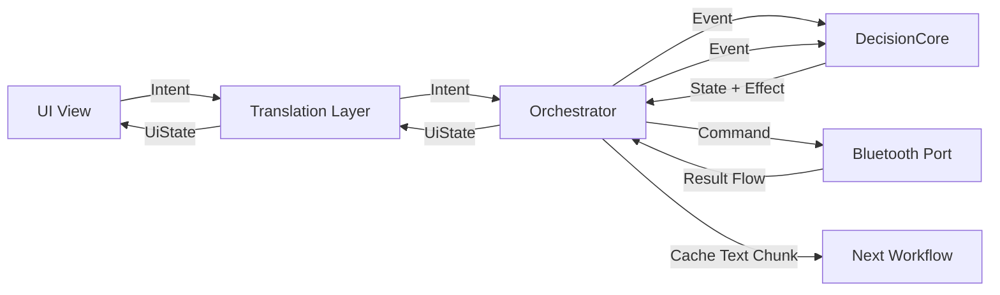

# 工作流 03：缓存明文流（设备命令会话与明文产出）

> 状态:**规划稿,未施工**。本文是第三章数据链路(05 生成文件 / 06 推送 / 07 拉取的前置)的设计草案,进入施工前会按需求 → 对话 → 架构 → 施工 → 沉淀流程重写。
> 词汇说明:本文沿用起草时的 Command/Result 名词。开工时统一为 Effect(下行)/ Event(上行)词汇(全库统一形态,见[说明-词汇表](../说明/词汇表.md)),与 `BluetoothPort` TODO 中预留的 `SendData / ObserveReceivedData` 等形态一致。

本章解决的不是“怎么处理一个 chunk”，而是“怎么把一次设备命令收发变成一个可管理的会话”。

旧 app 里，同步时间、读取缓存、删除缓存都走同一个蓝牙写入入口，也都从同一个蓝牙读取回调收到设备返回。设备协议本身不会给返回 bytes 标注“属于哪一次命令”。所以本章必须先讲清楚整体拓扑和会话归属，再讲读缓存分支里的 bytes 解码。

本章只负责设备命令流和会话绑定：

```text
设备命令
-> Port.execute(command)
-> Flow<CgmDeviceResult>
-> Orchestrator 绑定当前 CgmRuntime
-> DecisionCore 看见 session 级 Event
```

本章不做缓存内容校验、文件生成、上传、轮询结果展示。这些属于后续工作流。读取缓存分支只在本章完成 `bytes -> text chunk`，并把明文交给工作流 04。

## 2. 总体拓扑

这里是一个回环，不是一条单向通路。`Orchestrator` 是运行时拥有者。它接收 UI intent，把 intent 转成状态机事件，执行状态机给出的 effect，再把 Port 返回的 result 转回 event。



对应到本章，最关键的职责划分是：

| 组件 | 本章职责 |
|---|---|
| `UI` | 发起同步时间、读取缓存、删除缓存等用户意图 |
| `Translation` | 适配 UI 输入输出，不持有业务会话 |
| `Orchestrator` | 创建和清理 `CgmRuntime`，执行 `Port.execute()`，收集 flow，绑定会话 |
| `DecisionCore` | 只看 session 级事件，计算状态和 effect |
| `Port` | 隔离蓝牙 SDK，执行设备命令，输出设备级 result flow |
| `Workflow 04+` | 消费读缓存产生的明文 chunk，继续解析、校验、重试、上传 |

## 3. 旧 app 事实

旧 app 的 CGM profile 注册了三个设备动作：

```text
sync_time     -> TIME,yyyy,MM,dd,HH,mm,ss\n\r
read_cache    -> ALL\n\r
delete_cache  -> DELETE\n\r
```

它们有共同的发送入口：

```text
CgmController.postAction()
-> gateway.postText(module, payload)
-> AndroidBluetoothController.sendData(deviceModule, bytes)
```

它们也有共同的接收入口：

```text
AndroidBluetoothController.OnReadDataListener.readData(mac, bytes)
-> CgmActivity / CgmController
-> Codec.decode(bytes)
-> CgmRawLineConsumer.onLine(rawText)
-> DefaultCgmWorkflow.onDeviceText(text)
```

旧 app 的会话不是显式对象，而是藏在 `DefaultCgmWorkflow + CgmCacheSyncBuffer` 里：

```text
onReadCacheSent()
-> buffer.beginRead()

onDeviceText(text)
-> accept delete ack if waiting delete confirm
-> otherwise accept cache text chunk
-> saw end marker 后 validate
-> valid 后 write file + upload
-> upload success 后自动发送 delete cache

onDeleteCacheSent()
-> buffer.markDeleteSent()
```

这说明三件事：

1. 同步时间、读缓存、删缓存不能设计成三条互不相干的通道。
2. 设备返回没有天然 session tag，归属必须由上层运行时管理。
3. 删除确认必须和“已经发送删除命令”绑定，不能看见 `Log Cleared` 就直接确认。

## 4. 会话到底是什么

本章必须开门见山：

```text
CgmSession 只是业务含义的声明。
真正让会话成立的是 CgmRuntime。
CgmRuntime 把 CgmSession、Flow collecting job、session-local decoder、cleanup 责任绑在一起。
CgmRuntimeStore 用 byDevice 和 bySession 两张表管理这些 runtime。
```

`CgmSession` 只说明“这一次会话是谁、要做什么、从什么时候开始”。它不能阻止重复启动，不能停止 Flow，也不能清理解码器。

```kotlin
enum class CgmCommandPurpose {
    SYNC_TIME,
    READ_CACHE,
    READ_CACHE_RETRY,
    DELETE_CACHE
}

data class CgmSession(
    val sessionId: String,
    val deviceId: String,
    val purpose: CgmCommandPurpose,
    val startedAtMillis: Long,
    val attempt: Int = 1,
    val byteCount: Int = 0,
    val textLength: Int = 0,
    val chunkIndex: Int = 0
)
```

真正的运行时会话是 `CgmRuntime`：

```kotlin
class CgmRuntime(
    var session: CgmSession,
    val decoder: SessionTextDecoder?,
    val job: Job
)
```

`decoder` 只在读缓存时需要。同步时间和删除缓存是短命令，可以使用无状态解码或只匹配确认文本。

`CgmRuntimeStore` 维护两张表：

```kotlin
class CgmRuntimeStore {
    private val byDevice = mutableMapOf<String, CgmRuntime>()
    private val bySession = mutableMapOf<String, CgmRuntime>()

    fun hasActiveDevice(deviceId: String): Boolean {
        return byDevice.containsKey(deviceId)
    }

    fun put(runtime: CgmRuntime) {
        byDevice[runtime.session.deviceId] = runtime
        bySession[runtime.session.sessionId] = runtime
    }

    fun findBySession(sessionId: String): CgmRuntime? {
        return bySession[sessionId]
    }

    fun remove(runtime: CgmRuntime) {
        byDevice.remove(runtime.session.deviceId)
        bySession.remove(runtime.session.sessionId)
    }
}
```

两张表的含义：

| 表 | 作用 |
|---|---|
| `byDevice` | 防止同一设备同时启动两个设备命令会话 |
| `bySession` | 让 Orchestrator 能按本地 session 找到 runtime，并在停止后丢弃迟到结果 |

时间戳不是会话边界。`startedAtMillis` 只用于日志、超时和排查问题。真正的边界是：

```text
deviceId 禁并发
+ sessionId 查 runtime
+ job 控制 Flow 生命周期
+ cleanup 关闭 decoder 并移除 runtime
```

## 5. Command / Result / Port

前两章统一使用 `execute`，本章继续沿用这个边界。

### 5.1 Command

`Command` 表达“要给哪个设备发什么命令”。它不携带 `sessionId`，因为 session 是 Orchestrator 的运行时概念，不是设备协议的一部分。

```kotlin
data class CgmDeviceCommand(
    val deviceId: String,
    val purpose: CgmCommandPurpose,
    val text: String
)
```

命令文本来自协议编码：

```kotlin
interface CgmDeviceProtocol {
    fun syncTimeCommand(deviceId: String, now: Date): CgmDeviceCommand
    fun readCacheCommand(deviceId: String): CgmDeviceCommand
    fun readCacheRetryCommand(deviceId: String): CgmDeviceCommand
    fun deleteCacheCommand(deviceId: String): CgmDeviceCommand

    fun isDeleteAck(text: String): Boolean
    fun isTimeSyncAck(text: String): Boolean
}
```

### 5.2 Result

`Result` 表达设备命令执行过程中产生的结果。它是设备级 result，不是业务 session event。

```kotlin
sealed class CgmDeviceResult {
    object CommandAccepted : CgmDeviceResult()

    data class BytesReceived(
        val deviceId: String,
        val bytes: ByteArray,
        val receivedAtMillis: Long
    ) : CgmDeviceResult()

    data class SendFailed(val message: String) : CgmDeviceResult()
    object Timeout : CgmDeviceResult()
    object Disconnected : CgmDeviceResult()
}
```

`BytesReceived` 不携带 `sessionId`。这是故意的。设备返回的 bytes 本来就没有 session tag，不能在 Port 层假装知道它属于哪个业务会话。

### 5.3 Port

Port 只隔离蓝牙 SDK：

```kotlin
interface CgmBluetoothPort {
    fun execute(command: CgmDeviceCommand): Flow<CgmDeviceResult>
}
```

Port 内部可以把发送和接收包装到一个 Flow 里：

```kotlin
class AndroidCgmBluetoothPort(
    private val bluetooth: AndroidBluetoothController,
    private val deviceRegistry: DeviceRegistry,
    private val inboundBus: BluetoothInboundBus,
    private val clock: Clock
) : CgmBluetoothPort {

    override fun execute(command: CgmDeviceCommand): Flow<CgmDeviceResult> = channelFlow {
        val module = deviceRegistry.requireModule(command.deviceId)

        try {
            bluetooth.sendData(module, command.text.toByteArray(Charsets.UTF_8))
            send(CgmDeviceResult.CommandAccepted)
        } catch (e: Exception) {
            send(CgmDeviceResult.SendFailed(e.message ?: "send failed"))
            close(e)
            return@channelFlow
        }

        val readJob = launch {
            inboundBus.incoming(command.deviceId).collect { inbound ->
                when (inbound) {
                    is BluetoothInbound.Bytes -> send(
                        CgmDeviceResult.BytesReceived(
                            deviceId = command.deviceId,
                            bytes = inbound.bytes,
                            receivedAtMillis = clock.nowMillis()
                        )
                    )
                    is BluetoothInbound.Disconnected -> {
                        send(CgmDeviceResult.Disconnected)
                        close()
                    }
                }
            }
        }

        awaitClose {
            readJob.cancel()
        }
    }
}
```

这段代码表达的是接口形态，不要求最终实现逐字照抄。必须保留的约束是：

- `execute(command)` 是统一 Port 边界。
- Port 可以输出 `Flow<CgmDeviceResult>`。
- Port 不判断业务 session。
- Port 只按设备过滤 incoming bytes。

## 6. Orchestrator 怎么把 Flow 绑定成会话

Orchestrator 启动会话时，先查 `byDevice`。如果同一设备已有活跃 runtime，就拒绝新的命令会话。这不是 UI 优化，而是归属策略。因为设备返回没有 session tag，同一设备并发两个命令会让 bytes 无法可靠归属。

```kotlin
private fun startDeviceCommand(command: CgmDeviceCommand) {
    if (runtimeStore.hasActiveDevice(command.deviceId)) {
        dispatch(CgmEvent.StartRejectedBusy(command.deviceId))
        return
    }

    val session = CgmSession(
        sessionId = newSessionId(),
        deviceId = command.deviceId,
        purpose = command.purpose,
        startedAtMillis = clock.nowMillis()
    )

    lateinit var runtime: CgmRuntime

    val job = scope.launch(start = CoroutineStart.LAZY) {
        bluetoothPort.execute(command).collect { result ->
            val current = runtimeStore.findBySession(session.sessionId) ?: return@collect
            handleDeviceResult(current, result)
        }
    }

    runtime = CgmRuntime(
        session = session,
        decoder = decoderFor(command.purpose),
        job = job
    )

    runtimeStore.put(runtime)
    dispatch(CgmEvent.CommandSessionStarted(session))
    job.start()
}
```

这就是会话成立的地方：

```text
不是 bytes 自己找到 session。
是 Orchestrator 在启动 execute 前创建 runtime。
随后这个 runtime 的 job 收集 Port 的 Flow。
收集到的 result 先查 runtimeStore，查得到才继续处理。
```

停止会话也必须统一：

```kotlin
private fun stopRuntime(runtime: CgmRuntime, reason: StopReason) {
    runtime.job.cancel()
    runtime.decoder?.close()
    runtimeStore.remove(runtime)
    dispatch(CgmEvent.CommandSessionStopped(runtime.session.sessionId, reason))
}
```

停止后，旧 Flow 即使有迟到结果，也会因为 `findBySession(sessionId)` 查不到 runtime 而被丢弃。

## 7. 不同 purpose 怎么处理 Result

所有设备命令共用 `execute()` 和 `CgmRuntimeStore`。差异只在 Orchestrator 如何解释 bytes，以及何时停止 runtime。

```kotlin
private fun handleDeviceResult(runtime: CgmRuntime, result: CgmDeviceResult) {
    when (result) {
        CgmDeviceResult.CommandAccepted -> {
            dispatch(CgmEvent.CommandAccepted(runtime.session.sessionId))
        }

        is CgmDeviceResult.BytesReceived -> {
            handleBytes(runtime, result.bytes, result.receivedAtMillis)
        }

        is CgmDeviceResult.SendFailed -> {
            dispatch(CgmEvent.CommandFailed(runtime.session.sessionId, result.message))
            stopRuntime(runtime, StopReason.SEND_FAILED)
        }

        CgmDeviceResult.Timeout -> {
            dispatch(CgmEvent.CommandTimeout(runtime.session.sessionId))
            stopRuntime(runtime, StopReason.TIMEOUT)
        }

        CgmDeviceResult.Disconnected -> {
            dispatch(CgmEvent.DeviceDisconnected(runtime.session.sessionId))
            stopRuntime(runtime, StopReason.DISCONNECTED)
        }
    }
}
```

按 purpose 分支：

```kotlin
private fun handleBytes(runtime: CgmRuntime, bytes: ByteArray, receivedAtMillis: Long) {
    when (runtime.session.purpose) {
        CgmCommandPurpose.SYNC_TIME -> {
            val text = decodeStateless(bytes)
            if (protocol.isTimeSyncAck(text)) {
                dispatch(CgmEvent.TimeSynced(runtime.session.sessionId))
                stopRuntime(runtime, StopReason.COMPLETED)
            }
        }

        CgmCommandPurpose.DELETE_CACHE -> {
            val text = decodeStateless(bytes)
            if (protocol.isDeleteAck(text)) {
                dispatch(CgmEvent.DeleteAckReceived(runtime.session.sessionId))
                stopRuntime(runtime, StopReason.COMPLETED)
            }
        }

        CgmCommandPurpose.READ_CACHE,
        CgmCommandPurpose.READ_CACHE_RETRY -> {
            val decoder = runtime.decoder ?: error("read cache requires decoder")
            when (val output = decoder.accept(bytes, receivedAtMillis)) {
                is DecodeOutput.Text -> {
                    val chunk = CacheTextChunk(
                        sessionId = runtime.session.sessionId,
                        deviceId = runtime.session.deviceId,
                        index = runtime.session.chunkIndex,
                        text = output.text,
                        rawByteCount = output.rawByteCount,
                        receivedAtMillis = output.receivedAtMillis,
                        charsetName = output.charsetName
                    )
                    runtime.session = runtime.session.copy(
                        byteCount = runtime.session.byteCount + output.rawByteCount,
                        textLength = runtime.session.textLength + output.text.length,
                        chunkIndex = runtime.session.chunkIndex + 1
                    )
                    dispatch(CgmEvent.CacheTextProduced(chunk))
                    cacheTextChunks.tryEmit(chunk)
                }

                is DecodeOutput.Failed -> {
                    dispatch(CgmEvent.DecodeFailed(runtime.session.sessionId, output.message))
                    stopRuntime(runtime, StopReason.DECODE_FAILED)
                }
            }
        }
    }
}
```

终止规则：

| Purpose | 会话类型 | 停止条件 |
|---|---|---|
| `SYNC_TIME` | 短会话 | 收到同步确认、超时、发送失败、断开 |
| `READ_CACHE` | 长会话 | 工作流 04 判断完整、请求重试、超时、解码失败、断开 |
| `READ_CACHE_RETRY` | 长会话 | 同 `READ_CACHE`，但 attempt 增加 |
| `DELETE_CACHE` | 短会话 | 收到删除确认、超时、发送失败、断开 |

读缓存何时正常停止，不由本章直接识别 `Playback all done` 后决定。更准确的边界是：

```text
本章负责生产 CacheTextChunk。
工作流 04 负责解析 marker、校验完整性、决定完成或重试。
工作流 04 的结果再回到 Orchestrator，触发 stopRuntime 或启动 retry。
```

## 8. 解码怎么做

旧 app 是每个 bytes chunk 直接 decode：

```text
Codec.decode(bytes, Codec.Options(settingsStore.textEncoding(), false, false, false))
-> Analysis.getByteToString(bytes, charset, false, false)
```

迁移后不能把解码继续放在 UI，也不能每个 chunk 粗暴 `String(bytes)`。读缓存是长流，蓝牙 chunk 可能切在多字节字符中间，所以 decoder 必须是 session-local 的，挂在 `CgmRuntime` 上。

```kotlin
sealed class DecodeOutput {
    data class Text(
        val text: String,
        val rawByteCount: Int,
        val receivedAtMillis: Long,
        val charsetName: String
    ) : DecodeOutput()

    data class Failed(val message: String) : DecodeOutput()
}

class SessionTextDecoder(
    private val charsetName: String,
    private val decoder: CharsetDecoder
) {
    private var pendingBytes: ByteArray = byteArrayOf()

    fun accept(bytes: ByteArray, receivedAtMillis: Long): DecodeOutput {
        val inputBytes = pendingBytes + bytes
        val input = ByteBuffer.wrap(inputBytes)
        val output = CharBuffer.allocate(inputBytes.size * 2)

        val result = decoder.decode(input, output, false)
        if (result.isError) {
            return DecodeOutput.Failed("decode failed: $charsetName")
        }

        pendingBytes = if (input.hasRemaining()) {
            inputBytes.copyOfRange(input.position(), input.limit())
        } else {
            byteArrayOf()
        }

        output.flip()
        return DecodeOutput.Text(
            text = output.toString().replace("\u0000", ""),
            rawByteCount = bytes.size,
            receivedAtMillis = receivedAtMillis,
            charsetName = charsetName
        )
    }

    fun close() {
        pendingBytes = byteArrayOf()
        decoder.reset()
    }

    companion object {
        fun open(charsetName: String): SessionTextDecoder {
            val charset = Charset.forName(charsetName)
            return SessionTextDecoder(
                charsetName = charset.name(),
                decoder = charset.newDecoder()
                    .onMalformedInput(CodingErrorAction.REPORT)
                    .onUnmappableCharacter(CodingErrorAction.REPORT)
            )
        }
    }
}
```

解码策略：

| 项 | 规则 |
|---|---|
| 默认编码 | 沿用旧 app 设置，默认 `GBK` |
| session 内编码 | 一个读缓存 session 内固定一种编码 |
| chunk 边界 | 允许一个字符被拆到两个 bytes chunk，中间状态保存在 `pendingBytes` |
| 解码失败 | 还没产出 text 时可以尝试 fallback，已经产出 text 后失败则终止 session |
| marker 识别 | 不在本章做，交给工作流 04 |

## 9. Intent / Callback

这一层只管 UI 输入和 UI 输出，不直接暴露 runtime。

```kotlin
sealed class CgmCommandIntent {
    data class SyncTime(val deviceId: String) : CgmCommandIntent()
    data class ReadCache(val deviceId: String) : CgmCommandIntent()
    data class DeleteCache(val deviceId: String) : CgmCommandIntent()
    data class StopCurrent(val deviceId: String) : CgmCommandIntent()
    object ResetError : CgmCommandIntent()
}
```

```kotlin
sealed class CgmCommandCallback {
    object ShowIdle : CgmCommandCallback()
    data class ShowSending(val purpose: CgmCommandPurpose) : CgmCommandCallback()
    data class ShowReceivingCache(val byteCount: Int, val textLength: Int) : CgmCommandCallback()
    data class ShowBusy(val deviceId: String) : CgmCommandCallback()
    data class ShowDeleteConfirmed(val deviceId: String) : CgmCommandCallback()
    data class ShowError(val message: String) : CgmCommandCallback()
}
```

`CacheTextChunk` 不是 UI Callback，而是本章给工作流 04 的工作流消息：

```kotlin
data class CacheTextChunk(
    val sessionId: String,
    val deviceId: String,
    val index: Int,
    val text: String,
    val rawByteCount: Int,
    val receivedAtMillis: Long,
    val charsetName: String
)
```

## 10. State / Event / Effect

`DecisionCore` 只看 session 级事件，不看裸 bytes。

### 10.1 State

```kotlin
enum class StopReason {
    COMPLETED,
    USER_CANCEL,
    RETRY_REQUESTED,
    SEND_FAILED,
    DECODE_FAILED,
    TIMEOUT,
    DISCONNECTED
}
```

```kotlin
sealed class CgmCommandState {
    object Idle : CgmCommandState()
    data class Sending(val session: CgmSession) : CgmCommandState()
    data class ReceivingCache(val session: CgmSession) : CgmCommandState()
    data class WaitingDeleteAck(val session: CgmSession) : CgmCommandState()
    data class Stopped(val session: CgmSession, val reason: StopReason) : CgmCommandState()
    data class Error(val message: String) : CgmCommandState()
}
```

### 10.2 Event

```kotlin
sealed class CgmEvent {
    data class StartCommand(val command: CgmDeviceCommand) : CgmEvent()
    data class StartRejectedBusy(val deviceId: String) : CgmEvent()
    data class CommandSessionStarted(val session: CgmSession) : CgmEvent()
    data class CommandAccepted(val sessionId: String) : CgmEvent()
    data class CacheTextProduced(val chunk: CacheTextChunk) : CgmEvent()
    data class CacheReadCompleted(val sessionId: String) : CgmEvent()
    data class CacheRetryRequested(val sessionId: String, val reason: String) : CgmEvent()
    data class DeleteAckReceived(val sessionId: String) : CgmEvent()
    data class CommandFailed(val sessionId: String, val message: String) : CgmEvent()
    data class CommandTimeout(val sessionId: String) : CgmEvent()
    data class DeviceDisconnected(val sessionId: String) : CgmEvent()
    data class StopCurrent(val deviceId: String) : CgmEvent()
    object ResetError : CgmEvent()
}
```

### 10.3 Effect

```kotlin
sealed class CgmEffect {
    data class StartDeviceCommand(val command: CgmDeviceCommand) : CgmEffect()
    data class StopRuntime(val sessionId: String, val reason: StopReason) : CgmEffect()
    data class PublishCacheText(val chunk: CacheTextChunk) : CgmEffect()
    data class ReportBusy(val deviceId: String) : CgmEffect()
}
```

### 10.4 状态转换

| 当前 State | Event | 下一个 State | Effect |
|---|---|---|---|
| `Idle` / `Stopped` / `Error` | `StartCommand` | 等待 runtime 创建 | `StartDeviceCommand(command)` |
| 任意活跃状态 | `StartCommand` 同设备 | 原状态不变 | `ReportBusy(deviceId)` |
| 任意 | `CommandSessionStarted(session)` | `Sending(session)` | 无 |
| `Sending` | `CommandAccepted` 且 `READ_CACHE` | `ReceivingCache(session)` | 无 |
| `Sending` | `CommandAccepted` 且 `DELETE_CACHE` | `WaitingDeleteAck(session)` | 无 |
| `ReceivingCache` | `CacheTextProduced(chunk)` | `ReceivingCache(session + count)` | `PublishCacheText(chunk)` |
| `ReceivingCache` | `CacheReadCompleted(sessionId)` | `Stopped(session, COMPLETED)` | `StopRuntime(sessionId, COMPLETED)` |
| `ReceivingCache` | `CacheRetryRequested(sessionId, reason)` | `Stopped(session, RETRY_REQUESTED)` | `StopRuntime(sessionId, RETRY_REQUESTED)` |
| `WaitingDeleteAck` | `DeleteAckReceived(sessionId)` | `Stopped(session, COMPLETED)` | `StopRuntime(sessionId, COMPLETED)` |
| 活跃状态 | `CommandFailed` / `CommandTimeout` / `DeviceDisconnected` | `Error(message)` | `StopRuntime(sessionId, reason)` |
| 活跃状态 | `StopCurrent` | `Stopped(session, USER_CANCEL)` | `StopRuntime(sessionId, USER_CANCEL)` |
| `Error` | `ResetError` | `Idle` | 无 |

## 11. 本章必须保留的约束

- 拓扑是 `Orchestrator <-> DecisionCore` 的回环，不是单向流水线。
- Port 边界与前三章一致:统一为 `execute(effect): Flow<event>` 形态(文中 Command/Result 为起草期名词,开工时替换为 Effect/Event)。
- Port 只输出设备级 `Flow<CgmDeviceResult>`，不伪造业务 session 归属。
- 同一设备禁止并发命令会话，这是协议归属策略，不只是按钮禁用。
- `CgmSession` 只是业务声明，真正会话是 `CgmRuntime = session + job + decoder + cleanup`。
- `CgmRuntimeStore.byDevice` 用来拒绝重复启动，`bySession` 用来查找和清理 runtime。
- 时间戳只用于日志和超时，不能作为会话边界。
- 读缓存分支需要 session-local decoder，同步时间和删除缓存不需要长 decoder。
- 本章只生产 `CacheTextChunk`，不解析 marker、不校验完整性、不上传文件。
