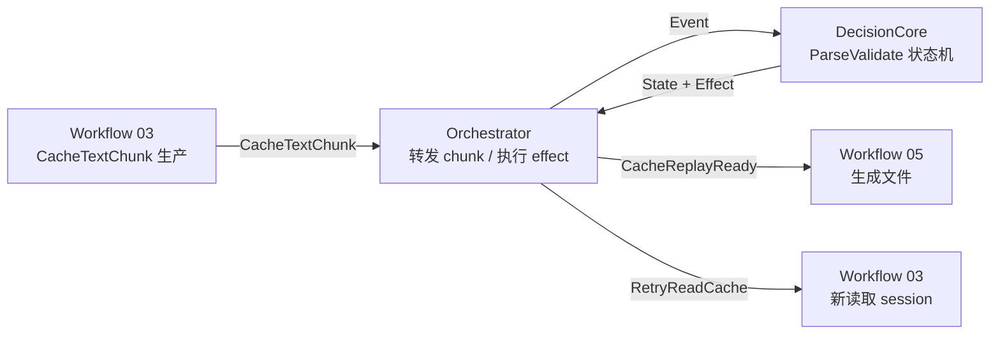

# 工作流 04：解析 / 校验 / 重试决策

> 状态:**规划稿,未施工**。本文与工作流 03 同属第三章数据链路的设计草案,进入施工前会按需求 → 对话 → 架构 → 施工 → 沉淀流程重写,词汇统一为 Effect/Event(06 推送 / 07 拉取章节中的 Command/Result 名词为起草期形态)。

本章处理 `D`：消费工作流 03 生产的 `CacheTextChunk`，识别一次缓存回放的边界，校验内容是否完整，并决定完成、重试或失败。

本章是“消费层”：它只看明文内容，不关心 bytes 如何接收，也不关心明文如何解码。

## 2. 总体位置



旧 app 的 `CgmCacheSyncBuffer.acceptChunk(text)` 已经包含本章雏形：追加文本、按换行切行、识别 start/end marker、看到 end 后 validate、失败则请求 `READ_CACHE_COMMAND` 重传。

## 3. Intent / Callback

### 3.1 Intent

本章没有直接来自 UI 的 Intent。它的入口是上游生产的明文 chunk。

```kotlin
sealed class ParseValidateIntent {
    data class ConsumeText(val chunk: CacheTextChunk) : ParseValidateIntent()
    data class FinishTransport(val sessionId: String) : ParseValidateIntent()
    object Reset : ParseValidateIntent()
}
```

| Intent | 含义 |
|---|---|
| `ConsumeText` | 消费一段属于某个读取 session 的明文 |
| `FinishTransport` | 上游传输结束，用于发现缺少 end marker |
| `Reset` | 清空解析状态 |

### 3.2 Callback

```kotlin
sealed class ParseValidateCallback {
    data class ShowParsing(val sessionId: String, val lineCount: Int) : ParseValidateCallback()
    data class ShowRetrying(val sessionId: String, val attempt: Int, val reason: String) : ParseValidateCallback()
    data class EmitReplayReady(val replay: CacheReplaySnapshot) : ParseValidateCallback()
    data class ShowError(val message: String) : ParseValidateCallback()
}
```

`EmitReplayReady` 是给后续“生成文件”工作流的输出，不表示已经上传。

## 4. State / Event / Effect

### 4.1 State

```kotlin
data class CacheReplaySnapshot(
    val sessionId: String,
    val deviceId: String,
    val lines: List<String>,
    val startLineIndex: Int,
    val endLineIndex: Int
)

data class CacheReplayBuffer(
    val sessionId: String,
    val deviceId: String,
    val pendingText: String = "",
    val lines: List<String> = emptyList(),
    val sawStart: Boolean = false,
    val sawEnd: Boolean = false,
    val attempt: Int = 1
)

sealed class ParseValidateState {
    object Idle : ParseValidateState()
    data class Consuming(val buffer: CacheReplayBuffer) : ParseValidateState()
    data class Validating(val buffer: CacheReplayBuffer) : ParseValidateState()
    data class Ready(val replay: CacheReplaySnapshot) : ParseValidateState()
    data class Retrying(val sessionId: String, val attempt: Int, val reason: String) : ParseValidateState()
    data class Error(val message: String) : ParseValidateState()
}
```

### 4.2 Event

```kotlin
sealed class ParseValidateEvent {
    data class TextChunkReceived(val chunk: CacheTextChunk) : ParseValidateEvent()
    data class TransportFinished(val sessionId: String) : ParseValidateEvent()
    data class ValidationPassed(val replay: CacheReplaySnapshot) : ParseValidateEvent()
    data class ValidationFailed(val sessionId: String, val retryable: Boolean, val reason: String) : ParseValidateEvent()
    data class RetryStarted(val newSessionId: String) : ParseValidateEvent()
    object Reset : ParseValidateEvent()
}
```

### 4.3 Effect

```kotlin
sealed class ParseValidateEffect {
    data class PublishParsingProgress(val sessionId: String, val lineCount: Int) : ParseValidateEffect()
    data class ValidateReplay(val buffer: CacheReplayBuffer) : ParseValidateEffect()
    data class RequestReadRetry(val oldSessionId: String, val reason: String) : ParseValidateEffect()
    data class PublishReplayReady(val replay: CacheReplaySnapshot) : ParseValidateEffect()
    data class ShowError(val message: String) : ParseValidateEffect()
}
```

### 4.4 状态转换

| 当前 State | Event | 下一个 State | Effect |
|---|---|---|---|
| `Idle` | `TextChunkReceived` | `Consuming(buffer)` | `PublishParsingProgress` |
| `Consuming` | `TextChunkReceived` 且未见 end | `Consuming(buffer + text)` | `PublishParsingProgress` |
| `Consuming` | `TextChunkReceived` 且见 end | `Validating(buffer)` | `ValidateReplay` |
| `Consuming` | `TransportFinished` 且未见 end | `Retrying(sessionId, attempt, "missing end marker")` 或 `Error` | `RequestReadRetry` 或 `ShowError` |
| `Validating` | `ValidationPassed` | `Ready(replay)` | `PublishReplayReady` |
| `Validating` | `ValidationFailed(retryable=true)` | `Retrying(sessionId, attempt, reason)` | `RequestReadRetry` |
| `Validating` | `ValidationFailed(retryable=false)` | `Error(reason)` | `ShowError` |
| 任意 | `Reset` | `Idle` | 无 |

## 5. 解析与校验模型

### 5.1 Marker

```kotlin
object CgmReplayMarkers {
    const val START = "Start Playback"
    const val END = "Playback all done"
}
```

### 5.2 Parser

```kotlin
data class ParseTextResult(
    val buffer: CacheReplayBuffer,
    val appendedLineCount: Int,
    val sawStart: Boolean,
    val sawEnd: Boolean
)

class CacheReplayParser {
    fun accept(buffer: CacheReplayBuffer, text: String): ParseTextResult {
        val joined = buffer.pendingText + text.replace("\r", "")
        val parts = joined.split("\n")
        val tail = parts.lastOrNull().orEmpty()
        val endInTail = tail.contains(CgmReplayMarkers.END)
        val completeLines = buildList {
            addAll(parts.dropLast(1).map { it.trim() }.filter { it.isNotEmpty() })
            if (endInTail && tail.trim().isNotEmpty()) add(tail.trim())
        }
        val pending = if (endInTail) "" else tail
        val lines = buffer.lines + completeLines

        val sawStart = buffer.sawStart || completeLines.any { it.contains(CgmReplayMarkers.START) }
        val sawEnd = buffer.sawEnd || completeLines.any { it.contains(CgmReplayMarkers.END) }

        return ParseTextResult(
            buffer = buffer.copy(
                pendingText = pending,
                lines = lines,
                sawStart = sawStart,
                sawEnd = sawEnd
            ),
            appendedLineCount = completeLines.size,
            sawStart = sawStart,
            sawEnd = sawEnd
        )
    }
}
```

### 5.3 Validator

```kotlin
data class CacheValidationResult(
    val valid: Boolean,
    val retryable: Boolean,
    val message: String,
    val replay: CacheReplaySnapshot? = null
)

class CacheReplayValidator {
    fun validate(buffer: CacheReplayBuffer, maxAttempts: Int): CacheValidationResult {
        val start = buffer.lines.indexOfFirst { it.contains(CgmReplayMarkers.START) }
        if (start < 0) return retryable(buffer, maxAttempts, "missing start marker")

        val end = buffer.lines.drop(start + 1).indexOfFirst { it.contains(CgmReplayMarkers.END) }
        if (end < 0) return retryable(buffer, maxAttempts, "missing end marker")

        val endIndex = start + 1 + end
        if (endIndex <= start + 1) return retryable(buffer, maxAttempts, "missing payload lines")

        return CacheValidationResult(
            valid = true,
            retryable = false,
            message = "cache replay validation passed",
            replay = CacheReplaySnapshot(
                sessionId = buffer.sessionId,
                deviceId = buffer.deviceId,
                lines = buffer.lines,
                startLineIndex = start,
                endLineIndex = endIndex
            )
        )
    }

    private fun retryable(
        buffer: CacheReplayBuffer,
        maxAttempts: Int,
        message: String
    ): CacheValidationResult {
        return CacheValidationResult(
            valid = false,
            retryable = buffer.attempt < maxAttempts,
            message = message
        )
    }
}
```

## 6. Command / Result

本章不直接访问 BluetoothPort。它的 Command 是工作流控制命令，由 Orchestrator 执行。

```kotlin
sealed class ParseValidateCommand {
    data class RetryReadCache(
        val oldSessionId: String,
        val deviceId: String,
        val reason: String
    ) : ParseValidateCommand()

    data class ForwardReplayToFileWorkflow(
        val replay: CacheReplaySnapshot
    ) : ParseValidateCommand()
}

sealed class ParseValidateResult {
    data class RetryDispatched(val oldSessionId: String) : ParseValidateResult()
    data class ReplayForwarded(val sessionId: String) : ParseValidateResult()
}
```

```text
RequestReadRetry
-> ParseValidateCommand.RetryReadCache
-> Orchestrator 停止旧 session
-> Workflow 03 开启新 session
```

```text
PublishReplayReady
-> ParseValidateCommand.ForwardReplayToFileWorkflow
-> Workflow 05 生成文件
```

## 7. 本章最容易漏风的点

1. `pendingText` 必须保留未成行的尾巴，否则 marker 或 payload 被切开时会误判。
2. 重试必须开启新读取 session，不能在旧 buffer 上继续追加。
3. 本章不做解码，不接触 bytes；否则会重新把 B/C/D 搅在一起。
4. 校验规则先保持旧 app 水平：start marker、end marker、payload 非空。更强的数据缺失检测需要真实样本再细化。
