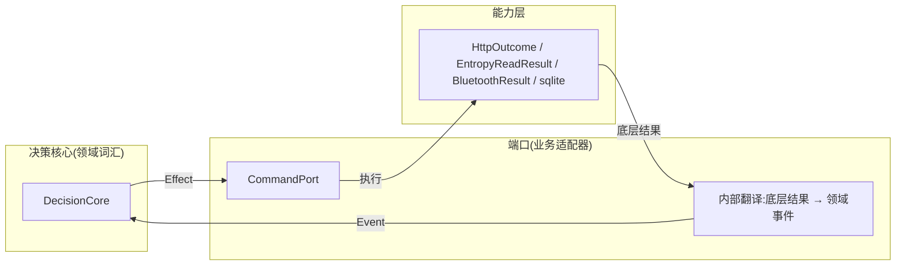
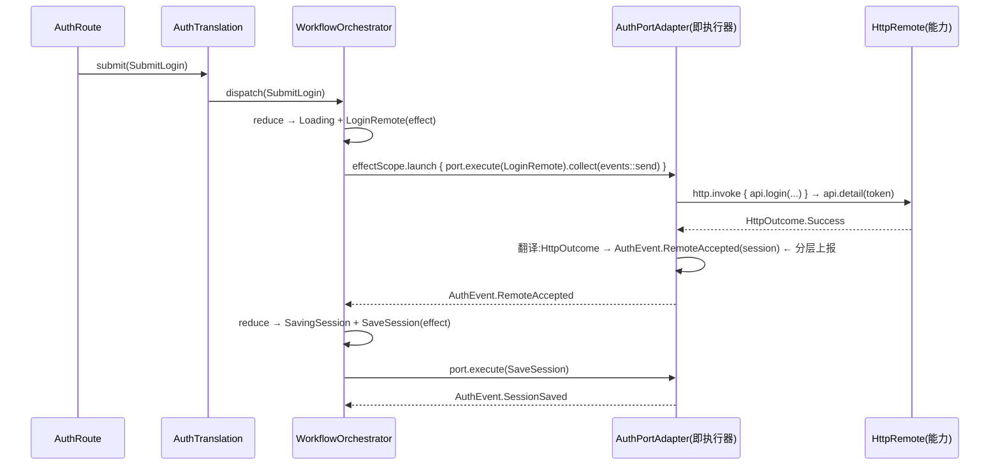

# 指令直达,分层上报:Effect/Command 映射收敛

> 范围：`port` 契约层 + `orchestrator` 执行器层。
> **不动** `decisioncore` 的状态机逻辑、`translation` 的业务语义、`ui`。
> 本重构是**行为等价重构**：只删"纯改名"的中间词汇，不改变任何运行逻辑。
> 前置：[06-port-capability-separation.md](./06-port-capability-separation.md)（已落地）。

## 0. 一句话

**下行指令直达**：端口直接执行领域 `Effect`，删掉 `Command` 传话层（它只是改名的废话）。
**上行分层上报**：端口内部把底层结果翻译成领域 `Event` 再上报，翻译环节保留、中间词汇表删除。

```text
下行(指令):  decisioncore ──Effect──▶ port(直接执行)         // 无传话
上行(上报):  port ──翻译─▶ Event ──▶ decisioncore            // 底层词汇止步于 port 边界
```

## 1. 现状（Before）

### 1.1 项目树与文件职能

```text
migratedev/src/main/kotlin/com/biosensor/migratedev/
├─ port/
│  ├─ PortContracts.kt                        # CommandPort<Command, Result>
│  ├─ auth/
│  │  ├─ AuthPort.kt                          # AuthCommand(Local/Remote) + AuthResult(Local/Remote) + AuthPort
│  │  └─ AuthPortAdapter.kt                   # 06 落地后:业务适配器
│  └─ connection/
│     ├─ ConnectionPort.kt                    # ConnectionCommand/Result + BindingSnapshot + ConnectionPort
│     └─ ConnectionPortAdapter.kt             # 06 落地后:业务适配器
├─ orchestrator/
│  ├─ OrchestratorContracts.kt                # fun interface EffectExecutor<Effect, Event>   ★与 CommandPort 同构
│  ├─ WorkflowOrchestrator.kt                 # effectExecutor 参数
│  ├─ auth/AuthEffectExecutor.kt              # ★toCommand() 纯改名 + toEvent() 纯改名
│  ├─ connection/ConnectionEffectExecutor.kt  # ★同上
│  └─ root/RootWorkflow.kt                    # EffectExecutor<RootEffect, RootEvent>(::execute) —— Root 域没有 Command 层!
└─ translation/
   ├─ auth/AuthTranslation.kt                 # effectExecutor = AuthEffectExecutor(port)
   └─ connection/ConnectionTranslation.kt     # effectExecutor = ConnectionEffectExecutor(port)
```

### 1.2 两个接口是同构的证据

```kotlin
// PortContracts.kt
interface CommandPort<Command, Result> {
    fun execute(command: Command): Flow<Result>
}

// OrchestratorContracts.kt
fun interface EffectExecutor<Effect, Event> {
    fun execute(effect: Effect): Flow<Event>
}
```

**完全相同的形状，只是词汇表不同。** 端口层和 effect 执行器层是同一个抽象被拆成了两份。

### 1.3 映射"废话"的量化

下行（AuthEffectExecutor.toCommand，6 对 6 纯改名）：

```kotlin
AuthEffect.ReadSession        -> AuthCommand.Local.ReadSession
AuthEffect.ValidateSession    -> AuthCommand.Remote.ValidateSession
AuthEffect.LoginRemote        -> AuthCommand.Remote.Login
AuthEffect.RegisterRemote     -> AuthCommand.Remote.Register
AuthEffect.SaveSession        -> AuthCommand.Local.SaveSession
AuthEffect.ClearSession       -> AuthCommand.Local.ClearSession
```

上行（AuthEffectExecutor.toEvent，16 对 16 纯改名）：

```kotlin
AuthResult.Local.SessionFound  -> AuthEvent.SessionFound
AuthResult.Remote.SessionVerified -> AuthEvent.SessionVerified
AuthResult.Remote.Accepted     -> AuthEvent.RemoteAccepted
...（16 条全部同构）
```

**每加一个命令/结果，要同步改 3-4 处**（Command 定义 + Result 定义 + 映射分支 + Effect/Event 定义），其中 Command/Result 定义和映射分支是纯废话。

### 1.4 问题定位

| # | 问题 | 表现 |
|---|---|---|
| P1 | 同一抽象两份词汇表 | `CommandPort` 与 `EffectExecutor` 签名逐字相同，却各自维护一套类型 |
| P2 | 下行映射是纯改名 | Effect→Command 无任何信息转换，纯粹为了"port 不说领域话" |
| P3 | 新增成本 3-4 处 | 每加一个副作用，改 Effect + Command + Result + 映射 + 决策核心 |
| P4 | 域间形态不一致 | Root 域从一开始就是指令直达（无 Command 层），auth/connection 域却各有一层传话 |

## 2. 修订后（After）

### 2.1 分层模型



### 2.2 项目树与文件职能（After）

```text
migratedev/src/main/kotlin/com/biosensor/migratedev/
├─ port/
│  ├─ PortContracts.kt                        # CommandPort<Effect, Event>(fun interface) —— 类型参数变为领域词汇
│  ├─ auth/
│  │  ├─ AuthPort.kt                          # ★只留接口:AuthPort : CommandPort<AuthEffect, AuthEvent>
│  │  │                                         (AuthCommand/AuthResult 删除)
│  │  └─ AuthPortAdapter.kt                   # execute(effect): Flow<AuthEvent>,内部完成本地/远端分派 + 结果翻译
│  └─ connection/
│     ├─ ConnectionPort.kt                    # ★只留接口 + readBinding/scanDevices 直读流
│     └─ ConnectionPortAdapter.kt             # execute(effect): Flow<ConnectionEvent>,蓝牙命令在内部包装
├─ orchestrator/
│  ├─ OrchestratorContracts.kt                # ★EffectExecutor 删除
│  ├─ WorkflowOrchestrator.kt                 # effectExecutor 参数类型 → CommandPort<Effect, Event>
│  ├─ (auth/AuthEffectExecutor.kt 删除)
│  ├─ (connection/ConnectionEffectExecutor.kt 删除)
│  └─ root/RootWorkflow.kt                    # CommandPort<RootEffect, RootEvent>(::execute) —— SAM 名替换
└─ translation/
   ├─ auth/AuthTranslation.kt                 # effectExecutor = port(直接传适配器)
   └─ connection/ConnectionTranslation.kt     # effectExecutor = port
```

### 2.3 关键差异一览

| 维度 | Before | After |
|---|---|---|
| 词汇表 | Effect + Command + Result + Event 四套 | Effect + Event 两套 |
| 执行器 | `AuthEffectExecutor` / `ConnectionEffectExecutor` 两个类 | 无 —— port 就是执行器 |
| 上行翻译 | 执行器内 `toEvent()`(纯改名) | port 内部(底层词汇→领域事件) |
| 新增副作用成本 | 改 3-4 处 | 改 2 处(Effect 定义 + 决策核心) |
| 域间一致性 | Root 直达,auth/connection 传话 | 全部直达 + 分层上报 |

## 3. 是否真的有优化（诚实评估）

### 3.1 改善了什么

| 维度 | 说明 |
|---|---|
| 删废话 | 2 个执行器类、2 个命令层级、2 个结果层级、2 个纯改名映射函数 |
| 新增成本减半 | 每加一个副作用从 3-4 处同步修改降为 2 处 |
| 域间统一 | auth/connection 对齐 Root 域形态（Root 从一开始就这么写的） |
| 词汇单一 | 全链路只流通两种领域词汇：下行 Effect、上行 Event |

### 3.2 代价与边界（诚实部分）

| 项 | 说明 |
|---|---|
| port 接口变大 | `execute` 直接吃 Effect、直接吐 Event，适配器内部同时承担分派与翻译 |
| 模块方向 | port 契约引用 decisioncore 类型（`AuthPort : CommandPort<AuthEffect, AuthEvent>`）——decisioncore 仍是纯词汇，方向是"port 依赖词汇"，不是反向 |
| 测试改写 | AuthWorkflowTest / WorkflowOrchestratorTest / 两个适配器测试 / ConnectionPortAdapterTest 共 5 个（多为签名与断言替换） |
| **上行翻译为什么保留** | 见 3.3，这是本方案的核心权衡，不是偷懒 |

### 3.3 为什么下行合并、上行保留（核心论证）

**下行可以合并**：Effect→Command 是 1:1 纯改名，中间层零信息量——没有任何转换、没有业务判断、没有未来演化空间。合并无损。

**上行必须保留翻译环节**（但不是保留中间词汇表）：

1. **翻译承载业务语义**。`HttpOutcome.Http(401)` → 登录时是 `Rejected`、会话验证时是 `SessionRejected`；`HttpOutcome.Timeout` → 登录时是 `Timeout`、验证时是 `SessionValidationTimeout`。这个"按命令语义归约底层结果"的过程是**业务逻辑**，必须存在于某个边界，不能省。
2. **未来演化位**。如果未来 port 要上报流式进度（蓝牙传输进度、文件上传百分比），`Event` 会超集化，翻译就不再 1:1——这个裂变点现在就该有归属地，就是 port 内部。
3. **分层上报的思想**：底层复杂度（HTTP 状态码、Tink 错误、BLE 状态）**止步于 port 边界**，状态机只处理领域词汇。合并下行只删"传话"，不破坏这个边界。

所以精确的表述是：**删掉的是 1:1 冗余的中间词汇表（AuthCommand/AuthResult/ConnectionCommand/ConnectionResult），保留的是"底层结果 → 领域事件"的翻译环节——它的位置从执行器类移到 port 内部，因为执行器类本身就是 port 的另一个名字。**

## 4. 调用说明：业务如何调用端口能力

### 4.1 登录链路（After）



**对比 Before**：`O → AuthEffectExecutor → port` 三跳变两跳；`AuthResult` 词汇消失，`toEvent()` 不再单独存在。

### 4.2 各域执行器形态（After）

| 域 | 执行器 | 形式 |
|---|---|---|
| Root | `CommandPort<RootEffect, RootEvent>(::execute)` | SAM(与现状一致,仅换接口名) |
| Auth | `AuthPortAdapter` 自身 | 实现 `AuthPort : CommandPort<AuthEffect, AuthEvent>` |
| Connection | `ConnectionPortAdapter` 自身 | 同上 |

## 5. 代码意图与完整代码

### 5.1 契约层:`PortContracts.kt`(修改后全量)

**意图**：`CommandPort` 保留名字（避免 import 全改），但语义变为"端口执行领域词汇"。变成 `fun interface` 以支持 SAM（Root 域使用）。

```kotlin
package com.biosensor.migratedev.port

import kotlinx.coroutines.flow.Flow

/**
 * 执行领域副作用,并把执行结果翻译成领域事件流返回。
 *
 * `execute(effect) -> Flow<event>`
 *
 * 下行指令直达:effect 就是 port 的命令,不再有 Command 传话层;
 * 上行分层上报:底层结果(能力层词汇)在实现内部翻译成领域事件,止步于 port 边界。
 */
fun interface CommandPort<Effect, Event> {
    fun execute(effect: Effect): Flow<Event>
}
```

### 5.2 端口接口:`AuthPort.kt` / `ConnectionPort.kt`(修改后全量)

**意图**：接口只声明词汇，不承载逻辑。`AuthCommand`/`AuthResult` 层级删除。

```kotlin
package com.biosensor.migratedev.port.auth

import com.biosensor.migratedev.decisioncore.auth.AuthEffect
import com.biosensor.migratedev.decisioncore.auth.AuthEvent
import com.biosensor.migratedev.port.CommandPort

interface AuthPort : CommandPort<AuthEffect, AuthEvent>
```

```kotlin
package com.biosensor.migratedev.port.connection

import com.biosensor.migratedev.decisioncore.connection.ConnectionEffect
import com.biosensor.migratedev.decisioncore.connection.ConnectionEvent
import com.biosensor.migratedev.port.CommandPort
import com.biosensor.migratedev.port.adapter.bluetoothport.BluetoothDeviceInfo
import kotlinx.coroutines.flow.Flow

interface ConnectionPort : CommandPort<ConnectionEffect, ConnectionEvent> {
    fun readBinding(userId: String): Flow<BindingSnapshot>

    fun scanDevices(): Flow<BluetoothDeviceInfo>
}
```

> 注：`ConnectionPort` 的 `readBinding` / `scanDevices` 是直读流（非 effect→event 形态），保持不变。

### 5.3 `AuthPortAdapter`：execute 签名与分派（改动段）

**意图**：原来 `toCommand()` 的本地/远端分派和 `toEvent()` 的翻译合入 execute。命令语义（`AuthEffect`）直接决定走向哪个能力、如何翻译结果。

```kotlin
class AuthPortAdapter(
    private val kv: StringEntropy,
    private val http: HttpRemote,
    private val clock: Clock = Clock.systemUTC(),
    private val gson: Gson = Gson()
) : AuthPort {

    private val api: AccountApi by lazy { http.api(AccountApi::class.java) }

    override fun execute(effect: AuthEffect): Flow<AuthEvent> = when (effect) {
        // 本地:KV + 会话 codec
        is AuthEffect.ReadSession -> executeLocal(effect)
        is AuthEffect.SaveSession -> executeLocal(effect)
        is AuthEffect.ClearSession -> executeLocal(effect)
        // 远端:端点语义
        is AuthEffect.LoginRemote -> executeRemote(effect)
        is AuthEffect.RegisterRemote -> executeRemote(effect)
        is AuthEffect.ValidateSession -> executeRemote(effect)
    }

    // 内部改动:runLocal/runRemote 的返回值从 AuthResult.Local/Remote 换成直接构造 AuthEvent。
    // 例:AuthResult.Local.SessionFound(session) -> AuthEvent.SessionFound(session)
    //     AuthResult.Remote.Accepted(session)    -> AuthEvent.RemoteAccepted(session)
    //     AuthResult.Remote.SessionVerified(...) -> AuthEvent.SessionVerified(...)
    // 翻译逻辑(HttpOutcome → AuthEvent、EntropyReadResult → AuthEvent)原样保留,只是目标类型从 AuthResult 换成 AuthEvent。
}
```

> 注意：`AuthEffect` **不需要** Local/Remote 嵌套——分派在 `execute` 的 when 里完成，嵌套只是把 when 搬到类型上，没有信息增益。

### 5.4 `ConnectionPortAdapter`：execute 签名与蓝牙包装（改动段）

**意图**：`ConnectDevice`/`DisconnectDevice` 语义留在 Effect 层（状态机说人话），蓝牙命令包装下沉到 port 内部。

```kotlin
class ConnectionPortAdapter(
    private val sqlite: LocalDatabase,
    private val bluetooth: BluetoothPort,
    private val nowMillis: () -> Long = System::currentTimeMillis
) : ConnectionPort {

    override fun execute(effect: ConnectionEffect): Flow<ConnectionEvent> = when (effect) {
        is ConnectionEffect.SaveBinding -> saveBinding(effect.userId, effect.deviceId)

        is ConnectionEffect.ConnectDevice -> bluetooth.execute(
            BluetoothCommand.Connect(effect.deviceId)
        ).map { it.toEvent() }

        ConnectionEffect.DisconnectDevice -> bluetooth.execute(
            BluetoothCommand.Disconnect
        ).map { it.toEvent() }
    }

    // 原 ConnectionEffectExecutor 的蓝牙结果翻译迁入此处:
    // BluetoothResult.Connected -> ConnectionEvent.DeviceConnected(device)
    // BluetoothResult.ConnectFailed -> ConnectionEvent.DeviceConnectFailed(message)
    // BluetoothResult.ConnectTimeout -> ConnectionEvent.DeviceConnectTimeout
    // BluetoothResult.Disconnected -> ConnectionEvent.DeviceDisconnected
}
```

### 5.5 Translation / RootWorkflow / Orchestrator 构造(改动行)

```kotlin
// AuthTranslation.kt —— effectExecutor 直接传 port
private val orchestrator = WorkflowOrchestrator(
    initialState = AuthState.Idle,
    decisionCore = AuthDecisionCore,
    effectExecutor = port,          // 原 AuthEffectExecutor(port)
    scope = viewModelScope,
    logTag = "Auth.Workflow",
    onTransition = ::reportRootOutput
)

// ConnectionTranslation.kt —— 同上
effectExecutor = port,              // 原 ConnectionEffectExecutor(port)

// RootWorkflow.kt —— 换接口名,SAM 不变
private val effectExecutor = CommandPort<RootEffect, RootEvent>(::execute)   // 原 EffectExecutor<RootEffect, RootEvent>(::execute)

// WorkflowOrchestrator.kt —— 参数类型
private val effectExecutor: CommandPort<Effect, Event>,   // 原 EffectExecutor<Effect, Event>
```

### 5.6 删除清单

| 文件 / 类型 | 去向 |
|---|---|
| `orchestrator/OrchestratorContracts.kt` 中 `EffectExecutor` | 删除(CommandPort 接管) |
| `orchestrator/auth/AuthEffectExecutor.kt` | 删除 |
| `orchestrator/connection/ConnectionEffectExecutor.kt` | 删除 |
| `port/auth/AuthPort.kt` 中 `AuthCommand` / `AuthResult` | 删除 |
| `port/connection/ConnectionPort.kt` 中 `ConnectionCommand` / `ConnectionResult` | 删除 |

## 6. 对之前问题的解答

**Q：指令直达会不会丢失信息？**
不会。下行 6 对 6 完全同构，删除的只有"改名"本身。上行翻译环节保留（只是从执行器类移入 port 内部），`HttpOutcome`/`EntropyReadResult`/`BluetoothResult` 的语义归约一步不少——401/403 特殊处理、超时归约全部原样保留。

**Q：分层上报保留什么、省略什么？**
保留：底层结果 → 领域事件的翻译环节（业务语义所在）。
省略：底层词汇表本身。状态机永远只看到 `Event`，看不到 HTTP 状态码、Tink 错误、BLE 状态。这是"分层"的意义：底层复杂度止步于 port 边界，而因为目前翻译是 1:1，上层也没有少看到任何信息。

**Q：为什么说"执行器类就是 port 的另一个名字"？**
`EffectExecutor.execute(effect): Flow<event>` 与 `CommandPort.execute(command): Flow<result>` 逐字同构。06 把 port 收敛为业务适配器后，执行器存在的唯一理由就是"翻译词汇表"——现在词汇表合并，执行器自然消失，port 直接就是执行器。Root 域从一开始就没有执行器类，证明这个形态本来就是通的。

**Q：与 06 的关系？**
06 解决**挂载与归属**（能力 vs 业务适配器），07 解决**契约词汇**（领域词汇直接通行）。两者正交：06 已落地，07 在其基础上做词汇收敛，互不阻塞。

**Q：`CommandPort` 名字不贴切了，改名吗？**
建议保留（避免 import 全改），语义已更新为"端口执行领域词汇"。若想更贴切，后续可整体改名 `EffectPort`——纯机械替换，零风险，随时可做。

## 7. 影响面与实施顺序

### 7.1 影响面

- **生产代码**：删除 2 个执行器类 + 4 个词汇类型；修改 8 个文件（PortContracts、WorkflowOrchestrator、AuthPort、ConnectionPort、AuthPortAdapter、ConnectionPortAdapter、AuthTranslation、ConnectionTranslation、RootWorkflow）。
- **测试**：改写 5 个（AuthWorkflowTest 的 FakeAuthPort 签名、WorkflowOrchestratorTest 的 SAM、AuthPortAdapter 本地/远端测试的断言、ConnectionPortAdapterTest）。
- **上游**：`decisioncore` 状态机逻辑**零改动**（只涉及类型 import）；`ui` 零改动。

### 7.2 实施顺序(每步可独立编译)

1. **契约层**：`CommandPort` 改 `fun interface` + 语义注释；`WorkflowOrchestrator` 参数类型切换；`WorkflowOrchestratorTest` SAM 适配；`RootWorkflow` 换接口名。此时全仓可编译（其余域仍走旧执行器）。
2. **Auth 域**：`AuthPort` 接口改签名 → `AuthPortAdapter.execute` 改签名与翻译目标 → `AuthTranslation` 直传 port → 删 `AuthEffectExecutor` + `AuthCommand`/`AuthResult` → 改写 AuthWorkflowTest / AuthPortAdapterLocalTest / AuthPortAdapterRemoteTest。
3. **Connection 域**：同构操作（注意蓝牙结果翻译迁入）。
4. **收尾**：删 `EffectExecutor` 接口，全量编译 + 单元测试回归。

> 步骤 2 与 3 是同一模式的两次演练——先 auth 后 connection，第二次会明显更快。
