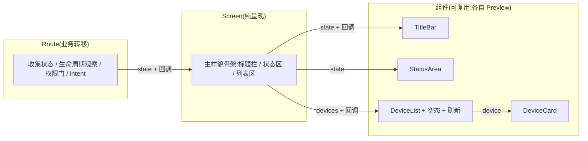

# UI 分层:Route 业务转移 / Screen 纯呈现 + 组件拆分与 Preview

> 范围：`ui/` 层(connection、auth 两个页面)。
> **不动** `translation` / `decisioncore` / `port` / `orchestrator`。
> 本重构是**行为等价重构**:只重组 UI 代码的呈现方式,不改任何业务逻辑。
> 前置:[07-direct-command-hierarchical-report.md](./07-direct-command-hierarchical-report.md)(已落地)。

## 0. 一句话

**Route 只做业务转移**(状态收集、生命周期、权限门、intent 提交),**Screen 只做纯呈现**(接受 state + 回调,零业务);Screen 内部先写主样貌骨架,再拆成独立组件,每个组件自带 `@Preview`。

```text
Route(业务)          → Screen(骨架)           → 组件(呈现)      → Preview(独立)
收集状态/提交intent     标题栏/状态区/列表区        每块一个composable    每组件一个预览
```

## 1. 现状(Before)

### 1.1 项目树与文件职能

```text
migratedev/src/main/kotlin/com/biosensor/migratedev/ui/
├─ AppMain.kt                        # 导航(NavHost + RootNavigationEffect)
├─ auth/
│  ├─ AuthRoute.kt                   # 业务转移:收集状态,回调转 intent(结构正确)
│  └─ AuthScreen.kt                  # ★164 行单文件:骨架 + 状态文案 + 表单 + 表单状态
└─ connection/
   ├─ ConnectionRoute.kt             # 业务转移:状态收集 + 生命周期观察 + 权限门 + intent(结构正确)
   ├─ ConnectionScreen.kt            # ★175 行单文件:骨架 + 状态文案 + 空态 + 列表 + 卡片 + 刷新状态
   └─ BluetoothAccessGate.kt         # ★4 个布尔 + 2 个 launcher + 1 个四分支 when 的隐式状态机
```

### 1.2 问题定位(对应三个痛点)

| # | 痛点 | 具体表现 |
|---|---|---|
| P1 | Screen 三件事混杂 | `ConnectionScreen` 里:骨架布局(Column/Row/Box)、状态→文案映射(`StatusText` 的 when)、组件绘制(`DeviceCard`)、局部状态(`rememberPullRefreshState`)全在一个函数,读起来要先"拆线"才能看清结构 |
| P2 | BluetoothAccessGate 乱 | 4 个 `rememberSaveable` 布尔(`permissionRequestStarted` / `enableRequestStarted` / `accessReported` / `permissionsGranted`)相互依赖,一个 `LaunchedEffect` 里 4 分支 `when` 是**隐式状态机**——流程靠读代码脑补,没法一眼看出"现在在哪一步"。还有一个空实现回调(`onBluetoothEnableCancelled = {}`)在调用侧,说明调用方自己都不确定它该干嘛 |
| P3 | 不能 Preview | 组件间没有拆分边界,没有 `@Preview`(`AuthScreen` 里甚至留了 TODO"讲一下这里怎么使用 @Preview")。改一个卡片样式要跑整个 App;也无法用预览快速比对状态变体(空列表/扫描中/已连接) |

### 1.3 现状结构图(ConnectionScreen 单函数 175 行)

```text
ConnectionScreen
├─ rememberPullRefreshState           ← 局部状态(和列表耦合)
├─ Column
│  ├─ Row{ 标题 + 退出按钮 }
│  ├─ StatusText(state)              ← 状态文案映射
│  ├─ message 展示
│  └─ Box{ pullRefresh
│     ├─ 空态 Column / LazyColumn
│     │  └─ DeviceCard               ← 组件
│     └─ PullRefreshIndicator }
```

一层套一层,每层职责没名字。

## 2. 修订后(After)

### 2.1 分层模型



### 2.2 项目树与文件职能(After)

```text
migratedev/src/main/kotlin/com/biosensor/migratedev/ui/
├─ AppMain.kt                        # 不变
├─ auth/
│  ├─ AuthRoute.kt                   # 不变(结构已正确)
│  └─ AuthScreen.kt                  # 骨架:Column{ 欢迎 + AuthStatusArea + AuthForm },各组件自带 Preview
└─ connection/
   ├─ ConnectionRoute.kt             # 不变(结构已正确)
   ├─ BluetoothAccessGate.kt         # ★状态机化:3 状态枚举替代 4 布尔,when(state) 线性流转
   ├─ ConnectionScreen.kt            # ★骨架:Column{ ConnectionTitleBar + ConnectionStatus + DeviceList }
   ├─ ConnectionTitleBar.kt          # ★标题 + 退出登录(独立 Preview)
   ├─ ConnectionStatus.kt            # ★状态文案 + 错误消息(独立 Preview)
   ├─ DeviceList.kt                  # ★列表/空态/下拉刷新(独立 Preview) —— 局部状态收在这里
   └─ DeviceCard.kt                  # ★设备卡片(独立 Preview)
```

### 2.3 职责判定规则(写进代码注释的准则)

| 东西 | 放哪 | 判断 |
|---|---|---|
| 状态收集、intent 提交、生命周期、权限流程 | Route | 问"换一套 UI 要不要改它"——要,就属于 Route |
| 主样貌骨架(哪里是标题、哪里是列表) | Screen | 一眼看完的布局结构,只调子组件 |
| 单个视觉块(卡片、状态行、空态) | 组件文件 | 能独立描述"长什么样"的单元 |
| 输入框内容、刷新状态、展开/折叠等**纯 UI 状态** | 组件内 `rememberSaveable` | 业务不关心,只影响长相 |
| 每个组件 + 关键状态变体 | `@Preview` | 纯数据驱动,不碰 ViewModel/Context |

## 3. 是否真的有优化(诚实评估)

### 3.1 改善了什么

| 维度 | 说明 |
|---|---|
| 阅读路径变短 | Screen 骨架 ≈ 30 行,5 分钟看懂页面结构;细节进对应组件文件 |
| 局部状态有归属 | `refreshState` 收进 `DeviceList`(它只服务于列表),不再污染骨架 |
| Preview 可用 | 组件全部纯数据驱动(`ConnectionUiState`/`DeviceItemUi` 是普通 data class),每个组件一个 `@Preview`,改样式秒级反馈 |
| Gate 可读 | 状态枚举把"现在在哪一步"显式化,`when(state)` 线性流转,无布尔交叉 |
| Route/Screen 分工落地 | 与你的判断一致:Route 只做业务转移(现状已正确,不动),Screen 只做呈现(重构) |

### 3.2 代价与边界(诚实部分)

| 项 | 说明 |
|---|---|
| 文件数量增加 | connection 从 3 个文件变 6 个(每个组件一个文件 + Preview)——小文件的代价是文件多,收益是定位快 |
| Preview 有取舍 | `BluetoothAccessGate` 绑 Launcher/Context,**不能也不该 Preview**——它属于 Route 层业务,不参与呈现 |
| 行为零变化 | 不改任何状态机、回调、文案;纯重组呈现代码,回归风险低(编译 + 现有 73 测试兜底) |
| AuthScreen 拆分幅度 | 它比 Connection 简单,只拆两层(状态区 + 表单区),表单状态保留在 `AuthForm` 内(纯 UI 状态,正确归属) |

## 4. 代码意图与完整代码

### 4.1 `ConnectionScreen.kt`:主样貌骨架(全量)

**意图**:先给出页面结构——标题栏、状态区、设备列表。每个块是一个函数调用,函数在各自文件里,每个都可独立 Preview。

```kotlin
package com.biosensor.migratedev.ui.connection

import androidx.compose.foundation.layout.Column
import androidx.compose.foundation.layout.Spacer
import androidx.compose.foundation.layout.fillMaxSize
import androidx.compose.foundation.layout.height
import androidx.compose.foundation.layout.padding
import androidx.compose.material3.MaterialTheme
import androidx.compose.runtime.Composable
import androidx.compose.ui.Modifier
import androidx.compose.ui.tooling.preview.Preview
import androidx.compose.ui.unit.dp
import com.biosensor.migratedev.translation.connection.ConnectionPhase
import com.biosensor.migratedev.translation.connection.ConnectionUiState
import com.biosensor.migratedev.translation.connection.DeviceItemUi

/**
 * 纯呈现:只描述页面结构,不涉及任何业务。
 * 结构 = 标题栏 + 状态区 + 设备列表。
 */
@Composable
fun ConnectionScreen(
    state: ConnectionUiState,
    onRefresh: () -> Unit,
    onDeviceSelected: (String) -> Unit,
    onLogout: () -> Unit
) {
    Column(
        modifier = Modifier
            .fillMaxSize()
            .padding(20.dp)
    ) {
        ConnectionTitleBar(
            logoutEnabled = state.phase != ConnectionPhase.EndingSession,
            onLogout = onLogout
        )
        Spacer(Modifier.height(12.dp))
        ConnectionStatus(state)
        Spacer(Modifier.height(12.dp))
        DeviceList(
            devices = state.devices,
            canInteract = state.phase == ConnectionPhase.Scanning ||
                state.phase == ConnectionPhase.Failed,
            isRefreshing = state.isRefreshing,
            onRefresh = onRefresh,
            onDeviceSelected = onDeviceSelected
        )
    }
}

@Preview(showBackground = true)
@Composable
private fun ConnectionScreenPreview() {
    MaterialTheme {
        ConnectionScreen(
            state = ConnectionUiState(
                phase = ConnectionPhase.Scanning,
                devices = listOf(
                    DeviceItemUi("AA:01", "BT24-S", -40, isRemembered = true),
                    DeviceItemUi("BB:02", "BT24-M", -55, isRemembered = false)
                ),
                rememberedDeviceId = "AA:01",
                isRefreshing = false,
                message = null
            ),
            onRefresh = {},
            onDeviceSelected = {},
            onLogout = {}
        )
    }
}
```

### 4.2 `ConnectionTitleBar.kt`(全量)

```kotlin
package com.biosensor.migratedev.ui.connection

import androidx.compose.foundation.layout.Arrangement
import androidx.compose.foundation.layout.Row
import androidx.compose.foundation.layout.fillMaxWidth
import androidx.compose.material3.MaterialTheme
import androidx.compose.material3.OutlinedButton
import androidx.compose.material3.Text
import androidx.compose.runtime.Composable
import androidx.compose.ui.Alignment
import androidx.compose.ui.Modifier
import androidx.compose.ui.tooling.preview.Preview

/** 标题栏:页面标题 + 退出登录。 */
@Composable
fun ConnectionTitleBar(
    logoutEnabled: Boolean,
    onLogout: () -> Unit
) {
    Row(
        modifier = Modifier.fillMaxWidth(),
        horizontalArrangement = Arrangement.SpaceBetween,
        verticalAlignment = Alignment.CenterVertically
    ) {
        Text("连接 BT24", style = MaterialTheme.typography.headlineSmall)
        OutlinedButton(enabled = logoutEnabled, onClick = onLogout) {
            Text("退出登录")
        }
    }
}

@Preview(showBackground = true)
@Composable
private fun ConnectionTitleBarPreview() {
    MaterialTheme {
        ConnectionTitleBar(logoutEnabled = true, onLogout = {})
    }
}
```

### 4.3 `ConnectionStatus.kt`(全量)

```kotlin
package com.biosensor.migratedev.ui.connection

import androidx.compose.foundation.layout.Arrangement
import androidx.compose.foundation.layout.Row
import androidx.compose.foundation.layout.Spacer
import androidx.compose.foundation.layout.height
import androidx.compose.foundation.layout.size
import androidx.compose.material3.CircularProgressIndicator
import androidx.compose.material3.MaterialTheme
import androidx.compose.material3.Text
import androidx.compose.runtime.Composable
import androidx.compose.ui.Alignment
import androidx.compose.ui.Modifier
import androidx.compose.ui.tooling.preview.Preview
import androidx.compose.ui.unit.dp
import com.biosensor.migratedev.translation.connection.ConnectionPhase
import com.biosensor.migratedev.translation.connection.ConnectionUiState

/** 状态区:当前阶段文案(带进度圈)+ 错误消息。 */
@Composable
fun ConnectionStatus(state: ConnectionUiState) {
    Column {
        Row(
            horizontalArrangement = Arrangement.spacedBy(8.dp),
            verticalAlignment = Alignment.CenterVertically
        ) {
            if (state.phase.isBusy) {
                CircularProgressIndicator(Modifier.size(20.dp))
            }
            Text(state.phase.text())
        }
        state.message?.let {
            Spacer(Modifier.height(8.dp))
            Text(it, color = MaterialTheme.colorScheme.error)
        }
    }
}

private val ConnectionPhase.isBusy: Boolean
    get() = this == ConnectionPhase.Scanning || this == ConnectionPhase.Connecting ||
        this == ConnectionPhase.EndingSession

private fun ConnectionPhase.text(): String = when (this) {
    ConnectionPhase.AwaitingBluetoothAccess -> "正在准备蓝牙权限与系统蓝牙"
    ConnectionPhase.Scanning -> "持续扫描中,下拉可刷新列表"
    ConnectionPhase.Connecting -> "正在连接所选设备"
    ConnectionPhase.Connected -> "设备已连接"
    ConnectionPhase.Failed -> "连接失败,可刷新或重新选择"
    ConnectionPhase.EndingSession -> "正在释放蓝牙资源"
    ConnectionPhase.LogoutReady -> "正在退出"
}

@Preview(showBackground = true)
@Composable
private fun ConnectionStatusPreview() {
    MaterialTheme {
        ConnectionStatus(
            ConnectionUiState(
                phase = ConnectionPhase.Connecting,
                devices = emptyList(),
                rememberedDeviceId = null,
                isRefreshing = false,
                message = null
            )
        )
    }
}
```

### 4.4 `DeviceList.kt`(全量)

**意图**:列表的全部复杂性(空态、下拉刷新、局部状态 `refreshState`)收在一个文件。骨架只看 `DeviceList(...)` 一行。

```kotlin
package com.biosensor.migratedev.ui.connection

import androidx.compose.foundation.layout.Arrangement
import androidx.compose.foundation.layout.Box
import androidx.compose.foundation.layout.Column
import androidx.compose.foundation.layout.Spacer
import androidx.compose.foundation.layout.fillMaxSize
import androidx.compose.foundation.layout.height
import androidx.compose.foundation.layout.padding
import androidx.compose.foundation.lazy.LazyColumn
import androidx.compose.foundation.lazy.items
import androidx.compose.material.ExperimentalMaterialApi
import androidx.compose.material.pullrefresh.PullRefreshIndicator
import androidx.compose.material.pullrefresh.pullRefresh
import androidx.compose.material.pullrefresh.rememberPullRefreshState
import androidx.compose.material3.Button
import androidx.compose.material3.MaterialTheme
import androidx.compose.material3.Text
import androidx.compose.runtime.Composable
import androidx.compose.ui.Alignment
import androidx.compose.ui.Modifier
import androidx.compose.ui.tooling.preview.Preview
import androidx.compose.ui.unit.dp
import com.biosensor.migratedev.translation.connection.DeviceItemUi

/** 设备列表:空态 / 列表 + 下拉刷新。局部状态(刷新)只在这里。 */
@OptIn(ExperimentalMaterialApi::class)
@Composable
fun DeviceList(
    devices: List<DeviceItemUi>,
    canInteract: Boolean,
    isRefreshing: Boolean,
    onRefresh: () -> Unit,
    onDeviceSelected: (String) -> Unit
) {
    val refreshState = rememberPullRefreshState(
        refreshing = isRefreshing, onRefresh = onRefresh
    )
    Box(
        modifier = Modifier
            .fillMaxSize()
            .pullRefresh(refreshState)
    ) {
        if (devices.isEmpty()) {
            EmptyDevices(canInteract = canInteract, onRefresh = onRefresh)
        } else {
            LazyColumn(verticalArrangement = Arrangement.spacedBy(10.dp)) {
                items(items = devices, key = DeviceItemUi::id) { device ->
                    DeviceCard(
                        device = device,
                        enabled = canInteract,
                        onClick = { onDeviceSelected(device.id) }
                    )
                }
            }
        }
        PullRefreshIndicator(
            refreshing = isRefreshing,
            state = refreshState,
            modifier = Modifier.align(Alignment.TopCenter)
        )
    }
}

@Composable
private fun EmptyDevices(canInteract: Boolean, onRefresh: () -> Unit) {
    Column(
        modifier = Modifier
            .align(Alignment.Center)
            .padding(24.dp),
        horizontalAlignment = Alignment.CenterHorizontally
    ) {
        Text("暂未发现符合条件的 BT24")
        Spacer(Modifier.height(12.dp))
        Button(enabled = canInteract, onClick = onRefresh) {
            Text("刷新扫描")
        }
    }
}

@Preview(showBackground = true)
@Composable
private fun DeviceListEmptyPreview() {
    MaterialTheme {
        DeviceList(devices = emptyList(), canInteract = true, isRefreshing = false, onRefresh = {}, onDeviceSelected = {})
    }
}

@Preview(showBackground = true)
@Composable
private fun DeviceListWithDevicesPreview() {
    MaterialTheme {
        DeviceList(
            devices = listOf(
                DeviceItemUi("AA:01", "BT24-S", -40, isRemembered = true),
                DeviceItemUi("BB:02", "BT24-M", null, isRemembered = false)
            ),
            canInteract = true, isRefreshing = false, onRefresh = {}, onDeviceSelected = {}
        )
    }
}
```

### 4.5 `DeviceCard.kt`(全量)

```kotlin
package com.biosensor.migratedev.ui.connection

import androidx.compose.foundation.clickable
import androidx.compose.foundation.layout.Column
import androidx.compose.foundation.layout.fillMaxWidth
import androidx.compose.foundation.layout.padding
import androidx.compose.material3.Card
import androidx.compose.material3.MaterialTheme
import androidx.compose.material3.Text
import androidx.compose.runtime.Composable
import androidx.compose.ui.Modifier
import androidx.compose.ui.tooling.preview.Preview
import androidx.compose.ui.unit.dp
import com.biosensor.migratedev.translation.connection.DeviceItemUi

/** 设备卡片:名称 + 地址/RSSI + 记忆标记。 */
@Composable
fun DeviceCard(
    device: DeviceItemUi,
    enabled: Boolean,
    onClick: () -> Unit
) {
    Card(
        modifier = Modifier
            .fillMaxWidth()
            .clickable(enabled = enabled, onClick = onClick)
    ) {
        Column(Modifier.padding(16.dp)) {
            Text(device.name, style = MaterialTheme.typography.titleMedium)
            Text(
                buildString {
                    append(device.id)
                    device.rssi?.let {
                        append("  RSSI ")
                        append(it)
                    }
                },
                style = MaterialTheme.typography.bodySmall
            )
            if (device.isRemembered) {
                Text("已记忆设备", color = MaterialTheme.colorScheme.primary)
            }
        }
    }
}

@Preview(showBackground = true)
@Composable
private fun DeviceCardPreview() {
    MaterialTheme {
        DeviceCard(
            device = DeviceItemUi("AA:01", "BT24-S", -40, isRemembered = true),
            enabled = true,
            onClick = {}
        )
    }
}
```

### 4.6 `BluetoothAccessGate.kt`:状态机化(全量)

**意图**:把 4 个隐式布尔换成显式状态枚举,`when(state)` 线性流转,每一步注释"为什么到这一步"。流程本身不变(权限 → 系统蓝牙 → 就绪),只是从"读代码脑补"变成"看状态就知道在哪"。

```kotlin
package com.biosensor.migratedev.ui.connection

import android.Manifest
import android.app.Activity
import android.bluetooth.BluetoothAdapter
import android.bluetooth.BluetoothManager
import android.content.Context
import android.content.ContextWrapper
import android.content.Intent
import android.content.pm.PackageManager
import android.os.Build
import androidx.activity.compose.rememberLauncherForActivityResult
import androidx.activity.result.contract.ActivityResultContracts
import androidx.compose.runtime.Composable
import androidx.compose.runtime.LaunchedEffect
import androidx.compose.runtime.getValue
import androidx.compose.runtime.mutableStateOf
import androidx.compose.runtime.remember
import androidx.compose.runtime.saveable.rememberSaveable
import androidx.compose.runtime.setValue
import androidx.compose.ui.platform.LocalContext
import androidx.core.content.ContextCompat
import timber.log.Timber

/**
 * 蓝牙访问门:权限请求 → 系统蓝牙开关 → 就绪,三步线性流转。
 * 属于 Route 层业务(绑 Activity/Launcher),不需要也不应该 Preview。
 */
@Composable
fun BluetoothAccessGate(
    onAccessReady: () -> Unit,
    onPermissionDenied: () -> Unit,
    onBluetoothEnableCancelled: () -> Unit
) {
    val context = LocalContext.current
    val adapter = remember {
        context.getSystemService(BluetoothManager::class.java)?.adapter
    }
    val permissions = remember { requiredBluetoothPermissions() }

    var gate by rememberSaveable {
        mutableStateOf(
            if (context.hasPermissions(permissions)) {
                GateState.AwaitingSystemEnable
            } else {
                GateState.AwaitingPermission
            }
        )
    }

    val requestPermissions = rememberLauncherForActivityResult(
        ActivityResultContracts.RequestMultiplePermissions()
    ) { result ->
        if (permissions.all { result[it] == true }) {
            gate = GateState.AwaitingSystemEnable
        } else {
            Timber.tag("Connection.UI").w("蓝牙权限被拒绝,结束任务")
            onPermissionDenied()
        }
    }
    val enableBluetooth = rememberLauncherForActivityResult(
        ActivityResultContracts.StartActivityForResult()
    ) { result ->
        if (result.resultCode == Activity.RESULT_OK || adapter?.isEnabled == true) {
            gate = GateState.Ready
        } else {
            onBluetoothEnableCancelled()
        }
    }

    LaunchedEffect(gate) {
        when (gate) {
            // 1. 权限未授予 → 弹系统权限请求;launch 不改变 gate,不会重复弹
            GateState.AwaitingPermission -> requestPermissions.launch(permissions)

            // 2. 权限齐了 → 检查系统蓝牙:无硬件直接退出;已开则就绪;未开则弹系统开启请求
            GateState.AwaitingSystemEnable -> when {
                adapter == null -> context.findActivity()?.finishAffinity()
                adapter.isEnabled -> gate = GateState.Ready
                else -> enableBluetooth.launch(
                    Intent(BluetoothAdapter.ACTION_REQUEST_ENABLE)
                )
            }

            // 3. 终态:只进入一次,通知上层
            GateState.Ready -> onAccessReady()
        }
    }
}

/** 权限门状态:只有三步,没有交叉布尔。 */
private enum class GateState {
    AwaitingPermission, AwaitingSystemEnable, Ready
}

internal fun requiredBluetoothPermissions(
    sdkInt: Int = Build.VERSION.SDK_INT
): Array<String> = if (sdkInt >= Build.VERSION_CODES.S) {
    arrayOf(
        Manifest.permission.BLUETOOTH_SCAN,
        Manifest.permission.BLUETOOTH_CONNECT,
        Manifest.permission.ACCESS_COARSE_LOCATION,
        Manifest.permission.ACCESS_FINE_LOCATION
    )
} else {
    arrayOf(Manifest.permission.ACCESS_FINE_LOCATION)
}

private fun Context.hasPermissions(
    permissions: Array<String>
): Boolean = permissions.all {
    ContextCompat.checkSelfPermission(this, it) == PackageManager.PERMISSION_GRANTED
}

internal tailrec fun Context.findActivity(): Activity? = when (this) {
    is Activity -> this
    is ContextWrapper -> baseContext.findActivity()
    else -> null
}
```

### 4.7 `AuthScreen.kt`:骨架拆分(改动段)

**意图**:与 Connection 同样的模式——骨架只放结构,状态区与表单区各自独立、各自 Preview。表单输入状态(纯 UI 状态)留在 `AuthForm` 内。

```kotlin
@Composable
fun AuthScreen(
    state: AuthUiState,
    onLogin: (String, String) -> Unit,
    onRegister: (String, String, String) -> Unit,
    onRetrySession: () -> Unit
) {
    Column(
        modifier = Modifier
            .fillMaxSize()
            .verticalScroll(rememberScrollState())
            .padding(24.dp),
        verticalArrangement = Arrangement.Center
    ) {
        Text("欢迎", style = MaterialTheme.typography.headlineMedium)
        Spacer(Modifier.height(16.dp))
        AuthStatusArea(state, onRetrySession)
        Spacer(Modifier.height(12.dp))
        AuthForm(state = state, onLogin = onLogin, onRegister = onRegister)
    }
}

// AuthStatusArea.kt:状态 → 文案 + 进度圈 + 错误重置按钮(与 ConnectionStatus 同模式,自带 Preview)
// AuthForm.kt:手机号/密码/账户名输入 + 登录/注册切换;phone/password/nickname/registerMode
//             这四个 rememberSaveable 是纯 UI 状态,留在这里,不打扰骨架(自带 Preview)
```

## 5. 对之前问题的解答

**Q1:Screen 三件事怎么分开?**
骨架、文案映射、组件、局部状态四个职责各归其位:骨架在 `ConnectionScreen`(约 30 行);文案映射在 `ConnectionStatus`(with 私有扩展函数);组件在各自文件;局部状态收进最贴近它的组件(`refreshState` 进 `DeviceList`、表单输入进 `AuthForm`)。

**Q2:请求权限真的需要这么复杂吗?**
流程本身是 Android BLE 的硬性要求(Android 12+ 的 SCAN/CONNECT 分权限 + 系统蓝牙开关两步),复杂度消不掉;但**代码组织**可以消掉——4 个布尔交叉是"隐式状态机",换成 3 个枚举状态 + `when(state)` 线性流转后,每一步的来龙去脉是自解释的(4.6)。调用侧的 `onBluetoothEnableCancelled = {}` 空实现保留(语义:用户取消开启系统蓝牙时保持现状,不二次弹窗),但 Gate 内部逻辑不再需要调用方脑补。

**Q3:能不能 Preview?**
能。全部呈现组件都是纯数据驱动(`ConnectionUiState`/`DeviceItemUi` 是普通 data class,回调是 lambda),每个组件文件自带 `@Preview`(含关键状态变体:空列表/有列表/连接中)。唯一的例外是 `BluetoothAccessGate`——它绑 Launcher/Context,属于 Route 层业务,不该参与呈现预览。改样式从此秒级反馈,不再需要跑整个 App。

## 6. 影响面与实施顺序

### 6.1 影响面

- **生产代码**:新增 5 个文件(`ConnectionTitleBar`/`ConnectionStatus`/`DeviceList`/`DeviceCard`/`AuthStatusArea`/`AuthForm`——Auth 侧 2 个),重写 3 个(`ConnectionScreen`/`AuthScreen`/`BluetoothAccessGate`),不变 3 个(`ConnectionRoute`/`AuthRoute`/`AppMain`)。
- **测试**:零改动(UI 层无单元测试;73 个现有测试全部在 UI 之下)。
- **行为**:零变化(文案、回调、流程原样保留)。

### 6.2 实施顺序(每步可独立编译)

1. **Connection 组件层**:新增 `ConnectionTitleBar`/`ConnectionStatus`/`DeviceList`/`DeviceCard`(纯新增,旧 Screen 不动)。
2. **Connection 骨架**:`ConnectionScreen` 改为调用组件(行为等价);`BluetoothAccessGate` 状态机化。
3. **Auth 拆分**:`AuthStatusArea`/`AuthForm` 抽出,`AuthScreen` 骨架化。
4. **收尾**:全量编译 + 单测回归,确认 73 个全绿。

> 核心验证手段:编译 + 现有测试 + 每个 `@Preview` 肉眼比对(与重构前截图)。
