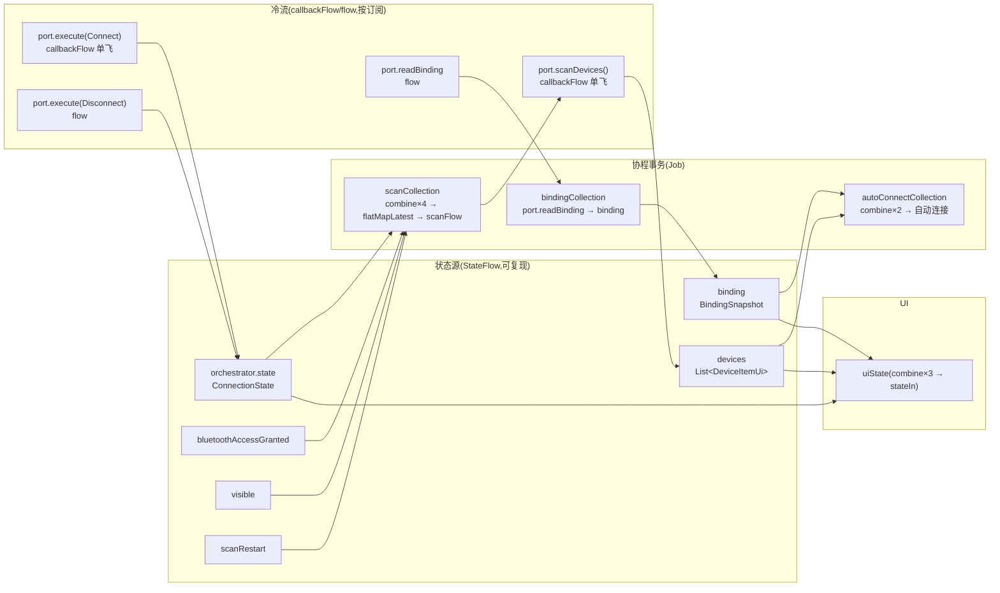

# 流全景与 combine 建模:抗压与低能耗刷新的边界

> 范围:梳理,不改代码。
> 目标:① 列出项目里**所有流**,每个流做什么、怎么做,作为 combine 的铺垫;② 讲清 combine 在这个代码库里的机制;③ 提炼**写流时的边界检查清单**(六问 + 准则),让以后每次写流都有据可依。
> 背景关切:抗压能力如何、刷新事件如何低能耗处理。

## 0. 一句话

**流的全景 = 3 个状态机流(StateFlow)+ 1 个事件队列(Channel)+ 1 个派生 UI 流(combine + stateIn)+ 3 个协程事务(两个 combine + 一个直收)+ 4 个冷流(callbackFlow/flow)。**
combine 是"多个来源的最新值投影成新值,任一来源变化就重算";低能耗的关键在 combine 输出用 `distinctUntilChanged` 按值去重,让 `flatMapLatest` **不重启**底层资源流。

## 1. 流全景

### 1.1 全景图



### 1.2 流清单(全部)

| # | 流 | 类型 | 生产 | 消费 | 生命周期 / 结束 |
|---|---|---|---|---|---|
| 1 | `root.state` | StateFlow | Root 状态机主循环([WorkflowOrchestrator.kt:63-64](migratedev/src/main/kotlin/com/biosensor/migratedev/orchestrator/WorkflowOrchestrator.kt#L63-L64)) | AppMain(导航 + 路由) | rootWorkflow.close |
| 2 | `auth.uiState` | StateFlow | `orchestrator.state.map(toUiState).stateIn(Eagerly)` | AuthRoute | viewModelScope |
| 3 | `connection.uiState` | StateFlow | **combine×3 → stateIn(Eagerly)**(见 2.3) | ConnectionRoute | viewModelScope |
| 4 | `events`(orchestrator 内部) | Channel(UNLIMITED) | `dispatch()` + effect 反馈([WorkflowOrchestrator.kt:57](migratedev/src/main/kotlin/com/biosensor/migratedev/orchestrator/WorkflowOrchestrator.kt#L57)) | 状态机主循环 | orchestrator.close |
| 5 | `binding` | MutableStateFlow | bindingCollection(port.readBinding) | uiState、autoConnect | bindingCollection 取消 |
| 6 | `devices` | MutableStateFlow | scanCollection 收集 | uiState、autoConnect | scanCollection 取消 |
| 7 | `bluetoothAccessGranted` | MutableStateFlow | `submit(BluetoothAccessGranted)` | scanCollection | — |
| 8 | `visible` | MutableStateFlow | `submit(BecameVisible/Hidden)` | scanCollection | — |
| 9 | `scanRestart` | MutableStateFlow(Int) | `submit(Refresh)`(**仅 `!scanActive` 时 +1**) | scanCollection | — |
| 10 | `scanFlow()` | cold Flow | `port.scanDevices()` + onStart/onCompletion/catch | scanCollection(flatMapLatest) | 每次 flatMapLatest 重启 |
| 11 | `port.scanDevices()` | **callbackFlow**(单飞) | Android 原生扫描回调 | scanFlow | awaitClose → stop;竞争失败 → close(ScanFailed) |
| 12 | `port.execute(Connect)` | **callbackFlow**(单飞) | HC 库连接回调 | orchestrator(经 effect→事件) | awaitClose / 超时协程 |
| 13 | `port.execute(Disconnect)` | cold flow | — | orchestrator | emit 一次即完 |
| 14 | `port.readBinding` | cold flow | sqlite 查询 | bindingCollection | 持续收集 |

### 1.3 关键流逐个说

**① `port.scanDevices()`([AndroidBluetoothPort.kt:63-111](migratedev/src/main/kotlin/com/biosensor/migratedev/port/adapter/bluetoothport/AndroidBluetoothPort.kt#L63-L111))——最底层的冷流**
callbackFlow 每次**按订阅**启动一个扫描会话:注册 `NativeBleScanListener` → `synchronized(lock)` 竞争 `activeScan` 单飞位 → 失败直接 `close("蓝牙扫描已经在进行中")` → `scanner.start(listener)` 启 native 扫描 → `awaitClose { finishActiveScan() }` 收尾。监听回调里过 `Bt24AdvertisementFilter`,并把结果写入 `discovered` 缓存 + `trySend` 给订阅者。
**代价**:每次订阅 = 一次完整的 start/stop 往返;单飞拒绝路径 = "蓝牙扫描已经在进行中"。

**② `scanFlow()`([ConnectionTranslation.kt:175-186](migratedev/src/main/kotlin/com/biosensor/migratedev/translation/connection/ConnectionTranslation.kt#L175-L186))——translation 侧的扫描包装**
`port.scanDevices().onStart { clearDevices(); scanActive = true }.onCompletion { scanActive = false }.catch { dispatch(ScanFailed) }`。
**注意两个边界**:`onStart` 无条件清空列表(0.4-0.5s 感知的根源);`catch` 吞掉错误且不重抛——**流正常完成,管道死亡,只能等用户手动刷新**(失败无自愈)。

**③ `scanCollection`([ConnectionTranslation.kt:116-130](migratedev/src/main/kotlin/com/biosensor/migratedev/translation/connection/ConnectionTranslation.kt#L116-L130))——combine + flatMapLatest 的开关事务**
`combine(bluetoothAccessGranted, visible, orchestrator.state, scanRestart)` → `ScanRequest(enabled, restart)`(data class)→ `distinctUntilChanged` → `flatMapLatest { if (enabled) scanFlow() else emptyFlow() }` → `collect { discovered[id] = it; devices.value = ... }`。
**这就是"刷新低能耗"的核心**:enabled 和 restart 不变 → 值相等 → distinct 吞掉 → flatMapLatest 不重启 → native 扫描零感知。

**④ `autoConnectCollection`([ConnectionTranslation.kt:132-140](migratedev/src/main/kotlin/com/biosensor/migratedev/translation/connection/ConnectionTranslation.kt#L132-L140))——自动连接事务**
`combine(binding, devices)` → `(Found)?.deviceId?.takeIf { it in currentDevices }` → `distinctUntilChanged` → `collect { requestConnection(it, automatic = true) }`。
记住的设备一出现在列表里就自动连接;`autoConnectConsumed` 哨兵保证只连一次。

**⑤ `uiState`([ConnectionTranslation.kt:96-104](migratedev/src/main/kotlin/com/biosensor/migratedev/translation/connection/ConnectionTranslation.kt#L96-L104))——给 UI 的纯投影**
`combine(orchestrator.state, binding, devices)` → `state.toUiState(binding, devices)` → `stateIn(Eagerly)`。
UI 只消费这一个流;排序、置灰(remembered 优先)、消息选择都在投影函数里([ConnectionTranslation.kt:249-291](migratedev/src/main/kotlin/com/biosensor/migratedev/translation/connection/ConnectionTranslation.kt#L249-L291))。

## 2. combine 机制详解

### 2.1 combine 是什么(语义)

```kotlin
combine(a, b, c) { va, vb, vc -> 投影(va, vb, vc) }
```

- **输入**:任意多个流(代码库里有 2、3、4 输入三种用法);
- **触发**:任一输入发射新值 → 用**各自最新值**重算投影 → 发射结果(不等其他输入,不等待"同时变化");
- **首值**:每个输入至少发过一个值才开始(本项目输入全是 StateFlow,恒有值,无此问题);
- **背压**:combine 是逐事件合并,发射挂起时输入事件排队,**不丢值**(队列隐式存在);真正的丢值发生在**回调驱动**的 `callbackFlow.trySend`(channel 容量 64,满了返回 false 直接丢)——扫描广播洪峰时,丢的是"UI 列表少更新一次",下一条广播自愈,可接受;
- **结果流是冷流**:没人收集就不干活——所以 UI 流用 `stateIn(Eagerly)` 主动拉起。

### 2.2 三个实例的输入-输出-触发器

| 实例 | 输入 | 投影 | 去重 | 下游 |
|---|---|---|---|---|
| scanCollection | access、visible、state、restart | `ScanRequest(enabled, restart)` | `distinctUntilChanged`(data class 值比较) | `flatMapLatest` 开关 native 扫描 |
| autoConnectCollection | binding、devices | `Found.deviceId?.takeIf { 在列表里 }` | `distinctUntilChanged`(String? 值比较) | `requestConnection` |
| uiState | state、binding、devices | `toUiState()`(排序/置灰/消息) | 无(每次重算,交给 stateIn 的 conflate) | Compose 重组 |

### 2.3 抗压能力评估

| 压力场景 | 行为 | 结论 |
|---|---|---|
| 广播洪峰(native 高频回调) | callbackFlow trySend 缓冲 64,满则丢 | 可自愈(下条覆盖),UI 少一次更新,可接受 |
| 扫描中反复下拉刷新 | state 变化 → combine 重算 → ScanRequest 值相等 → distinct 吞 → flatMapLatest 不重启 | **零成本**,native 无感知 |
| Failed 后刷新 / 生命周期抖动 | restart bump / enabled 翻转 → flatMapLatest 取消旧流启新流 | **真正的成本与风险点**:stop/start 竞争(见 3.2) |
| Connecting/Connected 时刷新 | `submit(Refresh)` 无条件 `clearDevices()` 但 decisioncore no-op | 列表闪空一次,状态机无感知(前端问题,非流问题) |
| uiState 高频变化 | stateIn conflate 跳中间值,Compose 只收最新 | 天然合并,无压 |

### 2.4 刷新事件的低能耗路径(完整链路)

```text
下拉/按钮 → submit(Refresh)
  → clearDevices()                       ← 唯一的前端成本(列表清空)
  → dispatch(RefreshRequested)           → state: Scanning.copy(message=null)
  → if (!scanActive) scanRestart += 1    ← 扫描中不 bump
  → combine 四输入:state 变了 → 重算 ScanRequest(enabled, restart)
  → enabled 不变 + restart 不变 → distinctUntilChanged 吞掉
  → flatMapLatest 不重启 → native 扫描零感知        ← 低能耗的关键
```

**要重启的只有三条路**:Failed→Scanning、BecameHidden→BecameVisible、refresh 恰在扫描未启动时。这三条路才有 stop/start 成本与竞争。

## 3. 边界建模:写流之前的检查清单

### 3.1 流的六问(每个流落笔前问一遍)

| 问 | 要答出什么 | 代码库中的对应案例 |
|---|---|---|
| ① 谁生产? | 单生产者还是多?多生产者需要合并还是互斥? | `discovered` 缓存 + 扫描单飞(互斥) |
| ② 谁消费? | 一个还是多个?多个要 StateFlow 共享,避免 cold 流重复订阅 | `orchestrator.state` 被 3 个 combine 共享 |
| ③ 何时开始? | 冷流按订阅;热流用 `stateIn` 的时机(Eagerly/WhileSubscribed) | uiState 用 Eagerly |
| ④ 何时结束? | `awaitClose`/`onCompletion` 是否覆盖所有出口?取消是否干净? | flatMapLatest 取消**不等待旧流收尾**(竞争源) |
| ⑤ 失败怎么办? | catch 吞掉 = 流正常完成 = 管道死。要重抛、自愈重试、或至少上报 | `scanFlow().catch` 只 dispatch,管道死亡 |
| ⑥ 背压怎么办? | 挂起式 emit 排队;回调式 trySend 丢值。丢值是否可自愈? | callbackFlow 64 缓冲丢广播,下条自愈 |

### 3.2 三类流的边界

| 类别 | 特征 | 适合 | 注意 |
|---|---|---|---|
| **状态流**(StateFlow) | 可复现、读最新、conflate 跳中间值 | "当前是什么":状态机 state、binding、devices、UI 门控 | 别拿它传一次性事件 |
| **事件流**(Channel/SharedFlow) | 一次性、不缓存、消费即消失 | "发生了什么":orchestrator 事件队列 | 本项目统一走 Channel(UNLIMITED),天然排队 |
| **数据流**(cold Flow/callbackFlow) | 按订阅启动、随订阅结束 | 资源型:扫描、连接、sqlite 查询 | 每次订阅都有启停成本;**高频重启场景要共享或幂等** |

### 3.3 combine / flatMapLatest / distinctUntilChanged 使用准则

| 算子 | 什么时候用 | 什么时候别用 |
|---|---|---|
| `combine` | 多个**独立来源** → 一个**派生视图**(uiState 投影) | 输入超 3-4 个说明视图太复杂,该拆(ScanRequest 的 4 输入是边界) |
| `flatMapLatest` | 上游信号**控制下游资源流的生命周期**(扫描开关) | 下游无资源成本时用 `mapLatest`/`flatMapConcat` 就够;且要意识到**取消不等待收尾** |
| `distinctUntilChanged` | 输出是 data class/等价值,防下游重复触发 | 输出本来就单调变化时是浪费 |
| `stateIn` | 把派生流变成 UI 可观察的热流 | 冷流场景(每订阅都要新结果)别用 |

### 3.4 资源单飞与取消竞争(最容易踩的坑)

资源型流(扫描、连接)必须**单飞**:`activeScan` / `connectionSession` + `check(active == null)`([AndroidNativeBleScanner.kt:73](migratedev/src/main/kotlin/com/biosensor/migratedev/port/adapter/bluetoothport/AndroidNativeBleScanner.kt#L73))。
但单飞 + check 意味着:**拒绝路径永远存在**。当 `flatMapLatest` 取消旧流(异步生效)与新流启动(立即执行)竞争时,新流的 `check` 会撞上未收尾的旧扫描 → 新流以 ScanFailed 关闭 → 管道死。防御方向:
- **串行化**:start/stop 过 `Mutex`,消除取消竞争;
- **共享引用计数**:第一个订阅者起扫描,后续订阅挂到同一 active scan,最后一个离开才 stop——重启成本趋近于零,拒绝路径消失;
- **幂等 start**:listener 相同时直接返回。

### 3.5 刷新 / 复位操作的建模(三档)

| 档 | 做法 | 成本 | 适用 |
|---|---|---|---|
| 幂等复位 | clear + 重扫,配 guard(isRefreshing/scanActive)防连发 | 感知成本(等第一个广播 0.4-0.5s) | 现在 |
| 增量更新 | **stale-while-revalidate**:保留旧列表,新广播增量覆盖,旧条目置灰 | 无感;autoConnect 更稳(记住的设备不消失) | 建议目标 |
| 事件合并 | translation 层 coalesce(400ms 内重复 refresh 忽略) | 防连发兜底 | 可选 |

### 3.6 失败自愈准则

`catch { 只上报 }` = 流正常完成 = **管道死亡**。三条出路:① 重抛(让上层知道);② 受限重试(退避 2 次);③ 至少让状态机进入 Failed,把"重试"变成显式用户操作(现在就是这样,但用户要手动刷新才自愈)。

## 4. 对两个问题的回答

**Q1:抗压能力如何?**
- **广播洪峰**:可承受。trySend 丢值自愈,combine 不丢值,stateIn conflate 合并,UI 只收最新。
- **连发刷新**:可承受。distinctUntilChanged 值比较挡住,扫描中刷新零 native 成本。
- **真正的弱点**:重启路径(Failed→Scanning、生命周期抖动)的 stop/start 竞争 → 单飞 check 拒绝 → 管道死;以及 30 秒内启停 5 次被 Android 限流(SCAN_FAILED_SCANNING_TOO_FREQUENTLY)。**这两个都是"重启成本"问题,不是"刷新次数"问题**,治本在 port 层(共享扫描 + 串行化)。

**Q2:刷新事件如何低能耗处理?**
已在 2.4 给出完整链路:扫描中刷新 = 零 native 成本(distinct 挡住);真正有成本的是"重启"而非"刷新"。前端把 `isRefreshing` 变真(现在恒为 false,[ConnectionTranslation.kt:288](migratedev/src/main/kotlin/com/biosensor/migratedev/translation/connection/ConnectionTranslation.kt#L288))即可挡住下拉连发;根治感知延迟是 3.5 的增量更新。

## 5. 落地优先级(建议,未实施)

| 优先级 | 事项 | 层 | 效果 |
|---|---|---|---|
| 1 | `isRefreshing` 反映 `scanActive`,按钮/下拉禁用 | translation | 堵住连发入口,10 分钟 |
| 2 | 刷新不清空列表(stale-while-revalidate) | translation | 0.4-0.5s 感知消失,autoConnect 更稳 |
| 3 | port 层共享扫描 + start/stop 串行化 | port | 重启竞争与限流风险根治 |
| 4 | 失败自愈重试 | translation/port | 管道不再死 |

> 1-2 是纯前端收益,3-4 是后端健壮性。每项都可独立落地,随时可做。
