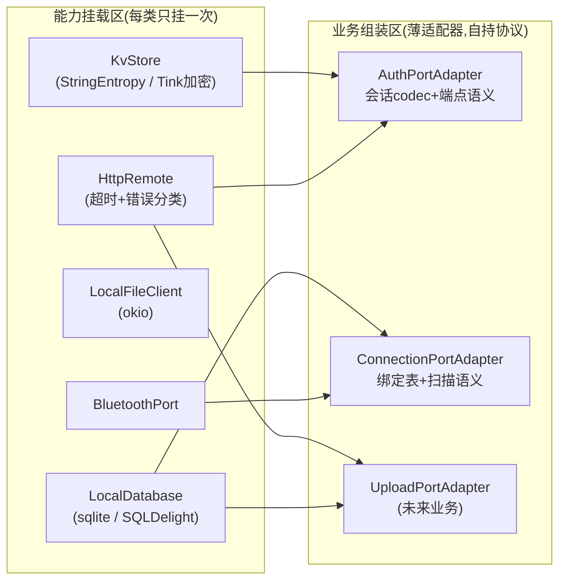
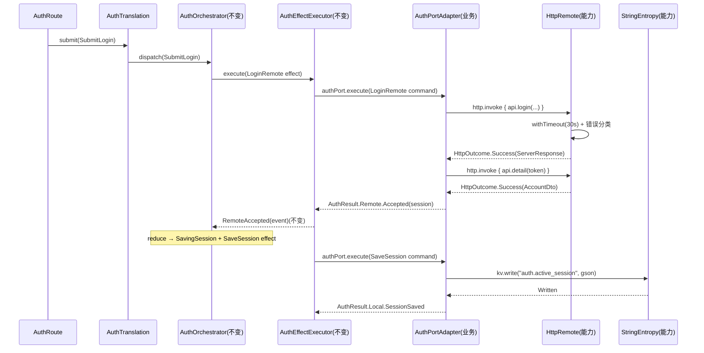

# 端口挂载：能力与业务适配器分离

> 范围：只动 `port` 层（AppGraph 挂载、adapter 归属、本地/远端存储结构）。
> **不动** `decisioncore` / `orchestrator` / `translation` / `UI` —— 它们对本次重构零感知。
> 本重构是**行为等价重构**：不改任何运行逻辑，只改代码归属与挂载结构。
> 状态:**已施工,归档可删**(其沉淀是代码:AuthPortAdapter / ConnectionPortAdapter / HttpRemote 等)。
> 注意:文内 Before/After 与代码块是施工时快照,其中 `CommandPort<Command, Result>` 词汇在后续 [04-词汇统一与契约收尾.md](./04-词汇统一与契约收尾.md) 中被删除(现在接口形态为 `execute(effect): Flow<event>`),**挂载结构不变**。
>
> | 日期 | 变更 |
> |---|---|
> | 2026-08-06 | 核验:修正 After 快照中已删除的 PortContracts.kt,4.2 未来业务示例更新为 effect/event 词汇,标注已施工 |
> | 2026-08-20 | 注记:[09-本地能力统一契约.md](./09-本地能力统一契约.md) 施工后挂载结构再变——能力挂载区改为挂 `LocalPort` 聚合口(`local.kv / local.sql / local.files`),业务组装区 `AuthPortAdapter(kv, http, clock)` / `ConnectionPortAdapter(sql, ble)` / `CgmPortAdapter(ble, files)` |

## 0. 一句话

## 0. 一句话

把"传输 / 存储 / 蓝牙"这类**通用能力**（每类只挂一次）和"端点 / 键名 / 序列化 / 协议编排"这类**业务协议**（每个业务一个薄适配器）分开，AppGraph 从"每个业务一段初始化"变成"能力挂载区 + 业务组装区"两段式。

```text
决策核心(纯词汇) → 业务 Port 接口 + 业务适配器(薄协议) → 通用能力(挂一次)
```

---

## 1. 现状（Before）

### 1.1 项目树与文件职能

```text
migratedev/src/main/kotlin/com/biosensor/migratedev/
├─ AppGraph.kt                                  # 模块装载
├─ port/
│  ├─ PortContracts.kt                          # CommandPort<Command, Result>
│  ├─ auth/
│  │  ├─ AuthPort.kt                            # AuthCommand(Local/Remote) + AuthResult(Local/Remote) + AuthPort 接口
│  │  └─ DefaultAuthPort.kt                     # 分派:Local→persistenceLocalPort, Remote→remoteAuth
│  ├─ connection/
│  │  ├─ ConnectionPort.kt                      # ConnectionCommand/Result + BindingSnapshot + ConnectionPort 接口
│  │  └─ DefaultConnectionPort.kt               # 绑定读写(sqlite) + 蓝牙分派
│  └─ adapter/
│     ├─ localport/
│     │  ├─ LocalPort.kt                        # 捆绑接口:entropy + sqlite + files 三个能力绑成一把
│     │  ├─ AndroidLocalPort.kt                 # Android 侧构造(Tink + DataStore + sqlite + files)
│     │  ├─ PersistenceLocalPort.kt             # ★"本地能力"实为会话业务:ReadSession/SaveSession/ClearSession + 过期判断
│     │  ├─ SessionStore.kt                     # 会话接口 + TTL 常量
│     │  ├─ EntropySessionStore.kt              # 会话 codec(gson + auth.active_session 键名)
│     │  ├─ database/LocalDatabaseFactory.kt    # SQLDelight 构造
│     │  └─ file/OkioLocalFileClient.kt         # okio 文件读写
│     ├─ remoteport/
│     │  └─ RetrofitRemotePort.kt               # createAccountApi + ★Auth 类:login→detail 编排、TTL、错误分类
│     └─ bluetoothport/
│        ├─ BluetoothPort.kt                    # 蓝牙能力契约
│        ├─ AndroidBluetoothPort.kt / AndroidNativeBleScanner.kt
│        ├─ HcBluetoothLibraryClient.kt / Bt24AdvertisementFilter.kt
└─ orchestrator/auth|connection/…               # EffectExecutor 等(本次不动)
```

### 1.2 现状 AppGraph 挂载

```kotlin
internal val localPort: LocalPort = AndroidLocalPort.create(application, applicationScope)

private val persistenceLocalPort = PersistenceLocalPort(
    sessionStore = EntropySessionStore(localPort.entropy), clock = clock   // ★会话形状
)
private val accountApi = RetrofitRemotePort.createAccountApi(BuildConfig.API_BASE_URL)
private val remoteAuth = RetrofitRemotePort.Auth(accountApi, clock)        // ★auth 形状
private val authPort: AuthPort = DefaultAuthPort(persistenceLocalPort, remoteAuth)

private val bluetoothPort: BluetoothPort = AndroidBluetoothPort(application)
private val connectionPort: ConnectionPort = DefaultConnectionPort(localPort, bluetoothPort)  // ★钻 local 全家桶
```

### 1.3 问题定位

| # | 问题 | 表现 |
|---|---|---|
| P1 | 能力类里长着业务 | `PersistenceLocalPort` 名字是"本地持久化能力"，内容是会话业务；`RetrofitRemotePort.Auth` 名字是"远端能力"，内容是登录编排。新业务来了只能往能力类里再塞一个分支 |
| P2 | 同一能力两套访问姿势 | auth 走 `PersistenceLocalPort`（经 SessionStore 包装），connection 直接钻 `local.sqlite`。同一个 sqlite，两种入口 |
| P3 | 依赖面过宽 | `DefaultConnectionPort` 持有 `LocalPort` 全家桶（entropy + sqlite + files），它只需要 sqlite |
| P4 | AppGraph 是业务形状的 | 每接一个业务，AppGraph 就要新写一段业务初始化；能力挂载与业务组装混在一起，读 AppGraph 分不清"项目有什么能力"和"业务用了什么" |

---

## 2. 修订后（After）

### 2.1 分层模型



### 2.2 项目树与文件职能（After）

```text
migratedev/src/main/kotlin/com/biosensor/migratedev/
├─ AppGraph.kt                                  # 两段式:能力挂载区 + 业务组装区
├─ port/
│  ├─ PortContracts.kt                          # CommandPort<Command, Result>(施工时保留,词汇统一后删除,见 [04-词汇统一与契约收尾.md](./04-词汇统一与契约收尾.md))
│  ├─ auth/
│  │  ├─ AuthPort.kt                            # 契约不变
│  │  ├─ AuthPortAdapter.kt                     # ★业务适配器:吸收 PersistenceLocalPort + EntropySessionStore +
│  │  │                                         #   SessionStore + RetrofitRemotePort.Auth 的职责;自持 AccountApi、
│  │  │                                         #   会话 codec、TTL、过期判断
│  │  └─ (原 DefaultAuthPort.kt 删除)
│  ├─ connection/
│  │  ├─ ConnectionPort.kt                      # 契约不变
│  │  └─ ConnectionPortAdapter.kt               # 原 DefaultConnectionPort,依赖从 LocalPort 收窄为 LocalDatabase
│  └─ adapter/
│     ├─ localport/
│     │  ├─ (LocalPort.kt 删除 —— 三个能力各自独立)                    ★配套改动
│     │  ├─ AndroidLocalPort.kt                 # 退化为纯构造工厂,不再实现任何接口
│     │  ├─ (PersistenceLocalPort.kt / SessionStore.kt /
│     │  │    EntropySessionStore.kt 删除 —— 职责并入 AuthPortAdapter)
│     │  ├─ database/LocalDatabaseFactory.kt    # 不变
│     │  └─ file/OkioLocalFileClient.kt         # 不变
│     ├─ remoteport/
│     │  ├─ HttpRemote.kt                       # ★新能力:统一超时 + 传输错误分类(Timeout/Network/Http)
│     │  ├─ OkHttpRemote.kt                     # ★实现:Retrofit 实例 + withTimeout + 分类
│     │  └─ (RetrofitRemotePort.kt 删除 —— AccountApi 归业务,错误分类归能力)
│     └─ bluetoothport/                         # 不变(能力)
└─ orchestrator/auth|connection/…               # 不变
```

### 2.3 修订后 AppGraph 挂载

```kotlin
class AppGraph(application: Application) {
    internal val applicationScope = CoroutineScope(SupervisorJob() + Dispatchers.IO)
    private val rootScope = CoroutineScope(SupervisorJob() + Dispatchers.Main.immediate)
    private val clock = Clock.systemUTC()

    // ── 能力挂载区:每类能力只挂一次 ────────────────────────────
    private val androidLocal = AndroidLocalPort.create(application, applicationScope)
    private val kv: StringEntropy = androidLocal.entropy      // 键值存储(Tink 加密)
    private val sqlite: LocalDatabase = androidLocal.sqlite   // 结构化存储(SQLDelight)
    internal val files: LocalFileClient = androidLocal.files  // 文件(日志初始化使用)
    private val http: HttpRemote = OkHttpRemote(BuildConfig.API_BASE_URL)
    private val ble: BluetoothPort = AndroidBluetoothPort(application)

    // ── 业务组装区:薄适配器,只表达业务协议 ──────────────────────
    private val authPort: AuthPort = AuthPortAdapter(kv, http, clock)
    private val connectionPort: ConnectionPort = ConnectionPortAdapter(sqlite, ble)

    val rootWorkflow = RootWorkflow(authPort, connectionPort, scope = rootScope)
}
```

`MigrateDevApplication` 中 `appGraph.localPort.files` 改为 `appGraph.files`（仅此一处）。

---

## 3. 是否真的有优化（诚实评估）

### 3.1 改善了什么

| 维度 | Before | After |
|---|---|---|
| 新业务接 HTTP | 写 `RetrofitRemotePort.Xxx` 类 + AppGraph 初始化 | 写 `XxxPortAdapter`（本来就要写），能力区零改动 |
| 业务协议归属 | 会话键名/序列化/TTL 散落在 adapter 层的 3 个类里 | 全部内聚在 `AuthPortAdapter` 一个文件 |
| 依赖面 | `DefaultConnectionPort` 依赖 LocalPort 全家桶 | `ConnectionPortAdapter` 只依赖 `sqlite + ble` |
| AppGraph 可读性 | 能力与业务混排，每业务一段 | 两段式：先看有什么能力，再看业务怎么组装 |
| 能力边界 | 传输层错误分类（超时/网络/HTTP）混在 auth 业务里 | 独立 `HttpRemote`，业务按自己语义映射 |

### 3.2 代价与边界（诚实部分）

| 项 | 说明 |
|---|---|
| auth 适配器体积增大 | `AuthPortAdapter` 约 200 行（吸收原 3 个类），这是"业务协议归位"的必然代价 |
| 行为等价、有回归风险 | 不改变任何运行时行为，但文件归属变了，靠重写后的测试兜底 |
| 测试要动 5 个 | `PersistenceLocalPortTest`、`EntropySessionStoreTest`、`EntropySessionStoreInstrumentedTest`、`RetrofitRemotePortTest`、`DefaultConnectionPortTest`（多数是浅层 fake 替换） |
| `LocalPort` 删除是配套改动 | 若嫌大可以保留，但那样 connection 仍依赖全家桶，"依赖收窄"这条就兑现不了 |
| **解决不了问题 2** | Effect/Command 映射"废话"是另一个重构（层级合并），不在本方案内，需单独排期 |

**结论：是优化，但优化的是"挂载清晰度 + 能力复用 + 依赖收窄"三个结构指标，不是性能也不是功能。** 判据很简单：未来每接一个需求.md 里的新业务（数据库上传、设备绑定、压测），这个结构少写多少样板。

---

## 4. 调用说明：业务如何调用端口能力

### 4.1 现有业务（登录）完整链路



**要点：`AuthPort` 接口不变，所以 orchestrator / decisioncore / translation / UI 对本次重构零感知。** 能力只是业务适配器的构造依赖，替换发生在 AppGraph 组装区。

### 4.2 未来业务接入示例（需求.md 第 1 条：数据库上传）

```kotlin
// port/upload/UploadPort.kt —— 业务契约(参照 AuthPort 模式,词汇统一为 effect/event)
interface UploadPort {
    fun execute(effect: UploadEffect): Flow<UploadEvent>   // 领域效果 → 领域事件
    // 直读流(非 effect→event 形态)放这里,如 readPending()
}

// port/upload/UploadPortAdapter.kt —— 业务适配器,拿它需要的能力
class UploadPortAdapter(
    private val http: HttpRemote,
    private val sqlite: LocalDatabase
) : UploadPort {
    private val api = http.api(UploadApi::class.java)   // 业务自持端点
    // http.invoke { api.upload(...) } + sqlite 导出,错误按业务词汇映射
}
```

AppGraph 只加一行，能力区零改动：

```kotlin
// 业务组装区
private val uploadPort: UploadPort = UploadPortAdapter(http, sqlite)
```

### 4.3 能力使用一览

| 能力 | 使用它的业务 | 未来业务 |
|---|---|---|
| `StringEntropy`(kv) | auth（会话持久化） | — |
| `LocalDatabase`(sqlite) | connection（设备绑定） | 数据库上传、压测 |
| `HttpRemote` | auth（登录/注册/验证） | 数据库上传、任务推送 |
| `BluetoothPort` | connection（扫描/连接） | 压测 |
| `LocalFileClient` | 日志初始化 | 生成/读取缓存文件 |

---

## 5. 代码意图与完整代码

### 5.1 能力层：`HttpRemote`（新增）

**意图**：传输层的唯一职责是"发起调用、统一超时、把异常分类成词汇"。它不知道登录、不知道上传，只提供 `HttpOutcome`（Success / Timeout / Network / Http）四种传输结果，业务适配器按自己的语义消费。

```kotlin
package com.biosensor.migratedev.port.adapter.remoteport

sealed interface HttpOutcome<out T> {
    data class Success<T>(val data: T) : HttpOutcome<T>
    data object Timeout : HttpOutcome<Nothing>
    data class Network(val message: String) : HttpOutcome<Nothing>
    data class Http(val code: Int, val message: String) : HttpOutcome<Nothing>
}

/** 传输能力:统一超时与错误分类。端点与语义由业务适配器自己表达。 */
interface HttpRemote {
    fun <T> api(apiClass: Class<T>): T          // 从共享 Retrofit 创建 typed 接口

    suspend fun <T> invoke(block: suspend () -> T): HttpOutcome<T>
}

class OkHttpRemote(
    baseUrl: String,
    okHttp: OkHttpClient = OkHttpClient.Builder()
        .connectTimeout(15, TimeUnit.SECONDS)
        .readTimeout(30, TimeUnit.SECONDS)
        .writeTimeout(30, TimeUnit.SECONDS)
        .build(),
    private val timeoutMillis: Long = 30_000
) : HttpRemote {

    private val retrofit = Retrofit.Builder()
        .baseUrl(baseUrl)
        .client(okHttp)
        .addConverterFactory(GsonConverterFactory.create())
        .build()

    override fun <T> api(apiClass: Class<T>): T = retrofit.create(apiClass)

    override suspend fun <T> invoke(block: suspend () -> T): HttpOutcome<T> = try {
        HttpOutcome.Success(withTimeout(timeoutMillis) { block() })
    } catch (_: TimeoutCancellationException) {
        HttpOutcome.Timeout
    } catch (failure: IOException) {
        HttpOutcome.Network("网络错误：${failure.message ?: "未知"}")
    } catch (failure: HttpException) {
        HttpOutcome.Http(failure.code(), "服务端错误：${failure.code()}")
    }
}
```

> 对照：`RetrofitRemotePort.Auth.execute` 里的 `withTimeout(30s)` + IOException/HttpException 分类，原样上移到这里，行为等价。

### 5.2 业务层：`AuthPortAdapter`（新增，替代 3 个旧类 + 1 个旧适配器）

**意图**：auth 业务协议的全部内容——端点（AccountApi）、会话 codec（键名 + gson + TTL + 过期判断）、传输失败到业务词汇的映射、Timber 日志收口（`Auth.Port`，本地/远端命令一行，全中文）——收拢在一个文件。`AuthCommand`/`AuthResult` 契约不变，行为与现状等价（包括 ValidateSession 的超时/401/403 特殊语义），日志为本次新增（原 auth 域无日志，补齐后与 connection 的 `Connection.Binding` 模式对齐）。

```kotlin
package com.biosensor.migratedev.port.auth

import com.biosensor.migratedev.decisioncore.auth.AuthSession
import com.biosensor.migratedev.decisioncore.auth.User
import com.biosensor.migratedev.port.adapter.localport.EntropyReadResult
import com.biosensor.migratedev.port.adapter.localport.EntropyRemoveResult
import com.biosensor.migratedev.port.adapter.localport.EntropyWriteResult
import com.biosensor.migratedev.port.adapter.localport.StringEntropy
import com.biosensor.migratedev.port.adapter.remoteport.HttpOutcome
import com.biosensor.migratedev.port.adapter.remoteport.HttpRemote
import com.google.gson.Gson
import com.google.gson.JsonParseException
import java.time.Clock
import kotlinx.coroutines.Dispatchers
import kotlinx.coroutines.flow.Flow
import kotlinx.coroutines.flow.flow
import kotlinx.coroutines.flow.flowOn
import retrofit2.http.Body
import retrofit2.http.GET
import retrofit2.http.Header
import retrofit2.http.POST
import timber.log.Timber

// ===== 业务协议:auth 的端点与 DTO(业务自持) =====
interface AccountApi {
    @POST("/api/account/v1/login")
    suspend fun login(@Body request: LoginRequest): ServerResponse<String>

    @POST("/api/account/v1/register")
    suspend fun register(@Body request: RegisterRequest): ServerResponse<AccountDto>

    @GET("/api/account/v1/detail")
    suspend fun detail(@Header("token") token: String): ServerResponse<AccountDto>
}

data class LoginRequest(val phone: String, val password: String)
data class RegisterRequest(
    val username: String, val password: String, val phone: String, val avatarUrl: String?
)
data class AccountDto(
    val id: Long = 0, val username: String? = null, val phone: String? = null,
    val avatarUrl: String? = null, val role: String? = null
)
data class ServerResponse<T>(
    val code: Int = -1, val success: Boolean = false, val msg: String? = null, val data: T? = null
) {
    fun isOk(): Boolean = success || code == 0 || code == 200
}

// ===== 业务适配器:能力 → 业务词汇 =====
class AuthPortAdapter(
    private val kv: StringEntropy,
    private val http: HttpRemote,
    private val clock: Clock = Clock.systemUTC(),
    private val gson: Gson = Gson()
) : AuthPort {

    private val api = http.api(AccountApi::class.java)

    override fun execute(command: AuthCommand): Flow<AuthResult> = when (command) {
        is AuthCommand.Local -> executeLocal(command)
        is AuthCommand.Remote -> executeRemote(command)
    }

    // ── 本地:KV + 会话 codec ──────────────────────────────
    private fun executeLocal(command: AuthCommand.Local): Flow<AuthResult> = flow {
        emit(runLocal(command))
    }.flowOn(Dispatchers.IO)   // Tink 加解密为 CPU 密集

    private suspend fun runLocal(command: AuthCommand.Local): AuthResult.Local {
        val result = when (command) {
            AuthCommand.Local.ReadSession -> when (val read = kv.read(SESSION_KEY)) {
                EntropyReadResult.Missing -> AuthResult.Local.SessionMissing
                is EntropyReadResult.Failed -> corrupted()
                is EntropyReadResult.Found -> parse(read.value)
            }

            is AuthCommand.Local.SaveSession -> if (save(command.session)) {
                AuthResult.Local.SessionSaved
            } else {
                AuthResult.Local.SessionSaveFailed("本地会话写入失败")
            }

            AuthCommand.Local.ClearSession -> when (kv.remove(SESSION_KEY)) {
                EntropyRemoveResult.Removed,
                EntropyRemoveResult.Missing -> AuthResult.Local.SessionCleared

                is EntropyRemoveResult.Failed -> AuthResult.Local.SessionClearFailed("本地会话清理失败")
            }
        }
        Timber.tag(AUTH_TAG).i("本地命令=%s 结果=%s", command::class.simpleName, result::class.simpleName)
        return result
    }

    private fun parse(raw: String): AuthResult.Local {
        val session = try {
            gson.fromJson(raw, AuthSession::class.java)
        } catch (_: JsonParseException) {
            return corrupted()
        } catch (_: IllegalArgumentException) {
            return corrupted()
        }
        if (session == null || session.token.isBlank()) return corrupted()
        val expiresAt = session.expiresAtMillis
        return if (expiresAt != null && clock.millis() >= expiresAt) {
            AuthResult.Local.SessionExpired
        } else {
            AuthResult.Local.SessionFound(session)
        }
    }

    private suspend fun corrupted(): AuthResult.Local {
        kv.remove(SESSION_KEY)
        return AuthResult.Local.SessionReadFailed("本地会话无法解密")
    }

    private suspend fun save(session: AuthSession): Boolean {
        if (session.token.isBlank()) return false
        return try {
            kv.write(SESSION_KEY, gson.toJson(session)) == EntropyWriteResult.Written
        } catch (_: JsonParseException) {
            false
        }
    }

    // ── 远端:端点语义 + 传输失败映射 ──────────────────────
    private fun executeRemote(command: AuthCommand.Remote): Flow<AuthResult> = flow {
        emit(runRemote(command))
    }

    private suspend fun runRemote(command: AuthCommand.Remote): AuthResult.Remote {
        val result = when (command) {
            is AuthCommand.Remote.Login -> login(command.phone, command.password)
            is AuthCommand.Remote.Register -> register(command)
            is AuthCommand.Remote.ValidateSession -> validate(command.session)
        }
        Timber.tag(AUTH_TAG).i("远端命令=%s 结果=%s", command::class.simpleName, result::class.simpleName)
        return result
    }

    private suspend fun login(phone: String, password: String): AuthResult.Remote {
        val login = when (val outcome = http.invoke { api.login(LoginRequest(phone, password)) }) {
            is HttpOutcome.Success -> outcome.data
            else -> return outcome.toRejected()
        }
        if (!login.isOk()) return AuthResult.Remote.Rejected(login.msg ?: "登录失败")
        val token = login.data?.takeIf { it.isNotBlank() }
            ?: return AuthResult.Remote.Rejected("登录响应没有 token")
        val detail = when (val outcome = http.invoke { api.detail(token) }) {
            is HttpOutcome.Success -> outcome.data
            else -> return outcome.toRejected()
        }
        val account = detail.data
        return if (!detail.isOk() || account == null) {
            AuthResult.Remote.Rejected(detail.msg ?: "用户详情验证失败")
        } else {
            AuthResult.Remote.Accepted(
                AuthSession(account.toDomainUser(), token, clock.millis() + LOCAL_TOKEN_TTL_MS)
            )
        }
    }

    private suspend fun register(command: AuthCommand.Remote.Register): AuthResult.Remote {
        val result = when (val outcome = http.invoke {
            api.register(
                RegisterRequest(
                    username = command.nickname,
                    password = command.password,
                    phone = command.phone,
                    avatarUrl = command.avatarUrl
                )
            )
        }) {
            is HttpOutcome.Success -> outcome.data
            else -> return outcome.toRejected()
        }
        return if (result.isOk()) {
            AuthResult.Remote.RegistrationAccepted
        } else {
            AuthResult.Remote.Rejected(result.msg ?: "注册失败")
        }
    }

    private suspend fun validate(session: AuthSession): AuthResult.Remote {
        val detail = when (val outcome = http.invoke { api.detail(session.token) }) {
            is HttpOutcome.Success -> outcome.data
            else -> return outcome.toSessionFailure()
        }
        val account = detail.data
        if (!detail.isOk() || account == null) {
            return AuthResult.Remote.SessionRejected(detail.msg ?: "token 已失效")
        }
        return AuthResult.Remote.SessionVerified(
            AuthSession(account.toDomainUser(), session.token, session.expiresAtMillis)
        )
    }

    // 传输失败 → 业务词汇(登录/注册语义)
    private fun HttpOutcome<*>.toRejected(): AuthResult.Remote = when (this) {
        HttpOutcome.Timeout -> AuthResult.Remote.Timeout
        is HttpOutcome.Network -> AuthResult.Remote.Rejected(message)
        is HttpOutcome.Http -> AuthResult.Remote.Rejected(message)
        is HttpOutcome.Success -> error("不可达")
    }

    // 传输失败 → 业务词汇(会话验证语义:超时/网络/非 401 都视为验证失败)
    private fun HttpOutcome<*>.toSessionFailure(): AuthResult.Remote = when (this) {
        HttpOutcome.Timeout -> AuthResult.Remote.SessionValidationTimeout
        is HttpOutcome.Network -> AuthResult.Remote.SessionValidationTimeout
        is HttpOutcome.Http -> if (code == 401 || code == 403) {
            AuthResult.Remote.SessionRejected(message)
        } else {
            AuthResult.Remote.SessionValidationTimeout
        }
        is HttpOutcome.Success -> error("不可达")
    }

    private companion object {
        const val SESSION_KEY = "auth.active_session"
        const val LOCAL_TOKEN_TTL_MS = 7L * 24 * 60 * 60 * 1000
        const val AUTH_TAG = "Auth.Port"
    }
}

private fun AccountDto.toDomainUser(): User {
    return User(
        id = id.toString(),
        userName = username.orEmpty(),
        telephone = phone.orEmpty(),
        avatarUrl = avatarUrl
    )
}
```

### 5.3 业务层：`ConnectionPortAdapter`（原 DefaultConnectionPort 改依赖）

**意图**：逻辑一行不改，只把 `local: LocalPort`（全家桶）收窄为 `sqlite: LocalDatabase`。这兑现了"依赖收窄"。
> 下方代码为施工时形态(词汇 `ConnectionCommand/ConnectionResult`);词汇统一后签名统一为 `execute(effect: ConnectionEffect): Flow<ConnectionEvent>`,蓝牙命令包在 `ConnectDevice/DisconnectDevice` 内部,结构不变(见 [04-词汇统一与契约收尾.md](./04-词汇统一与契约收尾.md))。

```kotlin
package com.biosensor.migratedev.port.connection

class ConnectionPortAdapter(
    private val sqlite: LocalDatabase,
    private val bluetooth: BluetoothPort,
    private val nowMillis: () -> Long = System::currentTimeMillis
) : ConnectionPort {

    override fun scanDevices(): Flow<BluetoothDeviceInfo> = bluetooth.scanDevices()

    override fun readBinding(userId: String): Flow<BindingSnapshot> = flow {
        val result = runCatching {
            sqlite.deviceBindingQueries.findByUserId(userId).executeAsOneOrNull()
        }.fold(onSuccess = { binding ->
            binding?.let { BindingSnapshot.Found(it.deviceId) } ?: BindingSnapshot.Missing
        }, onFailure = {
            BindingSnapshot.Failed(it.message ?: "读取设备绑定失败")
        })
        Timber.tag(BINDING_TAG).i("绑定读取 结果=%s", result::class.simpleName)
        emit(result)
    }.flowOn(Dispatchers.IO)

    override fun execute(command: ConnectionCommand): Flow<ConnectionResult> = when (command) {
        is ConnectionCommand.SaveBinding -> saveBinding(command.userId, command.deviceId)
        is ConnectionCommand.Bluetooth -> bluetooth.execute(command.command).map {
            ConnectionResult.Bluetooth(it)
        }
    }

    private fun saveBinding(userId: String, deviceId: String): Flow<ConnectionResult> = flow {
        val result = runCatching {
            sqlite.deviceBindingQueries.upsert(
                userId = userId, deviceId = deviceId, updatedAtMillis = nowMillis()
            )
        }.fold(onSuccess = {
            ConnectionResult.BindingSaved(deviceId)
        }, onFailure = {
            ConnectionResult.BindingSaveFailed(it.message ?: "保存设备绑定失败")
        })
        Timber.tag(BINDING_TAG).i("绑定保存 结果=%s", result::class.simpleName)
        emit(result)
    }.flowOn(Dispatchers.IO)

    private companion object {
        const val BINDING_TAG = "Connection.Binding"
    }
}
```

### 5.4 配套改动：`AndroidLocalPort` 与 `MigrateDevApplication`

```kotlin
// AndroidLocalPort:删除 `: LocalPort` 实现,退化为纯构造工厂(成员不变)
class AndroidLocalPort private constructor(
    val entropy: StringEntropy,
    val sqlite: LocalDatabase,
    val files: LocalFileClient
) {
    companion object { fun create(context: Context, applicationScope: CoroutineScope): AndroidLocalPort { /* 原逻辑不变 */ } }
}
```

```kotlin
// MigrateDevApplication:一处引用修改
files = appGraph.files   // 原 appGraph.localPort.files
```

### 5.5 删除清单

| 文件 | 去向 |
|---|---|
| `port/adapter/localport/LocalPort.kt` | 删除（三个能力独立为契约） |
| `port/adapter/localport/PersistenceLocalPort.kt` | 职责并入 `AuthPortAdapter` |
| `port/adapter/localport/SessionStore.kt` | 职责并入 `AuthPortAdapter` |
| `port/adapter/localport/EntropySessionStore.kt` | 职责并入 `AuthPortAdapter` |
| `port/adapter/remoteport/RetrofitRemotePort.kt` | 拆为 `HttpRemote`(能力) + `AccountApi`(归业务) |
| `port/auth/DefaultAuthPort.kt` | 改名 + 改构造为 `AuthPortAdapter(kv, http, clock)` |
| `port/connection/DefaultConnectionPort.kt` | 改名 + 改依赖为 `ConnectionPortAdapter(sqlite, ble)` |

---

## 6. 对之前几个问题的解答

**Q：能力与业务是不是分离了？**
分离了。判据：问一句话——"这行代码换到另一个业务还通用吗？"
- 通用（超时、错误分类、加解密 KV、SQLDelight、扫描）→ 能力层；
- 不通用（`auth.active_session` 键名、TTL、login→detail 编排、`/api/account/v1/*` 端点）→ 业务适配器。
按这个判据回看现状：`PersistenceLocalPort` 和 `RetrofitRemotePort.Auth` 的"通用外壳"里装的都是"不通用"的业务，这就是 P1。

**Q：AppGraph 挂载是不是更清晰了？**
清晰了。读法变成固定的两步：先看能力挂载区（项目有什么能力，每类一行），再看业务组装区（哪些业务在用，各拿什么能力）。新增业务 = 组装区加一行，能力区不动。Before 里 `persistenceLocalPort → EntropySessionStore → localPort.entropy` 这种链式追溯消失。

**Q：本地存储"读键取值"落实了吗？**
落实了。`StringEntropy`（read/write/remove/contains by key）就是 KV，它本来就是通用能力，只是被 `EntropySessionStore` 用业务键名 + 业务序列化盖住了。重构后：KV 是能力、键名和 gson 是业务（`AuthPortAdapter` 内 `SESSION_KEY` + codec）。**sqlite 保留**——设备绑定是"按 userId 查一行"的结构化查询，不该硬塞进 KV，两种存储能力并存是合理的。

**Q：新业务还要单独初始化才能挂远端吗？**
不需要。`HttpRemote` 挂一次，新业务拿它 + `api(XxxApi::class.java)` 自持端点即可（见 4.2）。

**Q：这个改动解决了"映射废话"（问题 2）吗？**
不解决，也不应该顺带做。问题 2 是"Effect/Command 层级合并"，涉及 decisioncore 与 orchestrator；本次重构只动 port 层。两者互不阻塞，先落本次，问题 2 单独排期。

---

## 7. 影响面与实施顺序

### 7.1 影响面

- **生产代码**：新增 3 个文件（`HttpRemote.kt`、`OkHttpRemote.kt`、`AuthPortAdapter.kt`），修改 5 个（`AppGraph`、`AndroidLocalPort`、`MigrateDevApplication`、`ConnectionPortAdapter`、`AuthPort` 文件名随适配器），删除 6 个。
- **测试**：重写 5 个（fake 层面替换），新增 `HttpRemoteTest`（可选）。
- **上游**：`decisioncore` / `orchestrator` / `translation` / `UI` **零改动**。

### 7.2 实施顺序（每步可独立验证）

1. **新增能力**：`HttpRemote` + `OkHttpRemote`（纯新增，现有代码不动，可编译）。
2. **新增 `AuthPortAdapter`**：从旧类复制逻辑并改写依赖；旧类先保留。
3. **AppGraph 切换 auth**：`AuthPortAdapter(kv, http, clock)` 替换 `DefaultAuthPort(...)`；删除 `PersistenceLocalPort` / `SessionStore` / `EntropySessionStore` / `RetrofitRemotePort`；重写 auth 相关测试；跑通登录/会话恢复。
4. **connection 同步**：`ConnectionPortAdapter` + AppGraph 切换；重写 `DefaultConnectionPortTest`。
5. **收尾**：删除 `LocalPort` 接口、`AndroidLocalPort` 去接口化、`MigrateDevApplication` 改引用；全量回归。

> 步骤 3 与 4 是同一模式的两次演练——先 auth 后 connection，第二次会明显更快。
