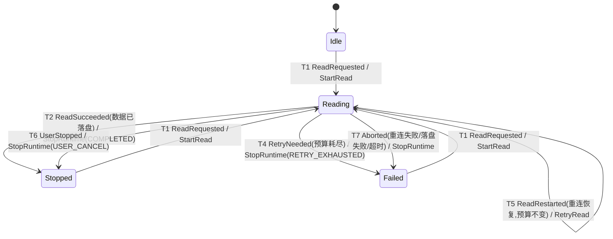
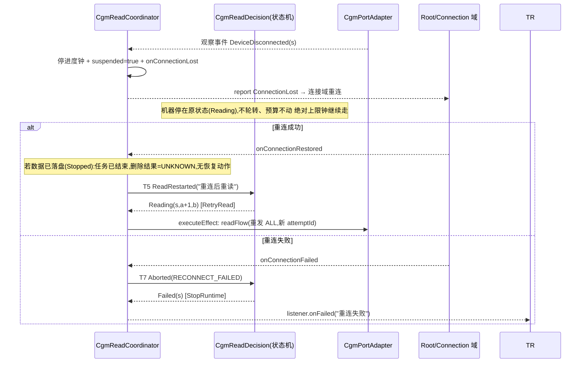

# 架构 10:Cgm 读流程职责重组(状态机收缩 + 监听器接管)

> 范围:`decisioncore/cgm` 读状态机收缩 + `translation/cgm` 新增协调器 + `port/cgm` 观察事件与落盘直调。
> 前置:[07-缓存明文流阶段链.md](./07-缓存明文流阶段链.md)、[01-父子编排器.md](./01-父子编排器.md)、[03-端口挂载与业务适配器.md](./03-端口挂载与业务适配器.md)、[08-统一蓝牙管理器.md](./08-统一蓝牙管理器.md)、[Workflow 12-cgm通信静默根因分析.md](../Workflow/12-cgm通信静默根因分析.md)。
> 状态:**设计稿,未施工**。施工完成后标注"已施工,归档可删"。文档中代码块为设计稿,施工后按真实代码回填核对。
>
> | 日期 | 变更 |
> |---|---|
> | 2026-08-21 | 初稿:调研外部实践后,按"监听器接管四件事 + 状态机收缩为任务生命周期"重设计读流程 |
> | 2026-08-21 | 修订一(用户三点):转移编号 T1-T12、完整代码、状态机 × 监听配合图 |
> | 2026-08-21 | 修订二(用户评审):计时拆三层(首响应/进度/绝对上限)、代际防迟到事件(sessionId+attemptId+commandId)、收尾失败语义与 journal 持久化、UX 文案、指标量化、三类测试;§2.1-2.3 改为角色职责与四场景分工文字版(此后架构文档标配) |
> | 2026-08-21 | 修订三(用户否决 journal):删除 DeleteJournal/ReadRecoveryWorker 及一切 journal 恢复语义——设备缓存是持续增长的时间线,上次没删无害(下次读取去重兜底),但恢复删除会把两次读取之间设备新产生的数据一起删掉;自动删除降级为"尽力而为,不阻塞、不重试、不恢复";新增去重设计(判据 CgmRecord.text,范围单会话内,两层算法:协调器块间剥离 + 校验链 CacheRecordDeduper 相邻去重);状态机收缩为 4 态 6 事件 3 effect(删除不再是闸门) |

## 0. 一句话

**读缓存流程按"发生了什么(协调器/监听器)与算什么(状态机)"两层职责重组:连接生命周期、数据终结符、计时、重试可见性移给协调器;状态机收缩为任务生命周期机,只保留阶段与重试预算;所有事件带代际(sessionId+attemptId)防迟到污染;计时拆三层(首响应 20s / 有效新记录 60s / 会话绝对上限 240s);数据落盘即任务完成,自动删除设备缓存降级为"尽力而为"的后台动作(不阻塞、不重试、不恢复——未删无害,恢复删除反而会误删设备新数据);重复数据按两层去重(协调器块间剥离 + 校验链相邻去重),范围限定单会话内,不做全局唯一(跨段相同文本是合法数据)。**

```text
蓝牙事件(DataReceived/Disconnected)
  → [port] 解析管道(END 检测上移)+ 代际标记 → 观察事件(RecordsProduced/ReplayEnded/...)
  → [协调器·新增] 唯一事件入口:代际过滤 + 块间剥离判重 + 三层计时 + 校验 + 挂起/恢复 → 结论事件
  → [状态机·收缩] 阶段 + 预算 → effects(StartRead/RetryRead/StopRuntime)
  → [协调器] 落盘直调 + 尽力而为删除(结果只更新文案)+ CgmReadListener 回调给 UI/Root
```

## 1. 现状与问题

### 1.1 现状:8 状态 13 事件,四类职责混在一个转移表

现状状态机 `CgmReadDecision`([CgmReadDecision.kt](../../migratedev/src/main/kotlin/com/biosensor/migratedev/decisioncore/cgm/CgmReadDecision.kt))把**任务推进**、**连接生命周期**、**数据判定**、**展示复位**四类不同性质的职责塞进同一张转移表:

| 状态 | 性质 | 为什么不该在转移表里 |
|---|---|---|
| Idle / Sending / Receiving / Completed | 任务推进 | 该留(其中 Sending 与 Receiving 仅差一个"命令已送达"细节,协调器不需要区分) |
| **Reconnecting** | 连接生命周期 | 断线/重连是连接域的事;状态机为此新增 3 个事件且 Translation 还要先查态再派发 |
| **Error** | 展示复位 | 只为了"显示一条异常"就占用状态 + ResetError 事件 + 每次 submit 前的复位仪式 |
| **Failed / Stopped** | 终态结论 | 区分有意义(重试耗尽 vs 正常完成),但它们是**结论**,由监听器上报即可 |

现状 `onRecords`([CgmReadDecision.kt:83-114](../../migratedev/src/main/kotlin/com/biosensor/migratedev/decisioncore/cgm/CgmReadDecision.kt#L83-L114))是问题最集中的一处:决策层扫描数据找终结符(协议知识在解析层却让状态机重复判定)、状态机携带全量累积(O(n²) 拼接)、END 判定与校验挤在 reduce 里。

### 1.2 四个错位点

| # | 错位 | 代码证据 | 后果 |
|---|---|---|---|
| 1 | 连接生命周期进转移表 | [CgmReadDecision.kt:153-185](../../migratedev/src/main/kotlin/com/biosensor/migratedev/decisioncore/cgm/CgmReadDecision.kt#L153-L185)、[CgmTranslation.kt:112-125](../../migratedev/src/main/kotlin/com/biosensor/migratedev/translation/cgm/CgmTranslation.kt#L112-L125) | 连接事件在任务机里手搓连接监听器 |
| 2 | 决策层扫描终结符 + 携带全量数据 | [CgmReadDecision.kt:89-92](../../migratedev/src/main/kotlin/com/biosensor/migratedev/decisioncore/cgm/CgmReadDecision.kt#L89-L92) | 状态机被迫感知协议;O(n²) 累积拷贝 |
| 3 | 重试静默、无跨重试心跳 | [CgmReadDecision.kt:107-113](../../migratedev/src/main/kotlin/com/biosensor/migratedev/decisioncore/cgm/CgmReadDecision.kt#L107-L113);port 空闲超时随每条新流重启 | 设备每 <60s 挤一点数据、END 永不到 → 无限 Receiving;重试原因用户不可见 |
| 4 | Error 展示态 + 复位仪式 | [CgmContracts.kt](../../migratedev/src/main/kotlin/com/biosensor/migratedev/decisioncore/cgm/CgmContracts.kt)、[CgmTranslation.kt:154-159](../../migratedev/src/main/kotlin/com/biosensor/migratedev/translation/cgm/CgmTranslation.kt#L154-L159) | 一个 toast 级别的展示需求占用状态机 + 复位仪式 |

### 1.3 外部实践调研(2026-08-21)

| 来源 | 做法 | 借鉴点 |
|---|---|---|
| [Silicon Labs BLE 架构](https://docs.silabs.com/bluetooth/latest/bluetooth-le-fundamentals/02-bluetooth-smart-architecture) | 链路层状态机与主机层 GATT 事件回调分层 | 分层是蓝牙体系的标准做法,与"状态机收缩、监听器接管"同构 |
| [TEJVON: How BLE Reconnection Fails on Android](https://tejvon.com/insights/ble-reconnection-android)(2026-06) | 独立连接状态机,状态以 StateFlow 暴露,UI 反应状态流;故障率 18% → 0.4% | 连接生命周期是独立状态机,不混入业务任务机;UI 反应状态流 |
| [Wikipedia: Event-driven FSM](https://en.wikipedia.org/wiki/Event-driven_finite-state_machine) / [ed-fsm-library](https://github.com/ThanhNguyen-Tien/ed-fsm-library) | 单消费者事件循环,多生产者投递,状态机只做转移 | 印证 WorkflowOrchestrator 形态是标准,不替换,只改投递对象 |
| [Android 官方 GATT 指南](https://developer.android.com/develop/connectivity/bluetooth/ble/connect-gatt-server) | 底层 `BluetoothGattCallback` 回调 + 上层自行管理状态 | 官方实践 = 底层回调 + 上层状态管理 |

**结论**:没有"用监听器替代状态机"的主流实践,标准做法是**职责分层**。正确形态是**分层重组而非替换**:状态机收缩回任务生命周期高度,连接/数据/时间交给各层观察者。

## 2. 设计

### 2.1 角色与职责(分工文字版)

**先说清楚参与这件事的五个角色,每个角色一句话,括号里是实现:**

1. **状态机**(`CgmReadDecision` 的 reduce):只记任务进度、查重试次数,然后拍板(继续 / 重试 / 结束 / 失败)。四个档:没开始、正在读、正常结束、失败。它是纯函数,自己不做任何现场动作。**删除确认、落盘完成这些收尾细节不进状态机**——数据一落盘任务就结束了,删设备缓存是完成后的事。
2. **协调器**(`CgmReadCoordinator`):读流程的现场执行者。收设备来的数据、攒数据、做块间剥离判重、对账(数据全不全)、盯三只钟(命令响应、进度停滞、会话绝对上限)、断线时挂起任务。把判断结果(读成功 / 要重试 / 恢复重读 / 终止)报给状态机。所有设备事件都先进它这里,它验明代际(是不是当前这轮/这个会话的)才放行。**数据落盘后,它自己发起一次"尽力而为"的自动删除**(发 DELETE、等确认,结果只用来更新 UI 文案,不阻塞任务、不重试、不恢复)。
3. **适配器**(`CgmPortAdapter` + 解析管道):只跟设备打交道。发命令(ALL / DELETE)、收原始字节、把字节解析成数据记录、认"回放完了"的终结符、映射断线。产出带代际标记的观察事件。
4. **翻译层**(`CgmTranslation`):接 UI 的点按、把进展拼成界面显示(7 种文案,删除结果单独一种)、把断线和重连结果转给 Root(连接域)、把指标事件交给埋点。
5. **UI**(`CgmScreen` / `CgmUiState`):显示。文案不能有歧义("数据保留"这种话不说了,改成明确区分"已保存到手机"和"设备缓存已清除")。

**一句话分工:适配器管设备,协调器管现场判断,状态机管进度拍板,翻译层管界面和上报。设备事件永远不进状态机,只有协调器转交的结论能进。删除不是任务闸门,是完成后的一次尽力而为,结果只影响文案。**

### 2.2 合作过程:五个场景(过程文字版)

#### 场景一:正常读通

1. **UI**:用户点"读缓存",发出读请求 → **翻译层**接住,先查短命令(对时/删缓存)是不是在跑,在跑就拒绝并提示;没冲突就把读请求交给**协调器**(调用协调器的 submitRead)。
2. **协调器**:开新会话(生成 sessionId),向**状态机**报告"要读"(派发 ReadRequested)。
3. **状态机**:当前空闲,记下**「正在读,第 0 次尝试,已耗 0 次预算」**,下发"开始读"(派发 StartRead effect)。
4. **协调器**:执行开始读,调用适配器的 readFlow(向设备发 ALL 命令,要求回放全部缓存;同时启动会话绝对上限钟 240 秒)。
5. **适配器**:收到设备回放的原始字节,用解析管道逐块解析成数据记录,发出"数据到了"事件(带 sessionId + attemptId 标记,证明是这一轮的数据)。
6. **协调器**:接住"数据到了",先验代际:attemptId 不是当前轮的直接丢弃(防上一轮的旧数据来搅局);是本轮的 → 做块间剥离(新块与已累积的尾部比对,字节块重发产生的重复前缀剥掉;整块都是重复 = 循环回放,不算进展)→ 追加进累积列表 → 重置"进度停滞钟"(60 秒内有有效新记录都算正常)→ 回调 onRecordsProduced。
7. **翻译层**:收到回调,把累积列表映射成 UI 状态 → **UI** 看板实时显示"正在从设备导入:已收到 37 条"。
8. **适配器**:识别到回放结尾(END 终结符,这是解析层的协议知识),发出"回放结束"事件(带 attemptId)。
9. **协调器**:接住"回放结束"(验代际后),用校验器链对累积数据对账(边界规整 → marker 校验 → 相邻去重 → 结构校验,去重细节见 §2.7)。齐全 → 调用适配器的 writeFile 把数据落盘(写本地文件,拿到文件路径;写失败见场景五)。
10. **协调器**:落盘成功 → 向**状态机**报告"读成功"(派发 ReadSucceeded)。
11. **状态机**:收到"读成功",记下**「正常结束」**,下发"收尾"(StopRuntime,原因:正常完成)。
12. **协调器**:执行收尾:停掉所有钟,回调 onSaved(路径 + 条数,UI 亮"已导入 120 条,已保存到手机")。**然后做一次尽力而为的自动删除**:调用适配器的 deleteFlow(向设备发 DELETE,要求删缓存)——这是后台动作,不阻塞任务完成、不重试、不恢复。
13. **适配器**:设备确认删除,发出"删除确认"事件(带 sessionId)。
14. **协调器**:接住"删除确认",验 sessionId 是刚结束的会话 → 更新删除状态为「已清除」(只影响文案和指标,状态机不动)。
15. **翻译层**:UI 文案追加"设备缓存已清除"。(若删除超时或断线,见场景五第 2 步——文案换成"清除结果未知",数据本身已安全。)

#### 场景二:数据不全,要重试

1. 第 1~9 步同场景一,但第 9 步对账发现数据不全 → **协调器**:先回调 onRetry("缺了 XX", 第 2 次)→ **翻译层**在 UI 和日志显示"数据不完整,正在重新读取(第 2/4 次)"(重试不静默)→ 再向**状态机**报告"要重试"(派发 RetryNeeded,带原因)。
2. **状态机**:查重试预算:没到 3 次 → 记下**「正在读,第 2 次尝试,已耗 1 次预算」**,下发"重试"(派发 RetryRead effect)。
3. **协调器**:执行重试:清空累积列表(重新读一遍,避免新旧数据重复),调用适配器的 readFlow 重发 ALL(带新的 attemptId=2),数据重新回放,回到收数据环节。**绝对上限钟不重置**(整个会话只剩 240 秒总预算)。
4. 若重试到第 4 次仍不全 → **状态机**:查预算发现超限 → 记下**「失败(原因)」**,下发"收尾" → **协调器**:停钟,回调 onFailed → **翻译层**:UI 显示失败和原因。

#### 场景三:读到一半断线

1. 读的过程中设备断开 → **适配器**(readFlow 内):识别蓝牙断线,发出"断线"观察事件,立即结束当前命令流(释放蓝牙消费权)。
2. **协调器**:接住"断线":停掉进度钟,把任务标记为**挂起**,回调 onConnectionLost。**绝对上限钟继续走**(断线也不延长会话上限)。
3. **翻译层**:收到回调,上报"连接丢失"给 Root,由连接域驱动重连。
4. **状态机**:全程不知情,还停在**「正在读」**,重试预算不动。
5. 重连成功 → Root 通知**翻译层** → 转交协调器的 onConnectionRestored → **协调器**:看当前状态,分两种情况:
   - 还在**「正在读」**:向**状态机**报告"恢复重读"(派发 ReadRestarted)→ 状态机记**「还在读,次数不变」**(断线不罚次数),下发"重试" → 协调器清空累积、重发 ALL(全量回放,恢复不等于断点续传)。
   - 已在**「正常结束」**(数据已落盘):任务已经完成了,没有要恢复的事。自动删除是尽力而为的,断线了结果就记为「未知」,不重发、不挂起、不恢复——下次读取时设备缓存若还在,数据重读一遍,由去重和校验兜底(见 §2.7),不会出错。
6. 若重连失败 → Root 通知**翻译层** → 转交协调器 onConnectionFailed → **协调器**向**状态机**报告"终止(重连失败)" → 状态机记**「失败」** → UI 显示失败原因。
7. UI 文案:断线期间显示"连接中断,正在重连;本次读取将从头校验"。

#### 场景四:长时间收不到数据(卡住)

三只钟分工,各管一段:

1. **首响应钟(20 秒,适配器管)**:发出 ALL 后 20 秒内完全没有任何响应(连断线都没有)→ 适配器发"命令无响应"观察事件 → 协调器验代际后报"要重试"(原因:命令无响应)。**每次新发 ALL 都重新计时**。
2. **进度停滞钟(60 秒,协调器管)**:距最后一条**有效新记录**(块间剥离后算数,循环回放的老数据不算)超过 60 秒 → 协调器报"要重试"(原因:数据停滞)。**只有有效新记录重置它**——所以"设备循环回放同一批数据"骗不过它。
3. **绝对上限钟(240 秒,协调器管)**:整个会话从开始算起超过 240 秒 → 协调器直接报"终止"(原因:会话超时)。**重试、重连、数据一直在来,都不延长它**——所以"设备每 50 秒挤一点新数据、永远不来 END"的活死,由它兜底。

触发顺序:正常情况下 1 → 2 → 3 依次兜底;任一触发后走场景二的重试流程,预算耗尽(第 4 次)或上限到点 → 状态机判**「失败」**,终局。卡住有终局,不会无限等——这是原来"重试重启超时窗 + 静默转移"堵不住的部分。

#### 场景五:收尾出问题(落盘失败 / 删除结果未知)

1. **写文件失败**:协调器调 writeFile 抛异常 → 向**状态机**报告"终止(落盘失败)" → 记**「失败」**。**此时绝不发 DELETE**(设备缓存没删,用户可以重新读——数据还在设备上,诚实可重来)。
2. **已落盘、但删除确认一直不来**(断线、ACK 丢失、设备不回应):**不失败、不谎称、不重试、不恢复**。数据已经安全保存在手机上了,任务已经完成;删除结果记为「未知」,UI 显示"数据已保存到手机;设备缓存清除结果未知(不影响已保存数据,下次读取会自动去重)"。**不做"重连后继续确认"这类恢复**——见 §2.7,恢复删除有删掉设备新数据的风险,而未删最多下次多读一遍旧数据,由去重兜底,损失远小于误删。

### 2.3 配合规则(三条)

1. **适配器只对设备**,产出"发生了什么"的观察事件,且每个事件带代际标记(sessionId + attemptId)。
2. **协调器是唯一事件入口**:所有观察事件先进协调器,它按当前代际过滤(不是这一轮/这个会话的直接丢弃),然后做现场判断,把结论报给状态机(读成功 / 要重试 / 恢复重读 / 终止)。删除确认只更新协调器自己的删除状态(UI 文案),不产生结论事件。
3. **状态机只收结论**:记进度、查预算、拍板,下发执行指令给协调器。断线不进状态机(场景三),数据落盘即完成(没有"等删除确认"这个闸门)。

### 2.4 状态机与配合图

#### 2.4.1 词汇(收缩后:4 态 6 事件 3 effect)

```kotlin
// ── 收缩后的读状态机词汇 ──
// 代际:sessionId = 一次"用户点读缓存";attemptId = 会话内每次实际发 ALL(+1,重试/恢复重读都加);
//       budgetSpent = 重试预算消耗(只有 RetryNeeded 加)。
// 收尾细节(落盘/删除确认)不进状态机:数据落盘即 Stopped,自动删除由协调器尽力而为。
// StopReason 增加 FILE_WRITE_FAILED / DEADLINE,其余不变。

sealed interface CgmReadState {
    data object Idle : CgmReadState
    /** 任务进行中。数据累积不在状态里(在协调器),代际与预算在此。 */
    data class Reading(
        val session: CgmSession, val attemptId: Int, val budgetSpent: Int
    ) : CgmReadState
    /** 终态:正常完成(数据已落盘,数据快照由协调器保留,UI 只读)。 */
    data class Stopped(val session: CgmSession) : CgmReadState
    /** 终态:预算耗尽 / 重连失败 / 落盘失败 / 会话超时。 */
    data class Failed(val session: CgmSession, val reason: String) : CgmReadState
}

sealed interface CgmReadEvent {
    data class ReadRequested(val sessionId: String, val deviceId: String) : CgmReadEvent
    /** 协调器结论:校验通过且已落盘(落盘先于本事件)。数据保存即任务完成。 */
    data class ReadSucceeded(val sessionId: String) : CgmReadEvent
    /** 协调器结论:校验失败 / 停滞 / 无响应,消耗一次重试预算。 */
    data class RetryNeeded(val sessionId: String, val reason: String) : CgmReadEvent
    /** 协调器结论:断线重连后恢复重读,不消耗预算。 */
    data class ReadRestarted(val sessionId: String, val reason: String) : CgmReadEvent
    /** 程序化停止:用户取消。 */
    data class UserStopped(val sessionId: String) : CgmReadEvent
    /** 程序化终止:重连失败 / 落盘失败 / 会话超时。 */
    data class Aborted(val sessionId: String, val reason: StopReason) : CgmReadEvent
}

sealed interface CgmReadEffect {
    data class StartRead(val session: CgmSession) : CgmReadEffect
    data class RetryRead(val session: CgmSession, val reason: String) : CgmReadEffect
    data class StopRuntime(val session: CgmSession?, val reason: StopReason) : CgmReadEffect
    // WriteFile 不是 effect:落盘由协调器直调 port.writeFile(协调器持有累积),成功后派发 ReadSucceeded。
    // SendDelete 不是 effect:落盘成功后协调器自行发起"尽力而为"的自动删除,不阻塞任务、不重试。
}

/** 自动删除结果(协调器持有,UI 文案依据;不进状态机)。 */
enum class DeleteState { PENDING, CLEARED, UNKNOWN }
```

#### 2.4.2 转移表(T1-T7,编号供全场景流程引用)

| # | 当前状态 | 事件 | 新状态 | effects |
|---|---|---|---|---|
| T1 | Idle / Stopped / Failed | ReadRequested | Reading(s, 0, 0) | StartRead |
| — | Reading | ReadRequested | 不变(幂等,串行守卫) | — |
| T2 | Reading(s, a, b) | ReadSucceeded(s)(已落盘) | Stopped(s) | StopRuntime(COMPLETED) |
| T3 | Reading(s, a, b) | RetryNeeded(预算内, b+1 ≤ 3) | Reading(s, a+1, b+1) | RetryRead |
| T4 | Reading(s, a, b) | RetryNeeded(b+1 > 3) | Failed(s, reason) | StopRuntime(RETRY_EXHAUSTED) |
| T5 | Reading(s, a, b) | ReadRestarted | Reading(s, a+1, b)(预算不变) | RetryRead |
| T6 | Reading | UserStopped | Stopped(s) | StopRuntime(USER_CANCEL) |
| T7 | Reading | Aborted(重连失败/落盘失败/超时) | Failed(s, reason.name) | StopRuntime(reason) |
| — | 其余组合 | 任意事件(代际不匹配/迟到) | 不变(幂等,忽略) | — |

#### 2.4.3 状态机图(带编号)



与现状相比:删 Sending、Reconnecting、Error 三态;删 CommandAccepted、CommandTimeout、DeviceDisconnected、DeviceReconnected、DeviceReconnectFailed、FileWriteFailed、StopCurrent、ResetError 八事件;`onRecords` 整段删除。`reduce` 只剩阶段判定、预算判定两件事,纯函数、可单测。

#### 2.4.4 配合时序图(主场景:正常完成,消息带转移编号)

```mermaid
sequenceDiagram
    participant UI as CgmScreen(UI)
    participant TR as CgmTranslation
    participant CO as CgmReadCoordinator(唯一事件入口)
    participant SM as CgmReadDecision(状态机)
    participant PT as CgmPortAdapter
    participant BT as 蓝牙层

    UI->>TR: ReadCache intent
    TR->>CO: submitRead(deviceId)
    CO->>SM: T1 ReadRequested
    SM-->>CO: Reading(s,0,0) StartRead
    CO->>PT: executeEffect: readFlow(发 ALL, attemptId=1)
    PT->>BT: SendData
    loop 设备回放
        BT-->>PT: DataReceived
        PT-->>CO: 观察事件 RecordsProduced(s, attemptId=1)
        CO->>CO: 代际校验(attemptId 匹配) + 块间剥离判重 + 累积 + 进度钟重置 + onRecordsProduced(看板)
    end
    PT-->>CO: 观察事件 ReplayEnded(s, attemptId=1) (END 检测在适配器)
    CO->>CO: 校验链(边界→marker→相邻去重→结构)→ 落盘 writeFile
    CO->>SM: T2 ReadSucceeded(s)
    SM-->>CO: Stopped(s) StopRuntime(COMPLETED)
    CO->>CO: onSaved(path, count) → UI 亮"已保存到手机"
    CO->>PT: (尽力而为,后台) deleteFlow(发 DELETE)
    alt 确认到达
        PT-->>CO: 观察事件 DeleteAcked(s)
        CO->>CO: deleteState=CLEARED(只更新文案与指标,不进状态机)
    else 超时 / 断线
        PT-->>CO: DeleteTimeout / DeviceDisconnected(s)
        CO->>CO: deleteState=UNKNOWN("清除结果未知",不重试不恢复)
    end
    TR-->>UI: "已导入 120 条, 已保存到手机"; "设备缓存已清除"(或"清除结果未知")
```

#### 2.4.5 配合时序图(变体:断线重连,状态机只收一个结论)



#### 2.4.6 全场景编号流程(所有时序的转移序列)

| # | 场景 | 观察事件 → 协调器动作 → 结论事件 → 状态机转移 |
|---|---|---|
| ① | 正常完成 | ReplayEnded(代际验过)→ 校验链 → 落盘 → T2 → 终;删除尽力而为(确认/超时只更新文案) |
| ② | 校验失败重试(第 2 次成功) | ReplayEnded → 校验不完整 → onRetry(原因,2) → T3 → T2 → 终 |
| ③ | 预算耗尽 | RetryNeeded ×3(校验失败/停滞/无响应)→ T3 ×3 → T4 |
| ④ | 读阶段断线,重连成功 | DeviceDisconnected → 挂起 → onConnectionRestored → T5 → T2 → 终 |
| ⑤ | 重连失败 | DeviceDisconnected → 挂起 → onConnectionFailed → T7 |
| ⑥ | 无响应(20s)/ 数据停滞(60s) | CommandTimeout / progressTimeout → onRetry(原因)→ T3 →(仍异常)→ T4 |
| ⑦ | 会话绝对上限(240s) | deadline 到期 → 直接 T7(DEADLINE),重试/重连不延长 |
| ⑧ | 用户取消 | onUserStop → T6 |
| ⑨ | 落盘失败 | writeFile 抛异常 → T7(FILE_WRITE_FAILED),**绝不发 DELETE** |
| ⑩ | 删除确认丢失 | DeleteTimeout / 断线 → deleteState=UNKNOWN(文案),不重试、不恢复、不占转移 |
| ⑪ | 循环回放(设备反复发同一批数据) | 块间剥离后无有效新记录 → 进度钟 60s → T3,预算耗尽 → T4 |

### 2.5 代际与迟到事件(防污染)

所有设备事件都可能迟到(蓝牙事件流、线程队列、重试并发),迟到事件必须按代际过滤,否则会污染当前轮/当前会话。

**两级代际:**

| 代际 | 含义 | 何时递增 | 谁校验 |
|---|---|---|---|
| sessionId | 一次"用户点读缓存" | 每次 submitRead | 协调器(观察事件 + 删除确认) |
| attemptId | 一次实际发 ALL | 每次 RetryRead / ReadRestarted(+1) | 协调器(数据/END/超时观察事件) |

(修订三删除 commandId 一级:删除不再有"必须确认、重发、恢复"语义,一次会话只发一次 DELETE,删除确认按 sessionId 对号即可。)

**还原场景 A:旧轮的 END 迟到,误当新轮的结束**

```text
t0  S100 / attempt=1:发 ALL,开始收到 1~40 条数据
t1  60 秒停滞:协调器判定重试,清空累积列表
t2  S100 / attempt=2:再次发 ALL,开始收到新的 1~15 条数据
t3  上一轮 attempt=1 已经进队列、但尚未解析的 END 到达
t4  若只认"当前正在读",协调器会把旧 END 当成 attempt=2 的结束
t5  协调器拿 attempt=2 的 15 条数据去校验 → 错误失败、错误重试;
    更糟时若校验规则不严,可能错误落盘
```
修复:END 观察事件带 `attemptId=1`,协调器只认 `attemptId == 当前 Reading.attemptId`(=2)→ 丢弃。数据记录、适配器超时同理都带 attemptId。

**还原场景 B:旧会话的删除确认迟到,误完成新会话**

```text
t0  S100:已落盘,发 DELETE(尽力而为)
t1  设备已执行 DELETE,但 ACK 在蓝牙/线程队列中滞留
t2  用户离开页面又重新读取,创建新会话 S101
t3  S101:正在读
t4  旧 ACK 到达:DeleteAcked(S100)
t5  若状态机还认"收到删除确认",可能误把 S101 收尾并显示成功
```
修复:删除确认不进状态机,只更新协调器自己的 `deleteState`;协调器按 `sessionId == 当前会话` 过滤,旧会话的确认丢弃。最坏情况也只是文案短暂显示错误,不影响任何任务结论——这正是"删除不是闸门"的收益。

### 2.6 计时策略(三层,替代原"60 秒停滞钟")

| 钟 | 语义 | 时长 | 归属 | 重置条件 | 触发动作 |
|---|---|---|---|---|---|
| 首响应钟 | 发 ALL/DELETE 后完全无任何事件(含断线) | 20s | 适配器(流内 interval timeout) | 每次新命令流重新计时 | CommandTimeout / DeleteTimeout → 重试 / 删除结果未知 |
| 进度停滞钟 | 距最后一条**有效新记录**(块间剥离后) | 60s | 协调器 | **只有有效新记录重置** | RetryNeeded("数据停滞") |
| 会话绝对上限钟 | 整个读取会话从开始起算 | 240s | 协调器 | **永不重置**(重试/重连/数据不断都不延长) | Reading 中到期 → Aborted(DEADLINE) |

三个钟的配合:首响应钟堵"命令发出去石沉大海";进度钟堵"数据来了但全是旧的(循环回放)";上限钟堵"数据一直在来但永远不结束(每 50 秒挤一点)"。**停滞钟原语义"60 秒无数据 + 重试不重置"拆开后,每只钟的语义都无矛盾**(60 秒停滞钟的问题:重试不重置则超时后立即重试、下一轮立即又超时,无法自然等待;拆开后首响应钟随新流重计,进度钟只被新记录重置,上限钟不重置)。

**60 秒是否合理,不凭直觉固定**:采集健康会话的"相邻有效记录到达间隔"分布 G,误判停滞率 = P(max(G) > 60s | 最终完整)。若高于 0.1% 或集中在某型号/弱信号,说明 60s 过短。初始规则取 P99.9(G) + 处理余量,再以产品可接受的最长等待设上限(见 §2.9 指标)。

### 2.7 收尾语义与去重设计(修订三核心)

#### 2.7.1 收尾语义:落盘即完成,删除尽力而为

**自动删除不是任务的必需收尾,是完成后的一次尽力而为。** 为什么?(用户否决 journal 恢复的原话逻辑)

> 设备缓存是持续增长的**时间线**——两次读取之间,设备还在不断记录新数据。上次没删,最坏情况是下次读取把旧数据再读一遍,后期去重能处理,没什么影响;但如果恢复删除(重发 DELETE / 扫描 journal 重删),删的是**整条缓存**,会把设备在两次读取之间新产生的数据一起删掉——那才是真丢数据。

所以规则只有一条:**删除发一次,结果只更新文案,绝不为删除重试、挂起、恢复**:

| 情形 | 处理 | 呈现 |
|---|---|---|
| 落盘失败 | Aborted(FILE_WRITE_FAILED),**绝不发 DELETE**(设备缓存保留,可重读;重试的是"写本地文件"本身,不是重新 ALL) | "读取失败:文件保存失败" |
| 落盘成功 | 任务即完成(ReadSucceeded → Stopped),随后发起一次自动删除 | "已导入 N 条,已保存到手机" |
| 删除确认到达 | deleteState = CLEARED(仅文案与指标,状态机不动) | "设备缓存已清除" |
| 删除超时 / 断线 / ACK 丢失 | deleteState = UNKNOWN;不重试、不挂起、不恢复 | "设备缓存清除结果未知(不影响已保存数据,下次读取自动去重)" |
| 进程被杀 / 后台回收 | 无恢复动作:任务已完成、数据已落盘;未删的缓存下次读取去重兜底 | 无 UI,计日志 + 计入"删除不确定率"指标 |

**删除不发时的兜底**:设备缓存未删 → 下次读取回放含旧数据 → 旧数据作为真实历史照常落盘(每次会话独立文件,不覆盖),本次回放内的重复由去重处理(§2.7.2),数据完整性由结构校验保证。不做跨会话全局去重、不做"与上次文件比对"的自动去重——见 2.7.2 的范围说明。

#### 2.7.2 去重设计(判据、范围、算法)

**为什么要去重**:重试/重连必然全量回放(数据重读一遍);蓝牙链路分包/重传会在相邻位置产生相同记录(字节块重发);设备缓存持续增加,回放内容随时间变化。重复不去掉,累积和落盘内容就会膨胀、看板数字失真、停滞判定失真。

**判据:`CgmRecord.text`(原始行文本)**——协议逐行原文,是唯一可安全比较的标识。`Eis.seq`/`Ca.seq`/`ts` 等字段用于结构校验,不用于去重(同一条文本的 seq/ts 是数据的一部分,文本相同则整行相同)。

**范围:单会话内(同一次回放)**。**不做跨会话全局去重、不做全局唯一去重**——理由(现状代码实测结论,`CacheValidators.kt`):跨段相同文本是**合法数据**,例如 `EIS:18`(某时刻某点位的值)同时出现在两个不同的段(两个快照);如果按"文本唯一"做全局去重,会把真实的第二条删掉,数据就错了。只有**相邻重复**(字节块重发产生的)才是安全可删的。

**算法:两层,第一层在协调器(决定"进度"与"看板"),第二层在校验链(决定"落盘内容")**:

1. **协调器块间剥离(实时,每块数据到达时)**:顺序回放,新块与累积尾部比对,剥离重叠前缀(蓝牙字节块重发/分包边界产生的重复);剥离后为空 = 整块都是重复(循环回放)→ 不算有效新记录,进度停滞钟不重置;非空 → 追加进累积。这一层让看板不膨胀、"有效新记录"判得准。
2. **校验链相邻去重(END 到达时,一次,现状 `CacheValidators.validate` 已实现)**:链序为 `CacheBoundaryTrimmer`(首次 START → 首个 END 裁剪边界)→ `CacheMarkerValidator`(marker 校验与剔除)→ `CacheRecordDeduper`(**只删相邻重复行,保序保留首条**,判据 text)→ `CacheStructureValidator`(LOG 段声明、seq 连续性、EIS ts 步进 10、空回放合法)。落盘内容 = 这条链的输出(render 时补齐 `Start Playback` / `Playback all done` 边界行)。

两层的关系:第一层是"进度判定"的判重(实时、按块),第二层是"落盘内容"的判重(终态、按行),同一语义(相邻重复)在不同时机各司其职;第一层即使漏判,第二层兜底,落盘内容不会错。

**循环回放为什么骗不过停滞判定**:设备反复发同一块数据 → 每块与累积尾部完全重叠 → 剥离后为空 → 不算有效新记录 → 进度钟 60s 触发重试(场景 ②/④);若循环里偶发一两个新值,进度钟被重置,则上限钟 240s 兜底(场景 ⑦)。

**去重复杂度**:块间剥离 O(块大小)每块;校验链去重 O(n) 一次,不增加渐进复杂度。

### 2.8 UX 文案映射(用户视角,不带歧义)

| 用户看到的文案 | 内部判定 |
|---|---|
| 正在从设备导入:已收到 37 条 | Reading,累积 > 0 |
| 仍在等待设备数据…(距最后有效数据 >45s 时出现) | Reading,now - lastProgressAt > 45s(进度文案叠加) |
| 数据不完整,正在重新读取(第 2/4 次) | Reading,budgetSpent > 0 |
| 连接中断,正在重连;本次读取将从头校验 | 挂起中,状态是 Reading |
| 正在保存数据… | 落盘进行中(短暂) |
| 已导入 120 条,已保存到手机 | Stopped(COMPLETED) |
| 设备缓存已清除 | Stopped + deleteState = CLEARED(在"已保存到手机"后追加) |
| 设备缓存清除结果未知(不影响已保存数据,下次读取自动去重) | Stopped + deleteState = UNKNOWN |

**废弃文案**:`读取完成(数据保留)`——用户无法判断"保留在手机"还是"仍保留在设备",而 DELETE 是不可逆语义,必须如实分阶段呈现。`重连后将继续确认`——删除不再恢复,不承诺做不到的事。

### 2.9 指标与埋点(量化,不凭感觉)

埋点入口:翻译层注入 MetricReporter,在协调器动作点(report 结论处)打点;每条打点带 sessionId + attemptId,天然可按会话聚合。按设备型号、固件、RSSI 分桶。

| 指标 | 公式 | 打点位置 |
|---|---|---|
| 首次成功率 | 首次完成会话 / 发起会话 | attemptId=0 且 Stopped(COMPLETED)/ ReadRequested |
| 最终成功率 | 正常结束 / 发起会话 | Stopped(COMPLETED)/ ReadRequested |
| 重试挽回率 | 重试后成功 / 首次失败 | 有重试的会话成功数 / attempt=0 失败数 |
| 错误重试率 | 健康会话中因超时被重试的比例,目标 < 0.1% | RetryNeeded(原因含超时/停滞)/ 发起会话 |
| 数据完整性失败率 | END 后校验失败 / 有 END 会话 | RetryNeeded(校验失败)/ ReplayEnded |
| 删除不确定率 | deleteState=UNKNOWN 的完成会话 / 完成会话 | deleteState 终值 / Stopped(COMPLETED) |
| 删除成功率 | deleteState=CLEARED 的完成会话 / 完成会话 | deleteState 终值 / Stopped(COMPLETED) |
| 时延 | 首条数据、完成,p50/p95 总时长 | 会话级时间戳 |
| UX 摩擦 | 重试后取消率、断线后放弃率、手动重试率 | UserStopped 上下文 / 重连结果 |
| 停滞阈值校准 | 相邻有效记录间隔 G 的分布;误判停滞率 = P(max(G) > 60s \| 完整) | 每条有效新记录打点(间隔分布) |

### 2.10 完整代码(施工目标)

#### 2.10.1 状态机决策(decisioncore/cgm/CgmReadDecision.kt,完整)

```kotlin
package com.biosensor.migratedev.decisioncore.cgm

import com.biosensor.migratedev.decisioncore.DecisionCore
import com.biosensor.migratedev.decisioncore.Transition

/**
 * 读状态机(收缩):只算两件事——任务阶段、重试预算。
 * 数据累积/判重/校验/计时/连接/删除都在协调器(架构 10 §2.2),本类保持纯函数、可表驱动测试。
 * 收尾细节不进状态机:数据落盘即 Stopped(ReadSucceeded 在落盘后派发),自动删除由协调器尽力而为。
 */
object CgmReadDecision : DecisionCore<CgmReadState, CgmReadEvent, CgmReadEffect> {
    private const val RETRY_LIMIT = 3

    override fun reduce(
        currentState: CgmReadState, event: CgmReadEvent
    ): Transition<CgmReadState, CgmReadEffect> = when (event) {
        is CgmReadEvent.ReadRequested -> onRequested(currentState, event)
        is CgmReadEvent.ReadSucceeded -> onSucceeded(currentState, event)
        is CgmReadEvent.RetryNeeded -> onRetryNeeded(currentState, event)
        is CgmReadEvent.ReadRestarted -> onRestarted(currentState, event)
        is CgmReadEvent.UserStopped -> onUserStopped(currentState, event)
        is CgmReadEvent.Aborted -> onAborted(currentState, event)
    }

    /** T1:Idle/Stopped/Failed 可发起新会话;活跃中忽略(幂等,串行守卫)。 */
    private fun onRequested(
        current: CgmReadState, event: CgmReadEvent.ReadRequested
    ): Transition<CgmReadState, CgmReadEffect> = when (current) {
        CgmReadState.Idle, is CgmReadState.Stopped, is CgmReadState.Failed -> {
            val session = CgmSession(event.sessionId, event.deviceId)
            Transition(
                CgmReadState.Reading(session, attemptId = 0, budgetSpent = 0),
                listOf(CgmReadEffect.StartRead(session)))
        }
        else -> Transition(current)
    }

    /** T2:校验通过且已落盘(落盘在协调器侧先行完成)→ 直接正常结束。 */
    private fun onSucceeded(
        current: CgmReadState, event: CgmReadEvent.ReadSucceeded
    ): Transition<CgmReadState, CgmReadEffect> = when (current) {
        is CgmReadState.Reading -> Transition(
            CgmReadState.Stopped(current.session),
            listOf(CgmReadEffect.StopRuntime(current.session, StopReason.COMPLETED)))
        else -> Transition(current)   // 迟到结论:忽略(幂等)
    }

    /** T3/T4:重试消耗一次预算;超限 → Failed 闭环。 */
    private fun onRetryNeeded(
        current: CgmReadState, event: CgmReadEvent.RetryNeeded
    ): Transition<CgmReadState, CgmReadEffect> = when (current) {
        is CgmReadState.Reading -> {
            val exhausted = current.budgetSpent + 1 > RETRY_LIMIT
            Transition(
                if (exhausted) CgmReadState.Failed(current.session, event.reason)
                else current.copy(attemptId = current.attemptId + 1, budgetSpent = current.budgetSpent + 1),
                listOf(
                    if (exhausted) CgmReadEffect.StopRuntime(current.session, StopReason.RETRY_EXHAUSTED)
                    else CgmReadEffect.RetryRead(current.session, event.reason)))
        }
        else -> Transition(current)
    }

    /** T5:重连恢复重读:预算不变,attemptId 递增(新数据代际)。 */
    private fun onRestarted(
        current: CgmReadState, event: CgmReadEvent.ReadRestarted
    ): Transition<CgmReadState, CgmReadEffect> = when (current) {
        is CgmReadState.Reading -> Transition(
            current.copy(attemptId = current.attemptId + 1, budgetSpent = current.budgetSpent),
            listOf(CgmReadEffect.RetryRead(current.session, event.reason)))
        else -> Transition(current)
    }

    /** T6:程序化停止(用户取消)。 */
    private fun onUserStopped(
        current: CgmReadState, event: CgmReadEvent.UserStopped
    ): Transition<CgmReadState, CgmReadEffect> = when (current) {
        is CgmReadState.Reading -> Transition(
            CgmReadState.Stopped(current.session),
            listOf(CgmReadEffect.StopRuntime(current.session, StopReason.USER_CANCEL)))
        else -> Transition(current)
    }

    /** T7:程序化终止(重连失败/落盘失败/会话超时)。落盘失败发生在读阶段(落盘先于 ReadSucceeded)。 */
    private fun onAborted(
        current: CgmReadState, event: CgmReadEvent.Aborted
    ): Transition<CgmReadState, CgmReadEffect> = when (current) {
        is CgmReadState.Reading -> Transition(
            CgmReadState.Failed(current.session, event.reason.name),
            listOf(CgmReadEffect.StopRuntime(current.session, event.reason)))
        else -> Transition(current)
    }
}
```

#### 2.10.2 监听器 + 协调器(translation/cgm/CgmReadCoordinator.kt,完整,新增)

```kotlin
package com.biosensor.migratedev.translation.cgm

import com.biosensor.migratedev.decisioncore.cgm.CacheValidators
import com.biosensor.migratedev.decisioncore.cgm.CgmReadDecision
import com.biosensor.migratedev.decisioncore.cgm.CgmReadEffect
import com.biosensor.migratedev.decisioncore.cgm.CgmReadEvent
import com.biosensor.migratedev.decisioncore.cgm.CgmReadState
import com.biosensor.migratedev.decisioncore.cgm.CgmRecord
import com.biosensor.migratedev.decisioncore.cgm.CgmSession
import com.biosensor.migratedev.decisioncore.cgm.DeleteState
import com.biosensor.migratedev.decisioncore.cgm.StopReason
import com.biosensor.migratedev.orchestrator.WorkflowOrchestrator
import com.biosensor.migratedev.port.cgm.CgmPort
import com.biosensor.migratedev.port.cgm.CgmReadObservation
import java.time.Clock
import java.util.UUID
import kotlinx.coroutines.CoroutineScope
import kotlinx.coroutines.Job
import kotlinx.coroutines.delay
import kotlinx.coroutines.flow.Flow
import kotlinx.coroutines.flow.MutableStateFlow
import kotlinx.coroutines.flow.StateFlow
import kotlinx.coroutines.flow.asStateFlow
import kotlinx.coroutines.flow.flow
import kotlinx.coroutines.launch

/** 读流程观察面:协调器 → Translation,把"发生了什么"回调给上层(对仗 BluetoothEngineListener)。 */
interface CgmReadListener {
    /** 数据到达:只喂 UI 看板,不做判定。 */
    fun onRecordsProduced(records: List<CgmRecord>)
    /** 数据已落盘保存(任务完成信号):UI 亮"已保存到手机"。 */
    fun onSaved(path: String, recordCount: Int)
    /** 重试可见:每次重读前回调(原因 + 即将进入第几次),禁止静默重试。 */
    fun onRetry(reason: String, attempt: Int)
    /** 连接丢失:Translation 据此 report ConnectionLost 驱动 Root 重连。 */
    fun onConnectionLost()
    /** 终态回调:正常完成(COMPLETED)/ 用户取消(USER_CANCEL)。 */
    fun onStopped(reason: StopReason)
    /** 终态回调:失败。 */
    fun onFailed(reason: String)
}

/**
 * 读会话运行时主体(架构 10 §2.2):唯一事件入口,代际过滤 → 块间剥离判重 → 三层计时 →
 * 校验 → 结论事件;断线挂起/恢复;落盘成功后发起"尽力而为"自动删除(结果只更新 deleteState,
 * 不阻塞任务、不重试、不恢复——修订三,见 §2.7)。
 */
class CgmReadCoordinator(
    private val port: CgmPort,
    private val listener: CgmReadListener,
    private val scope: CoroutineScope,
    private val progressTimeoutMillis: Long = PROGRESS_TIMEOUT_MILLIS,      // 60s
    private val sessionDeadlineMillis: Long = SESSION_DEADLINE_MILLIS,      // 240s
    private val clock: Clock = Clock.systemDefaultZone(),
) : AutoCloseable {

    val orchestrator = WorkflowOrchestrator(
        initialState = CgmReadState.Idle,
        decisionCore = CgmReadDecision,
        effectExecutor = ::executeEffect,
        scope = scope,
        logTag = "Cgm.Read",
        onTransition = { _, _, _ -> }   // 结论上报统一在动作点(StopRuntime/onSaved),见 executeEffect
    )

    /** UI 看板数据源:全量累积(会话结束后保留只读展示)。 */
    private val _accumulated = MutableStateFlow<List<CgmRecord>>(emptyList())
    val accumulated: StateFlow<List<CgmRecord>> = _accumulated.asStateFlow()

    /** UI 文案辅助:距最后有效新记录的时间戳("仍在等待设备数据…")。 */
    private val _lastProgressAt = MutableStateFlow(clock.millis())
    val lastProgressAt: StateFlow<Long> = _lastProgressAt.asStateFlow()

    /** 自动删除结果(尽力而为,不进状态机):UI 文案依据("已清除"/"结果未知")。 */
    private val _deleteState = MutableStateFlow(DeleteState.PENDING)
    val deleteState: StateFlow<DeleteState> = _deleteState.asStateFlow()

    private var progressJob: Job? = null      // 进度停滞钟(跨重试不清零,只由有效新记录重置)
    private var deadlineJob: Job? = null      // 会话绝对上限钟(永不重置)
    private var deleteJob: Job? = null        // 自动删除流(尽力而为,一次)
    private var suspended = false             // 断线挂起:机器停在原状态

    /** UI 入口:发起读(新会话)。 */
    fun submitRead(deviceId: String) {
        orchestrator.dispatch(CgmReadEvent.ReadRequested(newSessionId(), deviceId))
    }

    /** 程序化停止:用户取消。 */
    fun onUserStop() {
        currentSession()?.let { orchestrator.dispatch(CgmReadEvent.UserStopped(it.id)) }
    }

    /** Root 转发:重连成功 → 恢复重读(数据已落盘则任务已完成,删除结果=UNKNOWN,无恢复动作)。 */
    fun onConnectionRestored() {
        if (!suspended) return
        suspended = false
        val s = orchestrator.state.value
        if (s is CgmReadState.Reading) {
            orchestrator.dispatch(CgmReadEvent.ReadRestarted(s.session.id, "重连后重读"))
        }
    }

    /** Root 转发:重连失败 → 闭环终止。 */
    fun onConnectionFailed() {
        if (!suspended) return
        suspended = false
        currentSession()?.let {
            orchestrator.dispatch(CgmReadEvent.Aborted(it.id, StopReason.RECONNECT_FAILED))
        }
    }

    // ── effect 执行(观察事件全部在此消化,协调器是唯一事件入口)──

    private fun executeEffect(effect: CgmReadEffect): Flow<CgmReadEvent> = when (effect) {
        // StartRead / RetryRead:观察事件流由协调器收集,不回流 orchestrator 队列
        is CgmReadEffect.StartRead, is CgmReadEffect.RetryRead -> flow {
            startDeadlineIfNeeded()   // 会话绝对上限只启动一次
            val attemptId = currentReadingAttemptId() ?: return@flow
            port.readFlow(effect.session, attemptId).collect { obs ->
                onObservation(effect.session, obs)
            }
        }
        // StopRuntime:终态统一出口——停钟 + 结论回调
        is CgmReadEffect.StopRuntime -> flow {
            stopTimers()
            when (effect.reason) {
                StopReason.COMPLETED, StopReason.USER_CANCEL -> listener.onStopped(effect.reason)
                else -> listener.onFailed(effect.reason.name)
            }
        }
    }

    // ── 观察事件处理(代际过滤在前,任何不匹配直接丢弃)──

    private fun onObservation(session: CgmSession, obs: CgmReadObservation) {
        when (obs) {
            is CgmReadObservation.RecordsProduced -> {
                val state = orchestrator.state.value as? CgmReadState.Reading ?: return
                if (state.session.id != session.id || state.attemptId != obs.attemptId) return  // 代际不匹配
                if (appendDeduplicated(obs.records)) {          // 有效新记录才算进展
                    _lastProgressAt.value = clock.millis()
                    resetProgressTimer()
                }
                listener.onRecordsProduced(obs.records)         // 看板原样展示(块间剥离后的内容)
            }
            is CgmReadObservation.ReplayEnded -> {
                val state = orchestrator.state.value as? CgmReadState.Reading ?: return
                if (state.session.id != session.id || state.attemptId != obs.attemptId) return
                onReplayEnded(state.session)
            }
            is CgmReadObservation.CommandTimeout -> {
                val state = orchestrator.state.value as? CgmReadState.Reading ?: return
                if (state.session.id != session.id || state.attemptId != obs.attemptId) return
                requestRetry(state.session, "命令无响应(20s)")
            }
            is CgmReadObservation.DeviceDisconnected -> onConnectionLost(session.id)
            is CgmReadObservation.DeleteAcked ->
                if (obs.sessionId == session.id) _deleteState.value = DeleteState.CLEARED   // 仅文案与指标
            is CgmReadObservation.DeleteTimeout ->
                if (obs.sessionId == session.id) _deleteState.value = DeleteState.UNKNOWN   // 不重试、不恢复
        }
    }

    private fun onReplayEnded(session: CgmSession) {
        val conclusion = CacheValidators.validate(_accumulated.value)
        if (conclusion.complete) {
            stopProgressTimer()
            writeAndComplete(session, conclusion.records)
        } else {
            requestRetry(session, conclusion.reason ?: "校验未通过")
        }
    }

    /** 校验失败 / 停滞 / 无响应共用:先回调可见,再派发 RetryNeeded(预算判定在状态机)。 */
    private fun requestRetry(session: CgmSession, reason: String) {
        val attempt = (orchestrator.state.value as? CgmReadState.Reading)?.attemptId ?: return
        listener.onRetry(reason, attempt + 1)
        orchestrator.dispatch(CgmReadEvent.RetryNeeded(session.id, reason))
    }

    /** 落盘直调(替代 WriteFile effect):成功 → 任务完成 + 尽力而为删除;失败 → Aborted(绝不发 DELETE)。 */
    private fun writeAndComplete(session: CgmSession, records: List<CgmRecord>) {
        scope.launch {
            val path = try {
                port.writeFile(session, records)
            } catch (e: Exception) {
                orchestrator.dispatch(CgmReadEvent.Aborted(session.id, StopReason.FILE_WRITE_FAILED))
                return@launch
            }
            orchestrator.dispatch(CgmReadEvent.ReadSucceeded(session.id))   // T2 → Stopped(任务即完成)
            listener.onSaved(path, records.size)                            // UI 亮"已保存到手机"
            startBestEffortDelete(session)                                  // 尽力而为:不阻塞、不重试、不恢复
        }
    }

    /** 自动删除(修订三):发一次 DELETE,结果只更新 deleteState;断线/超时 → UNKNOWN,不做恢复。 */
    private fun startBestEffortDelete(session: CgmSession) {
        _deleteState.value = DeleteState.PENDING
        deleteJob?.cancel()
        deleteJob = scope.launch {
            port.deleteFlow(session).collect { obs ->
                when (obs) {
                    is CgmReadObservation.DeleteAcked ->
                        if (obs.sessionId == session.id) _deleteState.value = DeleteState.CLEARED
                    is CgmReadObservation.DeleteTimeout,
                    is CgmReadObservation.DeviceDisconnected ->
                        if (obs.sessionId == session.id) _deleteState.value = DeleteState.UNKNOWN
                    else -> Unit
                }
            }
        }
    }

    private fun onConnectionLost(sessionId: String) {
        stopProgressTimer()
        suspended = true
        listener.onConnectionLost()   // Translation 据此 report ConnectionLost → Root 重连
    }

    // ── 三层计时 ──

    /** 进度停滞钟:距最后一条有效新记录 60s;重试不重置它,只有新记录重置。 */
    private fun resetProgressTimer() {
        progressJob?.cancel()
        progressJob = scope.launch {
            delay(progressTimeoutMillis)
            currentReadingSession()?.let { requestRetry(it, "数据停滞(60s 无有效新记录)") }
        }
    }

    private fun stopProgressTimer() {
        progressJob?.cancel()
        progressJob = null
    }

    /** 会话绝对上限钟:启动一次,永不重置(重试/重连/数据不断都不延长)。 */
    private fun startDeadlineIfNeeded() {
        if (deadlineJob != null) return
        deadlineJob = scope.launch {
            delay(sessionDeadlineMillis)
            val s = orchestrator.state.value
            if (s is CgmReadState.Reading) {
                orchestrator.dispatch(CgmReadEvent.Aborted(s.session.id, StopReason.DEADLINE))
            }
        }
    }

    private fun stopTimers() {
        progressJob?.cancel(); progressJob = null
        deadlineJob?.cancel(); deadlineJob = null
    }

    // ── 累积与判重(§2.7.2:块间剥离,不做全局去重)──

    /**
     * 追加并判重:顺序回放,新块与累积尾部比对,剥离重叠前缀(蓝牙字节块重发/分包边界);
     * 整块重叠(循环回放同一块)→ 不算有效新记录(停滞钟不重置)。
     * 只做相邻剥离,不做全局唯一:跨段相同文本(EIS:18 同时出现在两个段)是合法数据,
     * 最终去重由校验链 CacheRecordDeduper(END 到达时)兜底,见架构 10 §2.7.2。
     */
    private fun appendDeduplicated(records: List<CgmRecord>): Boolean {
        val acc = _accumulated.value
        val maxOverlap = minOf(records.size, acc.size)
        var overlap = 0
        while (overlap < maxOverlap && records[overlap].text == acc[acc.size - maxOverlap + overlap].text) {
            overlap++
        }
        val fresh = records.drop(overlap)
        if (fresh.isEmpty()) return false
        _accumulated.value = acc + fresh
        return true
    }

    private fun currentReadingSession(): CgmSession? =
        (orchestrator.state.value as? CgmReadState.Reading)?.session

    private fun currentReadingAttemptId(): Int? =
        (orchestrator.state.value as? CgmReadState.Reading)?.attemptId

    private fun currentSession(): CgmSession? = when (val s = orchestrator.state.value) {
        is CgmReadState.Reading -> s.session
        is CgmReadState.Stopped -> s.session
        is CgmReadState.Failed -> s.session
        else -> null
    }

    private fun newSessionId(): String = UUID.randomUUID().toString()

    override fun close() {
        stopTimers()
        deleteJob?.cancel()
        orchestrator.close()
    }

    companion object {
        const val PROGRESS_TIMEOUT_MILLIS = 60_000L     // 有效新记录停滞
        const val SESSION_DEADLINE_MILLIS = 240_000L    // 会话绝对上限(重试/重连不延长)
    }
}
```

#### 2.10.3 观察事件与 port 契约(port/cgm/CgmPort.kt)

```kotlin
package com.biosensor.migratedev.port.cgm

import com.biosensor.migratedev.decisioncore.cgm.CgmRecord
import com.biosensor.migratedev.decisioncore.cgm.CgmSession
import com.biosensor.migratedev.decisioncore.cgm.CgmShortEffect
import com.biosensor.migratedev.decisioncore.cgm.CgmShortEvent
import kotlinx.coroutines.flow.Flow

/**
 * 观察事件(架构 10 §2.1):设备侧"发生了什么",只进协调器(唯一事件入口)。
 * 与结论事件(CgmReadEvent)分流:观察事件管"发生了什么",结论事件管"任务该怎样"。
 * 代际:数据/END/超时带 attemptId;删除确认/删除超时/断线只带 sessionId(删除一次、尽力而为)。
 */
sealed interface CgmReadObservation {
    /** 数据块(解析后的记录,带代际)。 */
    data class RecordsProduced(
        val sessionId: String, val attemptId: Int, val records: List<CgmRecord>
    ) : CgmReadObservation
    /** 一次性:END 终结符已到(检测在适配器,协议知识不上移)。 */
    data class ReplayEnded(val sessionId: String, val attemptId: Int) : CgmReadObservation
    /** 首响应超时(发命令 20s 无任何事件)或 flow 异常零事件兜底。 */
    data class CommandTimeout(val sessionId: String, val attemptId: Int) : CgmReadObservation
    /** 断线 / 连接不可用(映射为断线)。 */
    data class DeviceDisconnected(val sessionId: String) : CgmReadObservation
    /** 删除确认(尽力而为,协调器按 sessionId 对号,只更新 deleteState)。 */
    data class DeleteAcked(val sessionId: String) : CgmReadObservation
    /** 删除无响应(发 DELETE 20s 无任何事件)→ deleteState=UNKNOWN,不重试不恢复。 */
    data class DeleteTimeout(val sessionId: String) : CgmReadObservation
}

interface CgmPort {
    /** 读:观察事件流(协调器收集,代际过滤后派发结论)。 */
    fun readFlow(session: CgmSession, attemptId: Int): Flow<CgmReadObservation>

    /** 删缓存:尽力而为(协调器在落盘成功后自行调用一次;确认/超时只更新 deleteState)。 */
    fun deleteFlow(session: CgmSession): Flow<CgmReadObservation>

    /** 本地落盘(替代 WriteFile effect):协调器持有累积,直调;失败抛异常。 */
    suspend fun writeFile(session: CgmSession, records: List<CgmRecord>): String

    /** 短命令:不变。 */
    fun execute(effect: CgmShortEffect): Flow<CgmShortEvent>
}
```

#### 2.10.4 适配器(port/cgm/CgmPortAdapter.kt,readFlow / deleteFlow / writeFile 完整)

```kotlin
    // ── 读命令流:发 ALL → 收集 → 解析 → 观察事件(带 attemptId;END 检测上移)──
    // 首响应超时 = 距上次事件 20s(attemptResponseTimeout):既覆盖"发命令后无任何响应",
    // 也覆盖"数据流中异常停顿 20s";"有事件但无进展"由协调器进度钟与上限钟兜底
    override fun readFlow(session: CgmSession, attemptId: Int): Flow<CgmReadObservation> = flow {
        val payload = "ALL\n\r".encodeToByteArray()
        var sentBytes = 0
        var accepted = false
        var produced = false   // 是否发出过任何业务事件(确认/记录/断开)
        var idleTimeout = false
        var replayEnded = false
        val pending = mutableListOf<CgmRecord>()   // 确认前缓冲:回放可能快于写确认,不丢缓存开头(实测 2026-08-07 §3.9)
        try {
            bluetooth.execute(BluetoothEffect.SendData(payload))
                .timeout(attemptResponseTimeoutMillis.milliseconds)
                .collect { event ->
                    when (event) {
                        is BluetoothEvent.DataSent -> {
                            sentBytes += event.bytesSent
                            if (!accepted && sentBytes >= payload.size) {
                                accepted = true
                                produced = true
                                if (pending.isNotEmpty()) {   // 确认前已到数据:立即补发,顺序保持
                                    emit(CgmReadObservation.RecordsProduced(session.id, attemptId, pending.toList()))
                                    pending.clear()
                                }
                            }
                        }
                        is BluetoothEvent.DataReceived -> {
                            val records = pipeline.parse(event.data)
                            if (records.isEmpty()) return@collect
                            if (accepted) {
                                produced = true
                                emit(CgmReadObservation.RecordsProduced(session.id, attemptId, records))
                                // END 终结符检测上移:协议知识留在适配器,状态机不再扫描
                                if (!replayEnded && records.any {
                                        it is CgmRecord.Marker && it.kind == MarkerKind.END
                                    }) {
                                    replayEnded = true
                                    emit(CgmReadObservation.ReplayEnded(session.id, attemptId))
                                }
                            } else {
                                pending += records
                            }
                        }
                        is BluetoothEvent.Disconnected -> {
                            produced = true
                            emit(CgmReadObservation.DeviceDisconnected(session.id))
                            throw SessionEnded   // 立即终止,释放命令期消费权(实测 2026-08-07 §6.7)
                        }
                        is BluetoothEvent.ConnectFailed -> {   // 会话不可用:映射为断线
                            produced = true
                            emit(CgmReadObservation.DeviceDisconnected(session.id))
                            throw SessionEnded
                        }
                        else -> Unit   // Connected/MtuChanged 等非会话事件
                    }
                }
        } catch (e: SessionEnded) {
        } catch (e: TimeoutCancellationException) {
            idleTimeout = true
        }
        if (idleTimeout || !produced) {   // 首响应超时或零事件兜底(静默失败不出现)
            emit(CgmReadObservation.CommandTimeout(session.id, attemptId))
        }
    }

    // ── 删缓存流(尽力而为):发 DELETE → 等确认;断线/超时不谎称、不重试 ──
    override fun deleteFlow(session: CgmSession): Flow<CgmReadObservation> = flow {
        val payload = "DELETE\n\r".encodeToByteArray()
        var sentBytes = 0
        var produced = false
        var idleTimeout = false
        try {
            bluetooth.execute(BluetoothEffect.SendData(payload))
                .timeout(attemptResponseTimeoutMillis.milliseconds).collect { event ->
                    when (event) {
                        is BluetoothEvent.DataSent -> {
                            sentBytes += event.bytesSent
                            if (!produced && sentBytes >= payload.size) {
                                produced = true
                                emit(CgmReadObservation.DeleteAcked(session.id))
                            }
                        }
                        is BluetoothEvent.Disconnected -> {
                            produced = true
                            emit(CgmReadObservation.DeviceDisconnected(session.id))
                            throw SessionEnded   // 立即终止,释放命令期消费权
                        }
                        is BluetoothEvent.ConnectFailed -> {
                            produced = true
                            emit(CgmReadObservation.DeviceDisconnected(session.id))
                            throw SessionEnded
                        }
                        else -> Unit
                    }
                }
        } catch (e: SessionEnded) {
        } catch (e: TimeoutCancellationException) {
            idleTimeout = true
        }
        if (idleTimeout || !produced) {   // 删除无响应:结果未知(修订三:不重试、不恢复)
            emit(CgmReadObservation.DeleteTimeout(session.id))
        }
    }

    // ── 本地落盘(替代 WriteFile effect):协调器直调,返回路径,失败抛异常 ──
    // 形态由流(writeFileFlow)改直调:不再 emit FileWritten/FileWriteFailed;IO 调度在内部
    override suspend fun writeFile(session: CgmSession, records: List<CgmRecord>): String =
        withContext(Dispatchers.IO) {
            val path = "cgm/${session.id}.txt"
            try {
                files.write(FileSpace.RECEIVED, path, append = false).buffer().use { sink ->
                    sink.writeUtf8(render(records))
                }
                Timber.tag(CGM_TAG).i("落盘 session=%s path=%s ok=true", session.id, path)
                path
            } catch (e: Exception) {
                Timber.tag(CGM_TAG).e("落盘失败 session=%s path=%s: %s", session.id, path, e.message)
                throw e
            }
        }

    /** 文件边界 = Start Playback + 记录行 + Playback all done(不变)。 */
    private fun render(records: List<CgmRecord>): String = buildString {
        appendLine("Start Playback")
        records.forEach { appendLine(it.text) }
        appendLine("Playback all done")
    }
    // attemptResponseTimeoutMillis = 20_000L(原 commandIdleTimeoutMillis 60s 收缩);
    // 60s 停滞语义由协调器进度钟接管(§2.6)
```

#### 2.10.5 翻译层接线(translation/cgm/CgmTranslation.kt,与本次相关的完整方法)

```kotlin
class CgmTranslation private constructor(
    private val deviceId: String,
    private val port: CgmPort,
    private val report: (CgmOutput) -> Unit,
    private val metrics: MetricReporter,   // 新增:指标埋点(§2.9)
) : ViewModel(), Translation<CgmIntent, CgmUiState> {

    // 读侧:协调器持有 orchestrator(构造顺序由协调器持有解决,见 §2.10.2)
    private val coordinator = CgmReadCoordinator(
        port = port,
        listener = readListener,
        scope = viewModelScope,
    )

    // 短命令侧:不变(对时/删除不涉及本次重构)
    private val shortOrchestrator = WorkflowOrchestrator(
        initialState = CgmShortState.Idle,
        decisionCore = CgmShortDecision,
        effectExecutor = port::execute,
        scope = viewModelScope,
        logTag = "Cgm.Short",
        onTransition = ::onShortTransition
    )

    private val readListener = object : CgmReadListener {
        override fun onRecordsProduced(records: List<CgmRecord>) { /* 看板由 accumulated 投影 */ }
        override fun onSaved(path: String, recordCount: Int) {
            metrics.report(ReadSaved(recordCount, coordinator.accumulated.value.size))
        }
        override fun onRetry(reason: String, attempt: Int) {
            metrics.report(ReadRetried(reason, attempt))
            Timber.tag("Cgm.Read").w("重读 %d 次: %s", attempt, reason)
        }
        override fun onConnectionLost() = report(CgmOutput.ConnectionLost)
        override fun onStopped(reason: StopReason) {
            metrics.report(ReadStopped(reason, coordinator.deleteState.value))
        }
        override fun onFailed(reason: String) { metrics.report(ReadFailed(reason)); report(CgmOutput.Failed(reason)) }
    }

    /** 冲突提示(不变):拒绝时写入,下次命令开始清除。 */
    private val hint = MutableStateFlow<String?>(null)

    override val uiState: StateFlow<CgmUiState> =
        combine(
            coordinator.orchestrator.state,
            coordinator.accumulated,      // 看板数据源:从机器状态切到协调器累积
            coordinator.lastProgressAt,   // "仍在等待设备数据…"文案依据
            coordinator.deleteState,      // 自动删除结果("已清除"/"结果未知")
            shortOrchestrator.state,
            hint
        ) { read, accumulated, lastProgressAt, deleteState, short, hint ->
            read.toUi(accumulated, lastProgressAt, deleteState, short, hint)   // 文案映射见 §2.8
        }.stateIn(viewModelScope, SharingStarted.Eagerly,
            CgmReadState.Idle.toUi(emptyList(), 0L, DeleteState.PENDING, CgmShortState.Idle, null))

    // ── 互转策略(不变):submit 是通往 orchestrator 的唯一入口 ──
    override fun submit(intent: CgmIntent) {
        when (intent) {
            CgmIntent.ReadCache -> startRead()
            CgmIntent.SyncTime -> startShort(CgmCommandPurpose.SYNC_TIME)
            CgmIntent.DeleteCache -> startShort(CgmCommandPurpose.DELETE)
            // 内部信号:重连结果直接进协调器(不再查态,不再经状态机)
            CgmIntent.DeviceReconnected -> coordinator.onConnectionRestored()
            CgmIntent.DeviceReconnectFailed -> coordinator.onConnectionFailed()
        }
    }

    private fun startRead() {
        val short = shortOrchestrator.state.value
        if (short.isActive()) return blocked(short.hint())      // 短命令进行中:拒绝 + toast(不变)
        hint.value = null
        coordinator.submitRead(deviceId)                        // 复位仪式删除:无 Error 态
    }

    private fun startShort(purpose: CgmCommandPurpose) {
        val read = coordinator.orchestrator.state.value
        val short = shortOrchestrator.state.value
        if (short.isActive()) return blocked(short.hint())      // 自身活跃(防连点):拒绝 + toast
        if (read.isActive()) return blocked(read.hint())        // 读活跃(昂贵操作):拒绝 + toast
        hint.value = null
        shortOrchestrator.dispatch(CgmShortEvent.ShortRequested(newSessionId(), deviceId, purpose))
    }

    private fun blocked(hintText: String) { hint.value = hintText; report(CgmOutput.Blocked(hintText)) }

    override fun onCleared() {
        coordinator.close()
        shortOrchestrator.close()
    }
    // onShortTransition / newSessionId(短命令侧) / toUi(文案映射按 §2.8)等其余部分保持不变
}
```

#### 2.10.6 未列出的部分

| 文件 | 处理 |
|---|---|
| `decisioncore/cgm/CgmContracts.kt` | 状态/事件/effect 词汇按 §2.4.1 重写;StopReason 增加 `FILE_WRITE_FAILED`、`DEADLINE`;新增 `DeleteState`;`CgmReadObservation` 定义在 port 层;CgmShort* 词汇不动 |
| `decisioncore/cgm/CgmShortDecision.kt` / `CacheValidators.kt` | 不动(纯函数,调用点从 reduce 移到协调器;校验链内的相邻去重即 §2.7.2 第二层) |
| `orchestrator/WorkflowOrchestrator.kt` / `CgmParsePipeline.kt` | 不动 |
| `CgmTranslation.kt` 其余部分 | onShortTransition / hint 投影 / isActive / toUi 文案按 §2.8 调整,其余保持现状 |

### 2.11 与架构 07 的差异

| 07 决定 | 10 修订 | 原因 |
|---|---|---|
| 状态机 8 态,含 Sending/Reconnecting/Error | 4 态:Idle/Reading/Stopped/Failed | 连接/展示职责移出转移表(§1.2);删除不是闸门,无需 Completed 等收尾态 |
| 累积与 END 检测在 reduce(onRecords) | 累积在协调器(块间剥离判重),END 检测在适配器,校验由协调器触发 | 决策层不再扫描数据 |
| WriteFile / SendDelete 同为 effect | WriteFile 改协调器直调(它持有累积);SendDelete 删除——落盘成功后协调器自行尽力而为,不进状态机 | effect 无法携带协调器侧数据;删除不阻塞任务完成 |
| RetryRead 静默 | onRetry(reason, attempt) 每次重试前回调 | 重试可见 |
| 60s 空闲超时随每条新流重启 | 拆三层:首响应 20s(新流重计)/ 进度 60s(只由有效新记录重置)/ 会话上限 240s(永不重置) | 单钟语义矛盾(§2.6);堵"循环回放"与"慢速挤数据"两类活死 |
| Reconnecting 保留累积等重连 | 协调器挂起/恢复,机器停在原状态;重连后只恢复读(数据已落盘 = 任务已结束) | 连接生命周期旁路状态机 |
| 删除确认直达状态机,收尾靠双闸门 | 删除确认只更新协调器 deleteState(文案),不进状态机 | 删除尽力而为,不是任务闸门;未删无害(去重兜底),恢复删除有害(可能删新数据) |
| Error 态 + ResetError 复位仪式 | 删除;落盘失败直接 Aborted(FILE_WRITE_FAILED),绝不发 DELETE | 展示需求不占用转移表;失败语义诚实 |
| 无持久化 | 不持久化。删除发一次,断线/ACK 丢失 → 结果未知,不重试不恢复 | 恢复删除会误删设备新数据(§2.7.1) |
| (新增)无去重设计 | 两层去重:协调器块间剥离(进度判定)+ 校验链 CacheRecordDeduper 相邻去重(落盘内容);判据 text,范围单会话内,不做全局唯一 | 重试/重连全量回放 + 字节块重发必然产生重复;跨段相同文本是合法数据(§2.7.2) |

## 3. 诚实评估

| 维度 | 说明 |
|---|---|
| 改善了什么 | 转移表只剩任务决策(阶段/预算),表驱动测试更直白;累积 O(n²) 拼接移出 reduce 并加块间剥离;重试全程可见;三类卡死(无响应/循环回放/慢速挤数据)均有终局;断线重连不轮转状态、预算不消耗;迟到事件按两级代际拦截,不污染新轮/新会话;删除降为尽力而为后,状态机/协调器/适配器都没有"恢复删除"复杂度,也不会误删设备新数据;UX 文案如实分阶段,不撒谎、不承诺做不到的"继续确认" |
| 代价与边界 | ① 协调器是最大新增面(约 280 行),判定逻辑迁出 reduce 后靠注入时钟的协调器测试保证;② 三层计时 + 代际 + 两层去重使系统复杂度上升,文档 §2.2-2.7 逐层拆解,施工顺序见 4.2;③ 删除未确认 → 设备缓存残留,下次回放含旧数据:按会话独立落盘、不覆盖,本次回放内重复由去重处理;若实测发现设备每次回放都含全量历史导致落盘内容长期膨胀,列为收束 TODO 7(落盘前与已保存文件比对);④ 删除确认迟到最多造成文案短暂显示,不影响任务结论(删除不进状态机的收益);⑤ 指标埋点先接事件级打点,聚合/分桶后置 |
| 不做什么 | 不替换 WorkflowOrchestrator;不动短命令状态机;不把连接域做成任务域的一部分;不做真正的断点续传(协议无此能力,恢复重读 = 全量回放);**不做恢复删除 / 删除重试 / journal 持久化**(恢复删除有删掉设备新数据的风险);**不做跨会话全局去重**(跨段相同文本是合法数据) |

## 4. 落地与演进

### 4.1 影响范围(文件树)

```text
migratedev/src/main/kotlin/com/biosensor/migratedev/
├── decisioncore/cgm/
│   ├── CgmContracts.kt                 M  读词汇重写(4 态 6 事件 3 effect),StopReason + FILE_WRITE_FAILED/DEADLINE,新增 DeleteState
│   ├── CgmReadDecision.kt              M  转移表收缩(T1-T7),onRecords 整段删除
│   ├── CgmShortDecision.kt             ·  不变
│   └── CacheValidators.kt              ·  不变(调用点移到协调器;链内 CacheRecordDeduper 即去重第二层)
├── translation/cgm/
│   ├── CgmTranslation.kt               M  接线:协调器创建、submit 改线、重连转发、UI 投影(§2.8 文案,含 deleteState)、指标埋点
│   └── CgmReadCoordinator.kt           A  新增:监听器接口 + 协调器实现(§2.10.2,约 280 行)
├── port/cgm/
│   ├── CgmPort.kt                      M  契约:readFlow(session, attemptId) + deleteFlow(session) + writeFile 直调(§2.10.3)
│   └── CgmPortAdapter.kt               M  readFlow 带 attemptId + END 检测上移;deleteFlow 尽力而为(确认/超时只更新 deleteState);writeFile 直调化;20s 首响应超时
└── orchestrator/
    ├── WorkflowOrchestrator.kt         ·  不变
    └── cgm/CgmParsePipeline.kt         ·  不变
app 侧(UI 文案与指标):
├── CgmScreen / CgmUiState              M  文案映射(§2.8),删除"读取完成(数据保留)",新增删除结果文案
└── MetricReporter                      A  指标埋点入口(§2.9)

migratedev/src/test/kotlin/com/biosensor/migratedev/
├── decisioncore/cgm/CgmReadDecisionTest.kt      M  表驱动:全事件/重复/乱序/过期代际(T1-T7)
├── decisioncore/cgm/CacheValidatorsTest.kt      ·  不变
├── decisioncore/cgm/CgmShortDecisionTest.kt     ·  不变
├── translation/cgm/CgmReadCoordinatorTest.kt    A  注入时钟:三层计时/代际过滤/挂起恢复/块间剥离/尽力而为删除三态
├── translation/cgm/CgmTranslationTest.kt        M  适配协调器接线与文案映射(含 deleteState)
└── port/cgm/CgmPortAdapterTest.kt               M  故障注入:半包/粘包/重复记录/END 缺失/断线/删除 ACK 丢失
```

(· = 不改动;M = 修改;A = 新增)

### 4.2 施工顺序(每步可独立编译、测试回归)

1. `CgmContracts.kt` 词汇重写 + `CgmReadDecision.kt` 转移表收缩(4 态 6 事件 3 effect)+ 表驱动测试——**纯决策层先行**。
2. `CgmPort.kt` / `CgmPortAdapter.kt`:readFlow 带 attemptId、deleteFlow 尽力而为、writeFile 直调、20s 首响应超时 + 故障注入测试。
3. `CgmReadCoordinator.kt`(三层计时 + 代际过滤 + 块间剥离判重 + 尽力而为删除 + 挂起恢复)+ 注入时钟单测。
4. `CgmTranslation.kt` 接线 + UI 文案映射(§2.8,含 deleteState 三态)+ 指标埋点入口。
5. 设备实测:① 回放重叠形态(字节块重发是否相邻重复,验证块间剥离假设);② 删除确认/超时实际行为(尽力而为的前提是"没删无害");③ 首响应超时 20s 是否误触发。
6. 端到端测试(读中断线、重连恢复、写失败不删、删除 ACK 丢失、循环回放停滞、慢速挤数据、用户取消)+ 全量回归 + 文档回填(架构 07 标记修订指向本文件;词汇表、拓扑、项目树同步;本文件标记"已施工,归档可删")。

### 4.3 测试策略(三类测试)

1. **状态机表驱动测试**:每个事件、重复事件、乱序事件、过期 sessionId 都有确定结果(T1-T7 全组合 + 迟到代际用例)。
2. **适配器故障注入**:半包、粘包、相邻重复块、END 缺失、断线、删除 ACK 丢失、迟到 END(attemptId 错代际)。
3. **协调器测试(注入时钟)**:三层计时(progressTimeout / sessionDeadline 用 TestScheduler)、代际过滤、挂起/恢复、**块间剥离**(整块重叠=循环回放不算进展、部分重叠剥离前缀、无重叠全收)、**尽力而为删除三态**(确认→CLEARED、超时/断线→UNKNOWN、旧会话确认丢弃)、落盘内容 = 校验链去重后的输出。
4. **端到端恢复测试**:读中断线、重连恢复(预算不变)、写失败(绝不发 DELETE)、删除 ACK 丢失(UI 显示"结果未知")、用户取消、慢速挤数据(上限钟兜底)。

### 4.4 代码收束 TODO(本期不做,施工后逐步消化)

| # | 膨胀点 | 收束方向 | 前置 |
|---|---|---|---|
| 1 | `CgmContracts.kt` 同时承载读/短命令两套词汇(状态 11 个、事件 20+ 个) | 拆 `CgmReadContracts.kt` / `CgmShortContracts.kt` | 本次重构后(读词汇已减半) |
| 2 | `CgmPortAdapter` 三条命令流(read/short/delete)结构高度相似 | 抽公共命令流骨架(发送 → 超时 → 映射),三流只留差异 | 本次重构后 |
| 3 | 协调器与 Translation 的 UI 投影重复(accumulated + state + lastProgressAt + deleteState 组合) | 看板投影下沉到协调器,Translation 只做 report | 协调器稳定后 |
| 4 | `CgmReadCoordinator` 与 `ConnectionPortAdapter` 的事件收集形态重复 | 视情况抽"观察者收集"小工具 | 协调器稳定后 |
| 5 | StopReason 枚举跨 read/short/root 共用,取值已 9 个 | 评估按域拆分或保持共用 | 观察使用情况 |
| 6 | 适配器 timeout 语义(interval)与"首响应超时"不完全等价 | 若实测误触发,改为"首事件前超时"实现(先 `withTimeoutOrNull` 首事件,再无限收集) | 设备实测数据块间隔 |
| 7 | 删除未确认 → 设备缓存残留 → 下次回放含全量历史,落盘内容可能长期膨胀 | 若实测确认设备每次回放都含全量历史,落盘前与已保存文件比对去重(会话级,不跨会话) | 设备实测回放形态(施工顺序第 5 步) |

### 4.5 变更记录

| 日期 | 变更 |
|---|---|
| 2026-08-21 | 初稿 |
| 2026-08-21 | 修订一(用户三点):转移编号 T1-T12、完整代码、配合图 |
| 2026-08-21 | 修订二(用户评审):三层计时、三级代际防迟到、收尾失败语义 + journal、UX 文案、指标量化、三类测试;§2.1-2.3 分工与过程文字版前置 |
| 2026-08-21 | 修订三(用户否决 journal):删除 DeleteJournal/ReadRecoveryWorker 及一切 journal 恢复语义;自动删除降级为尽力而为(不阻塞、不重试、不恢复,恢复删除有误删设备新数据风险);状态机收缩为 4 态 6 事件 3 effect(删除不再是闸门,删 AckReceived/FileWritten/ResumeDelete/SendDelete);代际降为两级;新增 §2.7.2 去重设计(判据 CgmRecord.text、范围单会话内、两层算法:协调器块间剥离 + 校验链 CacheRecordDeduper 相邻去重);UX 删"重连后将继续确认";指标拆分删除不确定率/成功率;施工顺序、测试策略、TODO 同步 |
