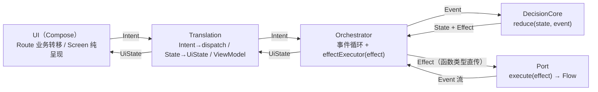

# 拓扑（结构快照）

> 说明：回答"系统各部分怎么连接、数据怎么流、**为什么这样组织**"。随架构变更滚动更新。
> 详细论证见各架构文档；本文件只放当前结论。

## 0. 一句话

分层：`UI → Translation → Orchestrator ↔ DecisionCore → Port`，副作用经执行器直通 `Port`；业务互不相通，靠父编排器做跨域切换与生命周期管理。

## 1. 分层拓扑（为什么分层）



**为什么这样分层**：每个环节只回答一个问题，职责单向、依赖单向，任何一层都可以单独替换和测试。

| 层 | 只回答 | 好处 |
|---|---|---|
| 状态机（DecisionCore） | "下一步到哪、要做什么" | 纯函数，业务规则可脱离手机环境测试 |
| 执行器（Orchestrator） | "怎么跑这个循环" | 事件串行、副作用统一执行，不散落 |
| 翻译层（Translation） | "外部输入怎么说、界面状态怎么呈现" | 界面与状态机互不知道对方 |
| 端口（Port） | "业务需要哪些外部能力" | 底层（蓝牙/存储/网络）可替换 |
| 界面（UI） | "显示什么、收什么操作" | 只消费，不做业务判断 |

## 2. 父子编排器（为什么需要"父"）

```text
RootWorkflow（父 Orchestrator<RootState, RootEvent, RootEffect>）
├─ 创建/释放 AuthTranslation        ── 子 Orchestrator<AuthState, …>
├─ 创建/释放 ConnectionTranslation  ── 子 Orchestrator<ConnectionState, …>
└─ report(Output) ← 子业务跨域事实 → dispatch(RootEvent)

父 → 子：RootEffect → RootWorkflow.execute() → translation.submit(Intent)
子 → 父：Output（Authenticated / LogoutRequested / Stopped / SessionCleared）
```

**为什么需要"父"**：业务的**控制生命周期**和**展示生命周期**是两回事。

- 展示生命周期（页面进出、前台后台）是短命的，随界面走；
- 控制生命周期（业务状态机、连接资源、登录会话）必须比页面活得久——页面退出再进来，业务状态不能丢。

父编排器把控制生命周期从界面中**抽离**出来统一管理：页面只负责展示，父负责"什么时候创建业务、什么时候释放业务、业务之间怎么切换"。这就是"解耦 UI 的控制与展示"：

- 父子**不共享状态机**，不互读 State——子业务之间也不互相读状态；
- 跨业务协作只通过 `Output → RootEvent` 单向上报（例如登录成功 → 切连接业务；连接退出 → 清会话）；
- 子业务生命周期由父管理（`ViewModelStore` + `onCleared`），页面重建不重建业务。

## 3. 词汇流（全库统一词汇）

```text
decisioncore（领域词汇）
   │ Effect
   ▼
port 接口（自带 execute）
   ├─ AuthPort          : AuthEffect      → AuthEvent
   ├─ ConnectionPort    : ConnectionEffect→ ConnectionEvent
   └─ BluetoothPort     : BluetoothEffect → BluetoothEvent   ← 能力端口，说蓝牙自己的话
   │ 内部翻译（底层结果 → 领域事件，止步于端口边界）
   ▼
decisioncore（Event）
```

全库只有一种接口形态 `execute(effect) -> Flow<event>`。曾经存在过一套"命令/结果"中间词汇，引入后发现它只多了一层翻译、没有价值，已全部删除——现在整个链路只有两种词汇形态：**要执行的动作（Effect，下行）/ 已发生的事实（Event，上行）**。历史沿革见 [演进史](./演进史.md)、[词汇表](./词汇表.md)。

## 4. 能力端口：三大能力（为什么这么分）

| 能力 | 端口 | 底层 | 现状 |
|---|---|---|---|
| 蓝牙 | `BluetoothPort` | 扫描：Android 原生 `BluetoothLeScanner`（callbackFlow + 单活动扫描互斥，见架构 02）；连接：HC 库 `HcBluetoothLibraryClient` | 已落地 |
| 本地 | `AndroidLocalPort`（纯构造工厂） | 见下表"本地三件" | 已落地 |
| 远端 | `HttpRemote` | Retrofit + OkHttp | 已落地（auth 部分） |

**为什么按三大能力分**：按**底层技术域**划分——蓝牙是一套完全不同的世界（回调、超时、硬件状态），本地存储一套，网络一套。各自独立进化、独立测试、独立替换，业务代码只见统一的 `execute(effect)`，看不见底层的差异。

**本地为什么解耦成三件**：

| 本地三件 | 管什么 | 为什么独立 |
|---|---|---|
| `StringEntropy`（加密键值） | 会话等少量敏感 blob（DataStore + Tink AES-GCM，key 作 AAD） | 用法是"按名读写一个值"，必须加密 |
| `LocalDatabase`（SQLDelight） | 绑定等结构化关系（`deviceBinding` 表） | 需要查询、更新、迁移，是关系数据 |
| `LocalFileClient`（Okio） | 大文件（日志、第三章收发的缓存明文） | 体积大、按文件管理，不适合放键值或关系表 |

三者生命周期和约束完全不同（键值要加密、关系要查询、文件要空间配额），拆开各自演进，互不牵连。AppGraph 的能力挂载区每类只挂一次，业务按需取用。

## 5. 数据流主链路（当前）

```text
启动 → RootWorkflow(AppStarted)
  → Auth 子域：RestoringSession →（本地读）→（远端校验）→ Authenticated
  → Root: AuthenticatedEvent → StartConnectionEffect
  → Connection 子域：扫描 → 选设备 → 连接 →（未来：缓存明文流）
```

## 6. 变更记录

| 日期 | 变更 |
|---|---|
| 2026-08-06 | 重构：每个章节补充"为什么"（分层动机、父子编排器分离控制/展示生命周期、三大能力划分、本地三件解耦）；词汇流去除历史编号表述 |
| 2026-08-06 | 核验：本地 KV 存储介质修正为 DataStore，LocalPort 引用改为 StringEntropy / LocalFileClient |
| 2026-08-06 | 建立本文件；词汇流按词汇统一修订（Command/Result → Effect/Event） |
