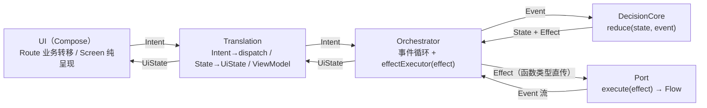

# 拓扑（结构快照）

> 说明：回答"系统各部分怎么连接、数据怎么流"。随架构变更滚动更新。
> 详细论证见各架构文档；本文件只放当前结论。

## 0. 一句话

分层：`UI → Translation → Orchestrator ↔ DecisionCore`，副作用经函数类型执行器直通 `Port`；业务互不相通，靠父编排器做跨域切换与生命周期管理。

## 1. 分层拓扑



## 2. 父子编排器（跨域拓扑）

```text
RootWorkflow（父 Orchestrator<RootState, RootEvent, RootEffect>）
├─ 创建/释放 AuthTranslation        ── 子 Orchestrator<AuthState, …>
├─ 创建/释放 ConnectionTranslation  ── 子 Orchestrator<ConnectionState, …>
└─ report(Output) ← 子业务跨域事实 → dispatch(RootEvent)

父 → 子：RootEffect → RootWorkflow.execute() → translation.submit(Intent)
子 → 父：Output（Authenticated / LogoutRequested / Stopped / SessionCleared）
```

- 父子**不共享状态机**，不互读 State。
- Translation 生命周期由父管理（ViewModelStore + onCleared）。

## 3. 词汇流（04 修订后）

```text
decisioncore（领域词汇）
   │ Effect
   ▼
port 接口（自带 execute）
   ├─ AuthPort          : AuthEffect      → AuthEvent
   ├─ ConnectionPort    : ConnectionEffect→ ConnectionEvent
   └─ BluetoothPort     : BluetoothEffect → BluetoothEvent   ← 能力端口，说蓝牙自己的话
   │ 内部翻译（底层结果 → 领域事件，止步于端口边界）
   ▼
decisioncore（Event）
```

全库只有一种接口形态 `execute(effect) -> Flow<event>`；Command/Result 已清零。

## 4. 能力端口现状

| 能力 | 端口 | 底层 | 现状 |
|---|---|---|---|
| 蓝牙扫描 | `BluetoothPort.scanDevices()` | Android 原生 `BluetoothLeScanner`（callbackFlow + 单活动扫描互斥，见架构 02） | 已落地 |
| 蓝牙连接 | `BluetoothPort.execute()` | HC 库 `HcBluetoothLibraryClient` | 已落地 |
| 本地 KV | `StringEntropy` | DataStore Preferences + Tink AES-GCM（key 作 AAD） | 已落地 |
| 本地数据库 | `LocalDatabase` | SQLDelight（deviceBinding 表） | 已落地 |
| 本地文件 | `LocalFileClient` | Okio（FileSpace 受限目录） | 已落地 |
| 远端 | `HttpRemote` | Retrofit + OkHttp | 已落地（auth 部分） |

## 5. 数据流主链路（当前）

```text
启动 → RootWorkflow(AppStarted)
  → Auth 子域：RestoringSession →（本地读）→（远端校验）→ Authenticated
  → Root: AuthenticatedEvent → StartConnectionEffect
  → Connection 子域：扫描 → 选设备 → 连接 →（未来 03：拉取缓存明文流）
```

## 6. 变更记录

| 日期 | 变更 |
|---|---|
| 2026-08-06 | 建立本文件；词汇流按 04 修订（Command/Result → Effect/Event） |
| 2026-08-06 | 核验：本地 KV 存储介质修正为 DataStore，LocalPort 引用改为 StringEntropy / LocalFileClient |
