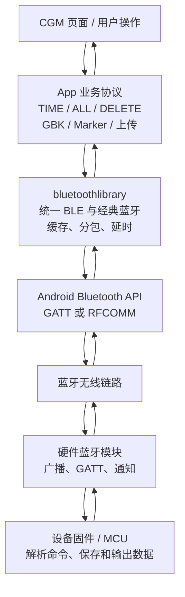
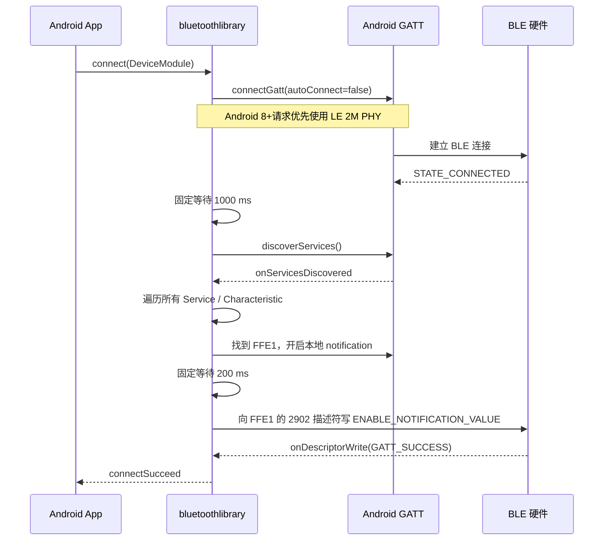

# MixTheBluetooth 蓝牙通信现状说明书

> 文档性质：当前实现的源码考证，不是改造方案。
>
> 考证范围：`bluetoothlibrary`、当前 `app` 的 CGM 流程、`migratedev` 蓝牙 Port，以及 Android / Bluetooth SIG 官方资料。
>
> 最后核对日期：2026-07-20。

## 1. 先说结论

当前工程不是一个单独的“蓝牙协议”，而是三层叠加：

1. **Android 蓝牙传输层**：负责扫描、建立 BLE GATT 或经典蓝牙 RFCOMM 连接、分包和收发字节。
2. **`bluetoothlibrary` 旧库封装层**：把 BLE 和经典蓝牙包装成统一接口，并用缓存阈值或静默时间把零散字节拼成较大的字节块。
3. **App 的 CGM 业务协议层**：把字节按 GBK 解码成文本，发送 `TIME`、`ALL`、`DELETE` 命令，用 Marker 判断缓存回放的开始和结束，然后保存、上传并删除设备缓存。

一句话描述完整链路：

> 手机扫描广播找到设备，连接设备的 GATT 服务，在 `FFE1` 特征上写入文本命令；硬件解析命令后，也通过 `FFE1` 通知返回文本；App 再用 GBK、换行和 Marker 把文本恢复成业务数据。

当前系统具备“能连接、能传文本、能读取缓存、能上传”的闭环，但不具备严格的数据帧协议：没有帧头、长度、序号、CRC、应用层 ACK、断点续传或蓝牙业务数据加密。

## 2. 用 408 知识理解这套系统

可以把整个通信过程类比为快递系统：

| 蓝牙概念 | 类比 | 在本项目中的含义 |
|---|---|---|
| 广播 Advertisement | 商店在街上挂招牌 | 硬件周期性告诉附近手机“我在这里”，可能携带名称和服务 UUID |
| 扫描 Scan | 手机查看附近招牌 | App 收集周围设备的名称、MAC、RSSI 和广播内容 |
| MAC / deviceId | 商店地址 | App 当前主要用设备地址区分设备 |
| GATT Service | 商店中的一个业务部门 | 硬件对外提供的一组相关能力 |
| Characteristic | 部门的一个窗口 | 手机在窗口写数据，或订阅窗口发出的数据 |
| Descriptor `0x2902` | “给我发通知”的订阅开关 | 手机写入 CCCD 后，硬件才可主动通知 App |
| MTU | 单个快递袋的最大尺寸 | 一次 ATT 传输最多能装多少字节，业务载荷通常是 `MTU - 3` |
| 分包 | 大文件拆成多个快递袋 | 超过单包载荷的数据必须拆开发送 |
| Marker | 一批货的“开始/结束”标签 | `Start Playback` 和 `Playback all done` 标记一次缓存回放 |
| ACK | 收件人签收 | 当前只有少量业务级确认，例如 `Log Cleared`；普通数据没有逐帧确认 |
| CRC / MAC | 验货码 / 防伪封条 | 当前蓝牙业务协议没有，因此无法可靠发现中间丢包或篡改 |

从计算机网络分层角度看：



`bluetoothlibrary` 相当于“传输层适配器”，CGM 的命令和 Marker 相当于“应用层协议”。两者不能混为一谈。

## 3. 工程中的三套实现

| 模块 | 当前职责 | 完成度 |
|---|---|---|
| `bluetoothlibrary` | BLE + 经典蓝牙扫描、连接、收发、分包、缓存 | 真实工作的旧传输库 |
| `app` | 当前产品 UI、GBK 编解码、CGM 命令、缓存校验、上传和删除 | 当前完整业务闭环 |
| `migratedev` | 用 Kotlin Flow 包装扫描、连接和断开 | 目前只迁移了连接控制，收到的数据被丢弃，尚未接入 CGM 数据流 |

`migratedev` 中 `HcBluetoothLibraryClient.readData()` 当前直接返回 `Unit`，所以它不能替代当前 `app` 完成 CGM 缓存读取。见 `migratedev/src/main/java/com/biosensor/migratedev/port/bluetooth/BluetoothPort.kt:347`。

## 4. 当前 BLE 广播与设备发现

### 4.1 当前扫描方式

- BLE 扫描时长：20 秒。
- Android 6.0 及以上使用 `SCAN_MODE_LOW_LATENCY`，即偏向发现速度和响应速度的高功耗扫描。
- 调用 `startScan(null, settings, callback)`，系统扫描阶段没有设置 `ScanFilter`，因此底层会接收附近所有 BLE 广播，再由 App 自己筛选。
- 混合扫描先执行经典蓝牙发现，经典扫描最长 10 秒；如果发现名称乱码的 BLE 设备，再追加最长 10 秒 BLE 扫描来恢复名称。
- 扫描到相同设备后按设备地址去重，并更新 RSSI。

源码：

- `bluetoothlibrary/.../BleBluetoothManage.java:73, 183-239`
- `bluetoothlibrary/.../ClassicBluetoothManage.java:87-106`

### 4.2 广播中的 UUID

当前 App 能识别的短服务 UUID 为：

| 广播字段 | 当前用途 |
|---|---|
| `0xFFE0` | 默认认为是汇承类模块 |
| `0xFFF0` | 默认认为是汇承类模块 |
| 自定义 16 位 UUID | 用户在筛选设置中输入后进行匹配 |

`DeviceModule.isHcModule()` 从广播包中解析一个 16 位服务 UUID，并与上述值比较。源码位于 `DeviceModule.java:211-231`。

需要特别注意：

1. `FFE0/FFF0` 是**广播识别条件**，不是当前代码实际写数据的特征。
2. 这个筛选是可选设置，不是扫描器的强制系统级过滤。
3. 当前主界面最终只显示 BLE 且名称不是 `N/A` 的设备；如果 UUID 筛选没有开启，其他有名称的 BLE 设备也可能出现。
4. 当前没有使用厂商 ID、设备证书、签名广播或挑战应答来证明“这是我们的真设备”。相同 UUID 可以被其他设备仿冒。

因此，就“用户只能看到我们的设备”这项需求而言，**当前状态是部分具备 UI 筛选能力，但没有强制且不可伪造的设备身份识别**。

### 4.3 名称和广播编码

如果 Android 返回的设备名称疑似乱码，旧库会从广播的 Complete Local Name 字段取原始字节，并按 GBK 解码。它还可按 MAC 保存修正后的名称。

这只是名称显示兼容，不参与业务数据的身份认证。

## 5. 当前 GATT 表：App 实际知道什么

BLE 中，手机是 Central + GATT Client，硬件是 Peripheral + GATT Server。Android 官方也用这种方式描述手机与传感器的典型关系。

### 5.1 从 App 源码可确认的 GATT 项

| 层级 | UUID | 属性 / 用途 | 当前代码行为 |
|---|---|---|---|
| Service | **不固定** | 容纳通信特征 | 连接后枚举硬件全部 Service，找到含 `FFE1` 的 Service 后记录其 UUID |
| Characteristic | `0000FFE1-0000-1000-8000-00805F9B34FB` | App 写入 + 硬件通知 | 当前唯一实际收发窗口；代码没有校验属性位是否同时支持 Write 和 Notify |
| Descriptor | `00002902-0000-1000-8000-00805F9B34FB` | Client Characteristic Configuration，简称 CCCD | 写入 `ENABLE_NOTIFICATION_VALUE` 开启通知 |

源码：`BluetoothLeService.java:35-44, 257-318`。

`0x2902` 在 Bluetooth SIG Assigned Numbers 中的正式名称是 **Client Characteristic Configuration**。旧库把它命名成 `SERVICE_EIGENVALUE_READ`，容易误解；它不是“读数据特征”，只是 `FFE1` 下的通知订阅开关。

### 5.2 无法仅凭 App 源码确认的硬件 GATT 表

App 并没有硬编码 Service UUID，也没有保存硬件所有 Service、Characteristic 的固定清单。因此以下信息不能从本仓库确定：

- `FFE1` 实际属于 `FFE0`、`FFF0` 还是另一项 Service；
- `FFE1` 的完整 Properties 组合；
- 是否还有设备信息、电量、固件升级等其他 Service；
- 硬件端 Attribute Handle；
- 硬件通知使用 Notification 还是还支持 Indication；
- 蓝牙模块与 MCU 之间的 UART 波特率、流控和缓存大小。

所以本项目当前能给出的不是硬件完整 GATT 表，而是“App 所依赖的最小 GATT 合同”。真正完整的 GATT 表仍需读取蓝牙模块配置、固件源码或用 nRF Connect 等工具实机导出。

## 6. BLE 连接全过程



关键事实：

- `connectGatt(..., false, ...)` 的 `autoConnect` 明确为 `false`，它不是后台自动连接模式。
- Android 8.0 以上连接时给出 `PHY_LE_2M` 偏好，但是否真正使用 2M 由手机和硬件共同决定；代码没有处理 PHY 更新回调来确认结果。
- 收到 `STATE_CONNECTED` 后先等 1 秒，再发现服务。
- 从连接成功回调开始计 5 秒，如果仍未完成服务发现和通知配置，则报告异常断开。
- 只有 `onDescriptorWrite(..., GATT_SUCCESS)` 到达时，旧库才把连接视为真正可用。
- Binder 绑定后固定等待 200 ms 再调用连接，未通过 `onServiceConnected` 严格串行保证，理论上存在时序竞争。

### 6.1 当前自动重连状态

当前没有“像耳机一样”的自动重连闭环：

- 没有持久化“最后一次成功设备”的 MAC / deviceId 用于下次启动自动连接；
- 异常断开后只通知页面并关闭连接；
- CGM 页面支持用户点击后调用 `reconnectCurrentModule()` 手动重连；
- 新 `migratedev` Port 断开后只发出 `Disconnected`，也不自动发起下一次连接；
- BLE `autoConnect=false`。

因此第二项需求的当前状态是：**同一次页面会话内可以手动重连，但没有跨页面、跨进程或设备重新上电后的自动重连机制**。

## 7. 经典蓝牙路径

旧库还保留经典蓝牙能力：

| 项目 | 当前值 |
|---|---|
| Profile | Serial Port Profile，SPP |
| RFCOMM UUID | `00001101-0000-1000-8000-00805F9B34FB` |
| 连接对象 | `BluetoothSocket` |
| 收发接口 | `InputStream` / `OutputStream` |
| 发送分块 | 1024 字节 |
| 接收缓存默认值 | 1500 字节 |
| 扫描时长 | 10 秒 |

经典蓝牙可以理解成无线串口：连接成功后，App 面对的是连续字节流，而不是 GATT Service / Characteristic。

当前产品主界面最终只加入 BLE 且名称有效的设备，所以经典蓝牙主要是库级兼容能力，不是当前 CGM UI 的主要通道。

## 8. 当前编码、命令和响应

### 8.1 文本编码

当前业务默认文本编码为 **GBK**：

- 接收：`byte[] -> Codec.decode(..., settingsStore.textEncoding())`
- 发送：由当前文本发送路径按设置中的编码转成字节。
- 默认配置：`EncryptedSettingsStore.textEncoding()` 返回 `GBK`。
- 编码可以在设置中修改，因此它不是写死在蓝牙库里的协议常量。

编码只回答“字节怎样变成字符”，不提供加密、校验或身份认证。

例如字符 `A` 变成某个字节是编码；把 `ALL` 变成别人看不懂且无法篡改的密文才是加密。两者不是一回事。

### 8.2 当前确认的 CGM 命令

| 目的 | 实际发送文本 | 说明 |
|---|---|---|
| 同步时间 | `TIME,yyyy,MM,dd,HH,mm,ss\n\r` | 使用手机当前本地时间 |
| 读取全部缓存 | `ALL\n\r` | 请求设备回放全部缓存 |
| 删除缓存 | `DELETE\n\r` | 请求设备清除日志 |

注意结尾顺序是 **LF + CR**，即 `\n\r`，不是更常见的 CRLF `\r\n`。二次开发时若擅自改顺序，硬件可能无法识别。

`CgmCommands.Capability` 中还声明了 `START_MEASURE`、`SET_PARAMS`、`STOP_MEASURE`，但 `LegacyCgm` 目前没有对应编码实现，所以不能把枚举项当作已经存在的硬件命令。

### 8.3 当前确认的响应 Marker

| Marker | 含义 | App 行为 |
|---|---|---|
| `Start Playback` | 缓存回放开始 | 记录已看到开始标记 |
| `Playback all done` | 缓存回放结束 | 触发完整性检查和后续上传 |
| `Log Cleared` | 删除缓存成功 | 仅在等待删除确认状态下视为成功 |

一个符合当前解析器预期的示例：

```text
Start Playback
EIS:1,1000,0.12
CA:1,0.08
CA:2,0.09
Playback all done
```

App 会去掉 `\r`，按 `\n` 切行，忽略空行，并保留非空文本。

## 9. 数据从 App 到硬件如何走

以发送 `ALL\n\r` 为例：

1. 用户点击“读取缓存”。
2. `CgmProfile` 生成字符串 `ALL\n\r`。
3. App 按当前文本编码转成 `byte[]`。
4. `AndroidBluetoothController` 调用 `AllBluetoothManage.sendData()`。
5. `AllBluetoothManage` 根据 `DeviceModule.isBLE()` 路由到 BLE 或经典蓝牙。
6. BLE 把字节按当前有效载荷 `mMTU` 切块，依次写入 `FFE1`。
7. 每次收到 Android `onCharacteristicWrite(GATT_SUCCESS)` 后才允许继续处理下一块。
8. 硬件蓝牙模块收到数据并转给 MCU；MCU 如何解析不在本仓库中。

这里的 `onCharacteristicWrite` 只表示 Android GATT 写操作完成，**不等于 MCU 已经解析、保存或执行命令**。真正的业务确认必须来自硬件返回的响应文本。

## 10. 数据从硬件到 App 如何走

以读取缓存为例：

1. MCU 收到 `ALL` 后开始输出缓存文本。
2. 蓝牙模块通过 `FFE1` Notification 向手机发送若干字节片段。
3. Android 调用 `onCharacteristicChanged()`。
4. `BleBluetoothManage` 把多个通知先放进 `mDataArray`。
5. 达到约 1000 字节缓存阈值，或连续约 300 ms 没有新数据时，旧库把片段合并成一个 `byte[]` 回调给 App。
6. App 按 GBK 解码为文本。
7. `CgmCacheSyncBuffer` 再跨回调保存未完成行，寻找开始和结束 Marker。
8. 校验通过后写成本地 txt，上传服务器并轮询结果。
9. 服务端处理成功后 App 自动发送 `DELETE\n\r`。
10. 收到 `Log Cleared` 后，本轮缓存同步结束。


## 11. 当前完整性校验的强弱

读取缓存最多尝试 3 次。当前校验要求：

1. 出现 `Start Playback`；
2. 之后出现 `Playback all done`；
3. 两个 Marker 之间至少有一行数据；
4. 数据行只包含正则允许的字母、数字、下划线、冒号、连字符、点、逗号、分号、等号和空白。

当前校验**没有**：

- 文件总长度；
- 总行数；
- 分包序号；
- CRC / Hash；
- 每包 ACK / NACK；
- 缺失范围重传；
- 断点续传；
- 防重放随机数；
- 消息认证码。

因此，如果中间丢失一行，但剩余文本仍然长得合法，开始和结束 Marker 也都存在，当前校验仍可能通过。Marker 只能证明“看见开头和结尾”，不能证明“中间一个字节都没丢”。

另外，只有收到结束 Marker 后才会触发校验和重试。如果硬件中途停止、始终不发送结束 Marker，当前业务层没有独立的读取总超时，流程可能一直停留在读取状态。删除确认也没有独立超时和重试。

## 12. 参数、缓存、时延和包大小统一参考

### 12.1 默认参数

| 参数 | 当前默认值 | 实际作用 |
|---|---:|---|
| `state` | 1 | BLE 常规发送人工延时的一部分 |
| BLE 接收缓存 | 1000 字节 | 通知累计到约该值时向 App 提交一次较大的字节块 |
| 经典蓝牙接收缓存 | 1500 字节 | Socket 接收聚合缓存上限 |
| `time` | 100 ms | 经典蓝牙静默判断时间；BLE 使用其 3 倍 |
| 检查换行 | 开启 | 缓存提交前尽量在最后一个 LF 处切分 |
| `level` | 0 | 常规发送额外延时 `level * 10 ms` |
| 文件模式 | 关闭 | 决定 BLE 是否走文件发送延时分支 |
| 文件额外延时 | 0 ms | 文件模式下每包附加延时 |

源码：`ModuleParameters.java:8-24`。

注释把 1000 和 1500 写成了 bit，但 Java 数组和长度运算的实际单位都是 **byte**，应以代码行为为准。

### 12.2 BLE 发送包大小

| 状态 | 当前行为 |
|---|---|
| 初始 ATT MTU 假设 | 23 字节 |
| 初始业务载荷 `mMTU` | 20 字节，即 `23 - 3` |
| 请求范围 UI 提示 | 23 到 512 |
| 协商成功后的载荷 | `onMtuChanged` 中设置为 `mtu - 3` |
| 普通业务是否自动请求大 MTU | 否 |
| 设置文件速率时 | 会调用 `requestMtu(512)` |

Android 14 开始，第一个 GATT 客户端调用 `requestMtu()` 时，Android 会请求 517，并忽略该 ACL 连接后续的 MTU 请求；最终值仍由双方协商能力决定。这意味着 UI 中反复设置 MTU 不一定按输入值生效，应以 `onMtuChanged` 返回值为准。

### 12.3 BLE 常规发送时延

每发送一个 BLE 分包，当前代码会等待写回调，并额外执行：

```text
额外时延 = level * 10 ms（level 非 0 时）
         + 5 ms
         + state * 10 ms
```

默认 `level=0, state=1`：每包人工延时为 **15 ms**。

华为、荣耀或厂商名为 `rongyao` 的设备，`getState()` 返回 `state + 2`，因此默认人工延时变为 **35 ms**。

这不是蓝牙规范要求的固定时延，而是旧库为了降低模块接收错误概率主动加的节流。

如果一直收不到写完成回调，代码会间隔 5 ms 轮询，尝试写空包“提醒”；累计到约 500 ms 后会记录“无法发送，跳过这个包”。这个跳过没有上报给业务层，也没有应用层重传保证。

### 12.4 BLE 接收聚合

BLE 每次 Notification 都先作为一个数组加入缓存：

- 如果通知片段比历史最大片段更大，就更新 `mModuleMtu`；初始为 20。
- 当片段数量达到 `1000 / mModuleMtu` 时提交缓存。
- 或者最后一个片段到达后连续 `100 * 3 = 300 ms` 没有新片段时提交。
- 开启换行检查时，缓存满后尽量从最后一个 LF 切开，LF 之后的残片留给下一批。

这里的 300 ms 是“静默后判定这一批暂时结束”，不是每包都固定等待 300 ms。

### 12.5 经典蓝牙缓存与时延

- 发送大块数据时按 1024 字节分块。
- 默认接收缓存 1500 字节。
- 接收过程中如果 100 ms 内没有新字节，就认为当前一批结束并提交。
- 普通发送只附加 `level * 10 ms`；默认 `level=0`，没有额外延时。
- `BluetoothSocket.connect()` 没有本项目自定义连接超时，依赖系统 Socket 行为。

### 12.6 扫描和连接相关时间

| 环节 | 当前时间 |
|---|---:|
| BLE 扫描 | 20 秒 |
| 经典蓝牙扫描 | 10 秒 |
| 名称乱码补充 BLE 扫描 | 10 秒 |
| BLE Service 发现前固定等待 | 1 秒 |
| BLE Service / 通知配置超时 | 5 秒 |
| 找到 FFE1 后写 CCCD 前固定等待 | 200 ms |
| BLE 断开后解绑 Service | 500 ms |
| `migratedev` 连接会话超时 | 15 秒 |
| CGM 缓存回放总超时 | 未实现 |
| 删除确认超时 | 未实现 |

## 13. 文件速率档位的真实含义

`SendFileVelocity` 的注释把四档对应为 9600、115200、230400、460800 波特率，但 App 并没有修改无线 PHY 或硬件 UART 寄存器。代码实际做的是：**改变 App 发送每个分包后的软件延时**；BLE 路径还顺带请求 MTU 512。

### 13.1 BLE 文件发送档位

| 档位 | 每包延时计算 | 旧库注释中的目标速度 |
|---|---:|---:|
| LOW | `payloadBytes` ms | 0.8 到 1 KB/s |
| HEIGHT | `payloadBytes / 10` ms | 7 到 8 KB/s |
| SUPER | `payloadBytes / 25` ms | 12 到 15 KB/s |
| MAX | 0 ms | 大于 20 KB/s，注释记录约 23.8 KB/s |
| CUSTOM | `max(payloadBytes / speed - 3, 0)` ms | `speed` 单位标称 KB/s |

### 13.2 经典蓝牙文件发送档位

| 档位 | 每 1024 字节块延时 | 旧库注释中的目标速度 |
|---|---:|---:|
| LOW | 1104 ms | 约 0.94 KB/s |
| HEIGHT | 120 ms | 约 7.5 KB/s |
| SUPER | 60 ms | 约 17.5 KB/s |
| MAX | 20 ms | 约 45 KB/s |
| CUSTOM | 0 ms | 全速，无法预测 |

### 13.3 这些档位目前为什么不能解释 CGM 下载速度

这是当前系统最容易产生误判的地方：

1. 档位逻辑控制的是 **App -> 硬件** 的发送循环。
2. `ALL` 后的百 KB 缓存是 **硬件 -> App** 的 Notification 流，发送节奏主要由硬件控制。
3. 当前正常业务没有调用 `ModuleParameters.setSendFile(true)`，整个工程中只有 setter 定义，没有调用者。
4. 因此，单独调用“设置文件速率”即使改变延时，也没有完整启用 BLE 文件模式。
5. 当前正常 CGM 业务也不主动设置 MTU，通常从 20 字节载荷起步。

作为数量级示例，仅看 App 向硬件、20 字节载荷和默认 15 ms 人工延时，不计 GATT 回调等开销，理论上限约为：

```text
20 B / 15 ms = 1333 B/s，约 1.30 KB/s
100 KB / 1.30 KB/s ≈ 77 秒
```

华为 / 荣耀默认 35 ms 时：

```text
20 B / 35 ms = 571 B/s，约 0.56 KB/s
100 KB / 0.56 KB/s ≈ 179 秒
```

这些计算只能说明旧库的 App 发送节流有多强，**不能直接作为设备缓存下载耗时**。设备到 App 的真实速度需要实机记录通知包大小、连接间隔、PHY、协商 MTU、单位时间字节数以及硬件 UART 输出速度。

## 14. 当前错误与错误码

### 14.1 蓝牙传输层

当前没有一套统一、稳定、对外公开的蓝牙错误码协议，主要是回调、日志字符串和 Android 原始状态混用：

| 场景 | 当前表示方式 |
|---|---|
| BLE 扫描失败 | 直接 Toast Android `errorCode`，未映射成项目错误枚举 |
| GATT 为空 | `connectionFail(mac, "未知错误")` |
| 5 秒未完成服务发现 | `errorDisconnect` |
| 找不到写特征 | 只写日志“没有拿到写入特征” |
| Characteristic 写失败 | 只记录 GATT `status` |
| Descriptor 写失败 | 没有明确失败回调 |
| MTU 设置失败 | 回调 `-1` |
| Android 版本不支持 MTU API | 回调 `-2` |
| 经典蓝牙连接失败 | 回调异常字符串 |
| 异常断开 | `errorDisconnect(DeviceModule)` |

代码想处理常见 GATT 133 错误，但判断写成了 `newState == 133`，正确的错误值通常位于 `status` 参数。因此这段 133 专项分支当前基本不会按预期触发。

### 14.2 CGM 业务与服务器错误码

`CallResult` 定义的本地错误码包括：

| 错误码 | 含义 |
|---:|---|
| `-1` | 未知错误 |
| `-100` | 网络错误 |
| `-101` | 空响应 |
| `-102` | 空数据 |
| `-200` | 本地文件不存在 |
| `-300` | 设备缓存回放不完整 |

HTTP 或后端业务失败时还可能直接使用 HTTP 状态码或服务器返回的业务 code。

硬件 CGM 文本协议当前没有统一的数字错误码表。仓库中能确认的硬件响应只有 Marker 和删除确认文本；没有发现 `ERR,<code>` 一类标准错误帧。

## 15. 当前安全状态

### 15.1 蓝牙业务数据是明文

`TIME`、`ALL`、`DELETE` 和设备返回的数据都按 GBK 明文传输。蓝牙通信路径中没有发现 AES、GCM、会话密钥、随机数、签名或消息认证码。

App 中确实有 `AES/GCM/NoPadding`，但它只用于加密手机本地 SharedPreferences，例如登录信息和设置项，**与蓝牙链路数据无关**。

因此第三项需求的当前状态是：**本地配置有加密，蓝牙业务载荷没有应用层加密和完整性保护**。

Android 官方 BLE 文档明确提醒：敏感数据应实现应用层安全。即使底层蓝牙连接可能使用链路层机制，应用仍不能把它等同于本协议的端到端加密和设备身份认证。

### 15.2 当前也缺少协议级防篡改

没有 MAC / AEAD Tag / CRC / 序号意味着：

- App 无法可靠判断内容是否被修改；
- App 无法判断合法消息是否被重复播放；
- Marker 和字符正则只能检查格式，不能证明真实性；
- 只复制相同 UUID 和设备名，就可能骗过当前可选筛选。

## 16. 四项后续需求的“现状差距”，不含施工方案

| 需求 | 当前已经有的 | 当前缺失的 |
|---|---|---|
| 1. 用户连接时只能看到我们的设备 | 可按 `FFE0/FFF0` 或自定义 16 位 UUID 过滤；UI 只显示有名称的 BLE | 底层扫描仍接收所有设备；筛选可关闭；UUID 可仿冒；没有强身份认证 |
| 2. 连接一次后自动连接 | 页面内保存当前 `DeviceModule`，支持用户点击重连 | 无最后设备持久化、后台重试、开机/进 App 自动连接、退避策略；`autoConnect=false` |
| 3. 数据加密 | 手机本地 Preferences 使用 AES-GCM | 蓝牙命令、响应和缓存均为明文；无密钥协商、随机数、认证 Tag、防重放 |
| 4. 百 KB 文件加速 | Android 8+偏好 2M PHY；可请求 MTU；接收超过一定速度时请求高连接优先级 | 正常 CGM 流程未主动请求大 MTU；文件档位方向不匹配下载；无窗口传输、序号、批量 ACK、断点续传；硬件吞吐未知 |

## 17. 当前软硬件边界

### 17.1 App / 软件当前负责

- 请求 Android 蓝牙权限；
- 扫描和显示设备；
- 可选 UUID、BLE、名称筛选；
- 发起 GATT / RFCOMM 连接；
- 找到 `FFE1` 并写 `0x2902` 开通知；
- BLE 发送分包和人工节流；
- 接收片段聚合；
- GBK 编解码；
- 生成 `TIME`、`ALL`、`DELETE`；
- 检查 Marker 和字符格式；
- 保存文件、上传服务器、成功后删除设备缓存；
- UI 中显示连接、字节数和结果。

### 17.2 硬件 / 固件当前负责

- 发送 BLE 广播、设备名和服务 UUID；
- 提供实际 GATT 表、`FFE1` 和 CCCD；
- 接收 App 写入的数据；
- 把命令交给 MCU 或固件逻辑；
- 维护设备时间和本地缓存；
- 解析 `TIME`、`ALL`、`DELETE`；
- 生成 `Start Playback`、数据行、`Playback all done`、`Log Cleared`；
- 决定设备到 App 的通知包大小和发送节奏；
- 决定蓝牙模块与 MCU 之间 UART / SPI 等内部链路的速度和缓存。

### 17.3 仓库无法证明的边界

本仓库没有硬件固件和蓝牙模块配置，因此不能仅凭 Android 代码确认：

- MCU 与蓝牙模块是同一芯片还是两个芯片；
- 内部是否使用 UART；
- UART 波特率是否真是注释中的四档；
- 硬件缓存的最大容量；
- 硬件 Notification 队列是否会溢出；
- 硬件是否支持 2M PHY、Data Length Extension、较大 MTU；
- 硬件每条业务数据的真实语义和完整错误码；
- 硬件是否已经启用 Pairing / Bonding 或链路层加密。

旧库注释把速度档位映射到若干“波特率”，这提示硬件可能是“蓝牙串口模块 + MCU”架构，但在没有硬件源码、模块手册或实测前只能视为线索，不能视为已证事实。

## 18. 当前实现中最值得警惕的事实

1. `FFE0/FFF0`、`FFE1` 和 `2902` 分属不同含义，不能都称作“广播 UUID”或“通信 UUID”。
2. 硬件完整 GATT 表不在 App 仓库中；目前只知道最小合同。
3. 当前业务不是二进制帧协议，而是 GBK 文本流协议。
4. Marker 不能替代长度、序号和 CRC。
5. GATT 写成功不等于硬件业务执行成功。
6. BLE 接收的 300 ms 是静默聚合时间，不是每包网络时延。
7. 文件速率档位主要控制 App 向设备发送，不能直接解释设备向 App 下载速度。
8. 正常业务没有启用文件模式，也没有自动请求大 MTU。
9. 当前没有真正的自动重连，也没有蓝牙业务数据加密。
10. `migratedev` 目前没有把收到的蓝牙数据交给业务层。

## 19. 主要源码索引

| 内容 | 源码位置 |
|---|---|
| BLE / 经典蓝牙统一入口 | `bluetoothlibrary/src/main/java/com/hc/bluetoothlibrary/AllBluetoothManage.java` |
| 设备信息、广播 UUID 筛选、经典 UUID 回退 | `bluetoothlibrary/src/main/java/com/hc/bluetoothlibrary/DeviceModule.java` |
| BLE 扫描和接收缓存 | `bluetoothlibrary/src/main/java/com/hc/bluetoothlibrary/bleBluetooth/BleBluetoothManage.java` |
| GATT 连接、FFE1、2902、MTU、发送分包 | `bluetoothlibrary/src/main/java/com/hc/bluetoothlibrary/bleBluetooth/BluetoothLeService.java` |
| 经典蓝牙 Socket、1024 B 分块、接收缓存 | `bluetoothlibrary/src/main/java/com/hc/bluetoothlibrary/classicBluetooth/ClassicBluetoothManage.java` |
| 默认缓存和时间参数 | `bluetoothlibrary/src/main/java/com/hc/bluetoothlibrary/tootl/ModuleParameters.java` |
| CGM 命令 | `app/src/main/java/com/hc/mixthebluetooth/ui/cgm/CgmCommands.java` |
| Marker、校验、三次尝试 | `app/src/main/java/com/hc/mixthebluetooth/application/cgm/CgmCacheSyncBuffer.java` |
| 保存、上传、状态机 | `app/src/main/java/com/hc/mixthebluetooth/application/cgm/DefaultCgmWorkflow.java` |
| 上传成功后自动删除 | `app/src/main/java/com/hc/mixthebluetooth/ui/cgm/CgmProfile.java` |
| GBK 解码与 UI 数据入口 | `app/src/main/java/com/hc/mixthebluetooth/ui/cgm/CgmController.java` |
| 当前连接控制与手动重连 | `app/src/main/java/com/hc/mixthebluetooth/driver/implementation/bluetooth/AndroidBluetoothController.java`、`app/src/main/java/com/hc/mixthebluetooth/ui/cgm/CgmActivity.java` |
| 新架构蓝牙 Port | `migratedev/src/main/java/com/biosensor/migratedev/port/bluetooth/BluetoothPort.kt` |

## 20. 官方参考

- Android Developers, [Bluetooth Low Energy overview](https://developer.android.com/develop/connectivity/bluetooth/ble/ble-overview)：GATT、Central / Peripheral、Client / Server，以及敏感数据的应用层安全提醒。
- Android Developers, [BluetoothGatt API reference](https://developer.android.com/reference/android/bluetooth/BluetoothGatt)：`requestMtu()`、连接优先级及 Android 14 的 517 MTU 行为。
- Bluetooth SIG, [Assigned Numbers](https://www.bluetooth.com/wp-content/uploads/Files/Specification/HTML/Assigned_Numbers/out/en/index-en.html)：`0x2902` 的正式定义。
- Bluetooth SIG, [Serial Port Profile](https://www.bluetooth.com/specifications/specs/serial-port-profile-1-2/)：经典蓝牙 SPP 的规范入口。
