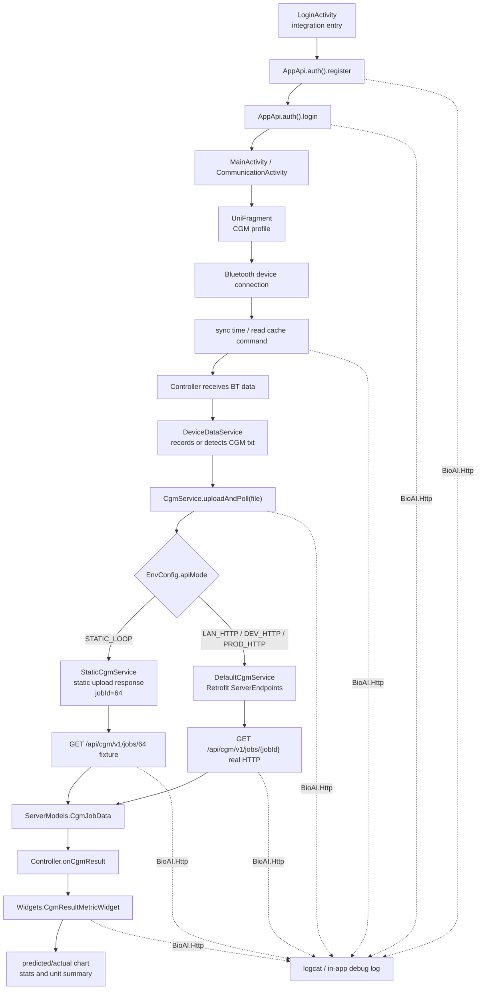

# LAN + Static HTTP CGM Loop Design

Date: 2026-06-01

## 1. Background

The backend is still under active development, but the Android app needs a stable integration path for development and demos. The current app already has most of the real chain in place: `AppApi`, Retrofit/OkHttp, `BioAI.Http` logging, account APIs, file upload, CGM polling, `UniFragment`, `Controller`, and CGM widgets.

The remaining problem is operational: testers should be able to validate the whole app flow without depending on USB, adb reverse, or a finished backend. At the same time, once a backend is available on the same LAN, the app should switch to real HTTP with only a small configuration change. Logs must keep the same shape in both modes, so debugging is consistent.

The target user-visible flow is:

```text
register -> login -> connect device -> send/receive data -> upload file
  -> backend calculates and returns CGM points -> render chart
```

## 2. Goals

- Support a full static loop that can run without USB and without any backend service.
- Support LAN real HTTP by changing only environment configuration such as `baseUrl` and API mode.
- Keep the same business entry points for static and real HTTP modes.
- Keep `BioAI.Http` logs for every important node in both modes.
- Preserve the real backend CGM endpoint shape: `GET /api/cgm/v1/jobs/{jobId}`.
- Use `jobId=64` for the static loop so the static path mirrors the real endpoint contract.
- Keep current Bluetooth/device flow intact; do not replace the real board path with fake packets.
- Make later backend integration a configuration and endpoint-adapter problem, not a UI rewrite.

## 3. Non-Goals

- Do not add adb reverse, USB-only network assumptions, or desktop proxy requirements.
- Do not make Android call `0.0.0.0`. That address is only valid for backend listening, not as an app target.
- Do not create a separate mock/debug page that bypasses the real business flow.
- Do not move CGM rendering back to legacy fragment pages.
- Do not remove the real Retrofit implementation.
- Do not require the backend to run on the Android development PC. The URL can point to this PC or another LAN host.

## 4. Network Model

Backend/proxy services may listen on `0.0.0.0`, but Android must connect to an actual reachable address:

```text
Backend host listens: 0.0.0.0:8080
Android app calls:     http://192.168.x.x:8080/
```

If the AP dynamically assigns IP addresses, the app still needs a concrete IP in `API_BASE_URL`. Since the development machine is expected to stay online, the current configured IP can remain the default for now. If the backend later moves to another LAN machine, only the URL changes.

The app should support these modes:

| Mode | Network | Purpose |
|---|---|---|
| `STATIC_LOOP` | No real HTTP | Demo and validation when backend is unavailable |
| `LAN_HTTP` | Real HTTP to LAN host | Same-LAN backend integration |
| `DEV_HTTP` | Real HTTP to current dev URL | Existing dev server path |
| `PROD_HTTP` | Real HTTP to production URL | Future production use |

## 5. Communication Model



## 6. Configuration Design

Add an explicit API mode to environment properties.

```properties
# app/config/env.static.properties
API_ENV=static
API_BASE_URL=http://127.0.0.1/
API_MODE=STATIC_LOOP
```

```properties
# app/config/env.lan.properties
API_ENV=lan
API_BASE_URL=http://192.168.x.x:8080/
API_MODE=LAN_HTTP
```

```properties
# app/config/env.dev.properties
API_ENV=dev
API_BASE_URL=http://124.16.68.18:8080/
API_MODE=DEV_HTTP
```

`API_BASE_URL` is ignored by static services except for logging. It still exists so `EnvConfig` has one consistent shape across modes.

Expected build examples:

```powershell
.\gradlew.bat :app:assembleDebug -PapiEnv=static
.\gradlew.bat :app:assembleDebug -PapiEnv=lan
.\gradlew.bat :app:assembleDebug -PapiEnv=dev
```

## 7. Project Tree And File Responsibilities

```text
app/
  config/
    env.dev.properties
      Existing dev HTTP target. Add API_MODE=DEV_HTTP.

    env.lan.properties
      New LAN backend target. Holds the AP/LAN reachable backend URL.

    env.static.properties
      New static loop target. Enables app-internal static transport.

  src/main/java/com/hc/mixthebluetooth/
    api/
      AppApi.java
        Service registry used by activities/fragments/controllers.
        Business code should not know whether services are static or real HTTP.

      EnvConfig.java
        Reads BuildConfig API_ENV, API_BASE_URL, and API_MODE.
        Exposes mode helpers such as isStaticLoop().

      auth/AuthService.java
        Stable app-facing account contract.

      cgm/CgmService.java
        Stable app-facing CGM contract: uploadAndPoll(file) and poll(jobId).

    impl/
      AppApiBootstrap.java
        Selects static or Retrofit services based on EnvConfig.
        Logs the active env/mode/baseUrl at startup.

      auth/DefaultAuthService.java
        Real Retrofit account implementation.
        Logs register/login/detail request and response.

      auth/StaticAuthService.java
        New static account implementation.
        Returns deterministic register/login/detail responses.
        Logs through the same BioAI.Http helper.

      cgm/DefaultCgmService.java
        Real Retrofit upload and CGM polling implementation.
        Uploads file, extracts jobId, polls /api/cgm/v1/jobs/{jobId}.

      cgm/StaticCgmService.java
        New static CGM implementation.
        Logs file metadata, returns static upload success, then polls jobId=64.

      log/ApiTraceLogger.java
        Unified BioAI.Http logger.
        Pretty JSON, sensitive-field masking, file preview, truncation.

    remote/
      ServerClient.java
        Builds Retrofit and OkHttp clients.
        Adds token header, timeouts, and HTTP body logging in debug modes.

      ServerEndpoints.java
        Real backend endpoint declarations:
        POST /api/account/v1/register
        POST /api/account/v1/login
        POST /api/test/v1/upload
        GET  /api/cgm/v1/jobs/{jobId}

      ServerModels.java
        DTOs for account, upload, and CGM responses.
        CGM DTOs mirror backend fields, including summaryJson.units[].points[].

      ServerResponse.java
        Existing generic wrapper for account/upload style responses.

    staticdata/
      StaticBioAiFixtures.java
        New deterministic static data:
        account user, token, upload response, jobId=64, CGM result JSON/data.

      StaticLoopClock.java
        Optional helper to make static timestamps deterministic in tests.

    fragment/
      UniFragment.java
        CGM page entry.
        Calls AppApi.cgm().uploadAndPoll(file) when cache file is ready.

    uni/
      Controller.java
        Receives Bluetooth events, dispatches commands, forwards CGM results to widgets.

      Widgets.java
        Renders CGM predicted/actual points and summary/unit text.

      profile/cgm/CgmProfile.java
        Defines CGM actions and raw line consumer.
        Keeps device command behavior unchanged.
```

## 8. Static Loop Behavior

Static mode should run through the same UI and service contracts:

```text
LoginActivity
  -> AppApi.auth().register(...)
  -> StaticAuthService returns ok
  -> AppApi.auth().login(...)
  -> StaticAuthService returns token
  -> CommunicationActivity / UniFragment
  -> Device flow creates or detects txt
  -> AppApi.cgm().uploadAndPoll(file)
  -> StaticCgmService logs file metadata
  -> StaticCgmService returns upload success with jobId=64
  -> StaticCgmService loads static CGM result for /api/cgm/v1/jobs/64
  -> Controller.onCgmResult(...)
  -> Widgets render chart
```

Static mode is not a separate debug screen. It is a transport mode underneath the same business flow.

If no real device/txt is available, a future optional action can trigger a bundled static txt fixture. That should be designed separately because the current goal keeps the real device path intact.

## 9. Real LAN HTTP Behavior

LAN mode should use the same code path after `AppApiBootstrap`, but with Retrofit services:

```text
API_MODE=LAN_HTTP
API_BASE_URL=http://192.168.x.x:8080/
```

Real endpoints:

```text
POST /api/account/v1/register
POST /api/account/v1/login
POST /api/test/v1/upload
GET  /api/cgm/v1/jobs/{jobId}
```

The app should never call `0.0.0.0`. If the backend says it listens on `0.0.0.0:8080`, Android should use the backend host's LAN IP.

## 10. CGM Endpoint Contract

The confirmed CGM result URL is:

```text
GET /api/cgm/v1/jobs/{jobId}
```

Static loop contract:

```text
jobId = 64
GET /api/cgm/v1/jobs/64
```

The app-facing `CgmService` should hide the exact endpoint from UI code:

```java
void uploadAndPoll(File cacheFile, ApiCallback<CallResult<ServerModels.CgmJobData>> callback);
void poll(long jobId, ApiCallback<CallResult<ServerModels.CgmJobData>> callback);
```

This keeps future endpoint changes localized to `DefaultCgmService`, `StaticCgmService`, `ServerEndpoints`, and tests.

## 11. Logging Design

Use one tag:

```text
BioAI.Http
```

Every log should include:

- owner/class
- API path or stage
- phase: request, response, failure, file, poll, render
- important identifiers such as jobId, file name, point count, unit count
- pretty JSON where useful
- masked password/token fields
- truncated long body/file preview

### Startup

```text
D/BioAI.Http: AppApiBootstrap API ENV config
env=static
mode=STATIC_LOOP
baseUrl=http://127.0.0.1/
remote=StaticBioAiTransport
```

### Register

```text
D/BioAI.Http: StaticAuthService API POST /api/account/v1/register request
{
  "username": "bioai-dev-user",
  "phone": "18800000001",
  "password": "***"
}
```

```text
D/BioAI.Http: StaticAuthService API POST /api/account/v1/register response
{
  "code": 0,
  "success": true,
  "msg": "static register ok",
  "data": {
    "accountId": 10001,
    "username": "bioai-dev-user",
    "phone": "18800000001"
  }
}
```

### Login

```text
D/BioAI.Http: StaticAuthService API POST /api/account/v1/login request
{
  "username": null,
  "phone": "18800000001",
  "password": "***"
}
```

```text
D/BioAI.Http: StaticAuthService API POST /api/account/v1/login response
{
  "code": 0,
  "success": true,
  "msg": "static login ok",
  "data": {
    "accountId": 10001,
    "username": "bioai-dev-user",
    "phone": "18800000001",
    "token": "***"
  }
}
```

### Device And Commands

```text
D/BioAI.Http: UniFragment API DEVICE_CONNECT state
connected=true
device=BioAI-CGM
```

```text
D/BioAI.Http: Controller API BT_SEND command
id=sync_time
payload=...
```

```text
D/BioAI.Http: Controller API BT_RECV cache
lines=128
bytes=18422
file=/storage/emulated/0/.../cgm_cache.txt
```

### Upload

```text
D/BioAI.Http: StaticCgmService API POST /api/test/v1/upload file
{
  "name": "cgm_cache.txt",
  "absolutePath": "/storage/emulated/0/.../cgm_cache.txt",
  "length": 18422,
  "preview": "Start Playback..."
}
```

```text
D/BioAI.Http: StaticCgmService API POST /api/test/v1/upload response
{
  "code": 200,
  "success": true,
  "msg": "static upload ok",
  "data": {
    "jobId": 64
  }
}
```

### CGM Result

```text
D/BioAI.Http: StaticCgmService API GET /api/cgm/v1/jobs/64 response attempt=1
{
  "code": 200,
  "message": "success",
  "data": {
    "jobId": 64,
    "status": "GENERATED",
    "pointCount": 30,
    "unitCount": 1,
    "predictionMean": 6.54,
    "avgMard": 16.3
  }
}
```

### Render

```text
D/BioAI.Http: CgmWidgetBinder API RENDER result
jobId=64
status=GENERATED
points=30
predicted=30
actual=30
unitCount=1
```

## 12. Error Handling

Static mode:

- Register and login should normally succeed.
- Upload should fail only for local file-not-found or invalid file cases.
- CGM result should return `GENERATED` for `jobId=64`.
- Unknown static job IDs should return a clear error and log the requested ID.

LAN/real HTTP mode:

- Network failure logs owner, API, exception type, and message.
- Upload failure keeps the txt file.
- Upload success deletes the txt file only after success is confirmed.
- Missing `jobId` after upload is a blocking error.
- Non-`GENERATED` CGM status continues polling until max attempts.
- Missing optional CGM fields should not crash rendering.
- Missing core fields should log a clear parsing/contract error.

Core CGM fields:

```text
code
message
data.jobId
data.status
data.summaryJson.units
data.summaryJson.units[].points
```

## 13. Test Strategy

Unit tests:

- `EnvConfig` parses `API_MODE`.
- `AppApiBootstrap` selects static services for `STATIC_LOOP`.
- `AppApiBootstrap` selects Retrofit services for `LAN_HTTP` and `DEV_HTTP`.
- `StaticAuthService` returns deterministic register/login/detail results.
- `StaticCgmService.uploadAndPoll` returns `jobId=64` and generated CGM data.
- `DefaultCgmService` still calls `/api/test/v1/upload`.
- `DefaultCgmService` still calls `/api/cgm/v1/jobs/{jobId}`.
- `ServerModels.CgmJobResp` parses the confirmed backend response shape.
- `Widgets.CgmResultMetricWidget` can consume points and summary fields.

Build verification:

```powershell
.\gradlew.bat :app:testDebugUnitTest
.\gradlew.bat :app:assembleDebug -PapiEnv=static
.\gradlew.bat :app:assembleDebug -PapiEnv=lan
```

Manual static acceptance:

1. Install the static debug APK.
2. Start the integration entry from login.
3. Confirm register/login success.
4. Enter the CGM page.
5. Run through the cache/upload/CGM result path.
6. Confirm the chart renders points.
7. Confirm `BioAI.Http` logs show `jobId=64` and `/api/cgm/v1/jobs/64`.

Manual LAN acceptance:

1. Ensure backend/proxy listens on `0.0.0.0:8080` or another configured port.
2. Confirm the Android device can reach the backend host LAN IP.
3. Set `API_BASE_URL=http://<LAN-IP>:<PORT>/`.
4. Build with `-PapiEnv=lan`.
5. Run the same user flow.
6. Confirm logs show the same phases but real HTTP responses.

USB logcat command:

```powershell
adb logcat -v time -s BioAI.Http
```

If testing without USB, keep or extend an in-app log view that can show/copy the same key `BioAI.Http` entries.

## 14. Success Criteria

- Static APK can complete the entire chain without USB and without backend availability.
- Static CGM result uses `jobId=64` and logs `/api/cgm/v1/jobs/64`.
- LAN APK can switch to real backend by changing environment config.
- Business UI code does not branch on static vs real HTTP.
- `BioAI.Http` logs clearly show register, login, device connection, send/receive, upload, CGM result, and render.
- Upload success/failure file lifecycle is observable in logs.
- CGM chart consumes `summaryJson.units[].points[]`.
- The implementation remains ready for backend contract changes in the remote/service layer only.

## 15. Open Follow-Ups

- Confirm the final LAN URL once AP assignment is stable enough for testing.
- Decide whether no-USB testing also requires an in-app log export/copy button.
- Decide later whether to add a static txt fixture action for cases where no real device is present.

## 16. Self-Review

- No Android target address uses `0.0.0.0`.
- The confirmed endpoint `/api/cgm/v1/jobs/{jobId}` is used throughout.
- The static loop explicitly uses `jobId=64`.
- Static mode is a transport mode, not a separate debug page.
- The design keeps `UniFragment`, `Controller`, and `Widgets` as the visible CGM path.
- The logging examples include all requested flow nodes.
- The project tree lists concrete files and responsibilities.
