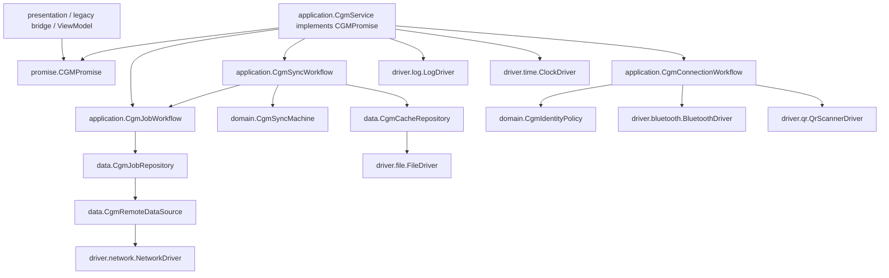

# migratedev CGM 后端设计稿

Date: 2026-06-25

Status: Draft for review.

## 核心修正

这版按你的反馈重新收束：`promise` 不再承接底层驱动能力。`promise` 是用户层能要求系统兑现的高级能力；`driver` 是文件、网络、蓝牙、二维码、日志、时间这些底层 IO 能力。`business/cgm` 夹在中间，像设备无关业务软件，只关心 CGM 业务如何流动。

更准确的分层是：

```text
presentation     前端适配层，Activity/Fragment/Compose/ViewModel 都在这里
promise          高级承诺，告诉前端 CGM 能做什么
business         设备无关业务软件，包含 domain/application/data
driver           底层 IO 能力合同和实现
Android/Network  真实设备、文件系统、HTTP、系统能力
```

CGM 后端的目标不是自己发送蓝牙字节、自己拼 Retrofit、自己碰 Android 文件 API，而是通过状态和 effect 组织工作流：

```text
设备文本/用户意图
  -> domain 状态机判断下一步
  -> application 解释 effect
  -> data/driver 执行必要 IO
  -> 新事件回灌 domain
  -> 对前端输出 state + effect
```

## 总依赖图



允许依赖：

```text
presentation -> promise
application -> promise + domain + data + driver capability
domain -> promise/domain model 或纯 Kotlin model
data -> promise/domain model + driver capability
driver implementation -> Android SDK / Retrofit / OkHttp / Bluetooth library
runtime/di -> 所有具体实现，只负责装配
```

禁止依赖：

```text
promise -> driver
domain -> driver / data / Android / Retrofit / File
data -> application workflow
presentation -> data repository / driver implementation / Retrofit DTO
driver -> business/cgm
```

这里的关键是：`driver` 可以有很多底层能力文件，但这些能力不放进 `CommonPromise` 里。`CommonPromise` 如果保留，也应该是高层通用承诺，不是 `Logger/Clock/File/Network/Bluetooth` 的大杂烩。

## 各层职责

### promise

`promise` 回答“前端可以要求 CGM 做什么”。它不回答“文件怎么写、HTTP 怎么发、蓝牙怎么连”。

```kotlin
interface CGMPromise {
    val connection: CgmConnection
    val sync: CgmSync
    val jobs: CgmJobs
}

interface CgmConnection {
    val state: StateFlow<CgmConnectionState>

    suspend fun scanIdentity(): CgmConnectionOutput
    suspend fun connect(identity: CgmDeviceIdentity, bluetoothDevice: BluetoothDevice): CgmConnectionOutput
    suspend fun disconnect(): CgmConnectionOutput
}

interface CgmSync {
    val state: StateFlow<CgmSyncState>

    suspend fun readCache(): CgmWorkflowOutput
    suspend fun onDeviceText(text: String): CgmWorkflowOutput
    suspend fun deleteCache(): CgmWorkflowOutput
    suspend fun reset(): CgmWorkflowOutput
}

interface CgmJobs {
    suspend fun uploadCache(file: CgmCacheFile): CgmJobId
    suspend fun pollResult(jobId: CgmJobId): CgmJobResult
    suspend fun uploadAndPoll(file: CgmCacheFile): CgmJobResult
}
```

我仍然建议把 `verifyCache(text)` 改成 `onDeviceText(text)`。这一步不是纯校验，它会处理缓存行、结束标记、delete ack、重试、上传、结果发布。

### domain

`domain` 是 CGM 知识层：协议规则、状态、事件、effect、校验规则。它不做 IO。

```text
domain/
  CgmDeviceProtocol.kt
  CgmSyncMachine.kt
  CgmCacheSession.kt
  CgmCacheValidator.kt
  CgmIdentityPolicy.kt
```

`domain` 的核心形态应该是状态机：

```kotlin
class CgmSyncMachine(
    private val protocol: CgmDeviceProtocol,
    private val session: CgmCacheSession,
    private val validator: CgmCacheValidator
) {
    var state: CgmSyncState = CgmSyncState.Idle
        private set

    fun dispatch(event: CgmSyncEvent): CgmTransition {
        return when (event) {
            CgmSyncEvent.ReadRequested -> onReadRequested()
            is CgmSyncEvent.DeviceTextReceived -> onDeviceText(event.text)
            is CgmSyncEvent.CacheFileSaved -> onCacheFileSaved(event.file)
            is CgmSyncEvent.JobFinished -> onJobFinished(event.result)
            CgmSyncEvent.DeleteRequested -> onDeleteRequested()
            CgmSyncEvent.DeleteAckReceived -> onDeleteAck()
            CgmSyncEvent.ResetRequested -> onReset()
        }
    }

    private fun onReadRequested(): CgmTransition {
        session.beginRead()
        state = CgmSyncState.ReadingCache
        return transition(CgmDomainEffect.SendDeviceCommand(protocol.readCacheCommand()))
    }

    private fun onDeviceText(text: String): CgmTransition {
        if (protocol.isDeleteAck(text)) return dispatch(CgmSyncEvent.DeleteAckReceived)

        val accepted = session.acceptText(text)
        state = CgmSyncState.ReceivingCache(accepted.lineCount)
        if (!accepted.sawEnd) return transition()

        state = CgmSyncState.ValidatingCache
        val validation = validator.validate(session.snapshot())
        if (!validation.valid) return retryOrFail(validation)

        return transition(CgmDomainEffect.SaveCacheFile(session.snapshot()))
    }

    private fun onCacheFileSaved(file: CgmCacheFile): CgmTransition {
        state = CgmSyncState.Uploading(file)
        return transition(CgmDomainEffect.UploadAndPoll(file))
    }

    private fun onJobFinished(result: CgmJobResult): CgmTransition {
        state = CgmSyncState.WaitingDeleteConfirm(result)
        return transition(
            CgmDomainEffect.PublishResult(result),
            CgmDomainEffect.SendDeviceCommand(protocol.deleteCacheCommand())
        )
    }

    private fun onDeleteRequested(): CgmTransition {
        state = CgmSyncState.WaitingDeleteConfirm(result = null)
        return transition(CgmDomainEffect.SendDeviceCommand(protocol.deleteCacheCommand()))
    }

    private fun retryOrFail(validation: CgmCacheValidation): CgmTransition {
        val reason = validation.message ?: "cache invalid"
        if (session.canRetry()) {
            session.beginRetry()
            state = CgmSyncState.RetryingRead(session.attempt, reason)
            return transition(CgmDomainEffect.SendDeviceCommand(protocol.readCacheRetryCommand()))
        }

        state = CgmSyncState.Failed(reason)
        return transition(CgmDomainEffect.ShowMessage(reason))
    }

    private fun onDeleteAck(): CgmTransition {
        if (state !is CgmSyncState.WaitingDeleteConfirm) return transition()
        state = CgmSyncState.Done((state as CgmSyncState.WaitingDeleteConfirm).result)
        return transition(CgmDomainEffect.ShowMessage("cache delete confirmed"))
    }

    private fun onReset(): CgmTransition {
        session.reset()
        state = CgmSyncState.Idle
        return transition()
    }

    private fun transition(vararg effects: CgmDomainEffect): CgmTransition {
        return CgmTransition(state = state, effects = effects.toList())
    }
}
```

对应的事件和 effect：

```kotlin
sealed interface CgmSyncEvent {
    data object ReadRequested : CgmSyncEvent
    data class DeviceTextReceived(val text: String) : CgmSyncEvent
    data class CacheFileSaved(val file: CgmCacheFile) : CgmSyncEvent
    data class JobFinished(val result: CgmJobResult) : CgmSyncEvent
    data object DeleteRequested : CgmSyncEvent
    data object DeleteAckReceived : CgmSyncEvent
    data object ResetRequested : CgmSyncEvent
}

sealed interface CgmDomainEffect {
    data class SendDeviceCommand(val command: CgmDeviceCommand) : CgmDomainEffect
    data class SaveCacheFile(val lines: List<String>) : CgmDomainEffect
    data class UploadAndPoll(val file: CgmCacheFile) : CgmDomainEffect
    data class PublishResult(val result: CgmJobResult) : CgmDomainEffect
    data class ShowMessage(val message: String) : CgmDomainEffect
}

data class CgmTransition(
    val state: CgmSyncState,
    val effects: List<CgmDomainEffect>
)
```

这样理解会更清楚：`domain` 负责“根据 CGM 知识判断下一步应该是什么”，但它不负责“下一步怎么执行”。

### application

`application` 是 workflow runner / effect interpreter。它实现 `promise`，驱动 domain 状态机跑起来。

```text
application/
  CgmService.kt
  CgmConnectionWorkflow.kt
  CgmSyncWorkflow.kt
  CgmJobWorkflow.kt
```

`CgmService` 是 CGM 后端入口：

```kotlin
class CgmService(
    private val log: LogDriver,
    private val clock: ClockDriver,
    bluetooth: BluetoothDriver,
    qrScanner: QrScannerDriver,
    cacheRepository: CgmCacheRepository,
    jobRepository: CgmJobRepository,
    protocol: CgmDeviceProtocol
) : CGMPromise {
    override val jobs: CgmJobs = CgmJobWorkflow(jobRepository)
    override val connection: CgmConnection = CgmConnectionWorkflow(
        bluetooth = bluetooth,
        qrScanner = qrScanner,
        clock = clock
    )
    override val sync: CgmSync = CgmSyncWorkflow(
        machine = CgmSyncMachine(
            protocol = protocol,
            session = CgmCacheSession(protocol),
            validator = CgmCacheValidator(protocol)
        ),
        cacheRepository = cacheRepository,
        jobs = jobs,
        log = log
    )
}
```

这里 `application` 知道 driver capability 和 data repository，因为它负责把 effect 执行掉；但 `domain` 不知道这些东西。

`CgmSyncWorkflow` 的重点是解释 domain effect：

```kotlin
class CgmSyncWorkflow(
    private val machine: CgmSyncMachine,
    private val cacheRepository: CgmCacheRepository,
    private val jobs: CgmJobs,
    private val log: LogDriver
) : CgmSync {
    private val mutableState = MutableStateFlow<CgmSyncState>(machine.state)
    override val state: StateFlow<CgmSyncState> = mutableState

    override suspend fun readCache(): CgmWorkflowOutput {
        return runMachine(CgmSyncEvent.ReadRequested)
    }

    override suspend fun onDeviceText(text: String): CgmWorkflowOutput {
        return runMachine(CgmSyncEvent.DeviceTextReceived(text))
    }

    override suspend fun deleteCache(): CgmWorkflowOutput {
        return runMachine(CgmSyncEvent.DeleteRequested)
    }

    override suspend fun reset(): CgmWorkflowOutput {
        return runMachine(CgmSyncEvent.ResetRequested)
    }

    private suspend fun runMachine(firstEvent: CgmSyncEvent): CgmWorkflowOutput {
        val outputEffects = mutableListOf<CgmWorkflowEffect>()
        var transition = machine.dispatch(firstEvent)

        while (true) {
            mutableState.value = transition.state
            val internalEffect = transition.effects.firstOrNull { it.needsApplicationExecution() } ?: break
            transition.effects.filterNot { it.needsApplicationExecution() }
                .mapTo(outputEffects, ::toWorkflowEffect)

            transition = executeInternalEffect(internalEffect)
        }

        transition.effects.mapTo(outputEffects, ::toWorkflowEffect)
        mutableState.value = transition.state
        return CgmWorkflowOutput(state = mutableState.value, effects = outputEffects)
    }

    private suspend fun executeInternalEffect(effect: CgmDomainEffect): CgmTransition {
        return when (effect) {
            is CgmDomainEffect.SaveCacheFile -> {
                val file = cacheRepository.saveReplay(effect.lines)
                machine.dispatch(CgmSyncEvent.CacheFileSaved(file))
            }
            is CgmDomainEffect.UploadAndPoll -> {
                val result = jobs.uploadAndPoll(effect.file)
                machine.dispatch(CgmSyncEvent.JobFinished(result))
            }
            else -> error("external effect should not be executed here")
        }
    }

    private fun CgmDomainEffect.needsApplicationExecution(): Boolean {
        return this is CgmDomainEffect.SaveCacheFile || this is CgmDomainEffect.UploadAndPoll
    }

    private fun toWorkflowEffect(effect: CgmDomainEffect): CgmWorkflowEffect {
        return when (effect) {
            is CgmDomainEffect.SendDeviceCommand -> CgmWorkflowEffect.SendCommand(effect.command)
            is CgmDomainEffect.PublishResult -> CgmWorkflowEffect.PublishResult(effect.result)
            is CgmDomainEffect.ShowMessage -> CgmWorkflowEffect.ShowMessage(effect.message)
            is CgmDomainEffect.SaveCacheFile,
            is CgmDomainEffect.UploadAndPoll -> error("internal effect should be executed before output")
        }
    }
}
```

这段草图要表达的是：`CgmSyncWorkflow` 本身不是规则库，它只是把 domain effect 翻译成 data/driver 调用，或者翻译成给前端执行的一次性 effect。

### data

`data` 不是架空层。它回答“CGM 业务数据怎么落地、怎么从远端回来、怎么从外部格式映射成内部模型”。

它不做状态机决策，不知道 `CgmSyncState` 怎么流转，也不发蓝牙命令。

```text
data/
  CgmCacheRepository.kt
  DefaultCgmCacheRepository.kt
  CgmJobRepository.kt
  DefaultCgmJobRepository.kt
  CgmRemoteDataSource.kt
  endpoint/CgmEndpoints.kt
  dto/CgmDtos.kt
```

本地缓存文件属于 data，因为它是 CGM 业务数据的持久化形态；文件 API 属于 driver，因为它是底层 IO。

```kotlin
interface CgmCacheRepository {
    suspend fun saveReplay(lines: List<String>): CgmCacheFile
    suspend fun readReplay(file: CgmCacheFile): List<String>
}

class DefaultCgmCacheRepository(
    private val fileDriver: FileDriver,
    private val clock: ClockDriver
) : CgmCacheRepository {
    override suspend fun saveReplay(lines: List<String>): CgmCacheFile {
        val name = "cgm-cache-${clock.nowMillis()}.txt"
        val stored = fileDriver.writeText(name, lines.joinToString(separator = "\n"))
        return CgmCacheFile(file = stored, lineCount = lines.size)
    }

    override suspend fun readReplay(file: CgmCacheFile): List<String> {
        return fileDriver.readText(file.file).lines()
    }
}
```

服务器 job 也属于 data，因为它负责 endpoint、DTO、状态字符串、result artifact 映射。

```kotlin
interface CgmJobRepository {
    suspend fun uploadCache(file: CgmCacheFile): CgmJobId
    suspend fun pollUntilFinished(jobId: CgmJobId): CgmJobResult
}

class DefaultCgmJobRepository(
    private val network: NetworkDriver,
    private val remote: CgmRemoteDataSource
) : CgmJobRepository {
    override suspend fun uploadCache(file: CgmCacheFile): CgmJobId {
        val response = network.execute(remote.uploadDataset(file))
        val jobId = response.jobId ?: error(response.errorMessage ?: "missing job id")
        return CgmJobId(jobId)
    }

    override suspend fun pollUntilFinished(jobId: CgmJobId): CgmJobResult {
        repeat(MAX_POLL_ATTEMPTS) {
            val job = network.execute(remote.getJob(jobId))
            if (job.status == "GENERATED" && job.resultId != null) {
                val artifacts = network.execute(remote.getArtifacts(job.resultId))
                return CgmJobResult(
                    jobId = job.jobId,
                    status = job.status,
                    primary = artifacts.firstOrNull(),
                    artifacts = artifacts
                )
            }
            delay(POLL_DELAY_MS)
        }
        error("poll timeout: ${jobId.value}")
    }

    private companion object {
        const val MAX_POLL_ATTEMPTS = 20
        const val POLL_DELAY_MS = 1000L
    }
}
```

所以 data 的有效性在于：

- 把文件命名、txt 内容、保存位置这些本地数据策略收起来。
- 把 endpoint、DTO、服务器状态码、artifact 映射收起来。
- 给 application 一个稳定的 repository，而不是让 workflow 碰 driver 细节。
- 后续贴片编号、设备绑定、历史结果、用户本地配置，也可以继续放在 data repository 后面。

### driver

`driver` 是底层能力，不属于 `promise`。

```text
driver/
  bluetooth/BluetoothDriver.kt
  file/FileDriver.kt
  network/NetworkDriver.kt
  qr/QrScannerDriver.kt
  log/LogDriver.kt
  time/ClockDriver.kt
```

driver contract 可以很细，因为这里确实是组件库思路。CGM 不重写文件、网络、日志、蓝牙，只调用这些稳定能力。

```kotlin
interface FileDriver {
    suspend fun writeText(name: String, content: String): StoredFile
    suspend fun readText(file: StoredFile): String
    suspend fun delete(file: StoredFile): Boolean
}

interface NetworkDriver {
    suspend fun <T : Any> execute(endpoint: NetworkEndpoint<T>): T
}

interface BluetoothDriver {
    suspend fun connect(device: BluetoothDevice)
    suspend fun disconnect(deviceId: String)
    suspend fun send(packet: BluetoothPacket)
}
```

这些接口后面可以由 Android 文件系统、Retrofit、蓝牙库分别实现。`business/cgm` 只依赖 driver contract，不依赖 implementation。

## data 和 presentation 的关系

前端以后一定会展示“数据”，但 presentation 不应该直接依赖 `business/cgm/data`。UI 要看的数据应该被放进 state，或者通过新的高级 promise 暴露。

也就是说：

```text
data repository -> application workflow -> promise state -> presentation ui-state
```

而不是：

```text
presentation -> data repository
```

`CgmSyncState` 不能只是几个空状态，它需要带上 UI 会关心的业务数据：

```kotlin
sealed interface CgmSyncState {
    data object Idle : CgmSyncState
    data object ReadingCache : CgmSyncState
    data class ReceivingCache(val lineCount: Int) : CgmSyncState
    data object ValidatingCache : CgmSyncState
    data class RetryingRead(val attempt: Int, val reason: String) : CgmSyncState
    data class CacheReady(val file: CgmCacheFile) : CgmSyncState
    data class Uploading(val file: CgmCacheFile) : CgmSyncState
    data class PollingJob(val jobId: CgmJobId, val attempt: Int) : CgmSyncState
    data class WaitingDeleteConfirm(val result: CgmJobResult?) : CgmSyncState
    data class Done(val result: CgmJobResult?) : CgmSyncState
    data class Failed(val reason: String) : CgmSyncState
}
```

如果 UI 要展示历史结果，不让 UI 直接查 `CgmJobRepository`，而是后续扩展高级能力：

```kotlin
interface CgmHistory {
    val results: StateFlow<List<CgmResultSummary>>
    suspend fun refresh()
}
```

这个能力仍然挂在 `CGMPromise` 或独立 promise 下，由 application/data 实现。前端拿到的是“可展示状态”，不是底层数据源。

## 一条完整数据流

```text
用户点读取缓存
  -> presentation 调 cgm.sync.readCache()
  -> application 投递 ReadRequested 给 domain
  -> domain state = ReadingCache, effect = SendDeviceCommand(read_cache)
  -> application 把 SendCommand 作为 CgmWorkflowEffect 返回
  -> presentation/host 执行真实蓝牙发送

设备文本进入
  -> presentation/host 解码 text
  -> cgm.sync.onDeviceText(text)
  -> domain 拼接缓存、判断 end marker、校验
  -> 如果缺失，domain effect = SendDeviceCommand(read_cache_retry)
  -> 如果完整，domain effect = SaveCacheFile(lines)

保存和上传
  -> application 解释 SaveCacheFile，调用 CgmCacheRepository
  -> data 调 FileDriver 写 txt，返回 CgmCacheFile
  -> application 回灌 CacheFileSaved(file)
  -> domain effect = UploadAndPoll(file)
  -> application 调 CgmJobWorkflow.uploadAndPoll(file)
  -> CgmJobWorkflow 调 CgmJobRepository
  -> data 调 NetworkDriver + endpoint，返回 CgmJobResult
  -> application 回灌 JobFinished(result)

结果和删除
  -> domain state = WaitingDeleteConfirm
  -> domain effects = PublishResult(result), SendDeviceCommand(delete_cache)
  -> application 返回给 presentation
  -> presentation 展示 result，并执行蓝牙 delete 命令
  -> 设备回 Log Cleared
  -> onDeviceText(text)
  -> domain state = Done
```

## 文件级落点

第一轮先整理这些后端文件：

```text
promise/
  CGMPromise.kt

business/cgm/domain/
  CgmDeviceProtocol.kt
  CgmSyncMachine.kt
  CgmCacheSession.kt
  CgmCacheValidator.kt
  CgmIdentityPolicy.kt

business/cgm/application/
  CgmService.kt
  CgmConnectionWorkflow.kt
  CgmSyncWorkflow.kt
  CgmJobWorkflow.kt

business/cgm/data/
  CgmCacheRepository.kt
  CgmJobRepository.kt
  CgmRemoteDataSource.kt
  DefaultCgmCacheRepository.kt
  DefaultCgmJobRepository.kt

driver/
  bluetooth/
  file/
  network/
  qr/
  log/
  time/
```

暂时不做：

- Compose 页面。
- 大规模迁移旧 Activity/Fragment。
- 完整 DI 框架。
- account 模块细化。
- 真实 driver implementation。

## 测试切口

第一轮测试应该能证明 domain 节点和 application 解释器是分开的：

```text
CgmSyncMachineTest
  read requested emits read command
  device text before end only updates ReceivingCache
  invalid cache emits retry command
  retry limit enters Failed
  valid cache emits SaveCacheFile
  cache file saved emits UploadAndPoll
  job finished emits PublishResult and delete command
  delete ack enters Done

CgmSyncWorkflowTest
  SaveCacheFile effect calls CgmCacheRepository
  UploadAndPoll effect calls CgmJobs
  external SendCommand effect is returned, not executed internally

CgmCacheRepositoryTest
  saveReplay writes txt through FileDriver
  readReplay reads txt through FileDriver

CgmJobWorkflowTest
  uploadAndPoll calls upload then poll

CgmJobRepositoryTest
  upload maps response to CgmJobId
  poll generated maps artifacts to CgmJobResult
  poll timeout returns clear error
```

## 当前需要你继续审的点

1. `CommonPromise` 是否只保留高层通用承诺，不再承载 driver 能力。
2. `domain` 是否按状态机 + domain effect 的方式落地。
3. `application` 是否作为 effect interpreter，负责调用 data/driver。
4. `data` 是否按本地缓存 repository + 远端 job repository 这样保留。
5. UI 需要的数据是否统一放进 promise/domain state，而不是让 presentation 直接依赖 data。
