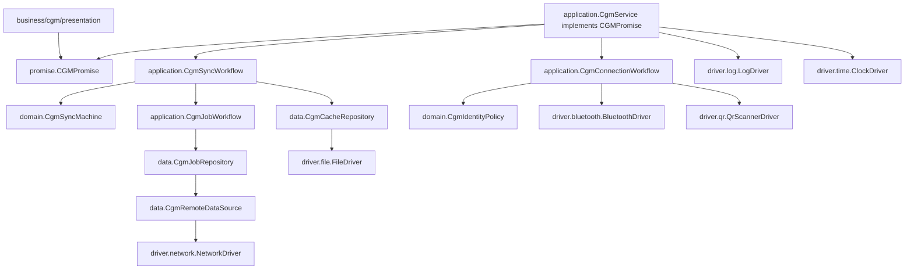

# migratedev CGM 后端设计稿

Date: 2026-06-25

Status: Draft for review.

## 分层定位

这版按“高级承诺 + 设备无关业务 + 底层驱动”的思路收束。

```text
presentation     前端适配层，负责 Activity / Fragment / Compose / ViewModel
promise          高级承诺，告诉前端 CGM 能做什么
business         设备无关业务软件，包含 domain / application / data
driver           底层 IO 能力合同和实现
Android/Network  真实设备、文件系统、HTTP、系统能力
```

这里的 `presentation` 是概念层，不一定要做成一个巨大的顶层 UI 包。我的 Android 经验建议是：**UI 按业务聚合，公共 UI 再抽共享层**。

```text
business/
  cgm/
    domain/
    application/
    data/
    presentation/
  account/
    domain/
    application/
    data/
    presentation/

presentation/
  app/        // 导航壳、AppScaffold、跨业务入口
  shared/     // 纯 UI 组件、主题、通用 dialog
```

原因是 Android 的页面通常跟业务流绑定很深：CGM 页面会依赖 CGM state/effect，Account 页面会依赖 Account state/effect。如果把所有 UI 都堆到顶层 `presentation/cgm`、`presentation/account` 也能做，但长期更容易出现“UI 跨业务乱调”。放在 `business/cgm/presentation` 的好处是边界很近：这个页面属于哪个业务，它能碰哪个 promise，一眼能看出来。

跨业务页面不要让 UI 互相调用，例如 CGM 页面不要直接调 account repository。跨业务协作放到更高层的 application/service 或 app-level ViewModel 里，UI 只消费组合后的状态。

## 依赖图



允许依赖：

```text
presentation -> promise
promise -> business/cgm/domain model
application -> promise + domain + data + driver capability
domain -> 纯 Kotlin model
data -> domain/promise model + driver capability
driver implementation -> Android SDK / Retrofit / OkHttp / Bluetooth library
runtime/di -> 所有具体实现，只负责装配
```

禁止依赖：

```text
promise -> driver
domain -> driver / data / Android / Retrofit / File
data -> application workflow
presentation -> data repository / driver implementation / Retrofit DTO
driver -> business/cgm
```

## promise 层

`CGMPromise` 应该短，只把握大方向。state/effect/event 的详细定义下放到 `business/cgm/domain`，promise 只是把这些业务模型暴露给前端使用。

```kotlin
interface CGMPromise {
    val connection: CgmConnection
    val sync: CgmSync
}

interface CgmConnection {
    val state: StateFlow<CgmConnectionState>

    suspend fun scanIdentity(): CgmConnectionOutput
    suspend fun connect(identity: CgmDeviceIdentity, bluetoothDevice: BluetoothDevice): CgmConnectionOutput
    suspend fun disconnect(): CgmConnectionOutput
}

interface CgmSync {
    val state: StateFlow<CgmSyncState>

    suspend fun startCacheSync(): CgmWorkflowOutput
    suspend fun acceptDeviceText(text: String): CgmWorkflowOutput
    suspend fun requestDeleteCache(): CgmWorkflowOutput
    suspend fun reset(): CgmWorkflowOutput
}
```

这里不把 `CgmJobs` 挂到 `CGMPromise`。上传缓存和拉取结果是 CGM 同步流程里的内部节点，不是前端日常要直接调用的高级承诺。后续如果真的出现独立的“任务管理页”或“手动输入 jobId 拉结果”的需求，再新增 `CgmJobPromise`，不要现在预留。

我也建议把 `verifyCache(text)` 改成 `acceptDeviceText(text)`。这一步不是纯校验，它会接收设备文本、拼接缓存、识别结束标记、处理 delete ack、触发重试、触发上传和发布结果。

## domain 层

`domain` 汇总 CGM 知识：协议规则、状态、事件、effect、校验规则。它不调用文件、网络、蓝牙，也不关心 Activity/Fragment/Compose。

```text
domain/
  CgmModels.kt
  CgmDeviceProtocol.kt
  CgmSyncMachine.kt
  CgmCacheSession.kt
  CgmCacheValidator.kt
  CgmIdentityPolicy.kt
```

`CgmModels.kt` 放 state/effect/event 这些业务模型。这样 `CGMPromise.kt` 会变短，前端也能通过 promise 拿到统一模型。

```kotlin
sealed interface CgmSyncEvent {
    data object ReadRequested : CgmSyncEvent
    data class DeviceTextReceived(val text: String) : CgmSyncEvent
    data class CacheFileSaved(val file: CgmCacheFile) : CgmSyncEvent
    data class CacheUploaded(val jobId: CgmJobId) : CgmSyncEvent
    data class JobPolled(val result: CgmJobResult) : CgmSyncEvent
    data object DeleteRequested : CgmSyncEvent
    data object DeleteAckReceived : CgmSyncEvent
    data object ResetRequested : CgmSyncEvent
}

sealed interface CgmDomainEffect {
    data class SendDeviceCommand(val command: CgmDeviceCommand) : CgmDomainEffect
    data class SaveCacheFile(val lines: List<String>) : CgmDomainEffect
    data class UploadCache(val file: CgmCacheFile) : CgmDomainEffect
    data class PollJob(val jobId: CgmJobId) : CgmDomainEffect
    data class PublishResult(val result: CgmJobResult) : CgmDomainEffect
    data class ShowMessage(val message: String) : CgmDomainEffect
}

data class CgmTransition(
    val state: CgmSyncState,
    val effects: List<CgmDomainEffect>
)

data class CgmWorkflowOutput(
    val state: CgmSyncState,
    val effects: List<CgmDomainEffect> = emptyList()
)
```

状态要携带 UI 会展示的数据，但仍然是业务状态，不是 UI 文案。

```kotlin
sealed interface CgmSyncState {
    data object Idle : CgmSyncState
    data object ReadingCache : CgmSyncState
    data class ReceivingCache(val lineCount: Int) : CgmSyncState
    data object ValidatingCache : CgmSyncState
    data class RetryingRead(val attempt: Int, val reason: String) : CgmSyncState
    data class CacheReady(val file: CgmCacheFile) : CgmSyncState
    data class Uploading(val file: CgmCacheFile) : CgmSyncState
    data class PollingJob(val jobId: CgmJobId) : CgmSyncState
    data class WaitingDeleteConfirm(val result: CgmJobResult?) : CgmSyncState
    data class Done(val result: CgmJobResult?) : CgmSyncState
    data class Failed(val reason: String) : CgmSyncState
}
```

`CgmSyncMachine` 是纯状态机。它看见节点 event，决定新的 state 和下一批 effect。

```kotlin
class CgmSyncMachine(
    private val protocol: CgmDeviceProtocol,
    private val session: CgmCacheSession,
    private val validator: CgmCacheValidator
) {
    var state: CgmSyncState = CgmSyncState.Idle
        private set

    fun dispatch(event: CgmSyncEvent): CgmTransition {
        return when (event) {
            CgmSyncEvent.ReadRequested -> onReadRequested()
            is CgmSyncEvent.DeviceTextReceived -> onDeviceText(event.text)
            is CgmSyncEvent.CacheFileSaved -> onCacheFileSaved(event.file)
            is CgmSyncEvent.CacheUploaded -> onCacheUploaded(event.jobId)
            is CgmSyncEvent.JobPolled -> onJobPolled(event.result)
            CgmSyncEvent.DeleteRequested -> onDeleteRequested()
            CgmSyncEvent.DeleteAckReceived -> onDeleteAck()
            CgmSyncEvent.ResetRequested -> onReset()
        }
    }

    private fun onReadRequested(): CgmTransition {
        session.beginRead()
        state = CgmSyncState.ReadingCache
        return transition(CgmDomainEffect.SendDeviceCommand(protocol.readCacheCommand()))
    }

    private fun onDeviceText(text: String): CgmTransition {
        if (protocol.isDeleteAck(text)) return dispatch(CgmSyncEvent.DeleteAckReceived)

        val accepted = session.acceptText(text)
        state = CgmSyncState.ReceivingCache(accepted.lineCount)
        if (!accepted.sawEnd) return transition()

        state = CgmSyncState.ValidatingCache
        val validation = validator.validate(session.snapshot())
        if (!validation.valid) return retryOrFail(validation)

        return transition(CgmDomainEffect.SaveCacheFile(session.snapshot()))
    }

    private fun onCacheFileSaved(file: CgmCacheFile): CgmTransition {
        state = CgmSyncState.Uploading(file)
        return transition(CgmDomainEffect.UploadCache(file))
    }

    private fun onCacheUploaded(jobId: CgmJobId): CgmTransition {
        state = CgmSyncState.PollingJob(jobId)
        return transition(CgmDomainEffect.PollJob(jobId))
    }

    private fun onJobPolled(result: CgmJobResult): CgmTransition {
        state = CgmSyncState.WaitingDeleteConfirm(result)
        return transition(
            CgmDomainEffect.PublishResult(result),
            CgmDomainEffect.SendDeviceCommand(protocol.deleteCacheCommand())
        )
    }

    private fun onDeleteRequested(): CgmTransition {
        state = CgmSyncState.WaitingDeleteConfirm(result = null)
        return transition(CgmDomainEffect.SendDeviceCommand(protocol.deleteCacheCommand()))
    }

    private fun retryOrFail(validation: CgmCacheValidation): CgmTransition {
        val reason = validation.message ?: "cache invalid"
        if (session.canRetry()) {
            session.beginRetry()
            state = CgmSyncState.RetryingRead(session.attempt, reason)
            return transition(CgmDomainEffect.SendDeviceCommand(protocol.readCacheRetryCommand()))
        }

        state = CgmSyncState.Failed(reason)
        return transition(CgmDomainEffect.ShowMessage(reason))
    }

    private fun onDeleteAck(): CgmTransition {
        val current = state as? CgmSyncState.WaitingDeleteConfirm ?: return transition()
        state = CgmSyncState.Done(current.result)
        return transition(CgmDomainEffect.ShowMessage("cache delete confirmed"))
    }

    private fun onReset(): CgmTransition {
        session.reset()
        state = CgmSyncState.Idle
        return transition()
    }

    private fun transition(vararg effects: CgmDomainEffect): CgmTransition {
        return CgmTransition(state = state, effects = effects.toList())
    }
}
```

## application 层

`application` 是 workflow runner / effect interpreter。`CgmService` 负责装配并实现 `CGMPromise`，但它不直接操纵状态流转；具体跑流程的是 workflow，状态判断来自 domain machine。

```text
application/
  CgmService.kt
  CgmConnectionWorkflow.kt
  CgmSyncWorkflow.kt
  CgmJobWorkflow.kt
```

`CgmService` 很薄：

```kotlin
class CgmService(
    bluetooth: BluetoothDriver,
    qrScanner: QrScannerDriver,
    clock: ClockDriver,
    log: LogDriver,
    cacheRepository: CgmCacheRepository,
    jobRepository: CgmJobRepository,
    protocol: CgmDeviceProtocol
) : CGMPromise {
    override val connection: CgmConnection = CgmConnectionWorkflow(
        bluetooth = bluetooth,
        qrScanner = qrScanner,
        clock = clock
    )

    override val sync: CgmSync = CgmSyncWorkflow(
        machine = CgmSyncMachine(
            protocol = protocol,
            session = CgmCacheSession(protocol),
            validator = CgmCacheValidator(protocol)
        ),
        cacheRepository = cacheRepository,
        jobWorkflow = CgmJobWorkflow(jobRepository),
        log = log
    )
}
```

`CgmJobWorkflow` 不需要 `uploadAndPoll`。上传和轮询是两个节点，状态机也应该能看见 `Uploading -> PollingJob` 的变化。

```kotlin
class CgmJobWorkflow(
    private val repository: CgmJobRepository
) {
    suspend fun uploadCache(file: CgmCacheFile): CgmJobId {
        return repository.uploadCache(file)
    }

    suspend fun pollResult(jobId: CgmJobId): CgmJobResult {
        return repository.pollUntilFinished(jobId)
    }
}
```

`CgmSyncWorkflow` 解释 domain effect。外部 effect 直接返回给 presentation，内部 effect 调 data/application 后再回灌 event。

```kotlin
class CgmSyncWorkflow(
    private val machine: CgmSyncMachine,
    private val cacheRepository: CgmCacheRepository,
    private val jobWorkflow: CgmJobWorkflow,
    private val log: LogDriver
) : CgmSync {
    private val mutableState = MutableStateFlow<CgmSyncState>(machine.state)
    override val state: StateFlow<CgmSyncState> = mutableState

    override suspend fun startCacheSync(): CgmWorkflowOutput {
        return runMachine(CgmSyncEvent.ReadRequested)
    }

    override suspend fun acceptDeviceText(text: String): CgmWorkflowOutput {
        return runMachine(CgmSyncEvent.DeviceTextReceived(text))
    }

    override suspend fun requestDeleteCache(): CgmWorkflowOutput {
        return runMachine(CgmSyncEvent.DeleteRequested)
    }

    override suspend fun reset(): CgmWorkflowOutput {
        return runMachine(CgmSyncEvent.ResetRequested)
    }

    private suspend fun runMachine(firstEvent: CgmSyncEvent): CgmWorkflowOutput {
        val outputEffects = mutableListOf<CgmDomainEffect>()
        var transition = machine.dispatch(firstEvent)

        while (true) {
            mutableState.value = transition.state
            val internal = transition.effects.firstOrNull { it.isInternalEffect() } ?: break
            outputEffects += transition.effects.filter { it.isExternalEffect() }
            transition = executeInternalEffect(internal)
        }

        mutableState.value = transition.state
        return CgmWorkflowOutput(
            state = mutableState.value,
            effects = outputEffects + transition.effects.filter { it.isExternalEffect() }
        )
    }

    private suspend fun executeInternalEffect(effect: CgmDomainEffect): CgmTransition {
        return when (effect) {
            is CgmDomainEffect.SaveCacheFile -> {
                val file = cacheRepository.saveReplay(effect.lines)
                machine.dispatch(CgmSyncEvent.CacheFileSaved(file))
            }
            is CgmDomainEffect.UploadCache -> {
                val jobId = jobWorkflow.uploadCache(effect.file)
                machine.dispatch(CgmSyncEvent.CacheUploaded(jobId))
            }
            is CgmDomainEffect.PollJob -> {
                val result = jobWorkflow.pollResult(effect.jobId)
                machine.dispatch(CgmSyncEvent.JobPolled(result))
            }
            else -> error("external effect should not be executed here")
        }
    }

    private fun CgmDomainEffect.isInternalEffect(): Boolean {
        return this is CgmDomainEffect.SaveCacheFile ||
            this is CgmDomainEffect.UploadCache ||
            this is CgmDomainEffect.PollJob
    }

    private fun CgmDomainEffect.isExternalEffect(): Boolean {
        return !isInternalEffect()
    }
}
```

这里的重点是：`CgmSyncWorkflow` 管 StateFlow 和 effect 执行，`CgmSyncMachine` 管业务判断，`CgmService` 管装配。

## data 层

`data` 不架空。它负责业务数据怎么落地、怎么从远端回来、怎么从外部格式映射成内部模型。

因为第一版代码量不大，接口和实现可以先写在同一个文件里，等膨胀后再拆。

```text
data/
  CgmCacheData.kt
  CgmJobData.kt
```

`CgmCacheData.kt`：

```kotlin
interface CgmCacheRepository {
    suspend fun saveReplay(lines: List<String>): CgmCacheFile
    suspend fun readReplay(file: CgmCacheFile): List<String>
}

class DefaultCgmCacheRepository(
    private val fileDriver: FileDriver,
    private val clock: ClockDriver
) : CgmCacheRepository {
    override suspend fun saveReplay(lines: List<String>): CgmCacheFile {
        val name = "cgm-cache-${clock.nowMillis()}.txt"
        val stored = fileDriver.writeText(name, lines.joinToString(separator = "\n"))
        return CgmCacheFile(file = stored, lineCount = lines.size)
    }

    override suspend fun readReplay(file: CgmCacheFile): List<String> {
        return fileDriver.readText(file.file).lines()
    }
}
```

`CgmJobData.kt`：

```kotlin
interface CgmJobRepository {
    suspend fun uploadCache(file: CgmCacheFile): CgmJobId
    suspend fun pollUntilFinished(jobId: CgmJobId): CgmJobResult
}

interface CgmRemoteDataSource {
    fun uploadDataset(file: CgmCacheFile): NetworkEndpoint<CgmUploadResponse>
    fun getJob(jobId: CgmJobId): NetworkEndpoint<CgmJobResponse>
    fun getArtifacts(resultId: Long): NetworkEndpoint<List<CgmResultArtifact>>
}

class DefaultCgmJobRepository(
    private val network: NetworkDriver,
    private val remote: CgmRemoteDataSource
) : CgmJobRepository {
    override suspend fun uploadCache(file: CgmCacheFile): CgmJobId {
        val response = network.execute(remote.uploadDataset(file))
        val jobId = response.jobId ?: error(response.errorMessage ?: "missing job id")
        return CgmJobId(jobId)
    }

    override suspend fun pollUntilFinished(jobId: CgmJobId): CgmJobResult {
        repeat(MAX_POLL_ATTEMPTS) {
            val job = network.execute(remote.getJob(jobId))
            if (job.status == "GENERATED" && job.resultId != null) {
                val artifacts = network.execute(remote.getArtifacts(job.resultId))
                return CgmJobResult(
                    jobId = job.jobId,
                    status = job.status,
                    primary = artifacts.firstOrNull(),
                    artifacts = artifacts
                )
            }
            delay(POLL_DELAY_MS)
        }
        error("poll timeout: ${jobId.value}")
    }

    private companion object {
        const val MAX_POLL_ATTEMPTS = 20
        const val POLL_DELAY_MS = 1000L
    }
}
```

data 层的边界价值：

- 本地缓存文件命名、txt 内容、保存位置属于 `CgmCacheRepository`。
- HTTP endpoint、DTO、服务器状态、artifact 映射属于 `CgmJobRepository` / `CgmRemoteDataSource`。
- workflow 只看到 `CgmCacheFile`、`CgmJobId`、`CgmJobResult`，不看到 Retrofit、File API、DTO。

## driver 层

`driver` 是底层能力，不属于 `promise`。

```text
driver/
  bluetooth/BluetoothDriver.kt
  file/FileDriver.kt
  network/NetworkDriver.kt
  qr/QrScannerDriver.kt
  log/LogDriver.kt
  time/ClockDriver.kt
```

driver contract 可以细，因为这是组件库思路。CGM 不重写文件、网络、日志、蓝牙，只调用这些稳定能力。

```kotlin
interface FileDriver {
    suspend fun writeText(name: String, content: String): StoredFile
    suspend fun readText(file: StoredFile): String
    suspend fun delete(file: StoredFile): Boolean
}

interface NetworkDriver {
    suspend fun <T : Any> execute(endpoint: NetworkEndpoint<T>): T
}

interface BluetoothDriver {
    suspend fun connect(device: BluetoothDevice)
    suspend fun disconnect(deviceId: String)
    suspend fun send(packet: BluetoothPacket)
}
```

## data 到 presentation 的完整示例

链路是：

```text
data repository -> application workflow -> promise/domain state -> presentation ui-state
```

presentation 不直接依赖 repository。UI 要展示的数据必须从 state/effect 里出来。

示例：job poll 成功后，data 返回 `CgmJobResult`：

```kotlin
val result = CgmJobResult(
    jobId = 42,
    status = "GENERATED",
    primary = CgmResultArtifact.GlucosePrediction(...),
    artifacts = artifacts
)
```

application 把它回灌给 domain：

```kotlin
machine.dispatch(CgmSyncEvent.JobPolled(result))
```

domain 产出状态和 effect：

```kotlin
state = CgmSyncState.WaitingDeleteConfirm(result)
effects = listOf(
    CgmDomainEffect.PublishResult(result),
    CgmDomainEffect.SendDeviceCommand(protocol.deleteCacheCommand())
)
```

ViewModel 只依赖 `CGMPromise`：

```kotlin
class CgmViewModel(
    private val cgm: CGMPromise
) : ViewModel() {
    private val mutableState = MutableStateFlow(CgmUiState())
    val state: StateFlow<CgmUiState> = mutableState

    private val mutableEffects = MutableSharedFlow<CgmUiEffect>()
    val effects: SharedFlow<CgmUiEffect> = mutableEffects

    fun onIntent(intent: CgmIntent) {
        viewModelScope.launch {
            val output = when (intent) {
                CgmIntent.ReadCache -> cgm.sync.startCacheSync()
                is CgmIntent.DeviceTextReceived -> cgm.sync.acceptDeviceText(intent.text)
                CgmIntent.DeleteCache -> cgm.sync.requestDeleteCache()
                CgmIntent.Reset -> cgm.sync.reset()
            }

            mutableState.value = CgmUiState.from(output.state)
            output.effects.forEach { effect ->
                effect.toUiEffect()?.let { mutableEffects.emit(it) }
            }
        }
    }
}
```

UI state 从业务 state 映射，不从 repository 查：

```kotlin
data class CgmUiState(
    val busy: Boolean = false,
    val lineCount: Int = 0,
    val cacheFileName: String? = null,
    val jobId: Long? = null,
    val result: CgmJobResult? = null,
    val error: String? = null
) {
    companion object {
        fun from(state: CgmSyncState): CgmUiState {
            return when (state) {
                CgmSyncState.Idle -> CgmUiState()
                CgmSyncState.ReadingCache -> CgmUiState(busy = true)
                is CgmSyncState.ReceivingCache -> CgmUiState(busy = true, lineCount = state.lineCount)
                CgmSyncState.ValidatingCache -> CgmUiState(busy = true)
                is CgmSyncState.RetryingRead -> CgmUiState(busy = true, error = state.reason)
                is CgmSyncState.CacheReady -> CgmUiState(cacheFileName = state.file.file.name)
                is CgmSyncState.Uploading -> CgmUiState(busy = true, cacheFileName = state.file.file.name)
                is CgmSyncState.PollingJob -> CgmUiState(busy = true, jobId = state.jobId.value)
                is CgmSyncState.WaitingDeleteConfirm -> CgmUiState(result = state.result)
                is CgmSyncState.Done -> CgmUiState(result = state.result)
                is CgmSyncState.Failed -> CgmUiState(error = state.reason)
            }
        }
    }
}
```

UI effect 从 domain effect 映射，真正执行蓝牙发送仍然在 host/driver bridge：

```kotlin
sealed interface CgmUiEffect {
    data class SendCommand(val command: CgmDeviceCommand) : CgmUiEffect
    data class ShowMessage(val message: String) : CgmUiEffect
}

fun CgmDomainEffect.toUiEffect(): CgmUiEffect? {
    return when (effect) {
        is CgmDomainEffect.SendDeviceCommand -> CgmUiEffect.SendCommand(command)
        is CgmDomainEffect.ShowMessage -> CgmUiEffect.ShowMessage(message)
        is CgmDomainEffect.PublishResult -> null
        is CgmDomainEffect.SaveCacheFile,
        is CgmDomainEffect.UploadCache,
        is CgmDomainEffect.PollJob -> null
    }
}
```

这就是 data 到 UI 的完整链路：`DefaultCgmJobRepository` 产生 result，workflow 把 result 交给 machine，machine 把 result 放进 `CgmSyncState.WaitingDeleteConfirm`，ViewModel 映射成 `CgmUiState.result`。UI 没有理由也没有入口去直接碰 `CgmJobRepository`。

## 完整流程

```text
用户点读取缓存
  -> presentation 调 cgm.sync.startCacheSync()
  -> workflow 投递 ReadRequested 给 machine
  -> machine state = ReadingCache, effect = SendDeviceCommand(read_cache)
  -> workflow 返回 SendCommand
  -> presentation/host 执行真实蓝牙发送

设备文本进入
  -> presentation/host 解码 text
  -> cgm.sync.acceptDeviceText(text)
  -> machine 拼接缓存、判断 end marker、校验
  -> 缺失则 effect = SendDeviceCommand(read_cache_retry)
  -> 完整则 effect = SaveCacheFile(lines)

保存、上传、轮询
  -> workflow 解释 SaveCacheFile，调用 CgmCacheRepository
  -> data 调 FileDriver 写 txt，返回 CgmCacheFile
  -> workflow 回灌 CacheFileSaved(file)
  -> machine effect = UploadCache(file)
  -> workflow 调 CgmJobWorkflow.uploadCache(file)
  -> data 调 NetworkDriver + upload endpoint，返回 CgmJobId
  -> workflow 回灌 CacheUploaded(jobId)
  -> machine state = PollingJob(jobId), effect = PollJob(jobId)
  -> workflow 调 CgmJobWorkflow.pollResult(jobId)
  -> data 调 NetworkDriver + poll/artifact endpoint，返回 CgmJobResult
  -> workflow 回灌 JobPolled(result)

结果和删除
  -> machine state = WaitingDeleteConfirm(result)
  -> machine effects = PublishResult(result), SendDeviceCommand(delete_cache)
  -> workflow 返回给 presentation
  -> presentation 展示 result，并执行蓝牙 delete 命令
  -> 设备回 Log Cleared
  -> cgm.sync.acceptDeviceText(text)
  -> machine state = Done(result)
```

## 文件级落点

第一轮先整理这些后端文件：

```text
promise/
  CGMPromise.kt

business/cgm/domain/
  CgmModels.kt
  CgmDeviceProtocol.kt
  CgmSyncMachine.kt
  CgmCacheSession.kt
  CgmCacheValidator.kt
  CgmIdentityPolicy.kt

business/cgm/application/
  CgmService.kt
  CgmConnectionWorkflow.kt
  CgmSyncWorkflow.kt
  CgmJobWorkflow.kt

business/cgm/data/
  CgmCacheData.kt
  CgmJobData.kt

business/cgm/presentation/
  // 后续再展开 Compose/ViewModel，当前只保留方向

driver/
  bluetooth/
  file/
  network/
  qr/
  log/
  time/
```

暂时不做：

- Compose 页面。
- 大规模迁移旧 Activity/Fragment。
- 完整 DI 框架。
- account 模块细化。
- 真实 driver implementation。

## 测试切口

```text
CgmSyncMachineTest
  read requested emits read command
  device text before end only updates ReceivingCache
  invalid cache emits retry command
  retry limit enters Failed
  valid cache emits SaveCacheFile
  cache file saved emits UploadCache
  cache uploaded emits PollJob
  job polled emits PublishResult and delete command
  delete ack enters Done(result)

CgmSyncWorkflowTest
  SaveCacheFile effect calls CgmCacheRepository
  UploadCache effect calls CgmJobWorkflow.uploadCache
  PollJob effect calls CgmJobWorkflow.pollResult
  external SendDeviceCommand effect is returned, not executed internally

CgmCacheRepositoryTest
  saveReplay writes txt through FileDriver
  readReplay reads txt through FileDriver

CgmJobRepositoryTest
  upload maps response to CgmJobId
  poll generated maps artifacts to CgmJobResult
  poll timeout returns clear error
```

## 当前需要你继续审的点

1. UI 物理包是否采用业务聚合：`business/cgm/presentation`，共享 UI 才放顶层 `presentation/shared`。
2. `CGMPromise` 是否只保留 `connection + sync`，不公开 `jobs`。
3. 上传和轮询是否拆成 `UploadCache -> CacheUploaded -> PollJob -> JobPolled` 四个节点。
4. data 是否先压成 `CgmCacheData.kt`、`CgmJobData.kt` 两个文件。
5. data 到 UI 的链路示例是否足够具体。
