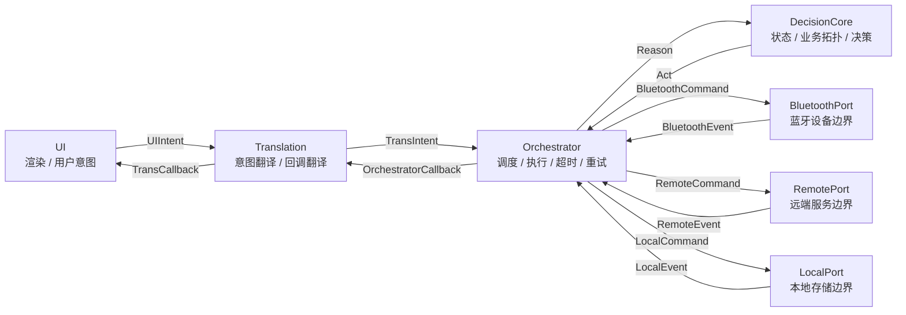
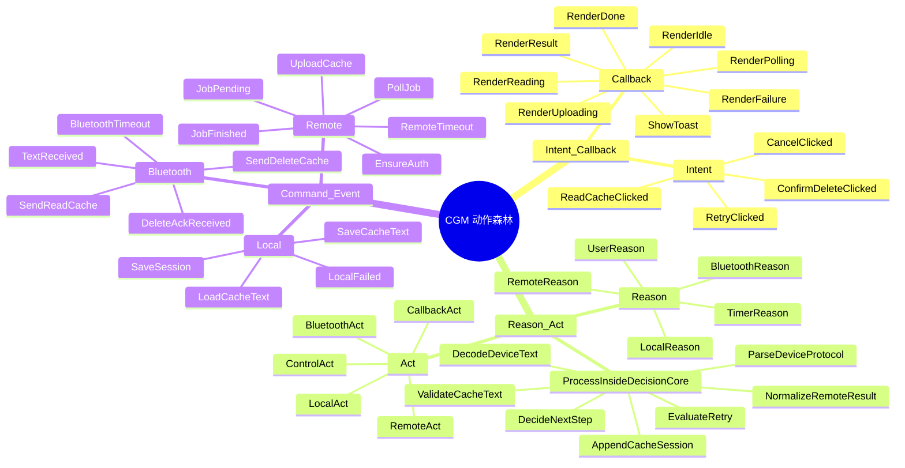
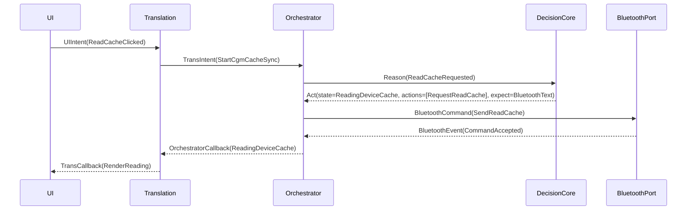
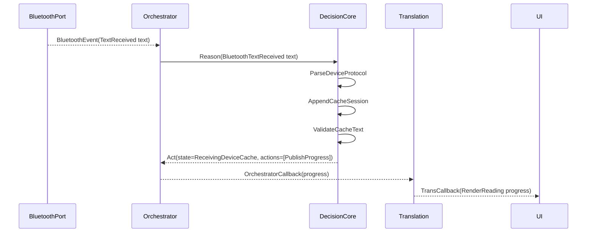
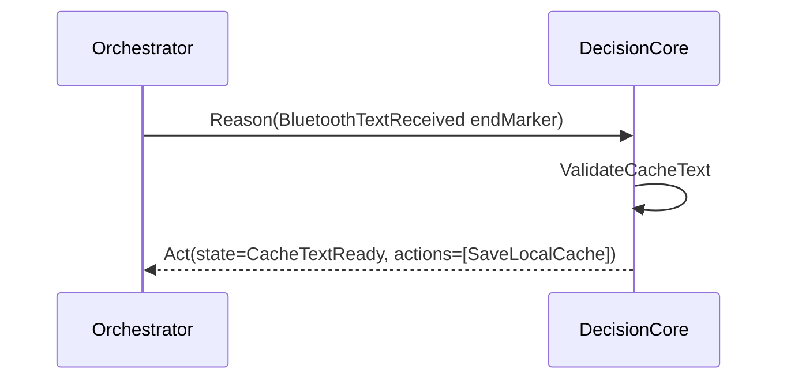
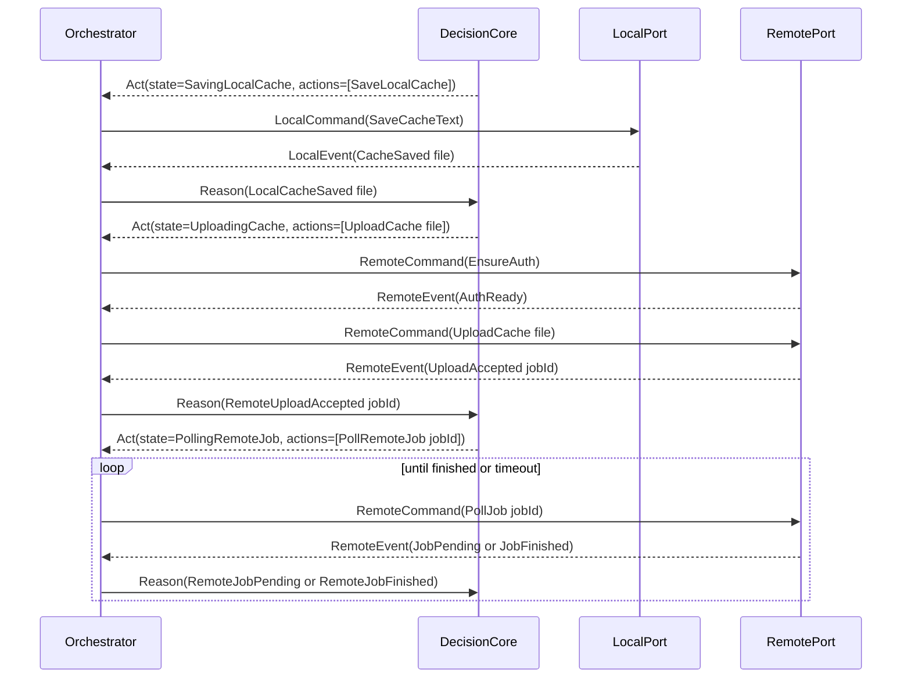
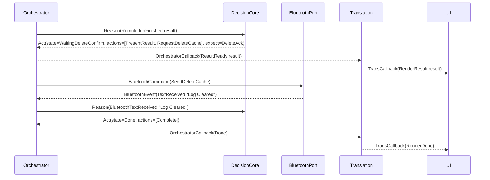
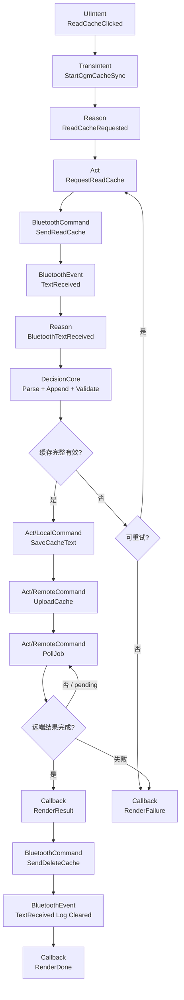

# CGM 原语通路与动作森林 SOP

Date: 2026-07-14

Status: Draft for review.

## 1. 目标

这份文档只做一件事：把 CGM 任务从“用户意图”到“设备、远端、本地 IO”再到“结果回到 UI”的通路固定下来。

它不是包名说明，也不是把现有代码照抄成图。它要回答：

1. 系统有哪些组件，每个组件负责什么，不允许负责什么。
2. 组件之间只能用哪些原语通信。
3. `state / reason / act / command / event` 到底有哪些。
4. CGM 动作如何组织成一棵可施工的动作森林。
5. 读缓存、接收文本、保存、上传、轮询、确认、删除如何沿同一套通路流动。

## 2. 固定拓扑

最终拓扑固定为五类组件：`UI`、`Translation`、`Orchestrator`、`DecisionCore`、`Port`。

`Port` 是外部世界的统一边界，再拆成 `BluetoothPort`、`RemotePort`、`LocalPort`。



### 2.1 为什么是这个拓扑

这张图的核心不是“多分几层”，而是把三条通信方向彻底分开：

| 方向 | 原语 | 作用 | 边界含义 |
|---|---|---|---|
| UI 意图方向 | `Intent / Callback` | 用户想做什么、系统反馈什么 | UI 不碰业务状态，也不碰 IO |
| 业务推理方向 | `Reason / Act` | 发生了什么、下一步做什么 | DecisionCore 只做决策，不做 IO |
| 外部执行方向 | `Command / Event` | 调用外部能力、接收外部结果 | Port 只做边界适配，不做业务决策 |

所以：

- `UI` 不能直接调用 `BluetoothPort / RemotePort / LocalPort`。
- `Translation` 不能直接调用 `DecisionCore`。
- `DecisionCore` 不能直接调用任何 `Port`。
- `Port` 不能直接通知 `UI`。
- 所有外部事件都必须先回到 `Orchestrator`，再变成 `Reason` 交给 `DecisionCore`。

## 3. 组件职责

### 3.1 UI

`UI` 是用户界面和用户动作的汇集层。

| 项 | 内容 |
|---|---|
| 拥有 | 页面状态渲染、按钮点击、输入框、提示展示 |
| 接收 | `TransCallback` |
| 发出 | `UIIntent` |
| 不允许 | 解析蓝牙文本、判断业务状态、发送蓝牙命令、调用网络、读写文件 |

`UI` 只表达“用户做了什么”，例如点击读缓存、点击重试、确认删除、取消任务。

### 3.2 Translation

`Translation` 是 UI 与系统能力之间的翻译层。它替代原来的 `promise / facade` 名字，因为它真正做的是双向翻译。

| 项 | 内容 |
|---|---|
| 拥有 | UI intent 到系统 intent 的映射、系统 callback 到 UI callback 的映射、对 UI 承诺的稳定接口 |
| 接收 | `UIIntent`、`OrchestratorCallback` |
| 发出 | `TransIntent`、`TransCallback` |
| 不允许 | 维护 CGM 业务状态、执行 IO、解析设备协议、做重试决策 |

`Translation` 的价值是保护 UI：UI 只看稳定的用户语义，不跟任务调度、蓝牙文本、HTTP DTO、文件路径耦合。

### 3.3 Orchestrator

`Orchestrator` 是调度器。它不决定业务应该怎么走，但它负责把业务决策执行出来。

| 项 | 内容 |
|---|---|
| 拥有 | 任务运行上下文、in-flight command、timeout、retry schedule、Port 调用、事件归一化 |
| 接收 | `TransIntent`、`Act`、`BluetoothEvent`、`RemoteEvent`、`LocalEvent` |
| 发出 | `Reason`、`OrchestratorCallback`、`BluetoothCommand`、`RemoteCommand`、`LocalCommand` |
| 不允许 | 写死业务协议下一步、绕过 DecisionCore 修改业务状态、把 Port event 直接转给 UI |

`Orchestrator` 像执行器：`DecisionCore` 发出 `Act`，它把 `Act` 翻译成具体 `Command`，并等待 `Event`、超时或失败。

### 3.4 DecisionCore

`DecisionCore` 是业务中枢。所有 CGM 业务拓扑、状态机、协议解释、结果确认和删除许可都在这里。

| 项 | 内容 |
|---|---|
| 拥有 | `CgmState`、协议规则、校验规则、会话拼接、下一步决策、失败归因 |
| 接收 | `Reason` |
| 发出 | `Act` |
| 不允许 | 直接调用蓝牙、网络、文件；直接操作 UI；知道 Port 的实现细节 |

`DecisionCore` 的输出不是底层命令，而是业务动作 `Act`。例如它不说“调用某个蓝牙 SDK 方法”，它只说“需要读取设备缓存”或“需要删除设备缓存”。

### 3.5 Port

`Port` 是外部世界边界。它统一接收 `Command`，统一返回 `Event`。

| Port | 拥有 | 接收 | 发出 | 不允许 |
|---|---|---|---|---|
| `BluetoothPort` | 蓝牙连接、发送命令、接收 bytes/text、蓝牙错误归一化 | `BluetoothCommand` | `BluetoothEvent` | 判断 CGM 业务状态 |
| `RemotePort` | 鉴权、HTTP DTO、上传、轮询、远端错误归一化 | `RemoteCommand` | `RemoteEvent` | 决定上传后是否删除设备缓存 |
| `LocalPort` | 本地文件、session/token/result 缓存、文件错误归一化 | `LocalCommand` | `LocalEvent` | 决定保存后是否上传 |

原来的 `DataAdapter` 可以收敛到 `RemotePort / LocalPort` 内部：DTO 映射、文件命名、txt 格式、response normalize 都是 Port 内部的适配任务，不再作为主拓扑组件暴露。

## 4. 通信原语

系统只保留六个核心原语：

```text
Intent / Callback
Reason / Act
Command / Event
```

`State` 不作为通信原语。`State` 是 `DecisionCore` 内部维护的业务事实，可以被放进 `Act` 或 `Callback` 里作为快照输出，但它本身不是跨组件消息。

### 4.1 Envelope 不是原语

之前的 `PrimitiveMeta` 容易误导。它不是原语，只是所有消息共用的信封，建议改名为 `Envelope`。

```kotlin
data class Envelope(
    val taskId: CgmTaskId,
    val traceId: String,
    val source: ComponentId,
    val target: ComponentId,
    val createdAtMillis: Long,
    val correlationId: String? = null,
    val attempt: Int = 0
)
```

`Envelope` 解决的是追踪和归属问题：这个消息属于哪个任务、对应哪个命令、是第几次尝试、出了错应该归到哪里。

### 4.2 方向化命名

原语本身保持少，落到具体方向时用“来源/目标语义 + 原语”命名。

| 名称 | 方向 | 含义 |
|---|---|---|
| `UIIntent` | `UI -> Translation` | 用户在界面上表达的动作 |
| `TransIntent` | `Translation -> Orchestrator` | 被翻译成系统能力调用的意图 |
| `OrchestratorCallback` | `Orchestrator -> Translation` | 任务进度、结果、错误 |
| `TransCallback` | `Translation -> UI` | UI 可直接消费的状态或效果 |
| `Reason` | `Orchestrator -> DecisionCore` | 触发业务推理的原因 |
| `Act` | `DecisionCore -> Orchestrator` | 下一步业务动作 |
| `BluetoothCommand` | `Orchestrator -> BluetoothPort` | 蓝牙侧命令 |
| `BluetoothEvent` | `BluetoothPort -> Orchestrator` | 蓝牙侧事件 |
| `RemoteCommand` | `Orchestrator -> RemotePort` | 远端侧命令 |
| `RemoteEvent` | `RemotePort -> Orchestrator` | 远端侧事件 |
| `LocalCommand` | `Orchestrator -> LocalPort` | 本地侧命令 |
| `LocalEvent` | `LocalPort -> Orchestrator` | 本地侧事件 |

### 4.3 Schema 原型

```kotlin
sealed interface CgmMessage {
    val envelope: Envelope
}

data class UIIntent(
    override val envelope: Envelope,
    val action: UIAction,
    val payload: UIPayload = UIPayload.Empty
) : CgmMessage

data class TransIntent(
    override val envelope: Envelope,
    val type: TransIntentType,
    val payload: TransPayload = TransPayload.Empty
) : CgmMessage

data class Reason(
    override val envelope: Envelope,
    val type: ReasonType,
    val payload: ReasonPayload = ReasonPayload.Empty
) : CgmMessage

data class Act(
    override val envelope: Envelope,
    val state: CgmState,
    val actions: List<WorkflowAction>,
    val expectations: List<Expectation> = emptyList()
) : CgmMessage

data class PortCommand(
    override val envelope: Envelope,
    val type: CommandType,
    val payload: CommandPayload,
    val expectation: Expectation? = null
) : CgmMessage

data class PortEvent(
    override val envelope: Envelope,
    val type: EventType,
    val payload: EventPayload = EventPayload.Empty
) : CgmMessage

data class OrchestratorCallback(
    override val envelope: Envelope,
    val state: CgmState,
    val progress: CgmProgress,
    val result: CgmResult? = null,
    val failure: CgmFailure? = null
) : CgmMessage

data class TransCallback(
    override val envelope: Envelope,
    val uiState: CgmUiState,
    val uiEffects: List<CgmUiEffect> = emptyList()
) : CgmMessage
```

`PortCommand / PortEvent` 是抽象形态。实现时可以拆成 `BluetoothCommand / RemoteCommand / LocalCommand` 和对应 Event。

## 5. State 设计

`State` 只由 `DecisionCore` 拥有和更新。其他组件可以读取快照，但不能写业务状态。

### 5.1 CGM 主状态

| State | 含义 | 允许的主要 Reason | 常见下一步 Act |
|---|---|---|---|
| `Idle` | 没有任务运行 | `ReadCacheRequested` | `RequestBluetoothRead` |
| `ReadingDeviceCache` | 已请求设备输出缓存 | `BluetoothTextReceived`、`BluetoothTimeout`、`BluetoothFailed` | `AppendCacheText`、`RetryBluetoothRead`、`Fail` |
| `ReceivingDeviceCache` | 正在持续接收缓存文本 | `BluetoothTextReceived` | `AppendCacheText`、`ValidateCacheText` |
| `CacheTextReady` | 缓存文本完整且通过协议检查 | `CacheTextValidated` | `SaveLocalCache` |
| `SavingLocalCache` | 正在保存本地缓存 | `LocalCacheSaved`、`LocalFailed` | `UploadCache`、`RetryLocalSave`、`Fail` |
| `UploadingCache` | 正在上传缓存到远端 | `RemoteUploadAccepted`、`RemoteFailed` | `PollRemoteJob`、`RetryRemoteUpload`、`Fail` |
| `PollingRemoteJob` | 正在轮询远端生成结果 | `RemoteJobPending`、`RemoteJobFinished`、`RemoteTimeout`、`RemoteFailed` | `ContinuePolling`、`PresentResultAndDelete`、`Fail` |
| `WaitingDeleteConfirm` | 结果已确认展示，正在等待设备删除确认 | `BluetoothDeleteAckReceived`、`BluetoothTimeout` | `Complete`、`RetryDelete`、`FailButKeepResult` |
| `Done` | 任务完成 | 无业务推进 Reason | 无 |
| `Failed` | 任务失败 | `RetryRequested`、`CancelRequested` | 视失败点重试或回到 `Idle` |

### 5.2 Session 子状态

除了主状态，还需要一个 `CgmSession` 保存过程性事实：

```kotlin
data class CgmSession(
    val taskId: CgmTaskId,
    val cacheLines: List<String> = emptyList(),
    val lastDeviceText: String? = null,
    val localCacheFile: CgmCacheFile? = null,
    val remoteJobId: CgmJobId? = null,
    val result: CgmResult? = null,
    val retryCounters: RetryCounters = RetryCounters.Empty,
    val pendingExpectation: Expectation? = null
)
```

主状态回答“任务走到哪一步”，Session 回答“这一步已经积累了哪些事实”。

## 6. Reason 设计

`Reason` 是 `Orchestrator` 给 `DecisionCore` 的推理触发。它不表达“要做什么”，只表达“发生了什么，所以请业务中枢推理”。

### 6.1 Reason 分类

| Reason 分类 | Reason | 来源 | 含义 |
|---|---|---|---|
| 用户意图 | `ReadCacheRequested` | `TransIntent` | 用户要求开始读取缓存 |
| 用户意图 | `RetryRequested` | `TransIntent` | 用户要求重试当前失败点 |
| 用户意图 | `CancelRequested` | `TransIntent` | 用户取消任务 |
| 蓝牙事件 | `BluetoothCommandAccepted` | `BluetoothEvent` | 蓝牙命令已被底层接受发送 |
| 蓝牙事件 | `BluetoothTextReceived` | `BluetoothEvent` | 收到设备文本 |
| 蓝牙事件 | `BluetoothDisconnected` | `BluetoothEvent` | 连接断开 |
| 蓝牙事件 | `BluetoothTimeout` | `Orchestrator timer` | 等待蓝牙事件超时 |
| 蓝牙事件 | `BluetoothFailed` | `BluetoothEvent` | 蓝牙命令或接收失败 |
| 本地事件 | `LocalCacheSaved` | `LocalEvent` | 缓存文件已保存 |
| 本地事件 | `LocalCacheLoaded` | `LocalEvent` | 已读取本地缓存 |
| 本地事件 | `LocalFailed` | `LocalEvent` | 本地读写失败 |
| 远端事件 | `RemoteUploadAccepted` | `RemoteEvent` | 上传成功并得到 jobId |
| 远端事件 | `RemoteJobPending` | `RemoteEvent` | 远端任务未完成 |
| 远端事件 | `RemoteJobFinished` | `RemoteEvent` | 远端结果生成完成 |
| 远端事件 | `RemoteTimeout` | `Orchestrator timer` | 轮询或请求超时 |
| 远端事件 | `RemoteFailed` | `RemoteEvent` | 上传或轮询失败 |

### 6.2 Reason 内部处理动作

这些不是通信原语，而是 `DecisionCore` 在处理 Reason 时使用的内部动作：

| 内部动作 | 做什么 | 属于哪个 Reason 场景 |
|---|---|---|
| `DecodeDeviceText` | 把蓝牙输入归一成业务文本；如果 Port 已输出 text，则这里只做协议级归一 | `BluetoothTextReceived` |
| `ParseDeviceProtocol` | 识别 `ALL` 响应、缓存正文、结束标记、`Log Cleared` 等协议含义 | `BluetoothTextReceived` |
| `AppendCacheSession` | 把缓存文本追加到 `CgmSession.cacheLines` | `BluetoothTextReceived` |
| `ValidateCacheText` | 判断缓存是否完整、格式是否可上传 | `BluetoothTextReceived`、`CacheTextValidated` |
| `NormalizeRemoteResult` | 把远端业务结果归一成领域结果；DTO 细节仍由 `RemotePort` 屏蔽 | `RemoteJobFinished` |
| `EvaluateRetry` | 根据状态、错误类型、次数决定是否可重试 | timeout / failed |
| `DecideNextStep` | 根据当前 state + session + reason 生成 Act | 所有 Reason |

这里的边界是：`Port` 可以做技术格式转换，`DecisionCore` 做业务语义解释。比如 bytes 到 string 可在 `BluetoothPort`，但 `Playback all done` 是不是缓存结束，必须在 `DecisionCore`。

## 7. Act 设计

`Act` 是 `DecisionCore` 给 `Orchestrator` 的业务命令。它表达“下一步业务动作”，但不暴露 SDK、HTTP、文件 API。

### 7.1 Act 分类

| Act | 目标方向 | Orchestrator 应该做什么 |
|---|---|---|
| `RequestBluetoothRead` | Bluetooth | 生成 `BluetoothCommand.SendReadCache` |
| `RequestBluetoothDelete` | Bluetooth | 生成 `BluetoothCommand.SendDeleteCache` |
| `SaveLocalCache` | Local | 生成 `LocalCommand.SaveCacheText` |
| `LoadLocalCache` | Local | 生成 `LocalCommand.LoadCacheText` |
| `UploadCache` | Remote | 生成 `RemoteCommand.UploadCache` |
| `PollRemoteJob` | Remote | 生成 `RemoteCommand.PollJob`，必要时建立轮询计划 |
| `ContinuePolling` | Remote | 继续下一次 `RemoteCommand.PollJob` |
| `RetryLastCommand` | Orchestrator | 重发对应方向的上一条 command |
| `CancelTask` | Orchestrator / Port | 取消 timeout、轮询、in-flight command |
| `PublishProgress` | Callback | 生成 `OrchestratorCallback` |
| `PresentResult` | Callback | 把结果输出给 Translation |
| `Complete` | Callback | 输出完成状态 |
| `Fail` | Callback | 输出失败状态 |
| `FailButKeepResult` | Callback | 删除失败但保留远端结果 |

### 7.2 Act 的形态

```kotlin
sealed interface WorkflowAction

sealed interface BluetoothAct : WorkflowAction {
    data object RequestReadCache : BluetoothAct
    data object RequestDeleteCache : BluetoothAct
}

sealed interface RemoteAct : WorkflowAction {
    data class UploadCache(val file: CgmCacheFile) : RemoteAct
    data class PollJob(val jobId: CgmJobId) : RemoteAct
}

sealed interface LocalAct : WorkflowAction {
    data class SaveCacheText(val lines: List<String>) : LocalAct
    data class LoadCacheText(val file: CgmCacheFile) : LocalAct
}

sealed interface CallbackAct : WorkflowAction {
    data class PublishProgress(val progress: CgmProgress) : CallbackAct
    data class PresentResult(val result: CgmResult) : CallbackAct
    data class Fail(val failure: CgmFailure) : CallbackAct
}

sealed interface ControlAct : WorkflowAction {
    data class RetryLastCommand(val reason: CgmFailure) : ControlAct
    data object CancelTask : ControlAct
    data object Complete : ControlAct
}
```

`Act` 可以一次包含多个 `WorkflowAction`。例如远端结果成功后，可以同时产生：

```text
state = WaitingDeleteConfirm
actions = [PresentResult(result), RequestDeleteCache]
```

这表示业务上“结果可以展示，同时设备缓存应该删除”。但真正展示和删除都由 `Orchestrator` 分别转成 callback 和 command。

## 8. Command / Event 设计

`Command / Event` 是 `Orchestrator` 和 Port 的通信协议。这里按 `Bluetooth / Remote / Local` 分类。

### 8.1 BluetoothCommand / BluetoothEvent

| Command | 作用 | 期望 Event |
|---|---|---|
| `SendReadCache` | 向设备发送读缓存命令，例如协议层的 `ALL` | `CommandAccepted`、`TextReceived`、`Timeout`、`Failed` |
| `SendDeleteCache` | 向设备发送删除缓存命令 | `CommandAccepted`、`TextReceived(Log Cleared)`、`Timeout`、`Failed` |
| `CheckConnection` | 检查连接是否可用 | `Connected`、`Disconnected` |
| `CancelBluetoothTask` | 取消当前蓝牙等待 | `Cancelled` |

| Event | 含义 |
|---|---|
| `CommandAccepted` | Port 已接受并尝试发送命令 |
| `TextReceived` | 收到设备文本 |
| `Connected` | 蓝牙连接可用 |
| `Disconnected` | 蓝牙连接断开 |
| `Timeout` | 等待蓝牙响应超时 |
| `Failed` | 蓝牙发送或接收失败 |
| `Cancelled` | 蓝牙等待已取消 |

### 8.2 RemoteCommand / RemoteEvent

| Command | 作用 | 期望 Event |
|---|---|---|
| `EnsureAuth` | 确保 token 或登录态可用 | `AuthReady`、`AuthFailed` |
| `UploadCache` | 上传本地缓存文件或缓存文本 | `UploadAccepted`、`Failed` |
| `PollJob` | 查询远端任务状态 | `JobPending`、`JobFinished`、`Timeout`、`Failed` |
| `CancelRemoteTask` | 取消远端轮询或本地等待 | `Cancelled` |

| Event | 含义 |
|---|---|
| `AuthReady` | 远端鉴权可用 |
| `AuthFailed` | 鉴权失败 |
| `UploadAccepted` | 上传成功并得到 jobId |
| `JobPending` | 远端任务还在处理中 |
| `JobFinished` | 远端任务完成并带回结果 |
| `Timeout` | 请求或轮询超时 |
| `Failed` | 远端请求失败 |
| `Cancelled` | 远端等待已取消 |

### 8.3 LocalCommand / LocalEvent

| Command | 作用 | 期望 Event |
|---|---|---|
| `SaveCacheText` | 把缓存文本保存成本地文件 | `CacheSaved`、`Failed` |
| `LoadCacheText` | 读取已有缓存文本 | `CacheLoaded`、`Failed` |
| `SaveSession` | 保存任务快照 | `SessionSaved`、`Failed` |
| `LoadSession` | 恢复任务快照 | `SessionLoaded`、`Failed` |
| `SaveToken` | 保存远端 token | `TokenSaved`、`Failed` |

| Event | 含义 |
|---|---|
| `CacheSaved` | 缓存文件保存成功 |
| `CacheLoaded` | 缓存文件读取成功 |
| `SessionSaved` | 会话快照保存成功 |
| `SessionLoaded` | 会话快照读取成功 |
| `TokenSaved` | token 保存成功 |
| `Failed` | 本地读写失败 |

## 9. 动作森林

动作森林不再按“拉取、推送、处理”粗暴生长，而是按三条通信方向组织。



### 9.1 三棵树的含义

| 动作树 | 主要问题 | 归属 |
|---|---|---|
| `Intent / Callback` | 用户想做什么，系统怎么反馈给用户 | `UI / Translation / Orchestrator` |
| `Reason / Act` | 发生了什么，业务下一步怎么走 | `Orchestrator / DecisionCore` |
| `Command / Event` | 如何和蓝牙、远端、本地交互 | `Orchestrator / Port` |

这三棵树不能互相串门：

- `Intent` 不能直接变成 `Command`，必须先成为 `TransIntent -> Reason -> Act`。
- `Event` 不能直接变成 `Callback`，必须先成为 `Reason -> Act`。
- `Act` 不能由 UI 或 Port 产生，只能由 `DecisionCore` 产生。

## 10. 确认、容灾和错误处理

确认机制统一建在 `Expectation` 上。`DecisionCore` 声明期待，`Orchestrator` 负责计时、重试和归档。

```kotlin
data class Expectation(
    val waitingFor: ExpectedEvent,
    val timeoutMillis: Long,
    val retryPolicy: RetryPolicy,
    val onTimeoutReason: ReasonType,
    val onFailureReason: ReasonType
)

sealed interface ExpectedEvent {
    data object BluetoothText : ExpectedEvent
    data object DeleteAck : ExpectedEvent
    data object LocalCacheSaved : ExpectedEvent
    data object RemoteUploadAccepted : ExpectedEvent
    data object RemoteJobFinished : ExpectedEvent
}
```

规则固定为：

1. `DecisionCore` 决定“是否需要等待什么”。
2. `Orchestrator` 执行等待、超时、重试调度。
3. `Port` 只返回 `Event`，不判断是否完成 CGM 任务。
4. 超时先变成 `Reason`，再由 `DecisionCore` 决定重试、失败或保留结果。
5. 所有失败必须带 `taskId / traceId / state / command / event`，否则无法定位。

## 11. 读缓存通路



这里最关键的约束：

- `UI` 不知道 `ALL`。
- `Translation` 不知道 `ALL`。
- `DecisionCore` 可以知道“读缓存这个业务动作对应设备协议 ALL”，但不直接调用蓝牙。
- `Orchestrator` 把 `RequestReadCache` 翻译成 `BluetoothCommand.SendReadCache`。
- `BluetoothPort` 再把 `SendReadCache` 落到具体蓝牙 SDK 和实际字符串。

## 12. 接收缓存文本通路



如果文本已经完整且有效：



不允许：

- `BluetoothPort` 判断缓存是否完整。
- `Orchestrator` 拼接缓存业务会话。
- `UI` 解析 `Playback all done` 或 `Log Cleared`。

## 13. 保存、上传、轮询通路



约束：

- `LocalPort` 只保存，不决定保存后上传。
- `RemotePort` 只上传和轮询，不决定结果出来后删除设备缓存。
- `Orchestrator` 可以管理轮询节奏，但“继续轮询还是失败”必须由 `DecisionCore` 通过 `Act` 决定。

## 14. 结果展示与删除确认通路



这里的核心设计点：

- 结果展示和删除设备缓存可以由同一个 `Act` 同时触发。
- UI 只收到结果，不负责删除。
- `Log Cleared` 只有在 `WaitingDeleteConfirm` 状态下才是删除确认。
- 删除失败时可以进入 `FailButKeepResult`，不能丢掉已经生成的结果。

## 15. CGM 大工作流



## 16. 最终固定结论

1. 主拓扑固定为 `UI -> Translation -> Orchestrator -> DecisionCore -> Orchestrator -> Port`。
2. `Port` 分为 `BluetoothPort / RemotePort / LocalPort`。
3. 跨组件原语只保留 `Intent / Callback / Reason / Act / Command / Event`。
4. `State` 是 `DecisionCore` 内部事实，不是通信原语。
5. `Envelope` 不是原语，只提供追踪、归属、重试和关联信息。
6. `DecisionCore` 维护状态机、协议语义、业务校验、下一步决策。
7. `Orchestrator` 执行 Act，调用 Port，维护超时、重试、in-flight command。
8. `Translation` 保护 UI，不让 UI 知道业务拓扑和外部 IO。
9. `UI` 只处理用户意图和展示回调。
10. `Port` 只处理外部世界适配，不决定业务下一步。
